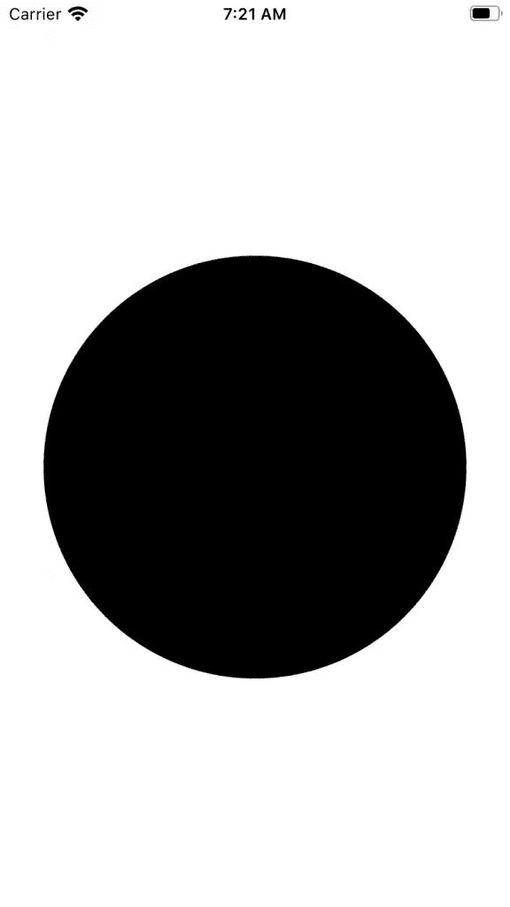
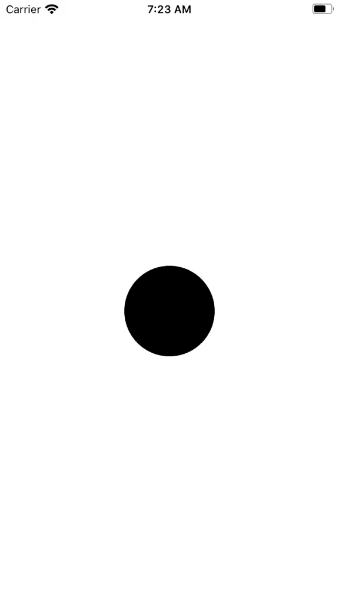
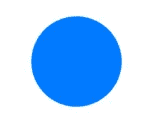
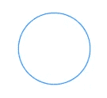

# SwiftUI:圆形

> 原文：<https://betterprogramming.pub/swiftui-circle-15663b523c20>

## 圆圈在我们的应用程序中随处可见。SwiftUI 让它们非常容易使用


[艾尔伦·埃克塞斯](https://unsplash.com/@er1end?utm_source=unsplash&utm_medium=referral&utm_content=creditCopyText)在 [Unsplash](https://unsplash.com/s/photos/circle?utm_source=unsplash&utm_medium=referral&utm_content=creditCopyText) 拍摄的照片

传统上，你会创建一个`UIView`并做一些计算来创建一个圆。使用 SwiftUI，您可以轻松创建一个圆，无需任何计算，这将为您节省大量开发项目的时间。

您应该在这里看到 SwiftUI 为您完成所有次要工作的模式。

在本教程中，您将学习如何在 SwiftUI 中从头构建一个圆。

# 先决条件

按照本教程，你需要一些基本知识。

*   对 Swift 的基本熟悉。
*   至少 Xcode 11。

# 圆

要创建一个`Circle`，只需调用下面的代码:

```
Circle()
```



如果圆太大，可以相应调整大小。

```
.frame(width: 100, height: 100)
```



改变颜色也很容易。

```
.foregroundColor(.blue)
```



轮廓颜色也可以。

```
.stroke(Color.blue)
```



将图像添加到圆也是可能的。


你甚至可以用`ZStack`将这些圆圈堆叠在一起。


感谢阅读！