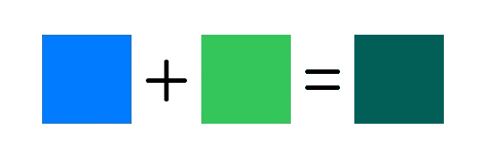
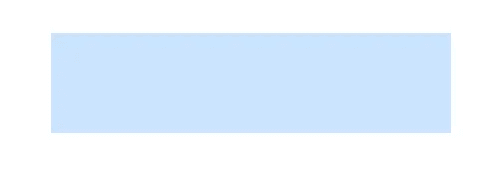
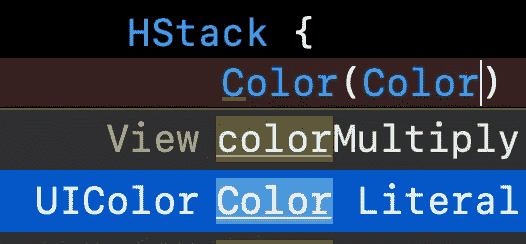
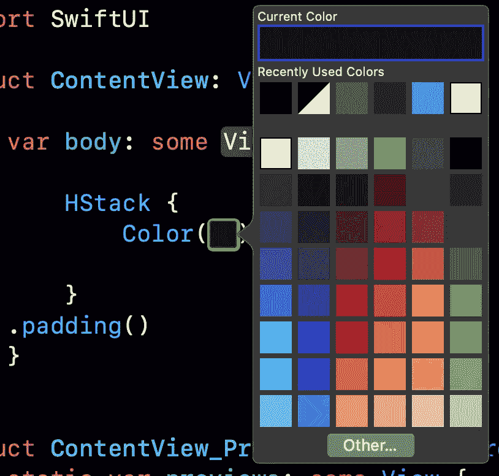

# SwiftUI:颜色

> 原文：<https://betterprogramming.pub/swiftui-color-7628a0c174b2>

## 深入了解 SwiftUI 颜色的细节


罗伯特·卡茨基在 [Unsplash](https://unsplash.com?utm_source=medium&utm_medium=referral) 上的照片。

有了颜色，你可以为你的应用程序提供更大的艺术感。也许有些设计应该是特定的颜色，而不仅仅是黑色和白色。

苹果公司将这种结构描述为“一种取决于环境的颜色”在本教程中，你将学习更多关于 SwiftUI 中的颜色——主要是你可以用它做什么。

# 先决条件

要学习本教程，您需要了解以下方面的一些基本知识:

*   迅速发生的
*   至少 Xcode 11

# 间色

苹果公司生产的`Primary`和`Secondary`颜色可以很快用在标题等文本上。下面是一个叠加第二种颜色的实验，它自己调整颜色。


当您在模拟器中打开黑暗模式时，它会改变颜色。`Secondary`为你处理明暗模式。


# 彩色倍增

也可以把颜色加在一起看结果。是不是很酷？



# 不透明

有时你需要某种颜色的浅色调。这就是不透明度发挥重要作用的地方。

```
Color.blue.frame(width: 200, height: 50).opacity(0.2)
```



# 颜色文字

如果你是那种喜欢看颜色的人，你可以选择彩色文字。为了触发它，您可以执行以下操作并选择颜色文字**。**



现在会出现一种颜色，双击它，您就可以选择自己的颜色了。



你知道如何在 SwiftUI 中用颜色做更多的事情。肯定更多。随意探索和分享你的发现。