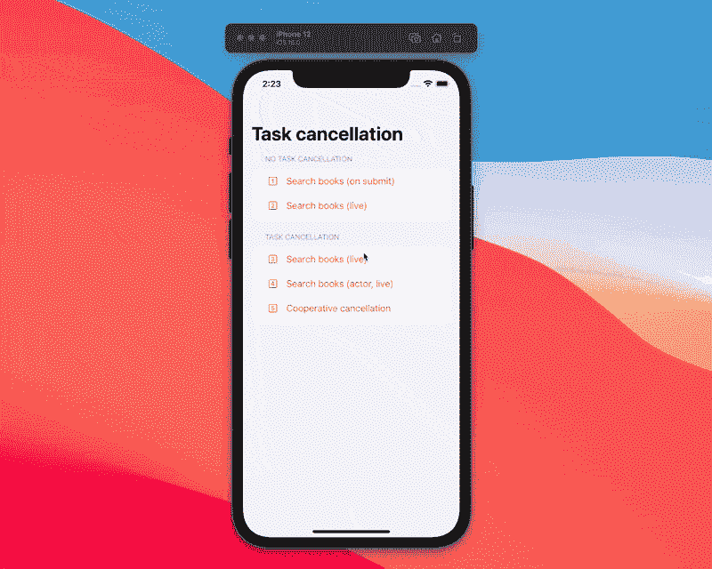
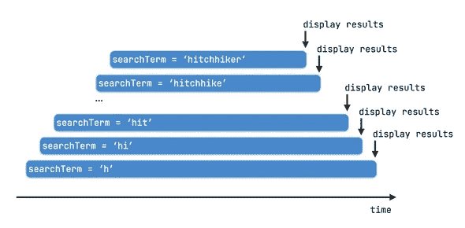

# SwiftUI 并发性:理解协作任务取消

> 原文：<https://betterprogramming.pub/swiftui-concurrency-understand-cooperative-task-cancellation-b71cc69483e0>

## 取消任务变得简单多了


标题图片基于苹果公司 SF 符号中的`xmark.circle.fill`

Swift 的新并发特性使得编写正确的并发代码变得更加容易。这是通过多种方式实现的，最突出的是通过向 Swift 语言本身添加 async/await 等功能，允许编译器执行流分析，并向开发人员提供有意义的反馈。

正如 Doug 在 Swift 论坛上的本帖中所指出的，“Swift 一直被设计为默认安全”，并且“Swift 6 的并发性工作的一个明确目标是让默认安全也扩展到数据竞争。”

在这一系列文章和视频中，我的目标是向您介绍 Swift 新并发模型的关键方面，您在构建 SwiftUI 应用时需要这些方面。[上次](/getting-started-with-async-await-in-swiftui-for-ios-15-f627eb722a4b)，我展示了如何使用`URLSession`从异步 API 获取数据，async/await 如何帮助我们摆脱末日金字塔，以及如何从同步上下文中调用异步代码。

今天，我想重点谈谈任务取消。这是 Swift 并发模型中的一个重要特性，使我们能够避免应用程序中的意外行为。

# 无序的搜索结果

为了理解为什么这很重要，让我们来看看我为本文构建的示例应用程序(可在本系列的 [GitHub 库](https://github.com/peterfriese/SwiftUI-Concurrency-Essentials)中获得)。这是一个简单的搜索屏幕，利用了 SwiftUI 新的`searchable`视图修改器。搜索字段被绑定到视图模型的`searchTerm` published 属性，我们使用`onReceive`视图修饰符来监听这个属性的任何变化。在闭包内，我们创建一个新的异步任务，并在视图模型上调用`executeQuery`方法。

这意味着每当用户输入一个字符时，我们就运行查询，这实质上给了我们一种实时搜索的体验。



如果你密切关注应用程序的记录，你会注意到一些奇怪的事情:用户键入一个搜索词(“搭便车”)，过了一会儿，这个搜索词的结果就会出现。但是不久之后，搜索结果被替换为不同的搜索结果，这有点出乎意料。如果你仔细观察，你会注意到第二个结果是搜索“搭便车”

这是为什么呢？

嗯，事实证明 [OpenLibrary API](https://openlibrary.org/developers) 的响应时间相当慢(这就是为什么它是我们例子的一个很好的展示)。此外，较短的搜索词似乎需要更长的时间来获取，这就是为什么较早(较短)搜索词的结果在较长搜索词的结果之后到达。

因此，当搜索词“搭便车”的结果到达时，对所有其他先前搜索词的请求仍然是突出的:



*无序到达的请求*

当它们最终完成时，花费较长时间完成的将覆盖较快的。这导致了意外的 UX，我们肯定需要解决这个问题。OpenLibrary API 可能是一个极端的例子，因为它的响应时间很慢，但是您也会在许多其他 API 中观察到类似的行为。

# 我们能解决这个问题吗？

现在，如果您以前使用过 Combine，您可能会回忆起操作符——只有在两个事件之间经过了指定的时间后，该操作符才会发布事件。由于发布的属性是组合发布者，使用`debounce`操作符实际上非常简单，所以让我们看看这是否解决了问题:

通过这种改变，当用户停止输入 0.8 秒时，`debounce`操作符将只发送`searchTerm`属性的最新值给接收者(在本例中是闭包)。

事实上，这确实解决了用户不停顿地输入搜索词的问题。但是如果他们开始输入，然后停下来想一会儿，然后在结果出来之前继续输入，我们会再次遇到同样的问题。

因此，尽管这更好(主要是因为我们减少了发送给 API 的请求数量，这也有助于防止系统颠簸)，但它并不完美。

# 刮这个

为了真正提高应用程序的 UX，我们需要确保在发送新请求之前取消所有未完成的请求。

Swift 的新并发功能使我们只需增加几行代码就能实现这一点。在`executeQuery`中，我们使用`async { }`(在 Swift 5.5 goes GA 之前将被替换为`Task { }`)从同步上下文中启动一个新的异步任务。查看源代码可以发现，`async`是一个返回`Task.Handle`的函数:

```
public func async<T>(priority: Task.Priority? = nil, operation: @escaping @Sendable () async -> T) -> Task.Handle<T, Never>
```

`Task.Handle`是与活动任务交互的启示([参见文档](https://developer.apple.com/documentation/swift/task/3851218-cancel))。例如，我们可以使用任务句柄来取消任务。

下面是更新后的`executeQuery`功能:

*   为了实现这一点，我们创建了一个私有属性来保存对一个`Task.Handle<Void, Never>`的引用。这意味着我们的任务不返回值，并且永远不会失败(也就是说，它不会抛出)。
*   在`executeQuery`函数中，我们首先取消任何之前启动的任务。
*   接下来，我们将为新搜索请求创建的任务存储在`searchTask`属性中(这样，如果需要，我们可以在以后取消它)。

基本上就是这样了！这是因为`URLSession`的异步方法支持 Swift 的新并发模型。要了解更多关于在 URLSession 中使用 async/await 的信息，请查看苹果官方 [WWDC 视频](https://developer.apple.com/videos/play/wwdc2021/10095/?time=284)。

注意，我们通过检查当前任务是否已被取消来防止更新`isSearching`属性。该属性用于驱动 UI 上的进度微调器，我们希望确保只要有任何搜索请求未完成，微调器就可见。这就是为什么只有当搜索请求成功完成或者搜索项为空时，我们才可以将该属性设置为`false`。

如果您正在使用参与协作任务取消的 API，那么现在一切都准备好了。然而，如果您自己是一个 API 的作者，那么您需要采取一些额外的步骤来确保您的代码参与协作任务取消。

# 合作任务取消

`[cancel](https://developer.apple.com/documentation/swift/task/3851218-cancel)`的文档包含非常重要的注释:

> 这个函数是否有任何作用取决于任务。
> 
> 对于考虑取消的任务，它必须在运行时合作检查取消。许多任务在开始它们的“实际工作”之前会检查取消，但是这不是一个要求，也不能保证任务通常如何以及何时检查取消。"

这意味着当调用者请求取消您的代码正在运行的任务时，您有责任尽快停止任何工作。

考虑下面的代码片段。它是计算第 n 个斐波那契数的函数的迭代实现。我通过在内部循环中添加`Task.sleep()`人为地减慢了算法的速度。

通过调用`Task.checkCancellation()`，该函数检查调用者是否请求取消任务。`Task.checkCancellation()`会检查`Task.isCancelled`是否为真，如果为真就会抛出`Task.CancellationError`。这样，`fibonacci`函数可以在其内部循环的每次迭代后停止任何正在进行的工作。

如果您不想抛出`Task.CancellationError`，您可以使用`Task.isCancelled`来检查当前任务是否已经被取消，并停止任何正在进行的工作。

抛出错误只是响应取消的一种方式。根据代码执行的工作类型，您应该选择以下哪个选项效果最好:

*   抛出一个错误(如上所示)
*   返回`nil`或空集合
*   返回部分完成的工作

# SwiftUI 的新任务()视图修改器

SwiftUI 具有一个新的视图修饰符，允许您在视图一出现就在异步任务中运行代码。一旦视图消失，它将自动取消任务。

这是本系列上一篇文章[中示例的一个片段:](/getting-started-with-async-await-in-swiftui-for-ios-15-f627eb722a4b)

如果您需要在视图出现时调用异步代码，最好使用`task { }`而不是`onAppear` / `onDisappear`。

# 生产的

最后一条建议:如果你正在编写计算密集型代码，你应该时不时地调用`Task.yield()`向系统让步，让它有机会执行任何其他工作，比如更新 UI。如果你不这样做，你的应用对用户来说可能看起来是冻结的，即使它正在运行一些计算密集型代码。

# 关闭

Swift 的新并发模型使得编写以可预测和结构化的方式处理并发的结构良好的应用程序变得容易。就个人而言，我喜欢以特定领域的方式将概念添加到语言中的方式——这与 Swift 的许多其他领域也使用 DSL 方法(例如 SwiftUI 本身)是一致的。

我希望这篇文章能帮助你理解如何使用任务取消来使你的用户界面更加可预测，并增加它们的可用性。

请记住，Swift 的结构化并发仍然是一项正在进行的工作，它的一些功能正在经历[一些](https://twitter.com/dgregor79/status/1412944336572932096) [波动](https://github.com/apple/swift/commit/a7eed56988d7675e693692b1a97d4a34c7eac334)。为了掌握最新情况，我建议关注相关提案并关注 Swift 论坛上的讨论:

[](https://github.com/apple/swift-evolution/blob/main/proposals/0304-structured-concurrency.md) [## 苹果/swift-进化

### 是一种用于编写自然、高效的异步代码的语言机制。异步函数(引入于…

github.com](https://github.com/apple/swift-evolution/blob/main/proposals/0304-structured-concurrency.md) [](https://forums.swift.org/t/swift-concurrency-feedback-wanted/49336) [## 快速并发:需要反馈！

### 今天苹果发布了 Xcode 13 的首个测试版。这包括 Swift 5.5，支持本地语言并发…

forums.swift.org](https://forums.swift.org/t/swift-concurrency-feedback-wanted/49336) 

感谢阅读！

*原载于*[*https://peterfriese . dev*](https://peterfriese.dev/swiftui-concurrenct-essentials-part2/)*。*