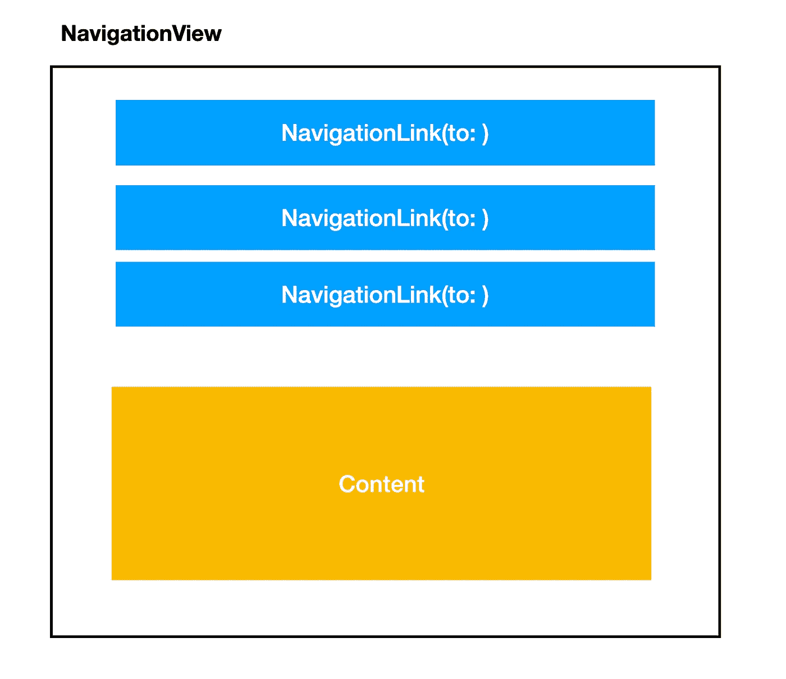
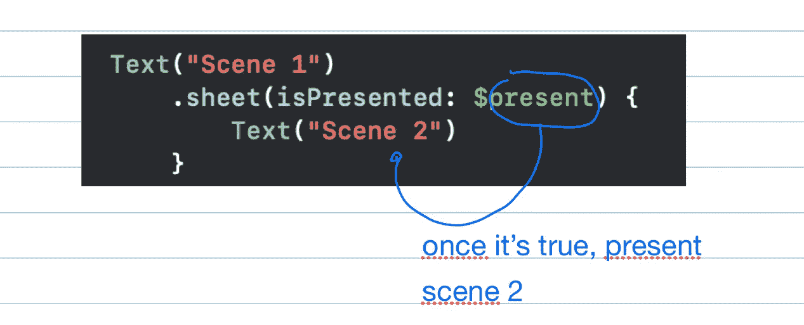
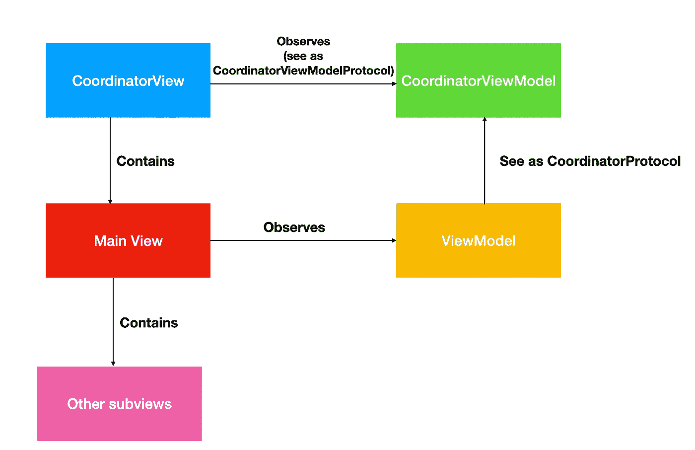
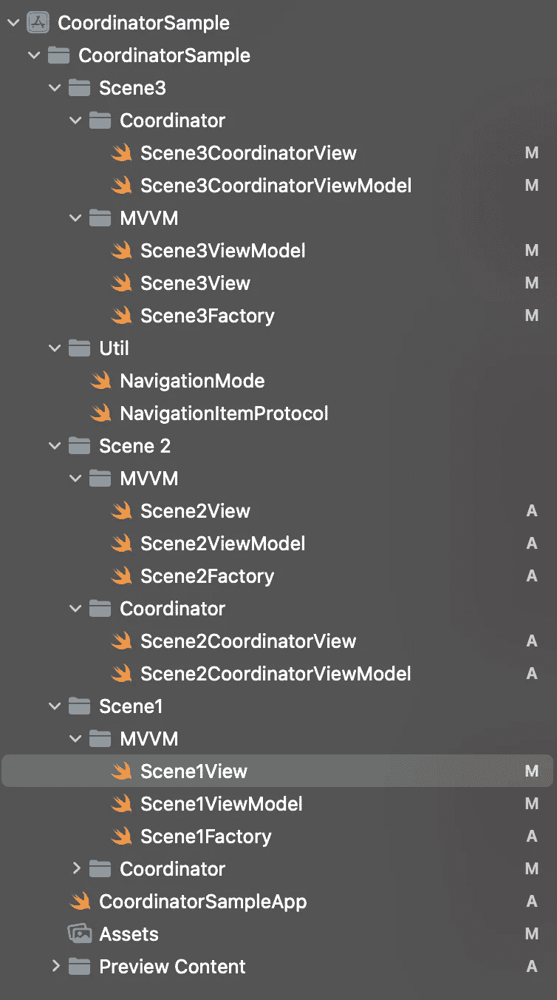
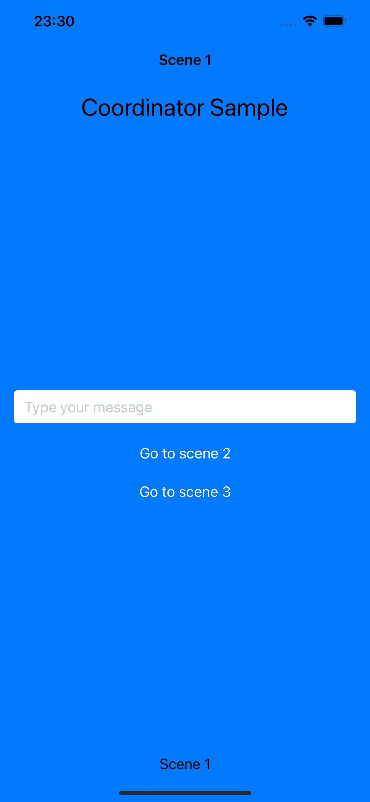
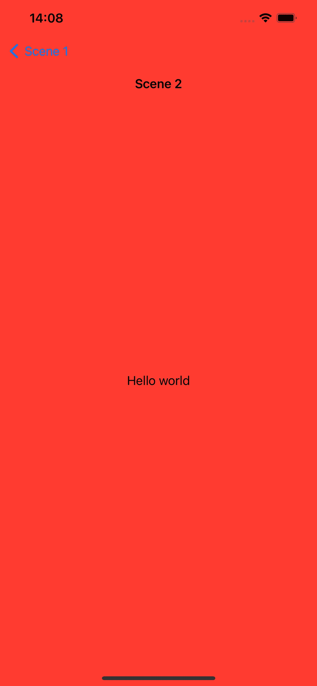
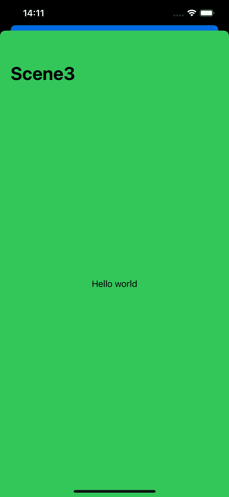
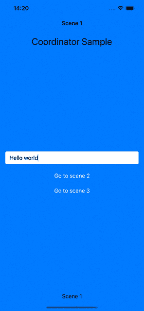

# 探索 SwiftUI 协调员

> 原文：<https://betterprogramming.pub/swiftui-coordinators-a27c2c9d701f>

## 回收以前为命令性代码库设计的著名模式，并重用它来处理一些声明性 UI。

[斯旺西汽车集团](https://unsplash.com/@swansway?utm_source=medium&utm_medium=referral)在 [Unsplash](https://unsplash.com?utm_source=medium&utm_medium=referral) 上拍摄的照片

您可能已经熟悉了最初为 UIKit 框架设计的协调器设计模式。基本上，它包括将导航责任委托给另一个层，称为`Coordinator`。

这个类包含对场景的`viewController`或`navigationController`的引用，它允许`pushViewController`和`present`操作，以便拥有多种导航方法并在上下文之间传递适当的数据。

我们希望用 SwiftUI 做同样的事情，但问题是在这个框架中，关于 UI 的一切都是声明性的，我们处理值类型(结构)。所以我们不能有一个引用，我们可以直接要求改变上下文，导航是通过建立`NavigationViews`和`NavigationLinks`以声明的方式完成的，只要我们操纵它的状态数据，这些数据通过输入传递给这些组件，就会触发一些改变。首先，让我们深入 SwiftUI 导航原语:

# 导航指令

像 UIKit 一样，在 SwiftUI 中，你可以通过两种方式改变上下文:按下或者模式化。在 UIKit 中，你可以在你的`navigationController`中使用`pushViewController`来放置一个新的 ViewController 到你的堆栈中，或者如果你想要一个模态 ViewController，可以使用`present`。在 SwiftUI 中有同样的两种方法，但是机制非常不同，我们现在将看到

## 1.导航链接

在 SwiftUI 中，当我们希望一个堆栈保存多个顺序呈现的视图时，您需要使用`NavigationView`来保存所有内容。就像以前的`UINavigationController`，但是现在以声明的方式实例化了。在这个容器中，你可以声明`NavigationLinks`来建立你可以从当前上下文中选择的路径。

如果你想让一个`NavigationLink`工作，它应该被放在一个`NavigationView`里面。忘记这一点就像试图访问一个没有任何导航功能的`viewController`的`navigationController`。

基本上，一旦导航链接的输入绑定布尔值为真，或者如果某个标签被赋予了某个对应于自定义视图的值，导航链接就会强制改变上下文。

由于本文的目的是在声明性框架中展示一个协调器层，所以我不会涉及它的细节，所以我们将继续。

## 2.表

这是一个 SwiftUI 修改器，一旦绑定布尔输入为真或者某个输入`Identifiable`被改变，它会强制一个新的屏幕以模态方式呈现在你当前的屏幕上。

# 解释我们的建筑

当我们在 SwiftUI 中导航到一个新场景时，我们只需通过`NavigationLink`或`sheet`修饰符来声明可能的路线，这与 UIKit 不同，在 ui kit 中，我们习惯于强制“命令”我们的`navigationController`将一个新屏幕推入堆栈。由于我们没有对我们的`NavigationView`的引用，我们需要一些绑定变量来控制何时是改变屏幕的正确时间。也就是说，我们需要将协调器分成两个子层:

1.  CoordinatorView:插入`NavigationView`并通过`NavigationLinks`和`sheet`修饰符建立可能的路线。此外，我们需要插入我们的内容视图，在这个 CoordinatorView 中我们场景的中心组件。
2.  CoordinatorViewModel:我们放置逻辑数据的层，这些数据将触发我们的上下文变化。当我们和 MVVM 一起工作时，不要被场景视图模型弄糊涂了，它处理主要的场景逻辑，这个处理导航逻辑。

这是我们的场景可能看起来像:

简而言之，我们的`CoordinatorView`有一些`NavigationView`和协调指令，它们由我们的`CoordinatorViewModel`中的一些绑定逻辑控制。`CoordinatorView`将我们的`View`呈现在里面，它也由自己的`ViewModel`控制，并向它发送一些用户事件，这可能会触发`CoordinatorViewModel`的上下文变化，它执行一些导航逻辑，强制在`CoordinatorView`中导航。很简单，对吧？说到这里，让我们在 Xcode 上创建一个新项目。

# CoordinatorSample 示例项目

打开 Xcode 并创建一个新的 SwiftUI 项目。你可以用 CoordinatorSample 这样的名字来命名它。这是我们将要创建的文件夹结构:

让我们首先创建一些我们需要的通用模型:

首先，在某个地方创建这个协议。基本上，这将是一个负责定义单一导航路线的`enum`。我们将在第一场戏中验证这一点。

创建一个新的 SwiftUI 场景，并将其命名为`Scene1CoordinatorView`:

这里我们有一个公正的视图，它建立了一个`NavigationView`，它将我们的输入`content`(主场景本身)包装在一起，并通过所有可能的导航情况(NavigationItem)进行循环，以便将自己的`nextView`附加到`NavigationLink`目的地。这样，我们就为给予者提供了一条通向每个视图的路径`NavigationItem`。因为我们的`NavigationItem`是`Identifiable`和`Hashable`，我们被允许用这个类型来标记我们的链接。

修复我们的`CoordinatorView`引用了`Scene1CoordinatorViewModelProtocol`实例。我们现在就要谈论它。

# 协调器视图模型

在我们的场景 1 文件夹中创建一个新类，并将其命名为`Scene1CoordinatorViewModel`:

这么多内容你可能会感到困惑，那我来解释一下每一部分:

1.  我们有两个`NavigationItem`具体类型，它们都是枚举:`Scene1NavigationItem`应该附加到一个`NavigationLink`和`Scene1SheetItem`上，在那里定义一个`sheet`要呈现的视图。每个枚举案例对应于一个可能由我们的场景路由的新上下文。对于每种情况，`nextView`方法返回一个新场景。在这种情况下，`Scene2Factory`实例化一个新的上下文，场景 2 的协调器视图。

2.我们有两个协议:`Scene1CoordinatorViewModelProtocol`和`Scene1CoordinatorProtocol`，前者是我们的协调视图可以看到的接口，后者是我们的视图模型可以看到的接口。`navigateTo`方法接收一个`Scene1NavigationItem`，`present`接收一个`Scene1SheetItem`。在我们的具体类中，它们每个都有一个属性，所以当分配了相应的项时，它会更新我们的协调器视图，如果分配了新的`Scene1NavigationItem`，则导航由`NavigationLink`触发；如果分配了`Scene1SheetItem`，则导航由`sheet`触发。

因为一个`Scene1NavigationItem`的散列也是由它的关联值计算的，所以我们应该在每次新值出现时将每个新的事例保存到一个数组中，所以我们订阅了我们的`navigationItem` publisher 并将这个条目添加到我们的数组中。为了节省内存，每次实例化场景时，我们都会重置这些值。

# 视角

现在让我们创建我们的视图。它只由一个`TextField`组成，将一些值传递给下一个场景。我们将绑定值保存在视图模型中。

如您所见，第一个按钮通过`NavigationLink`导航到场景 2(查看我们的协调视图)，第二个按钮通过`sheet`导航到场景 3。好了，让我们来谈谈我们的视图模型

# 逻辑视图模型

这是我们的标准视图模型，我通过逻辑视图模型调用它，以区别于`CoordinatorViewModel`。它的主要任务是保存可能改变`View`的值，并回答用户交互以及触发`CoordinatorViewModel`的上下文变化。看一看:

如您所见，`SceneViewModel`实现了一个协议，该协议包含一个绑定到我们的`View`中的`TextField`的文本`String`和由我们的用户交互触发的方法。每个人创建一个新的`NavigationItem`案例，并将其发送到`CoordinatorViewModel`进行处理。

它的工作方式与我们已经习惯的前一种方式完全一样。

# 工厂

我们采用工厂设计模式来构建我们所有的场景，通过绑定每一层来保证架构的完整性。只需在我们的`Scene1`文件夹中创建这个枚举:

# 创造我们接下来的两个场景

由于我们只是从场景 1 导航到场景 2 和场景 3，我们的目标不是为其他场景重建场景结构，因此，只需为它们创建一个新的`View`，它将只呈现从原始场景传递过来的`Text`:

视图模型只能保存从场景 1:

# 结论

我们刚刚创建了一个新项目，它包含一个带有`TextField`的初始场景，该场景的值通过**协调器**视图模型传递给场景 2 和场景 3，该模型控制在**协调器**视图中触发上下文变化的时间。我们要检查的最后一行代码是:

现在，您可以运行项目并检查导航魔术:

我没有分享这个项目的所有文件，因为我的目标是解释如何将导航逻辑分成场景 1 中的两个特殊层(协调器)并向前发送它们。

下面是 Github 上这个示例项目的链接:

 [## GitHub-pnalvarez/swift ui-Coordinator:这个库说明了 Coordinator 的正确用法…

### 此时您不能执行该操作。您已使用另一个标签页或窗口登录。您已在另一个选项卡中注销，或者…

github.com](https://github.com/pnalvarez/SwiftUI-Coordinator) 

在本文中，我们解释了如何回收以前为命令性代码库设计的著名模式，并重用它来处理一些声明性 UI。

我们将我们的主场景包装在一个`NavigationView`中，还有一些链接和表单修改器，只有在我们的 Coordinator 视图模型中实现了一些逻辑时才会启用。

我希望这个新的 MVVM C 建筑适合你未来的项目，你喜欢；)