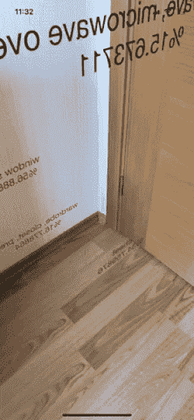

# SwiftUI + Core ML + ARKit —创建一个对象检测 iOS 应用程序

> 原文：<https://betterprogramming.pub/swiftui-core-ml-arkit-create-an-object-detection-ios-app-2c74fc57d984>

## 使用机器学习和增强现实的力量来检测你周围的物体


[帕特里克](https://unsplash.com/@patuphotos?utm_source=medium&utm_medium=referral)在 [Unsplash](https://unsplash.com?utm_source=medium&utm_medium=referral) 上拍照。

我最近在 Medium 上阅读和研究 iOS 文章的时候，发现关于 Core ML，ARKit，SwiftUI 的文章很少。这就是为什么我想把这三个库放在一起并[编写一个简单的应用程序](https://github.com/hanleyweng/CoreML-in-ARKit)。

长话短说，该应用程序使用了使用 Python 编写的名为 ResNet 的深度学习库的 Swift 版本。

现在来说说应用逻辑。当我们在应用程序中单击屏幕时，我们将捕获屏幕中心的当前图像，用我们的核心 ML 模型处理它，并创建一个增强现实文本。逻辑很简单。

# **我们开始吧！**

首先，我们从苹果提供给我们的模型中下载[我们的模型](https://developer.apple.com/machine-learning/models/)，并将我们的模型放在我们的项目根目录中。这里我们需要注意的一点是，我们的目标设备是一个真实的设备。否则，模型和`ARView`可能会出错。我猜是 Xcode 的 bug。

# 我们要做什么？

我们将创建一个界面为 SwiftUI 的增强现实项目。然后我们将删除项目中的名称`Experience.rcproject`。我们不需要它。

之后，我们将在`UIViewRepresentable`中创建我们的 ResNet 模型。因为我们的 ResNet 模型会抛出错误，所以我们在`do catch`块中配置我们的模型。

我们将在`makeUIView()`中名为`arView`的常量移出函数，并创建一个`ARRaycastResult`对象，在这里我们可以获得屏幕上被触摸点的信息，以及一个`VNRequest`数组，在这里我们将收集我们的核心 ML 请求。

```
**let** arView = ARView(frame: .zero)
**var** hitTestResultValue : ARRaycastResult!
**var** visionRequests = [VNRequest]()
```

完成所有这些步骤后，我们在`Struct`中定义了一个`Coordinator`类，并在我们的`UIViewRepresentable`对象中提供了对该类中 init 方法的引用，并使用`makeCoordinator()`函数将其引入到我们的`UIViewRepesentable`对象中。

到目前为止，我们已经执行了简单的操作。现在让我们继续主要的操作。

首先，我们将一个`tapGesture`添加到我们的`makeUIView()`函数中的`arView`对象中，并将`action`方法添加到我们的`Coordinator`类中。

这是我们在`UIViewRepresentable`的工作。现在让我们继续我们在`Coordinator`类中的操作。

首先，我们创建一个函数，将定义的对象名称放在屏幕上，并为此函数定义一个文本参数。

简单说一下功能吧。我们在[网格资源](https://developer.apple.com/documentation/realitykit/meshresource)类的`[genrateText](https://developer.apple.com/documentation/realitykit/meshresource/3244422-generatetext)`函数中创建一个增强现实对象，并且我们创建一个[简单材质](https://developer.apple.com/documentation/realitykit/simplematerial)对象。这些对象有助于应用一些材料(等。颜色、粗糙度)到我们的增强现实对象。

我们将这个材质转换成一个`Entity`对象，根据我们上面创建的`rayCastValue`中的坐标，按照现实世界的坐标来放置。

然后我们在`visionRequest`名称中创建将处理图像的函数。这个函数接受一个" [CVPixelBuffer](https://developer.apple.com/documentation/corevideo/cvpixelbuffer-q2e) "类型的值。

在通过这个处理请求的函数创建了一个核心 ML 请求之后，我们在现实世界中创建了一个文本对象，其中包含了我们想要显示信息的对象的名称和百分比。

作为最后一个过程，我们创建了标记为`obj`的方法。在该方法中，我们根据来自`tapGesture`对象的屏幕坐标获得真实世界中的 3D 位置，这要归功于我们的`raycast`方法。

当我们获得点击该屏幕时的快照后，我们从该数据中点击的位置就是`rayCastResultValue`。我们将常数和当时获得的截图转移到我们的方法中，然后将截图发送到我们的核心 ML 模型。

# 结果



结果

这里只有一个小问题。文本对象看起来并不是双面的，也没有这方面的 API。我希望苹果很快会在这个问题上带来一些创新。

# 结论

使用 Core ML 和 ARKit4 库，我们在 SwiftUI 界面中开发了一个对象识别应用程序。你可以在 GitHub 上找到完整的项目。我在下面留下了有用的资源来获取更多信息。

感谢您的阅读！

[](https://github.com/eren-celik/SwiftUI-CoreMl-ARKit) [## 额仁-切利克/斯威夫特 ui-CoreMl-阿尔基特

### 在 GitHub 上创建一个帐户，为 eren-celik/swift ui-CoreMl-ARKit 开发做出贡献。

github.com](https://github.com/eren-celik/SwiftUI-CoreMl-ARKit) 

## 核心 ML

*   [https://developer . apple . com/documentation/vision/recogniting _ objects _ in _ live _ capture](https://developer.apple.com/documentation/vision/recognizing_objects_in_live_capture)
*   [https://www . raywenderlich . com/7960296-core-ml-and-vision-tutorial-on-device-training-on-IOs](https://www.raywenderlich.com/7960296-core-ml-and-vision-tutorial-on-device-training-on-ios)

## 阿尔基特

*   【https://developer.apple.com/augmented-reality/ 
*   [https://medium . com/无瑕 app-stories/how-to-enforce-swift-style-and-conventions-into-the-project-using-swift lint-7588 B4 ffba 66](https://medium.com/flawless-app-stories/how-to-enforce-swift-style-and-conventions-into-the-project-using-swiftlint-7588b4ffba66)