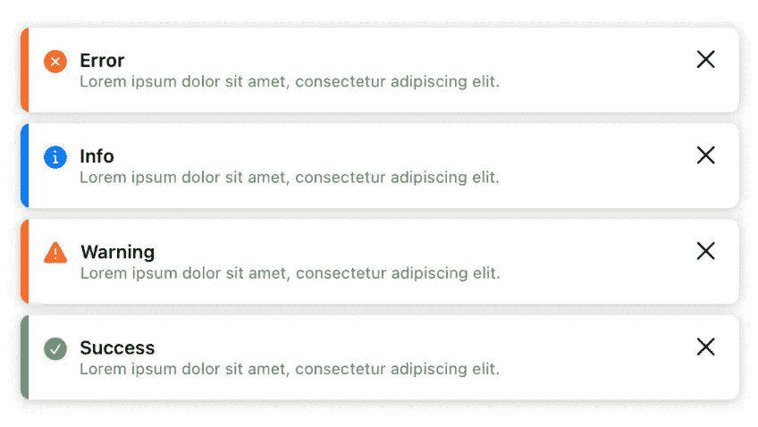
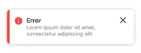
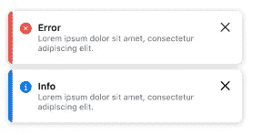

# 使用 SwiftUI 创建花式吐司组件

> 原文：<https://betterprogramming.pub/swiftui-create-a-fancy-toast-component-in-10-minutes-e6bae6021984>

## 构建令人惊叹的用户界面



对，我们要做这个组件！🎉

嗨，伙计们，欢迎来到另一篇 SwiftUI 文章！在本文中，我们将在 SwiftUI 中快速轻松地制作一个别致的 toast 组件。谁兴奋了？

## 什么是吐司？

> toast 组件是一个非破坏性消息，显示在界面底部，提供关于操作结果的快速、一目了然的反馈。[来源](https://polaris.shopify.com/components/toast)

基于 UX 的观点:

Toast 应该只用于不需要完全中断用户体验的确认、简单通知和低优先级警报。

事不宜迟，我们开始吧！

# 1.创建 toast 视图

首先，创建一个 SwiftUI 视图文件，并将其命名为`FancyToastView`或其他名称。这是我们将向用户显示的 toast 的主视图。

基于上面的代码，toast 由水平排列的图标、标题、消息和关闭按钮组成。对于图标，我们将使用`SFSymbol`,这样您就不需要导入资产来运行上面的代码。

我们用一张覆盖图来制作边单。当运行上面的代码时，视图应该是这样的:



如此奇特又如此简单，对吧？😁

但是…我们希望祝酒词的内容是动态的。行..下一个。

# 2.创建 toast 枚举样式和 toast 模型

我们将制作 4 种最常见的祝酒方式。样式包括信息、错误、警告和成功。不同之处通常在于主题颜色和图标。

我认为上面的代码非常简单。我们有 4 种类型，我们使用 computed 属性来获取每种类型的主题颜色和图标文件名。如此简单！

接下来，我们将制作一个模型来配置我们的 toast 内容。

我们的模型包含 type，其中 type 是我们之前创建的 enum，title 和 message 是将在烤面包机上显示的消息内容，duration 是决定烤面包机将显示多长时间的值，然后自动关闭它。此外，我们在模型中使用了 Equatable，因为我们希望区分不同的吐司。

# 3.将视图与模型集成

下一步是将我们的主视图与模型集成，这样我们的烤面包机内容就是动态的。

和上一个没多大区别吧？我们只是用模型中的值替换硬编码的值。如果你注意到了，就会发现有些不同。是的，我们对 cancel 按钮操作使用回调函数，所以我们希望父视图执行关闭 toast 的逻辑。

然后尝试通过调用视图来运行它，如下所示:

视图应该是这样的:



耶！

更近一步…

# 4.创建一个 ViewModifier 来显示 toast

我们希望能够轻松、无缝地展示我们的祝酒词，当然还可以重复使用。因为我们将在应用程序的许多视图中使用这个 toast。如果我们创建一个 ZStack，然后手动将 toast 放在每个视图的 tp 视图中，这将是非常复杂和累人的。`ViewModifier`是一把钥匙！

赞成..我希望这不会让:D 感到困惑

可能这是之前上面众多代码中最复杂，也有点混乱的一个。但是请冷静…我会试着用简单的方式解释。

在这个视图修改器中，有两个具有不同属性包装的变量。

第一个是 toast，这是一个 toast 模型，我们使用`@Binding`属性包装器将它绑定到 toast 视图，这样我们可以从内部改变值，并且如果外部的值发生变化，我们也可以直接反映出来。

第二个是`workItem`，它是一个`DispatchWorkItem`，当烤面包时间达到指定的持续时间时，它将帮助我们关闭烤面包。明白了吗？

我们还有 2 个视图函数和 2 个逻辑函数。我不会详细讨论 UI 代码，因为我相信你们所有人都已经理解了 SwiftUI 的基础，从上面的代码来看没有什么是困难的。一切都很基本。

我们只是将框架内容的大小设置为无穷大，这意味着它适合设备屏幕，因此我们的 toast 组件将按照我们的预期出现在屏幕的底部。然后我们使用 overlays 和 ZStack 将我们的 toast 组件放在内容之上。我们还使用`onChange`修饰符来执行负责显示 toast 的函数。

接下来是`showToast`函数，我认为它也很简单。因为我们只是调用了`UIImpactFeedbackGenerator`函数来让我们的 toast 变得引人注目和花哨，然后设置`workItem`任务并在指定的持续时间后执行它。

最后一个是`dismissToast`，也是直白吧？我们只是将 nil 设置为绑定 toast，然后取消并将 nil 设置为我们的工作项，以防止内存泄漏。

## 完成了吗？嗯差不多。

使它变得更容易和更有趣的最后一步是在视图扩展中创建一个函数，这样我们就可以使用我们的组件变得更加“SwiftUI”。

最后，我们完成了组件的创建，现在可以使用了！

使用组件的示例如下:

尝试运行它，它应该是这样的:


太棒了！！

## 结论

Toast 在应用程序中是一个非常常见的东西，我想为那些可能不知道如何在 SwiftUI 中制作这个组件的人分享如何轻松制作 toast 组件。或者对于那些已经有制作这个吐司组件的经验的人，或者有更好的东西，请在下面的评论中自由讨论。

接下来，您可以自己探索如何创建一个队列系统，如果您想要显示多个祝酒词和其他内容的话。

```
**Want to Connect?**If you’re an Indonesian, [Blibli.com is Hiring](https://careers.blibli.com/)! Pssst we are using SwiftUI in one of our projects
```