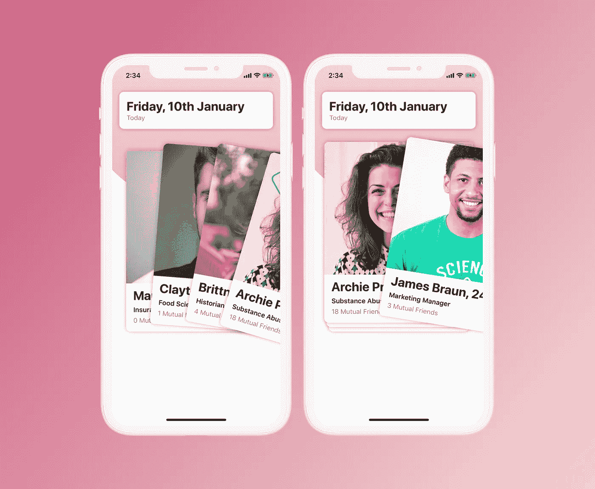
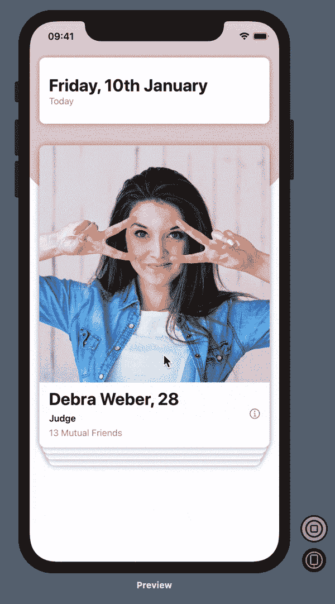
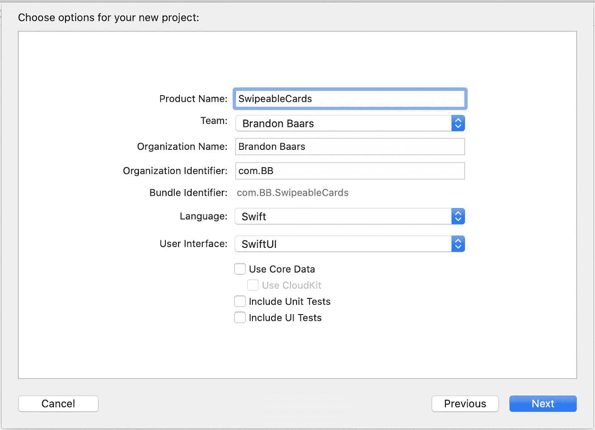
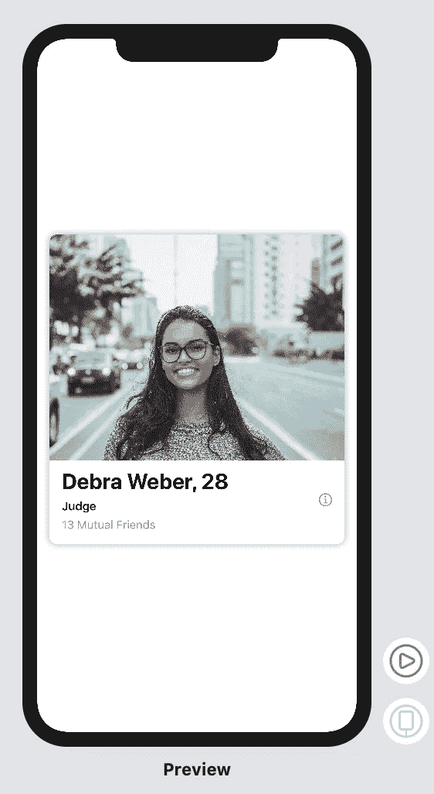
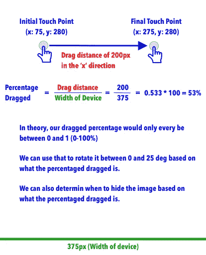
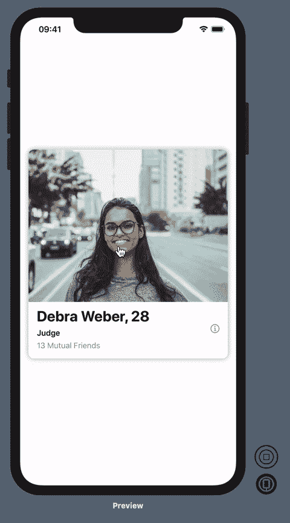
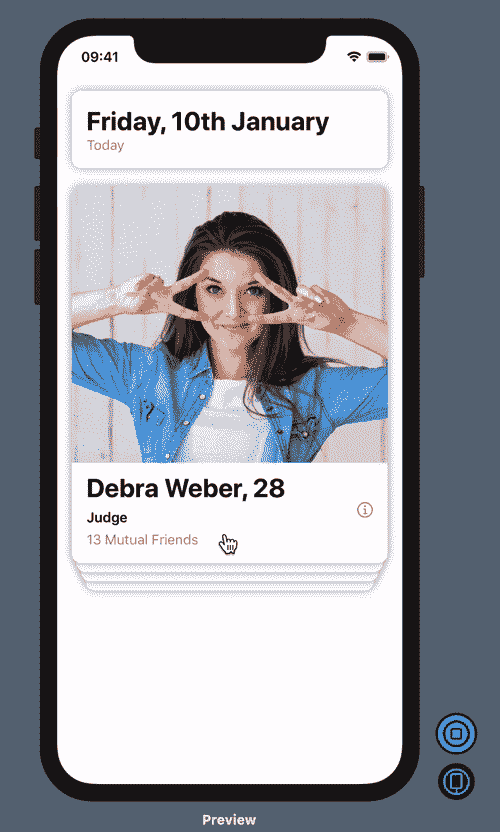

# SwiftUI:创建 Tinder 风格的可滑动卡片视图

> 原文：<https://betterprogramming.pub/swiftui-create-a-tinder-style-swipeable-card-view-283e257cb102>

## SwiftUI 中的卡片和刷卡手势



图片来源:李国豪·巴尔斯

# 以下是我们将在本教程中构建的内容

如你所见，任何时候都只显示四张牌。当一个被移除时，另一个被添加到堆栈的底部。



# 入门指南

在 Xcode 中创建新的 SwiftUI 项目。确定您运行的是 macOS Catalina，并且安装了 Xcode 11。(这允许您使用 SwiftUI。)

打开 Xcode →文件→新建→项目

我把我的叫做可刷卡，但是你想怎么叫都行。

确保将用户界面设置为 SwiftUI。



# 履行

让我们开始我们的布局。

我接着去了 pexels.com，搜索了人物，为这个教程抓取了大约十张人物照片。

我们将在顶部创建我们的日期视图。

打开`ContentView.swift`，在主`ContentView`结构之外添加以下代码作为新结构。

1.  创建一个类似容器的视图来包装我们的整个布局。我们添加了填充，这样我们的视图就不会接触到手机的侧面。
2.  `DateView`组件只是一个简单的布局，用`Text()`来显示我们的假日期。我们使用一个对齐的`VStack`和一个`Spacer()` 来让我们的文本位于视图的最左边。

接下来，我们将创建可重用卡片视图的布局。这张卡最终会被多次创建，并显示虚假数据。

布局存在一个图像，一些假数据，和一个信息按钮。该卡将有圆角和阴影。

创建一个新的 Swift 文件，并将其命名为`CardView.swift`。

打开新创建的`CardView.swift`文件，添加以下代码:

这里没有什么是开创性的 UI，但让我们来分解一下。

1.  使用几何阅读器在父视图的框架内调整内容的大小。变量`geometry`将允许我们访问父对象的宽度和高度。我们将用它来填充可用区域。这将允许我们根据从`geometry`接收的数据来调整我们的内容。
2.  创建我们的`VStack`我们的形象，然后是内容。这将把图像放在顶部，我们的内容在下面。
3.  将我们的图片调整为父图片的宽度和 75%的高度。这将使我们所有的图像大小相同，并为下面的`HStack`创造足够的空间。
4.  创建我们的`PreviewProvider`，这允许我们在屏幕右侧的画布中查看我们的`CardView`。我们给视图一个 400 像素的明确高度，并使用系统默认的填充。这意味着我们的`geometry`变量将接收这个帧，高度将是 400 像素，宽度将是我们设备的宽度减去系统填充(可能是 16 像素？).

我们新创建的`CardView`:



# 如何让它平移和旋转



我们可以使用拖动手势来获得拖动的宽度。在上图中，如果用户从这两点拖动，我们的平移将是 200 像素。

使用这个不断变化的值，我们可以根据用户拖动手指的程度，将视图偏移我们想要的 x 或 y 值。

然后，我们可以使用设备或父视图的值和宽度来确定用户拖动屏幕的百分比。

使用该百分比，我们可以说，在 0%时，我们不旋转图像，但在 100%时，我们将其旋转 25 度。

写一些伪代码获取我们的旋转度数:
`let rotationDeg = dragPercentage * 25`。

这会给我们 0 到 25 之间的值。

谢天谢地，SwiftUI 通过手势为我们做了很多繁重的工作。我们只需要保存一个`@State`值来更新我们的翻译。使用该值，我们可以进行必要的计算。

仍然在我们的`CardView.swift`中，将下面的变量和视图修饰符添加到我们现有的最外层`VStack { }`中。

1.  创建一个私有状态变量来保存我们的翻译值。
2.  基于我们的平移的宽度/高度中的任何值来更新视图的偏移。这将把视图准确地移动到我们拖动它的地方。
3.  添加手势修改器并指定`DragGesture()`类。这个类允许我们获得`.onChange`处理程序中的拖动值。
4.  将我们的`translation`变量更新为我们拖动的新值，并在`.onEnded`中将我们的平移重置回 0。如果我们不把它设置回 0，视图将保持在我们上次离开的地方。

您可能已经注意到，我们的视图可以在 x 或 y 方向拖动。但是，我们需要将其限制在 x 方向(水平拖动)。

将
`.offset(x: self.translation.width, y: self.translation.height)`
改为
`.offset(x: self.translation.width, y: 0)`。

注意:这里我们不想根据我们的拖拽来更新我们的 y 值，只更新 x 值。

## 旋转

简单，让我们使用几何阅读器的宽度来检索父视图的宽度，并使用它作为我们的最大拖动距离。

我们所要做的就是在`.offset()`之后和`.gesture()`之前添加这一行代码视图修饰符:

`.rotationEffect(.degrees(Double(self.translation.width / geometry.size.width) * 25), anchor: .bottom)`

这将添加一个 0 到 25 度之间的旋转效果(或者-25 度，取决于我们在 x 轴上移动手指的方向)，锚定在我们视图的底部。

如果我们没有设置底部锚点，我们的视图将围绕它的默认视图`.center`旋转。(这也很好，但我认为`.bottom` 看起来更好)。

这就是我们现在的观点:



不过，你现在可能会问，当翻译结束时，我们如何将它动画回原位。

轻松点。

在`.offset()`修改器的正上方添加`.animation(.interactiveSpring())`作为视图修改器。这将交互式地产生一个漂亮的弹簧般的动画。

# 如何创建堆叠卡片

为了实现堆叠的卡片外观，创建一个由四张卡片组成的`ZStack`。这四张牌将作为前四名。如果一个被删除，一个被添加到堆栈的底部，以此类推，动画帧的每一个变化，所以最新的一个变得更大，当它在顶部时。

为了将最大的卡片放在顶部，我们需要使用每张卡片的索引，并基于该索引使其稍微变小。该指数将通过乘以一个固定值来决定每张卡的宽度。

## 那是什么意思？

假设我们最上面的卡片的索引是 0，下一张是 1，然后是 2，以此类推。我们可以将其乘以 10px，然后从宽度中减去该值，从而将每张卡片的大小减少 10px。我们可以对 y 偏移做同样的事情，这样第三张卡片看起来比第一张卡片更靠下。

我们现在移除最上面的卡片(索引为 0)，新的最上面的卡片现在是索引 1。现在，我们遇到了一个问题，因为我们的第一个视图会由于上述算法的性质而稍微偏移。如果我们最上面的牌变成了索引 9，情况会更糟，因为我们已经移除了另外 9 张牌。

一种解决方案是当另一张卡被移除时，通过减一来更新每张卡的索引。所以当最上面的卡片被移除时，我们将下一张卡片更新为新的索引 0。这样做的一个缺点是，当我们修改对象时，我们需要遍历整个列表并更新每个条目的索引——我们可能并不总是被允许这样做。

另一个稍微复杂一点的解决方案是反转索引并从数组长度中减去它们，然后在算法中使用它来找到新的宽度和 y 偏移量。

让我们深入探讨一下，因为这是我们将要使用的解决方案。(它的可扩展性稍强，您不必遍历整个列表来更新每个对象上的变量)。

假设我们有 10 张卡片，索引 0-9。如果我们反转数组，我们的索引现在是 9 → 0。

我们顶卡的当前指数是 9。数组的最大索引是 9。我们可以做:
`let offset = (arraySize — 1 — currentIndex) * 10`

对于我们的顶卡，这将等同于`10–1–9 * 10 = 0`。

然而，对于我们的第二张卡，它等同于`10–1–8 * 10 = 10`。

第三张牌`10–1–7 * 10 = 20`。

这种模式适用于所有未来的卡片。

这将减少宽度并偏移 y 轴。

# 来实施吧！

打开`ContentView.swift`，添加以下代码:

1.  使用我们的`User`结构，构造一个包含十个伪用户的数组。`id`字段是我们用来驱动`CardView`偏移的。
2.  创建一个助手函数来返回我们的新宽度。这依赖于用户的 ID 字段来计算我们的偏移量。
3.  为我们的卡偏移创建另一个助手，同样使用 ID 字段和每张卡 10px。
4.  添加一个`GeometryReader`来获得我们的`VStack`的实际大小(因为在本例中这是我们的父视图)。
5.  添加一个`VStack`，这样我们的`DateView`和`ZStack`卡可以很好地配合，并且`DateView`卡在`CardView`卡的上方。
6.  加一个`ZStack`。因为我们将循环和创建我们所有的卡片，我们希望它们一个在另一个之上。然而，它的工作方式是阵列中的最后一张牌在顶部，带有`id: 9`。
7.  为了迭代我们的用户，在`ForEach`中创建的每个视图都需要一个`ID`。我们可以为我们的用户继承`Hashable`协议，这允许我们在这里使用`\.self`(这只是我们数组中的每个用户)。`Hashable`确保每个物体都是独一无二的。或者，您可以不使用`Hashable`协议，而只编写`\.self.id`，它对应于每个用户的 ID，这个 ID 对于`User`对象的每个实例都是唯一的。
8.  将我们的帧和偏移量更新为从步骤 2 的帮助函数返回的内容。第三。

我们的更新视图:


你可能注意到了，我们所有的牌都被展示出来了。

如果我们想限制只显示前四张的牌呢？

如果我们回头看看我们是如何实现我们的卡的，我们知道每张卡都有一个`id`。如果 ID 在四的范围内，我们只能呈现前四张卡片。

例如，如果我们的顶部 ID 是 9，那么我们希望显示 ID 为 6、7、8、9 的卡片。

为了实现这一点，当我们在那个`ForEach`中创建我们的卡视图时，我们可以编写一个`if-statement`，它查看卡的 ID 并确定它是否在该范围内。

将这个计算出的变量添加到顶部，在`var body: some View { }`之上

```
 // Compute what the max ID in the given users array is. 
 private var maxID: Int {
     return self.users.map { $0.id }.max() ?? 0
 }
```

我们创建了一个计算变量，无论何时使用，它都会重新计算`maxID`是什么。当我们开始从牌堆中取出牌时，这将很有用。

接下来，在这个 if 语句中包装`CardView().frame(:width).offset(x:y:)`。

```
/// Using the pattern-match operator ~=, we can determine if our 
/// user.id falls within the range of 6...9if (self.maxID - 3)...self.maxID ~= user.id {
    // Normal Card View being rendered here.                                    
}
```

或者，您也可以:

```
if user.id > self.maxID - 4 { ... }
```

现在我们在任何给定的时间都只展示四张牌。

# 移除卡

要移除一张卡，我们将使用一个给定的阈值(比如 50%刷卡)，这将触发我们的父视图从用户的数组中移除该卡，同时还将其隐藏在`View`中。

这样做将在我们的`View`层级中触发一次重新渲染，我们应该还有四张牌在堆叠中，但它们将是接下来的四张。

打开`CardView.swift`并添加以下新代码:

1.  创建两个变量，一个用于`User`函数，一个用于`onRemove`函数，当用户刷卡超过某个阈值时，将调用这两个变量。
2.  将我们的阈值百分比指定为视图宽度的 0.5%或 50%。
3.  创建我们的自定义`init`，它接受我们的用户和`onRemove`函数。请注意，我们将通过以下方式传回移除的用户:

```
 @escaping (_ user: User) -> Void
```

4.创建一个助手函数，它将获取我们的几何图形和当前滑动值，并传回百分比。

5.用`self.user.{value}`更新用户特定数据的所有实例。现在所有的卡都不一样了。

6.在我们的手势识别器的`.onEnded`中，我们确定我们的`gesturePercentage`是大于还是`threshold`。如果是，我们调用我们的`onRemove`，传回我们的`user`。

7.确保更新`PreviewProvider`以包含一个`temp`用户，这样我们的视图将再次呈现在画布中。

现在打开`ContentView.swift`，更新我们的`view`，我们正在构建我们的`User`视图:

```
CardView(user: user, onRemove: { removedUser in
   // Remove that user from our array
   self.users.removeAll { $0.id == removedUser.id }
  })
  .animation(.spring()) // Animate our changes to our frame
  .frame(width: self.getCardWidth(geometry, id: user.id), 
         height: 400)
  .offset(x: 0, y: self.getCardOffset(geometry, id: user.id))
```

现在我们删除与我们删除的用户 ID 相匹配的`user`。

我们还加上了`.animation(.spring())`。这现在使我们的框架中的变化有了动画效果，所以看起来我们新的顶卡会弹出来，同时也使被添加到底部的卡有了动画效果。

现在我们的视图应该是这样的:



# 就是这样！

我们完成了 Tinder 风格布局的滑动和堆叠视图。

我要求你自己加上喜欢和不喜欢的。

完整的源代码可以在这里找到，包括挑战:[https://github.com/bbaars/SwiftUI-Tinder-SwipeableCards](https://github.com/bbaars/SwiftUI-Tinder-SwipeableCards)