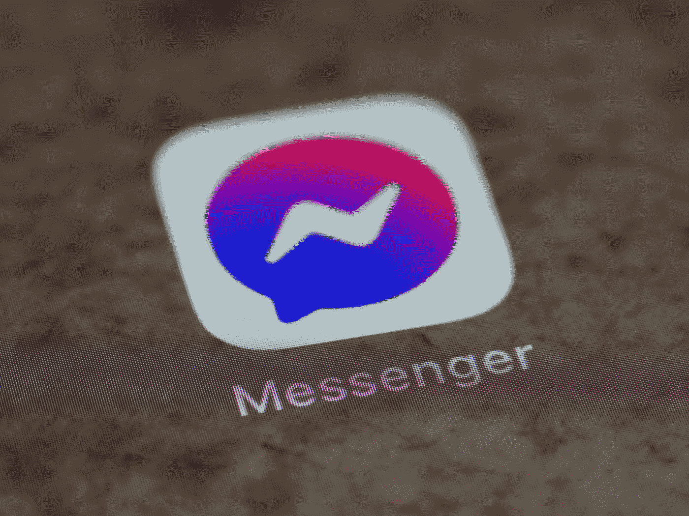
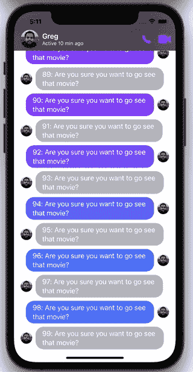
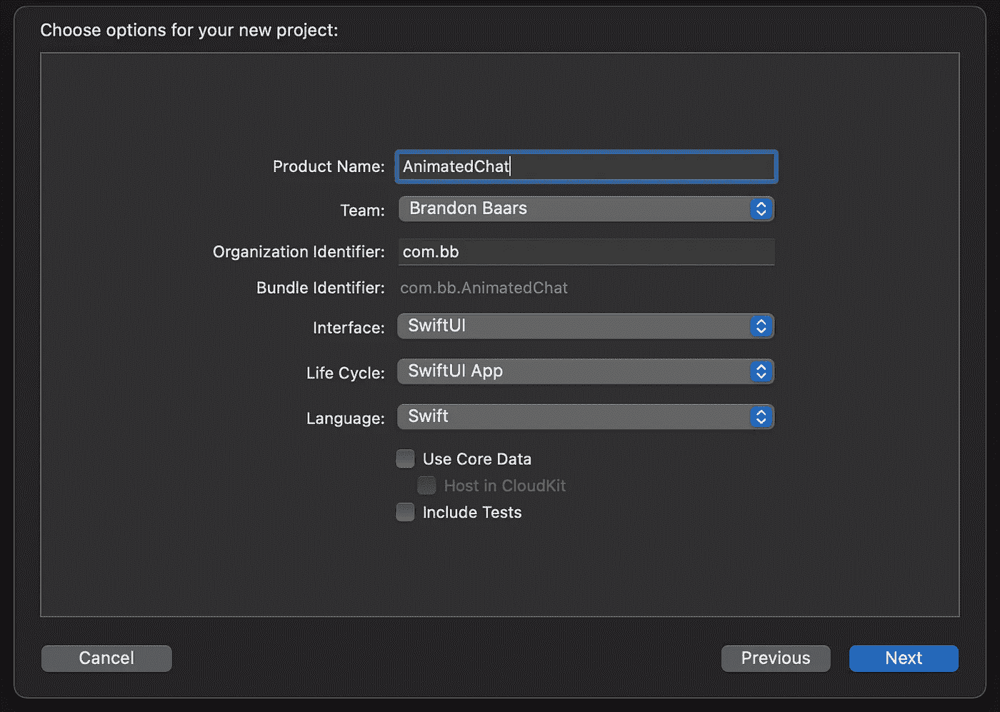
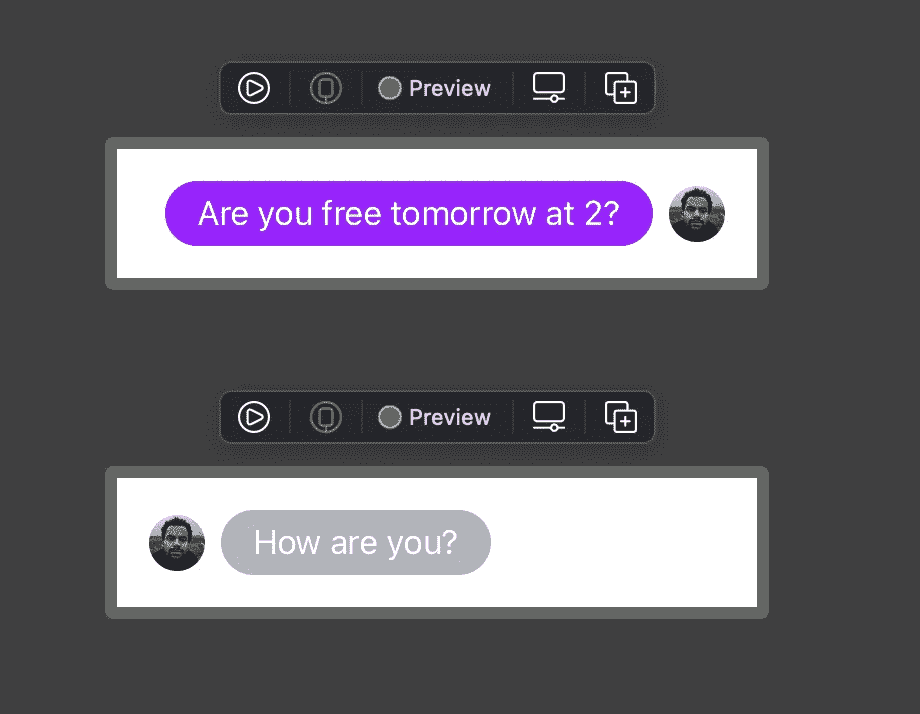
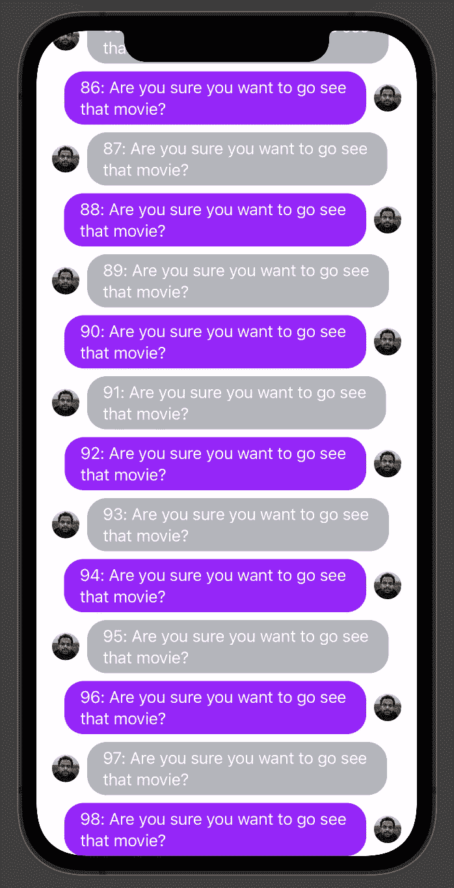
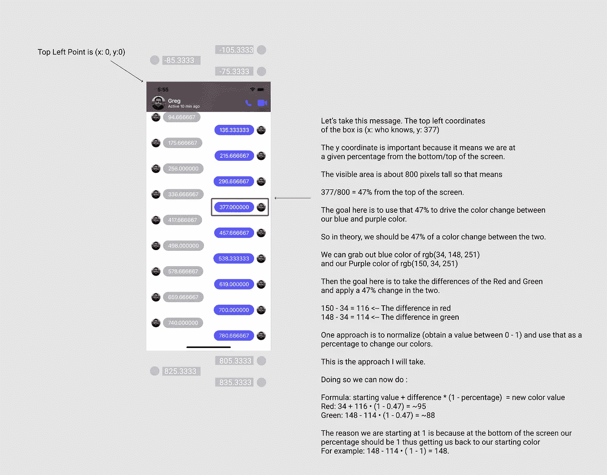
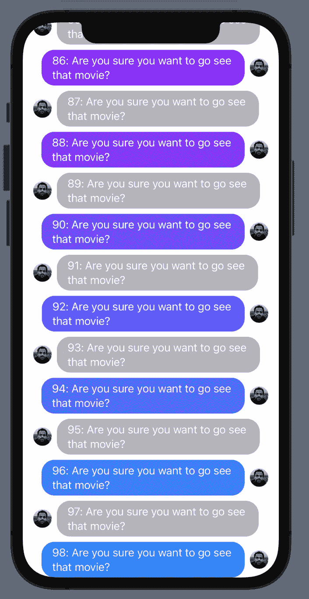

# SwiftUI:像 Facebook Messenger 一样创建变色聊天

> 原文：<https://betterprogramming.pub/swiftui-create-color-changing-chat-like-facebook-messenger-1b3a937b1cd9>

## 了解如何使用 GeometryReader 和 PreferenceKey 在用户滚动时改变聊天气泡的颜色。

布雷特·乔丹在 [Unsplash](https://unsplash.com?utm_source=medium&utm_medium=referral) 上拍摄的照片

在本教程中，我们将创建一个可滚动视图，其中聊天的颜色将根据其在可视区域内的位置而变化。我们将使用`GeometryReader`和`PreferenceKey`来获取所有子视图的当前位置。如上图所示，我们正在显示当前`minY`T3 的聊天记录。顶部的聊天消息更靠近屏幕的顶部，因此它们更接近 0，因为屏幕的左上角是原点。随着聊天记录的下移，它们在视图中的位置离原点越来越远，这就解释了为什么它们是一个更大的数字。

这就是我们在本教程中要完成的内容:

作者图片

# 入门指南

若要开始，请打开 Xcode。我在使用 Swift 5 的英特尔 Macbook Pro 上运行 Xcode 12.5.1。

打开 Xcode →文件→新建→项目

通过选择单视图应用程序创建一个新的 SwiftUI 项目，并将其命名为 AnimatedChat(或其他任何名称)。

确保你的用户界面设置为 SwiftUI

作者图片

# 履行

让我们从聊天模型开始。该模型将驱动用户在屏幕上看到的内容。

创建一个新的`swift`文件，命名为`Model.swift`。这个文件将只是持有这个小项目的所有模型。通常，我会让每个模型都有一个单独的文件。

在`Model.swift`内添加以下`structs`和必要的代码:

这里我们只是创建一个 SwiftUI `Color`扩展。这将允许我们在以后使用它们作为正常的颜色。

`User`结构包含一个名称和图像属性。这些将驱动我们稍后将创建的`MessageView`。

我们的`Message`结构持有一个`id`以使其可识别，这样我们可以在一个`ForEach`中循环遍历它们。它保存了消息是由谁发送的、消息是由谁发送的以及是否是由他们自己发送的。

接下来，让我们创建我们的`MessageView`。创建一个新的 SwiftUI 视图文件并将其命名为`MessageView.swift`。

上面的布局创建了下图。本质上，我们正在创建一个`HStack`,其中每个视图根据消息是由您还是其他人发送的，向左或向右推送内容。

对于用户图像，我从 [pexels](https://www.pexels.com/search/portrait/) 中抓取了一个图像。

作者图片

现在，返回到`ContentView.swift`，我们将创建我们的父视图，它将在`ScrollView`中创建和显示我们所有的消息。

要开始，打开`AnimatedChatApp.swift`(这是我对我的项目的称呼，但你的可能不同)

继续添加以下代码:

这只是创建了一个包含 99 条消息的数组，其中每条消息都有一个惟一的 ID，并且该消息包含 ID。

然后，我们将把这些消息传递到我们的主视图中。

打开`ContentView.swift`，让我们添加下面的代码来创建我们的`ScrollView`和`MessageViews`

这里我们向 ContentView 添加一个用户和消息。这些是由父节点传入的。在我们的例子中，用户就是`otherPerson`。

我们添加了一个`ScrollViewReader`，这样当视图第一次出现时，我们可以滚动到最后一项。你可以在我们做`proxy.scrollTo(lastItem)`的第 17 行看到

在我们的`ScrollView`中，我们循环所有的`messages`并添加一个`id`到视图中。这是`proxy`滚动到特定位置所需的`id`。

目前我们所拥有的当前输出

# 使用 PreferenceKey 和 GeometryReader

现在我们要开始有趣的事情了。我们将使用`PreferenceKey`和`GeometryReader`来读取所有聊天消息的`frame`，并使用当前的`minY`(视图左上角的 Y 坐标)来确定我们的背景颜色。

## 快速背景

作者图片

在`MessageView.swift`中添加以下代码

这是获取给定元素的`CGRect`信息的一种方式。它利用`PreferenceKey`在它的全局框架内向上传递子节点`geometry`，如上面要点的第 7 行所示。

如果你对`PreferenceKey or GeometryReader`不熟悉，看看这篇[文章](https://swiftui-lab.com/communicating-with-the-view-tree-part-1/)做个概述。

现在回到我们的`struct MessageView`，让我们添加以下代码:

我们添加了一个名为`getBackgroundColor`的函数，它接收`currentFrame`并使用百分比来驱动我们的颜色变化。

我们首先标准化我们的值，并确保屏幕顶部边缘以上的任何值为 0，然后屏幕底部以下的任何值为 1。使用 0 和 1 之间的这个值，我们确定百分比偏移。

你现在应该可以看到滚动时颜色的变化！

作者图片

# 结论

这就是我们如何使用`PreferenceKey`和`GeometryReader`来获取消息的当前帧。当用户滚动时，使用 Y 值创建到新颜色的过渡。

 [## bbaars/动画聊天

### Permalink 无法加载最新的提交信息。没有提供描述、网站或主题。你不能表演那个…

github.com](https://github.com/bbaars/AnimatedChat)