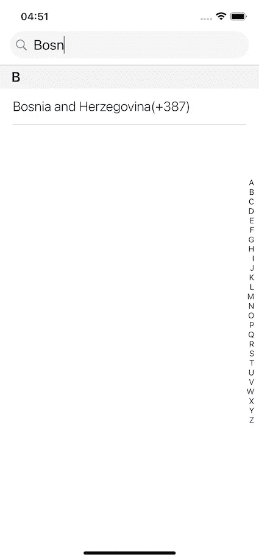
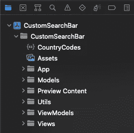
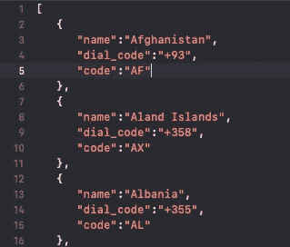

# 使用 LazyVStack 构建一个自定义的 SwiftUI 搜索栏，包含部分和部分索引

> 原文：<https://betterprogramming.pub/swiftui-custom-search-bar-lazyvstack-with-sections-and-section-index-6091da436c83>

## 让我们创建一个国家采摘 iOS 应用程序


马库斯·温克勒在 [Unsplash](https://unsplash.com?utm_source=medium&utm_medium=referral) 上拍摄的照片

在这个简短的教程中，我们将实现我们的自定义搜索栏 LazyVStack，它包含带有节和节索引的数据—灵感来自于 [this StackOverflow 问题](https://stackoverflow.com/questions/58809357/swiftui-list-with-section-index-on-right-hand-side)。

首先，让我们解释一下我们想要达到的目标。假设我们需要实现一个可搜索或过滤的值列表，用户需要从中选择一个。

在这个例子中，我们实现了一个国家代码选择器，其中我们的列表包含了一个国家列表以及它们各自的国家代码。用户从列表中选择一项，然后返回输入电话号码。

我们的成品将是这样的:


正如我们所看到的，我们有一个包含部分的项目列表。每个部分在屏幕右侧都有一个索引，当我们点击索引值时，我们的列表就会滚动到所选的部分。此外，当我们在搜索栏中输入文本时，带有部分的项目列表会被过滤。



因此，让我们创建我们的项目。我们项目的结构将如下所示:



首先，我们需要添加`**CountryCodes.json**`文件。文件的结构如下所示:



因此，让我们创建我们的`CountryModel.swift`来保存来自 JSON 文件的数据。

接下来，我们将实现`CountryCodeViewModel.swift`，它负责从 JSON 文件中获取数据，并创建节。

正如我们在前面的代码部分中看到的，当我们初始化视图模型时，我们从 JSON 文件中初始化数组或国家。

接下来，我们将添加代表可点击列表项的`CountryItemView.swift`。

所以，剩下要实现的最后一件事就是`CountryCodeView.swift`。它结合了所有以前的代码。因此，让我们将视图主体分成多个部分。

搜索栏是自定义创建的，如下所示:

下一个重要部件是`countriesListView`:

让我们就此打住，解释一下这个应用程序最重要的部分。

首先，我们在`ScrollView`和`ScrollViewReader`里面加上了`LazyVStack`和段。在`LazyVStack`内的每个子视图部分都用`pinnedViews:[.sectionHeaders]`钉住。

接下来，我们遍历 sections 数组中的每个 section 或字母，并将 section 添加为`CountrySectionHeaderView`。

我们使用的第一个过滤器是 section 过滤器，它通过调用`searchForSection`函数并根据用户输入的搜索栏文本的第一个字母来过滤我们的 section 数组:

```
**self**.searchForSection($0)
```

接下来，当我们遍历各个部分时，我们通过获取每个国家的第一个字母并将其与当前部分的字母进行比较来过滤视图模型中的国家名称。该过滤器将过滤后的国家添加到所需的部分。

```
(countryModel) -> Bool **in** countryModel.name.prefix(1) == letter
```

同时，我们为搜索栏输入使用另一个过滤器，通过调用`searchForCountry`函数来过滤视图模型中的国家。这个函数根据用户在搜索栏中输入的字符串过滤国家。

```
**self**.searchForCountry(countryModel.name)
```

`scrollProxy` from `ScrollViewReader`允许我们滚动到我们点击的索引列表项目的每个部分的顶部。

```
scrollProxy.scrollTo(target, anchor: .topLeading)
```

我们通过监听状态变量`scrollTarget`的值来做到这一点。该变量在`lettersListView`索引列表中变化，每次我们点击列表中的字母按钮项目。

```
Button(action: {
   **if** countryCodeViewModel.countryCodes.first(where: {    $0.name.prefix(1) == letter }) != **nil** {
         scrollTarget = letter
   }
}
```

最后一部分是`lettersListView`。

就是这样，希望你喜欢这个教程，并期待更多的内容。

代码可从下面的 GitHub 库获得:

[](https://github.com/kenagt/CustomSearchbarIOS) [## GitHub-kenagt/CustomSearchbarIOS:带有 LazyVStack、过滤和…

### 此时您不能执行该操作。您已使用另一个标签页或窗口登录。您已在另一个选项卡中注销，或者…

github.com](https://github.com/kenagt/CustomSearchbarIOS)