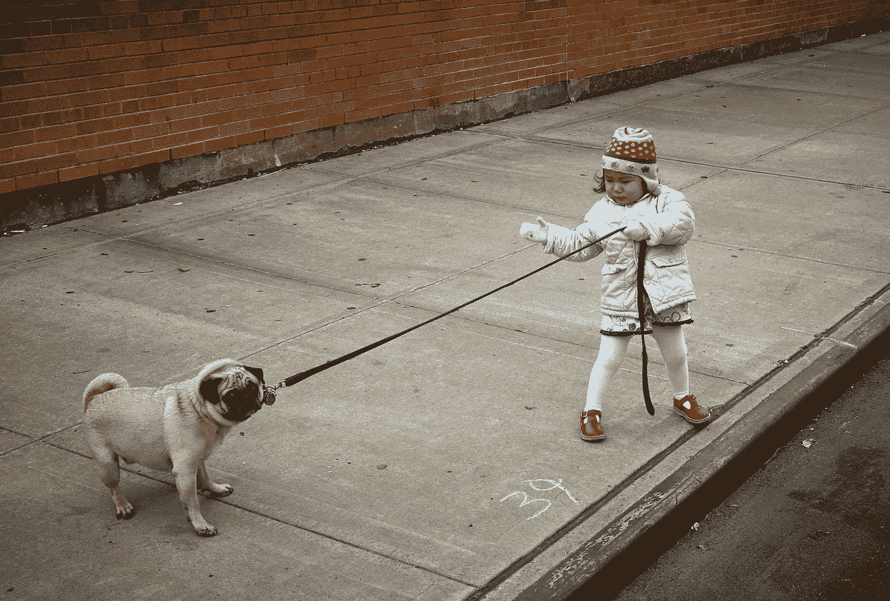
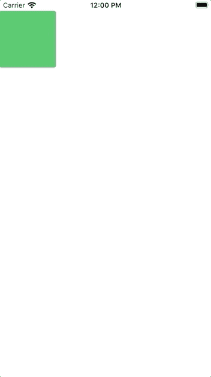
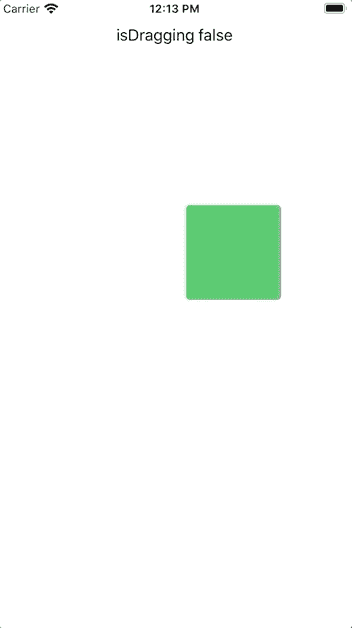
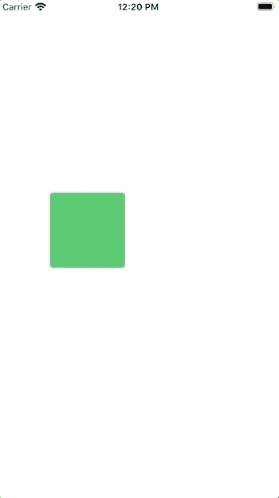
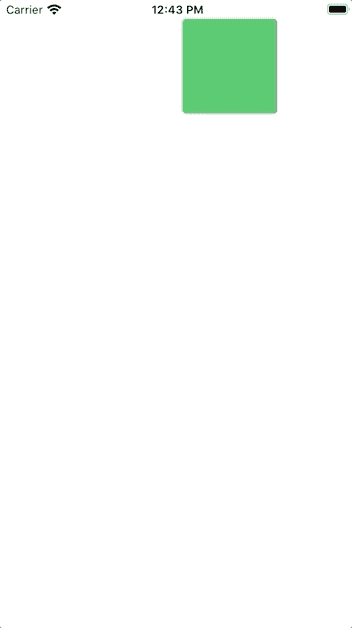

# SwiftUI:拖动手势

> 原文：<https://betterprogramming.pub/swiftui-drag-gesture-2559cf255c5e>

## 让您的用户在应用程序的屏幕上拖动项目



照片由[维达尔·诺德里-马西森](https://unsplash.com/@vidarnm?utm_source=unsplash&utm_medium=referral&utm_content=creditCopyText)在 [Unsplash](https://unsplash.com/s/photos/pull?utm_source=unsplash&utm_medium=referral&utm_content=creditCopyText) 上拍摄

"拖动手势:一种拖动动作，当拖动事件序列改变时，它调用一个动作."— [苹果文档](https://developer.apple.com/documentation/swiftui/draggesture)

在本教程中，您将了解 SwiftUI 中的拖动手势是什么。您将学习如何:

*   使用`.onChanged`
*   使用`.updating`
*   使用`.onEnded`
*   限制滚动

# 先决条件

要跟随本教程，您需要:

*   基本熟悉 Swift
*   至少具备 Xcode 11 的一些基础知识

# 。onChanged

`onChanged`改变您拖动的对象的位置值。这将移动物体。

首先，让我们创建一个可以存储大小的变量。使用下面的变量，对象现在被放置在 x 和 y*的坐标 50 处。*

```
*@State private var rectPosition = CGPoint(x: 50, y: 50)*
```

*当矩形移动时，你将改变`rectPosition`。*

*结果，你有一个移动的矩形。*

**

# *。更新*

*通过读取状态可以知道用户是否在拖动。首先，创建保存一个值的`GestureState`。*

```
*@GestureState private var isDragging = false*
```

*这里你不能更新`isDragging`，因为它是只读的。但是您可以更新状态，然后状态会更新`isDragging`。*

```
*.gesture(DragGesture().onChanged({ value in
    self.rectPosition = value.location
}).updating($isDragging, body: { (value, state, trans) in
    state = true
}))*
```

**

# *。统一的*

*也许您只希望在用户拖动完对象后执行某些操作。首先，创建一个变量来知道用户是否已经结束拖动。*

```
*@State private var isEnded = false*
```

*如果 x 小于 120，您可以使用相同的代码并稍加调整来设置颜色。*

*这就是结果:*

**

# *限制水平滚动*

*在屏幕上拖动太多；我的应用不太支持这个功能。只是水平拖动呢？*

```
*.gesture(DragGesture().onChanged({ value in
    self.rectPosition = CGPoint(x: value.location.x, y: 50)
}))*
```

**

*如果你只想让它垂直滚动，那么你可以只考虑改变 y 的值。*