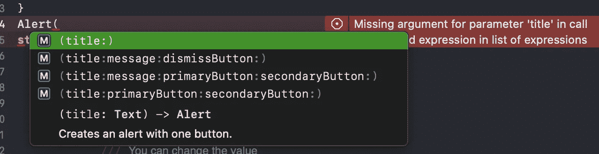
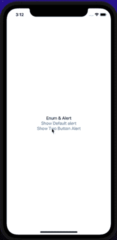

# SwiftUI:枚举和警报

> 原文：<https://betterprogramming.pub/swiftui-enums-and-alerts-8b5d75d81e78>

## 在警报中使用枚举的力量

[alevision.co](https://unsplash.com/@alevisionco?utm_source=medium&utm_medium=referral)在 [Unsplash](https://unsplash.com?utm_source=medium&utm_medium=referral) 上拍照。

在本文中，我们将讨论使用 SwiftUI 的 enums 的强大功能。如果您想了解更多信息，请查阅 [Swift 的文档](https://docs.swift.org/swift-book/LanguageGuide/Enumerations.html)。

# 我们开始吧

最近，我在开发一个小应用程序，我不得不使用许多[提醒](https://developer.apple.com/documentation/swiftui/alert)。我意识到我需要将`@State`属性与警报用法一起使用。这很糟糕，因为我的项目中许多不必要的`@State`属性将会转换成意大利面条式的代码。此外，警报不使用相同的堆栈或行。有时候，我不知道把它们放在哪里。

因此，我决定在本文中将枚举的力量与警告结合起来。让我们开始钻研代码吧！

# 逻辑

我们将根据警报按钮类型创建一个 enum，并在 SwiftUI 视图中使用它。基本上，当我们查看按钮的动作枚举类型时，有三种类型的动作([默认警告、单按钮警告、双按钮警告](https://developer.apple.com/documentation/swiftui/alert/button))。您也可以使用这些按钮来分配操作。此外，我们还有一个标题和可选的消息值。

警报值

我们根据警报值创建枚举结构。如您所见，这是一个标准的 Swift 警报结构。如果您愿意，您可以对`[.actionSheet](https://developer.apple.com/documentation/swiftui/actionsheet)`警报类型使用相同的逻辑。

正如您在下面看到的，如果您按下按钮，您指定分配给警报值的值，`@State`属性触发警报值，您将看到警报:

# 结论

结果

今天，我们学习了如何显示没有不必要的`@State`或`.alert`值的警告。不要忘记，您可以在`.actionSheet`警报类型上使用相同的结构。

各位编码愉快。下一篇文章再见！