# SwiftUI:渐变

> 原文：<https://betterprogramming.pub/swiftui-gradient-67e66a38793a>

## 使用渐变，更多地使用颜色并创建漂亮的颜色表示

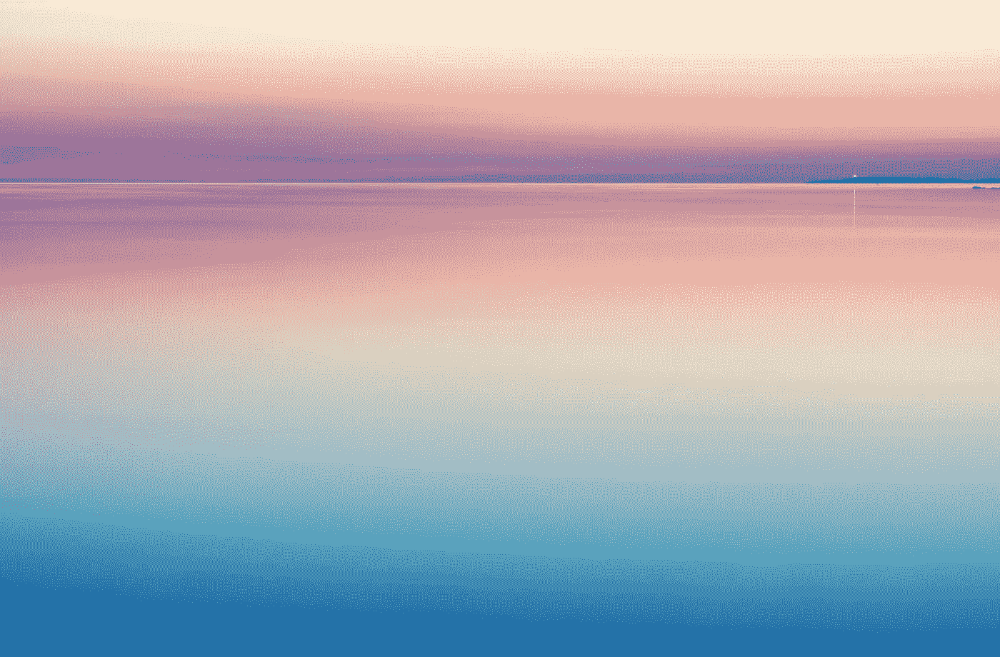

照片由[哈里·马腾](https://unsplash.com/@harlimarten?utm_source=unsplash&utm_medium=referral&utm_content=creditCopyText)在 [Unsplash](https://unsplash.com/s/photos/gradient-background?utm_source=unsplash&utm_medium=referral&utm_content=creditCopyText) 上拍摄

> *"一种颜色渐变，表示为一个色标数组，每个色标都有一个参数化的位置值。"—苹果文档*

在本教程中，您将学习如何在 SwiftUI 中实现不同的渐变。您将了解到:

*   如何使用角度渐变？
*   如何使用线性渐变？
*   如何使用径向渐变？

# 先决条件

要跟随本教程，您需要:

*   对 Swift 的基本熟悉。
*   至少 Xcode 11。

# 角度梯度

使用角度渐变，您设置圆心，渐变将从您设置的角度开始，顺时针填充，完成整个圆。

目前，渐变从顺时针移动的 180 度开始填充。

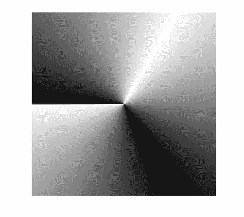

你甚至可以调整渐变的开始和结束角度。将起始角度设置为 90 度，结束角度设置为 180 度。

```
let angularGradient = AngularGradient(gradient: Gradient(colors: [.black, .white, .black]), center: .center, startAngle: .degrees(90), endAngle: .degrees(180))
```


如果突出的中心更容易引起眼睛疼痛，你可以把它移到尾部。

```
let angularGradient = AngularGradient(gradient: Gradient(colors: [.black, .white, .black, .white]), center: .bottomTrailing, angle: .degrees(0))
```

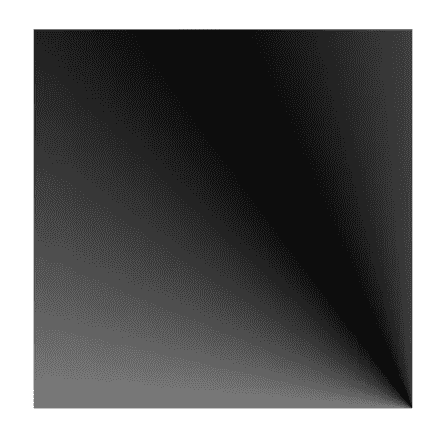

# 线性梯度

线性渐变是最常用的渐变，通常有起点和终点。

苹果在预定义`UnitPoint`方面做得很好，使用了`.leading`、`.trailing`、`.top`、`.topLeading`等等。你所要知道的就是你希望它在哪里开始和结束。

## **从左到右**

```
let linearGradient = LinearGradient(gradient: Gradient(colors: [.green, .yellow]), startPoint: .leading, endPoint: .trailing)
```

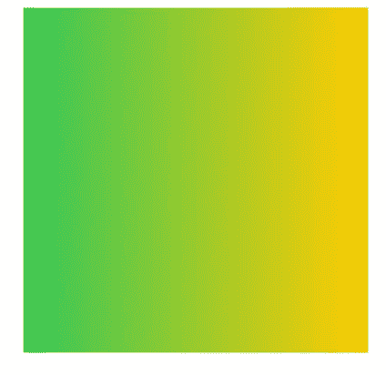

## **从上到下**

```
let linearGradient = LinearGradient(gradient: Gradient(colors: [.green, .yellow]), startPoint: .top, endPoint: .bottom)
```

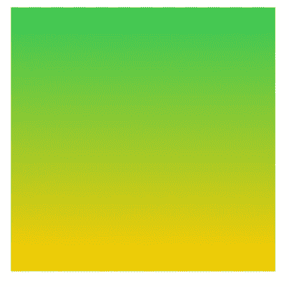

## **从左至右上方**

```
let linearGradient = LinearGradient(gradient: Gradient(colors: [.green, .yellow]), startPoint: .leading, endPoint: .topTrailing)
```

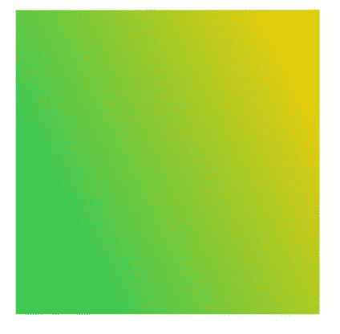

如果您需要自定义方向，您甚至可以定义自己的`UnitPoint`。

```
let linearGradient = LinearGradient(gradient: Gradient(colors: [.green, .yellow]), startPoint: UnitPoint(x: 0.9, y: 0.9), endPoint: UnitPoint(x: 0.25, y: 0.25))
```

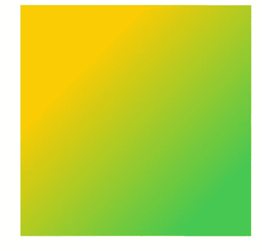

# 径向梯度

除了起点和终点之外，径向渐变的行为方式与线性渐变相同。

使用径向渐变，可以指定起始半径和终止半径。这样，梯度将填补它循环，向外移动。

```
let radialGradient = RadialGradient(gradient: Gradient(colors: [.blue, .purple]), center: .center, startRadius: 1, endRadius: 20)
```

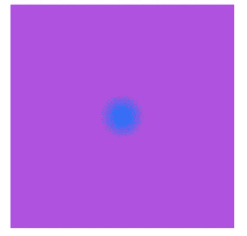

为了更明显，你可以设置一个更大的半径。

```
let radialGradient = RadialGradient(gradient: Gradient(colors: [.blue, .purple]), center: .center, startRadius: 10, endRadius: 70)
```

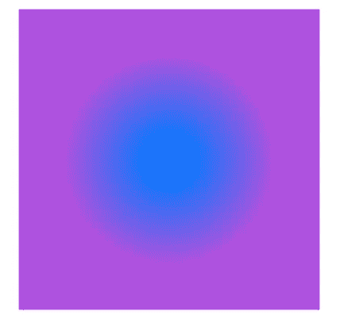

如果居中不是您的设计选择，您可以使用预定义的单位点来移动它。您将使用`.topLeading`，它应该出现在左上角。

```
let radialGradient = RadialGradient(gradient: Gradient(colors: [.blue, .purple]), center: .topLeading, startRadius: 10, endRadius: 70)
```

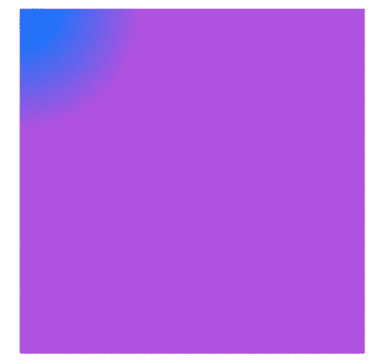

这到底意味着什么？

请看下图，起始半径从内圆开始，到外圆结束。在内圈和外圈之间，就是梯度发生的地方。

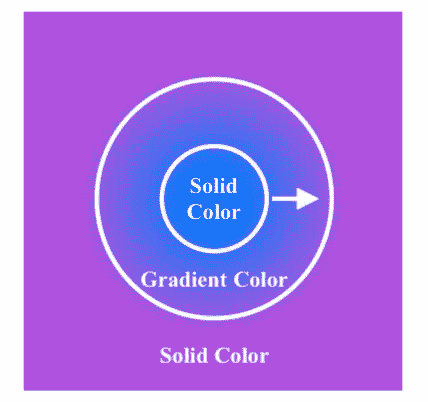

让我们仔细看看，这次没有任何编辑。

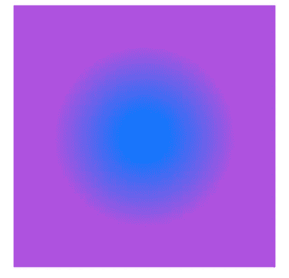

感谢阅读！