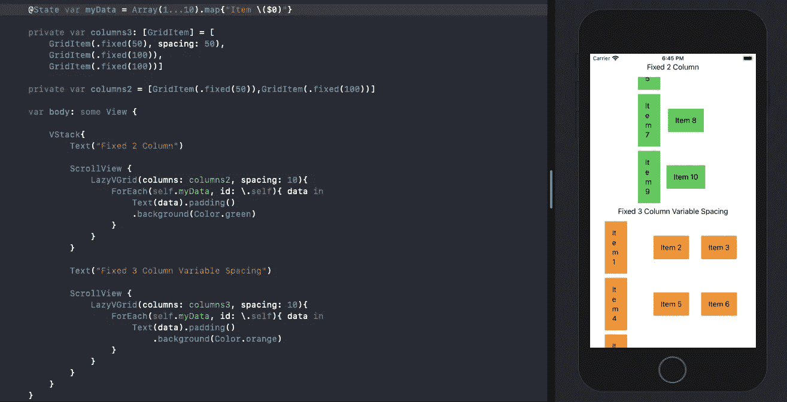
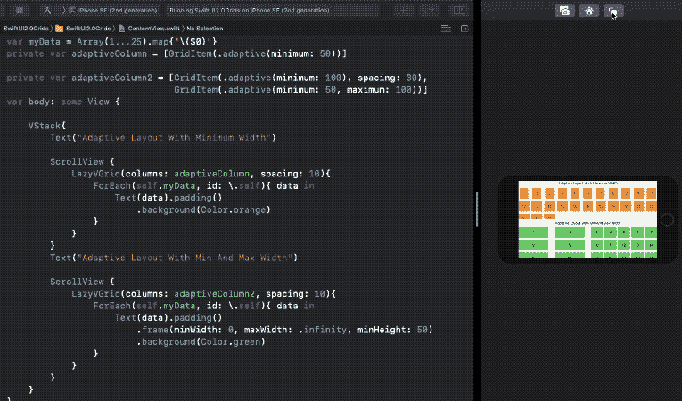
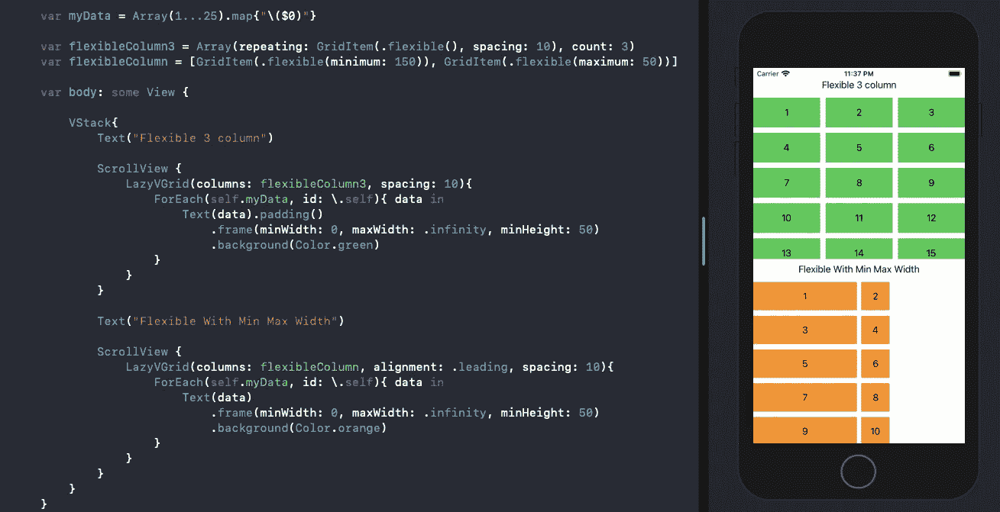
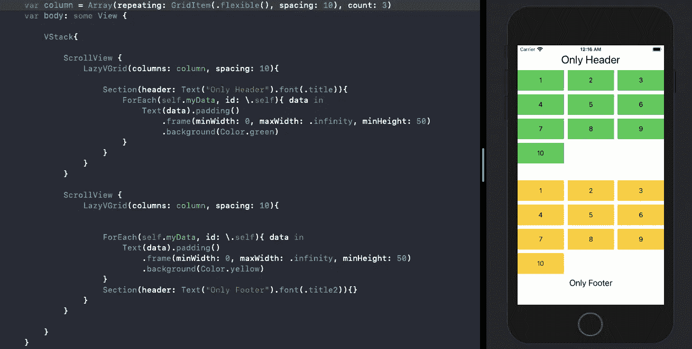
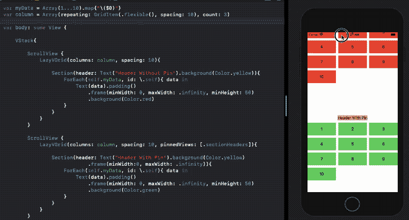

# 了解 iOS 14 中的 SwiftUI 网格

> 原文：<https://betterprogramming.pub/swiftui-grids-in-ios-14-49df6aa28541>

## 让我们看看这个强大的新工具，它可以构建类似集合视图的布局


[Julie Tupas](https://unsplash.com/@jltps?utm_source=medium&utm_medium=referral) 在 [Unsplash](https://unsplash.com?utm_source=medium&utm_medium=referral) 上拍摄的照片

SwiftUI 的第二次迭代没有给我们一个开箱即用的`UICollectionView`实现，但它确实给了我们两个强大的组件`LazyVGrid`和`LazyHGrid`，来构建强大的基于网格的布局。

在接下来的几节中，我们将探索:

*   如何构建 SwiftUI 网格
*   如何设置网格的项目
*   如何构建不同种类的网格布局
*   如何在 SwiftUI 网格中定义部分

让我们开始吧。

# SwiftUI 网格

顾名思义，`LazyVGrid`用于垂直定位视图，而`LazyHGrid`用于水平方向设置视图。需要注意的是，这些项目是按需缓慢加载的。

为了设置网格布局的类型，我们需要在初始化器中指定一个网格项数组。

`GridItem`基本上允许您指定单个项目的大小、它们之间的间距，以及`LazyHGrid`的行内对齐和`LazyVGrid`的列内对齐。

让我们看看创建网格项的不同方法。

# 如何设置网格项目

下面的代码展示了一种创建网格布局的方法，该布局基于我们传递它的位置，具有两个元素的行或两个元素的列。

```
private var columns: [GridItem] = [
    GridItem(.fixed(50)),
    GridItem(.fixed(100))
]
```

上面的`GridItem`数组可以传入一个`LazyVGrid`或`LazyHGrid`。让我们看看如何:

```
LazyVGrid(columns: columns, alignment: .center, spacing: 10)
```

本质上，从上面的布局创建的 SwiftUI 网格在一行的每一列中都有两个元素，第一个元素的大小为 50，另一个元素的大小为 100。上面的`LazyVGrid`初始化器中定义的间距是每行之间的间距。

我们可以通过以下方式设置列间距:

```
private var columns: [GridItem] = [
    GridItem(.fixed(50), spacing: 50),
    GridItem(.fixed(100)),
    GridItem(.fixed(100))
]
```

让我们来看看 SwiftUI 网格在上述两种列类型下的运行情况:



# 如何调整网格项目的大小

我们之前看到的是通过定义固定大小来设置网格项的最基本的方法。

但是你可能不希望每次都硬编码项目大小，考虑到有这么多不同大小和方向的设备。

幸运的是，除了用`fixed`来定义`GridItem`尺寸，我们还可以用`adaptive`****`flexible`。****

## ****自适应项目大小调整****

****顾名思义，`adaptive`条目让我们根据指定的约束来放置适应父视图宽度或高度的条目。****

****例如:****

```
**GridItem(.adaptive(minimum: 100))GridItem(.adaptive(minimum: 50, maximum: 100))**
```

****第一行代码表明，在指定最小宽度的情况下，`LazyVGrid`或`LazyHGrid`的每一行或每一列将分别容纳尽可能多的项目。****

****第二行设置行或列中每个项目的最大宽度或高度的上限。让我们在`LazyVGrid`中比较这两者:****

********

## ****灵活的项目规模****

****这个函数让我们指定网格中的列数，默认情况下每个列占用相等的空间。****

****但是您也可以通过设置最小和最大宽度来定制它，这将自动处理该项目的扩展和收缩。****

****看看我们如何设置下面的`flexible`三列网格布局:****

```
**Array(repeating: GridItem(.flexible(), spacing: 10), count: 3)**
```

********

****[要点链接](https://gist.github.com/anupamchugh/507d227c161cf4140bb46bfcae57e751)****

****请注意，在第二个网格布局中，我们将对齐方式设置为向左。此外，这些项目不会像`adaptive`布局那样占据屏幕上的所有可用空间。这是`adaptive`和`flexible`布局之间的关键区别。****

****您还可以在构建网格项目时混合使用`flexible`、`adaptive`和`fixed`类型。****

# ****如何在 SwiftUI 网格中设置部分****

****我们看到了如何创建网格布局、调整项目大小、设置间距和对齐方式。现在让我们看看另一个有趣的特性——创建节。****

****要定义一个标题，我们可以简单地将网格布局包装在一个`section`中。要定义页脚，我们可以简单地将它放在布局代码的下面，如下所示:****

********

****这看起来很简单，但是有时候，你会想把页眉或页脚放在分页的网格布局中。****

****幸运的是，`LazyVGrid`和`LazyHGrid`初始化器拥有一个可选的参数`pinnedViews`,允许您指定将节固定在顶部或底部或顶部和底部，如下所示:****

```
**//pins at top
LazyVGrid(columns: columns, pinnedViews: [.sectionHeaders])//pins at bottom
LazyVGrid(columns: columns, pinnedViews: [.sectionFooters])//both
LazyVGrid(columns: columns, pinnedViews: [.sectionHeaders, .sectionFooters])**
```

********

****上述粘性和非粘性头的 SwiftUI 结果是使用以下代码生成的:****

****您还可以设置嵌套的`for`循环来填充每个网格部分中的项目。****

# ****结论****

****因此，我们用不同的`GridItem`类型和大小构建了`LazyVGrid`布局。随后，我们构建部分，并查看如何固定它们。你也可以设置一个`LazyHGrid`作为`LazyVGrid`的一部分来构建一个 Instagram Stories 类型的布局。****

****这一次到此为止。感谢阅读。****