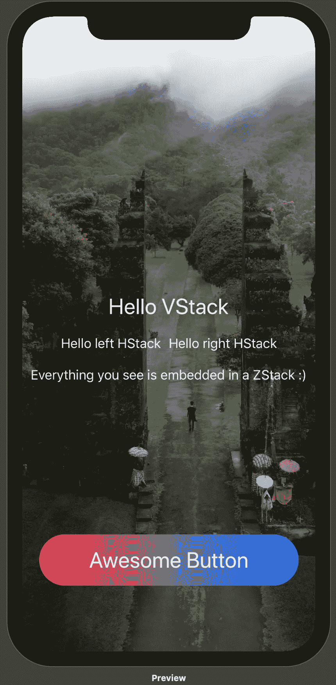
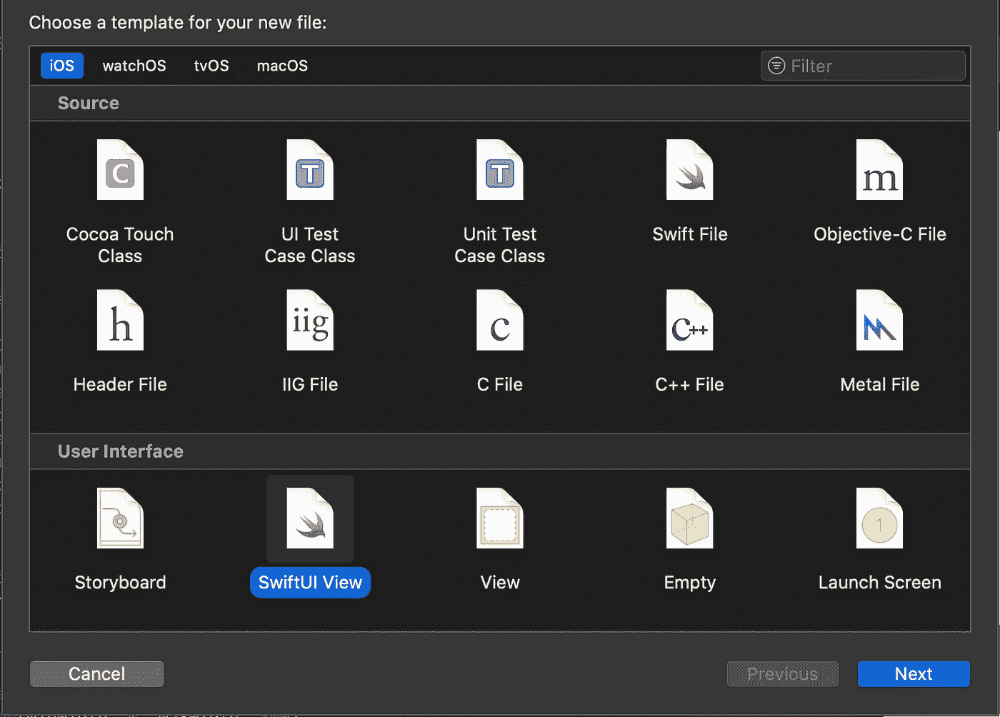

# 如何在 SwiftUI 中使用 ZStack 对视图进行堆叠和分层

> 原文：<https://betterprogramming.pub/swiftui-how-to-stack-views-999bf7730016>

## 以一种简单的方式将视图一个放在另一个上面

[Yura Fresh](https://unsplash.com/@mr_fresh?utm_source=medium&utm_medium=referral) 在 [Unsplash](https://unsplash.com?utm_source=medium&utm_medium=referral) 上的照片

好的，所以你正在从 iOS 的 UIKit 进入 SwiftUI，然后，嘣，你不知道如何在彼此之上分层视图。这听起来熟悉吗？如果是的话，欢迎来到 ZStack 的 SwiftUI 世界。

# 为什么是 ZStack？

诚然，当 iOS 开发者在苹果 2019 年 WWDC 上发现 SwiftUI 时，这是一种全新的体验，也有点震惊。在阅读了许多移动开发人员关于 SwiftUI 的一些文章后，有一件事似乎听起来很真实，那就是既有超现实的兴奋，又有令人痛苦的紧张。这主要是因为学习了一种全新的苹果软件编码模式。

这些文章的主要目标是对 SwiftUI 和 UIKit 的 iOS 开发有一点了解，以帮助我们大家。进入这篇文章的要点:在你第一次尝试 SwiftUI 时，Stacks 将是你最好的朋友。特别是，当您需要使用最新最棒的 SwiftUI 将多个视图层叠在一起时，ZStack 将会脱颖而出。

那么为什么选择 ZStack 呢？对于许多 iOS 开发人员来说，当他们在 SwiftUI 中第一次看到 VStack 和 HStack 时，过了一会儿，他们似乎很清楚每个人都做了什么:VStack 代表垂直堆栈，HStack 代表水平堆栈。但直到一些教程和四处搜索，我才偶然发现了 ZStack。将 ZStack 视为堆栈中视图的 *z* 轴，就像 3D 内容堆栈的轴一样。

# 让我们从按钮开始

我们需要创建一个新的 SwiftUI 视图文件，并用以下代码替换样板代码:

接下来，我们需要整合一些东西，比如图像、文本和按钮(这是另一个视图),并将它们放在我们的内容视图中，如下所示:

完全公开:我假设您可以在 Xcode 中将图像添加到 assets 文件夹中，并可以通过名称引用它(就像上面第 4 行的图像)。在[像素](https://www.pexels.com/)上为自己获取一个有趣的图像，并调整图像大小。

但是，我的朋友们，快速展示了如何在 SwiftUI 的 ZStack 中嵌入和嵌套多个视图。更多的文章和解释应该会出现在你面前。记住，用我们的结构一次只能返回一个视图。因此，通过在 ZStack 中嵌入我们的视图和对象，我们最终可以在一个中返回多种类型的视图。玩得开心，用 SwiftUI 弄脏。