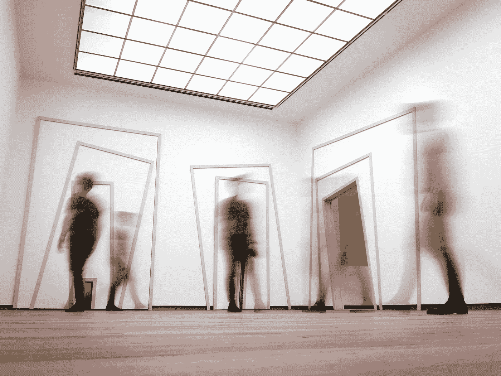
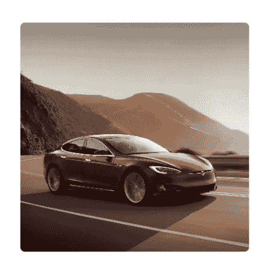
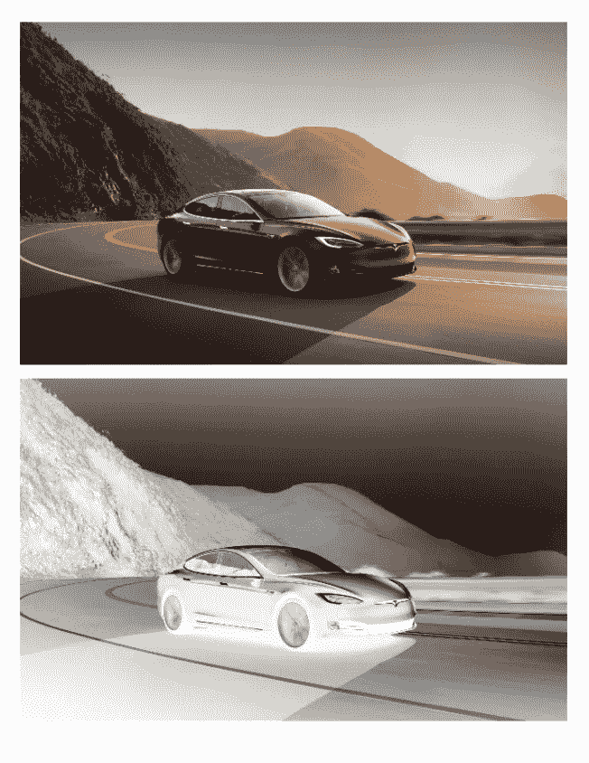

# SwiftUI:图像

> 原文：<https://betterprogramming.pub/swiftui-image-25dee39571bf>

## SwiftUI 的图像允许您在应用程序中展示不同的设计变化



由[克里斯蒂安·弗瑞尼南](https://unsplash.com/@christianfregnan?utm_source=unsplash&utm_medium=referral&utm_content=creditCopyText)在 [Unsplash](https://unsplash.com/s/photos/multiple?utm_source=unsplash&utm_medium=referral&utm_content=creditCopyText) 上拍摄的照片

在本教程中，您将了解什么是 SwiftUI 映像。您将了解到:

*   如何调整图像大小
*   如何掩盖你的形象
*   亮度到 alpha 效果

# 先决条件

要学习本教程，您需要:

*   基本熟悉 Swift
*   至少 Xcode 11

# 可调整大小

要修改图像的大小，几乎总是要包含`resizeable()`。

```
Image("tesla")
.resizable()
.scaledToFill()
.frame(width: 200, height: 200)
```


图片来源:[车与司机 2020 款特斯拉 Model-S](https://www.caranddriver.com/tesla/model-s)

# 面具

您可以通过在图像上添加图层来遮罩图像。

```
.mask(RoundedRectangle(cornerRadius: 4.0))
```



```
.mask(Circle())
```


```
Image("tesla")
    .resizable()
    .scaledToFill()
    .frame(width: UIScreen.main.bounds.width, height: 200)
    .mask(Text("Tesla")
        .fontWeight(.black)
        .font(.system(size: 120))
        .frame(maxWidth: .infinity, alignment: .center))
```


# 亮度到 Alpha 效果

一个*亮度到 alpha 效果*在你应用它的视图之外创建一个半透明的遮罩。暗区会变成透明的，而亮区会变成不透明的黑色。并且中等亮度区域将变成部分不透明的灰色。

通过包含以下代码，可以将亮度激活为 alpha。下面是有和没有亮度到 alpha 的图像的比较。

```
.luminanceToAlpha() 
```

