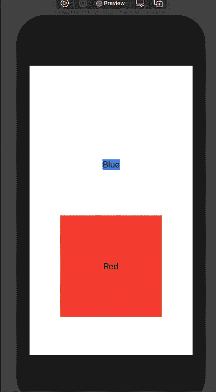

# 生产中的 SwiftUI？你需要考虑的 6 个利弊

> 原文：<https://betterprogramming.pub/swiftui-in-production-6-pros-and-cons-you-need-to-consider-69ace40a1b46>

## 在你的下一个项目中，你应该使用 SwiftUI 还是 UIKit？

迈克尔·泽兹奇在 [Unsplash](https://unsplash.com?utm_source=medium&utm_medium=referral) 上的照片

SwiftUI 是在 2018 年 WWDC 奥运会上推出的，自 13 版本以来一直得到 iOS 的支持。

通常，对于我们这些 iOS 开发者社区来说，两年的时间足够开始在生产代码中使用一个功能。然而，对于真正大的变化，比如从 [Objective-C](https://en.wikipedia.org/wiki/Objective-C) 迁移到 Swift 或者现在从 UIKit 迁移到 SwiftUI，需要更多一点的分析。

这里有 6 个缺点和 6 个优点，可以帮助你为下一个或当前的 iOS 项目做出深刻的决定。

**缺点:**

1.  旧操作系统上的用户无法使用你的应用。
2.  问题将更难解决，因为以前没有人面对过它们。
3.  有一些功能是目前为止只有 UIKit 才有的。
4.  这将需要更多的时间，因为你还不太熟悉这个工具包。
5.  您团队中的其他开发人员可能不知道 SwiftUI。
6.  最佳实践尚未形成。

**优点:**

1.  您可以使用预览和实时预览来快速开发 UI。
2.  SwiftUI 使设计人员和 web 开发人员更容易与您合作。
3.  您将编写更少的代码来获得想要的结果。
4.  WidgetKit 扩展需要 SwiftUI，您可能无论如何都需要使用它。
5.  这是一个学习宝贵技能和未来工具箱的机会。
6.  将来，更容易找到可以使用 SwiftUI 的开发人员。

本文将向您展示为什么做出决定不是那么容易，并提供一个解决方案，如果您仍然无法在 SwiftUI 和 UIKit 之间做出决定，这个解决方案可能会对您有所帮助。

# 缺点(为什么不应该使用 SwiftUI)

让我们从负面的事情开始，那些反对在你的下一个项目中采用 SwiftUI 的事情。

## 旧操作系统上的用户无法使用你的应用

根据 [Mixpanel](https://mixpanel.com/trends/#report/ios_14) 的这一非官方数据，已经有 93.08%的用户运行 iOS 13 或更高版本(上次检查时间:2020 年 11 月 28 日)。这意味着 SwiftUI 已经被超过 90%的潜在用户使用。

这是一个很大的数字，对于苹果的移动设备来说也很常见。这也是为什么我们开发人员觉得在我们的应用程序中只支持两个最新的 iOS 版本很舒服的原因。

但是，您可能有其他要求。如果您的下一个或当前项目需要在旧设备上运行，或者支持 iOS 12 及更低版本的操作系统，则不能使用 SwiftUI。

## 问题将更难解决，因为以前没有人面对过它们

让我们面对它，更多的时候，我们不得不通过搜索互联网来找到解决我们当前问题的方法。[堆栈溢出](https://stackoverflow.com/)是结果的常见来源。

虽然我想提醒你不要盲目地复制和粘贴一个潜在的解决方案，但知道几乎没有其他人以前没有遇到过的问题还是很好的。

然而，这只是 UIKit 的真实情况。SwiftUI 才推出两年，还没有被生产企业广泛使用。危险就在这里，你将是第一个与手头的问题斗争的人。

我创建了一个小型的 SwiftUI iPad 应用程序，并花了几周时间解决了其中的三四个问题。确保你意识到这也可能发生在你身上。

## 有一些功能目前只在 UIKit 中可用

iOS 14 中 SwiftUI 最后受欢迎的新增功能包括 lazy stacks、grid(像 UIKit 的`CollectionView`)以及许多其他功能，如向 SwiftUI 视图添加视频播放器或地图。

然而，仍然缺少一些东西来使 SwiftUI 能够在您的应用程序中完全取代 UIKit 的`ViewControllers`。不支持 [WebKit](https://webkit.org/) ，也不支持在提醒中添加文本字段。

你应该考虑到这一点，并意识到你的应用程序可能无法 100% SwiftUI。但稍后会详细介绍。

## 这将需要更多的时间，因为你不太熟悉工具包

在 UIKit 中成为一名专业人员可能需要一些时间，在 SwiftUI 中也需要一些时间。

SwiftUI 非常容易上手。然而，您可能有多年的 UIKit 知识，这包括常见的错误和陷阱，如何使用控件、委托、测试和快捷方式。

你不会以你习惯的速度前进。

## 您团队中的其他开发人员可能不知道 SwiftUI

这是最大的问题之一。您可能会想到一位年长的开发人员，他已经停止学习很多东西，并且不喜欢尝试新事物。

我知道一些公司的首席开发人员告诉他们的实习生，他们不能使用 Swift，因为它不会成功和客观——C 仍将是十年内使用最多的 iOS 编程语言。他们也不允许使用 ARC(自动引用计数),因为这不再是“真正的”编程。

我说的不是这种傻逼开发商。您的同事可能只是没有时间，并且被困在 UIKit 项目中。一旦你离开(休假、生病或辞职)，其他开发人员将很难处理你的代码。这种让自己对公司更有价值的方式是有问题的。你肯定要考虑你现在的团队构成，和队友讨论这一点。

也考虑一下将来会加入你公司的开发人员。如果你确定他们将被检查 SwiftUI 知识，这不是一个表演停止。然而，如果不是这样，在跳上 SwiftUI 火车之前要三思。

## 最佳做法尚未形成

您可能只在小型应用程序上工作，而最佳实践往往会被忽略。但是如果你想增加你作为开发人员的价值，你应该采用大公司用来构建大型可伸缩应用程序的通用模式。

在 UIKit 中，我们已经有了许多优秀的架构，我们知道如何构建我们的代码。RxSwift 是最先进的，我们知道如何使用它进行绑定。也许你已经听说过 MVVM、协调模式和设计模式，以及它们是如何用于 iOS 项目的。

您的知识不会丢失，许多东西仍然可以在 SwiftUI 中应用。然而，特别是结合 [Combine](https://developer.apple.com/documentation/combine) 框架，你必须重新思考如何正确地编写和组织你的代码，以便编写好的 SwiftUI iOS 应用。

许多针对程序导航和其他常见问题的最佳实践还没有形成。因此，你需要考虑，一旦你对合适的解决方案的了解增加，你可能必须在未来几年内对你当前的项目进行大规模的重组。

到目前为止，我非常想念苹果公司的一件事，那就是关于我们应该如何测试 SwiftUI 视图的完整指南。特别是对于企业软件，足够的代码覆盖率是一个要求。可悲的是，我还没从他们身上看到多少对这个话题的喜爱。

# 优点(为什么应该使用 SwiftUI)

好吧，也许现在你已经在想 SwiftUI 还没有做好生产准备。这就是为什么我现在想向你展示为什么你应该在 SwiftUI 中开始你的下一个项目。

## 您可以使用预览和实时预览来快速开发 UI

SwiftUI 为我们提供了一个漂亮的预览功能，可以立即看到我们的代码更改到视图的结果。

当您考虑到许多修改器根据它们的顺序产生不同的结果时，这就特别方便了。

考虑下面的代码。

两个视图有相同的修饰符。然而，结果完全不同:

由我拍摄的图像(曼努埃尔·舒尔茨)

预览，尤其是实时预览，你甚至可以与按钮等互动。，确实有助于避免意外行为和模拟器的多次重建。

## **SwiftUI 让设计师和网络开发人员更容易与您合作**

如上所述，SwiftUI 有一个漂亮的预览。预览版不仅对我们这些开发者来说很棒，它也能帮助那些不熟悉故事板的人，比如设计师或网页开发者。

你实际上可以用代码创建一些 UI，但另一部分只是用强大的 UI 工具来创建，这些工具是由 Xcode 提供的，用来创建 SwiftUI 视图。您甚至可以构建完整的用户界面，而无需编写任何代码。

如果你在一个有技术仿射设计师的团队中工作，向他们展示基础知识并让他们自己创建用户界面是有意义的。这减少了你们两个人之间的协调，让你们专注于实现业务逻辑，这将允许更快的特性部署。

这里有一个好处:我也喜欢 SwiftUI 代码和视图总是同步的。对于故事板或者 xib 文件，你必须记住你在哪里改变了某些属性。您也不容易找到您在可视化工具中所做的更改，因为它们从未产生易于搜索的代码。使用 SwiftUI，您是否用代码编写所有内容都没关系，但您的同事使用可视化工具。总有代码和它的可视化呈现。

## **你将编写更少的代码来获得想要的结果**

你可能已经听说过了，但是 SwiftUI 减少了构建用户界面所需的代码。有许多示例应用程序，但我喜欢保罗·哈德森在他的 YouTube 频道上的比较:

注意:这里要小心。是的，Paul 用 SwiftUI 更快，你将来也会更快。然而，如果这是您的第一个 SwiftUI 项目，那么将自己与一个在过去两年中已经编写了大量 SwiftUI 教程和书籍的人进行比较是没有多大意义的。

他们说最好的代码是你从来没有写过的。因此，看到仅仅在一个小的应用程序中就可以减少多少代码行(LOC)是很棒的。这真的是我非常喜欢的东西。

## **WidgetKit 扩展需要 SwiftUI，你可能无论如何都需要使用它**

iOS 14 中引入了 WidgetKit 扩展。他们真的被用户所欣赏，所以你写的许多应用程序也将提供 WidgetKit 扩展是合乎逻辑的。

然而，由于您的代码加载和显示其信息的时间很短，所以小部件需要是轻量级的。除了那些精简的 SwiftUI 视图结构之外，还有什么可以用于该任务？

Apple 只允许 WidgetKit 扩展在 SwiftUI 中编写。如果您无论如何都必须使用 SwiftUI，那么将它用于整个应用程序可能是一个好主意。

## **这是一个学习宝贵技能和未来工具的机会**

未来，SwiftUI 将会增加越来越多的功能。我确信在 Swift 中创建用户界面将成为事实上的标准。

你可以等到你采用它，并与 UIKit 轻松地再走五年。然而，在某个时间点，您会发现使用 UIKit 的项目越来越少。那你为什么不马上学呢？

现在，可能是一个很好的时机，让你在其他人开始学习这个框架之前，抢先一步成为专家。成为早期采用者是非常有益的。作为一名 iOS 开发专家，这绝对是一项需要在职业生涯中不断进步的技能。

## **在未来，找到能够使用 SwiftUI 的开发人员会更容易**

通常，我们会想很多如何编写干净的代码，这将是几年后的一件乐事。这是好事！

然而，我们也经常忘记我们工作的企业是如何发展的。年轻的新开发人员将加入我们的团队。我经常遇到从未学习过 Objective-C 的新开发人员。

想象一下，我仍然用 Objective-C 编写每一个项目，然后当我的合同结束时我离开了公司，公司雇佣了一个只懂 Swift 的新开发人员。他们将很难维护我的代码。

这不仅仅是像我这样的承包商的问题。你的公司将雇用其他开发人员，你不想仅仅因为几年前你决定反对 SwiftUI 就给他们三周的 UIKit 培训。

尽快使用 SwiftUI，帮自己和未来的同事一个忙。

# 混合方法

赞成和反对的双方都有道理。即使没有针对 SwiftUI 的 dealbreakers(比如对 iOS 12 及以下版本的支持)，你可能仍然很难决定在你的下一个项目中做什么。所以我想帮你做决定。

如果你不能决定，两者都用。

苹果做了一件了不起的工作，它允许我们在 UIKit 中使用 SwiftUI 视图，并从 SwiftUI 启动一个`UIViewController`。对于我的下一个项目，我将尝试从 SwiftUI 开始，以保持我的代码现代和精简。如果我在 SwiftUI 中找不到解决方案，并且如果 UIKit 在不使用第三方代码的情况下提供了对该功能的支持，我将进行切换。

尝试“SwiftUI first”是值得的——只要确保您知道后果。

如果您仍然对在 SwiftUI 中开始新项目感到焦虑，慢慢过渡是个好主意。从你在一个普通的老 UIKit 项目中熟悉的东西开始，到处使用 SwiftUI 视图，同时习惯在 iOS 中构建 UI 的新方式。

注意:WidgetKit 扩展总是启动 SwiftUI 的好地方。

# 结论

SwiftUI 是一个为所有苹果设备编写用户界面的伟大工具。很高兴看到许多不同背景的设计师和开发人员加入这个社区。

然而，对于你们中的一些人来说，在下一个项目中采用 SwiftUI 仍然为时过早。没关系，我们有可以玩的辅助项目，WidgetKit 扩展为我们提供了一个开始 SwiftUI 的好地方。

如果你很难在 UIKit 和 SwiftUI 之间做出决定，尝试使用一个组合:要么“SwiftUI 优先”，要么一个保守的 UIKit 项目，到处都有一些 SwiftUI 视图。

感谢您的参与，祝您在 SwiftUI 上玩得开心！