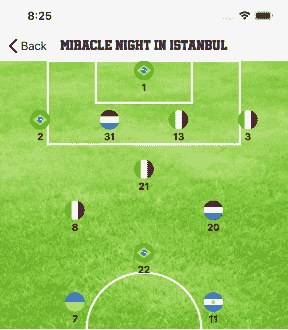
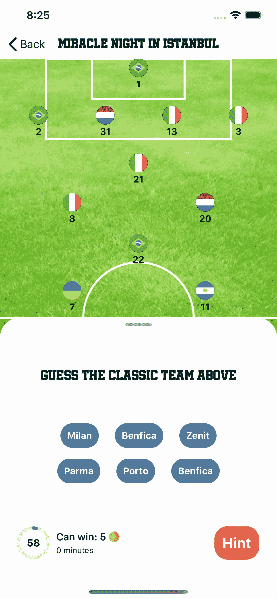
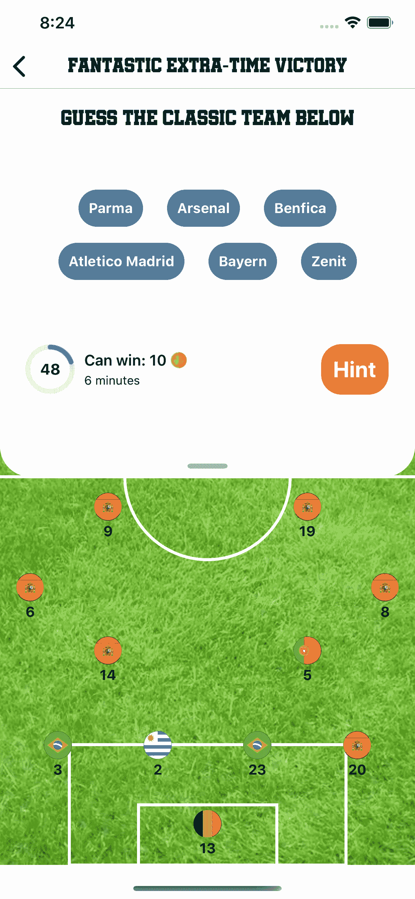
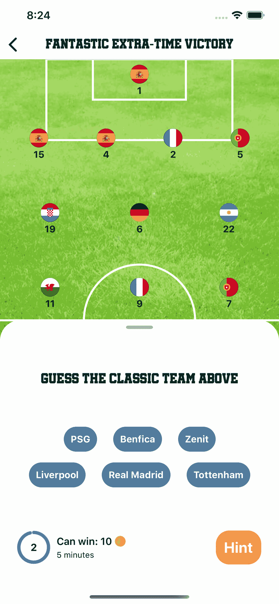
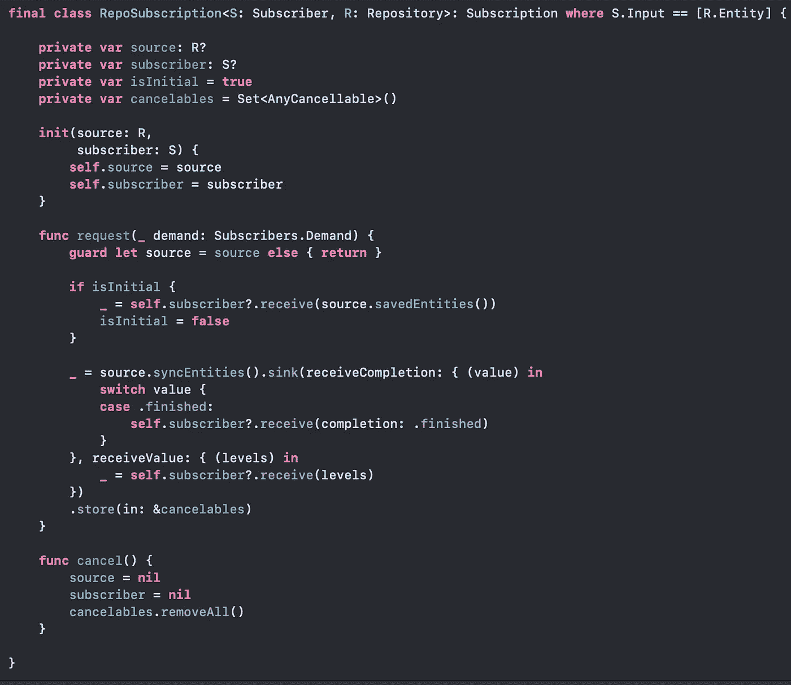
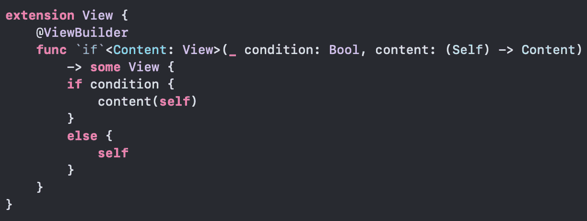

# 生产中的 SwiftUI

> 原文：<https://betterprogramming.pub/swiftui-in-production-678af4db19c9>

## 不管你可能听到什么，SwiftUI 在生产中运行良好

在 [Unsplash](https://unsplash.com?utm_source=medium&utm_medium=referral) 上由 [C Dustin](https://unsplash.com/@dianamia?utm_source=medium&utm_medium=referral) 拍摄的照片。

我的应用程序[足球拼图](https://apps.apple.com/us/app/soccer-puzzles/id1511159096)在应用商店上线已经一个月了(在我写这篇文章的时候),它的篮球兄弟[篮球拼图](https://apps.apple.com/us/app/basketball-puzzles/id1520915346)也上线一天了。它们都是在 SwiftUI 中开发的。在 App Store 上直播一个月可以对苹果的新 UI 框架在 App Store 上的表现提供一些信息。

# TL；速度三角形定位法(dead reckoning)

是的，SwiftUI 可以用在生产应用程序中，而且大多数时候都运行得很好。然而，也有一些小故障。欲知详情，请继续阅读。

# 该应用程序

虽然是个琐事/竞猜游戏，但 app 本身并不琐碎。它有大约 10K 行代码，有同步机制，应用内购买，游戏逻辑(解锁级别，成就)，以及大量数据通过它。它还有一个绘图引擎，可以根据位置绘制不同的足球(和篮球)阵型。

# 足球

对于那些不太看足球的人来说，阵型类似于一个 app 的架构——球队是如何被结构化和组织在一起的。关注点是分离的。例如，守门员和后卫的主要目标是阻止对方进球。他们在后面(数据模型)，他们通常给球队他们的身份和力量，队长经常来自球场的那一部分。前锋(观点)负责进球。每个人都看到他们，他们通常是英雄，但没有团队的支持，他们做不了什么。中场球员(控制者)将一切联系在一起，给比赛带来活力。

这些部分有很多种组织方式，像经典的 4-4-2 (MVC？)，最流行的 4-3-3 (MVVM？)，还有更复杂的像 4-1-2-1-2(蝰蛇？).这里有一些直观的例子，但可以有许多不同的组合:

# 赞成者

SwiftUI 非常适合这项任务。如果你把这个区域分成不同的部分(和子部分),分别是守门员、防守、中场和进攻，并且只使用间隔和偏移，你就可以很好地表现一个足球阵型，而不用做太多的计算。如果我不得不在 UIKit 中这样做，那将会是很大的工作量。

作为奖励，当你浏览问题时，有一些很好的动画，你只需要调用`animate`修改器。同样，在 UIKit 中做这件事需要更多的工作。根据问题类型的不同，问题本身有许多不同的表现形式。使用 SwiftUI 的组合方法，重用组件、移动组件等等变得非常容易。

另一点是设计和 UX，这是原型和创建的方式。有一次，一个视图在顶部，然后被移到底部。在 SwiftUI 中，这是一个非常快的变化，而在 UIKit 中，您将不得不一直处理约束。

与联合收割机一起工作也是一次非常好的经历。这在同步机制中帮助很大，我为我的存储库创建了定制的发布者。存储库将首先获取并返回一些缓存或绑定的数据，然后与 Firebase 同步以获得最新的更改。对于一个数据中不能有错误的琐事应用程序来说，这非常有帮助。

以下是我如何进行回购认购的一瞥:

我在这个应用程序中使用了标准的 MVVM 模式，并结合得非常好。视图模型是从外部创建并传递给视图的`@ObservableObjects`。因此，我不会对 iOS 14 做任何改变，也没有必要使用新的`@StateObject`。

一个很好的方法是使用依赖容器的层次结构。使用 SwiftUI 预览特性时，拥有创建视图和视图模型的容器也非常有用，因为视图和视图模型可以有复杂的初始化方法。例如，如果我想创建一个`FootballTeamView`，它有一个`FootballTeamViewModel`，后者有一个`PlayersRepository`、`AnswersRepository`和`UsersService`，并且它们还有其他依赖项，预览会变得非常混乱。

我首先做的是为上述类型中的所有依赖项使用协议。然后，我创建了一个实现了`PreviewProvider`的`PreviewsContainer`。在这个提供程序中，我创建了模拟存储库和显示在预览中的数据。因此，在 SwiftUI 预览中创建依赖关系非常容易。好的一面是，由于`PreviewsContainer`实现了`PreviewProvider`，它不会出现在你的应用程序的发布版本中。另一个好处是，您可以在单元测试中使用那些相同的模拟实现。

除了乐趣因素之外，这些是使用 SwiftUI/Combine 的一些好处，对于下班后完成的宠物项目来说，这是驱动你的动力。

# 坏处

当然，SwiftUI 并不完美。我最不喜欢的是那些可以神奇出现的小版本差异和 bugs 尤其是 13.0/13.1 版本。因此，您应该在所有次要版本甚至多个设备上进行测试。

下面是我在进入生产环境并查看崩溃日志后发现的一个具体例子:在一些 iOS 13.1.2 设备上出现了崩溃。崩溃日志不是很有帮助。一些`AttributeGraph`崩溃，没有进一步的细节。然而，如果您选择相同的 iOS/iPhone 组合，您可以很容易地在 Xcode 中重现崩溃。即使这样，也真的很难调试，很难找出问题出在哪里。

粗暴的方法是注释掉事物，直到它停止崩溃。原来，在我给列表添加了一个 ID 修饰符后，崩溃就消失了。

另一个问题是现在的修改器，在 iOS 13.1 版本中也有问题。我有一个在应用内购买或广告加载时出现的加载视图。然而，在这些设备上，我只看到了一个白色的屏幕，这对于用户(无法赚取更多的硬币来玩游戏)或我(我无法为这些用户赚钱)来说不是很有帮助。

同样，这很难调试，我想出的快速解决方案非常愚蠢——没有对那些版本使用现在修饰词(如果有人知道更好的，请分享)。在这种情况下，可以使用条件修饰符。

我见过的其他小故障涉及导航栏的标题。有时候，之前的头衔并没有消失。它与当前标题合并，您无法阅读任何内容。另一件事是文本视图的动画。有时候，有些省略号会出现，但永远不会消失。要解决这个问题，您需要显式地禁用文本视图的动画。

目前，应用程序更加稳定，只有一个崩溃，没有更多关于如何修复它的细节，可能每隔几天一次。比如就这个:`AttributeGraph: 0x1cb4e3000 + 205760`。在堆栈跟踪中，有一个对 app 的 main 方法的调用，并在`GraphicsServices`中崩溃。

让我们希望这样的问题不会出现在新的 SwiftUI 版本中。

在网上阅读 SwiftUI 为什么还没有准备好投入生产时，还提到了其他一些事情，比如缺少一些标准的 UI 组件和没有导航堆栈信息。对于第一个问题，您可以轻松地包装 UIKit 等价物，甚至构建自己的定制组件。对于导航栈，由于苹果甚至在 iOS 14 中也不提供，也许是时候重新思考我们如何在应用中设计导航了。

# 结论

SwiftUI 可以用于生产，但是你需要记住上面提到的小故障。我很确定这些问题会随着时间的推移得到解决。可能有些已经在 iOS 14 中修复了。是的，你会有偶尔的崩溃和一星评级，但这与连续几个小时的持续崩溃相比不算什么，因为你已经包括了第三方 SDK(你知道是哪一个)。

因此，如果你现在开始一个新项目——即使是一个更复杂的项目——我相信 SwiftUI 是一个不错的选择。我这样做是为了一个月前开始的更大的工作项目，到目前为止，一切顺利。

你对这个话题有什么想法？SwiftUI 准备好生产了吗？

你也可以看看我的 SwiftUI 驱动的拼图应用程序，[足球拼图](https://apps.apple.com/us/app/soccer-puzzles/id1511159096)和[篮球拼图](https://apps.apple.com/us/app/basketball-puzzles/id1520915346)，并找到更多 SwiftUI 错误。

感谢阅读！