# 如何提高 SwiftUI 视图的内部可重用性和可维护性

> 原文：<https://betterprogramming.pub/swiftui-increasing-a-view-internal-reusability-and-maintenance-the-power-of-viewbuilders-26805714103>

## 视图构建器的力量

照片由[阿尔迪·斯贡](https://unsplash.com/@sigun?utm_source=medium&utm_medium=referral)在 [Unsplash](https://unsplash.com?utm_source=medium&utm_medium=referral) 拍摄

SwiftUI 最强的一点是，由于其声明式的定义方式，以及仅用几行代码编写复杂接口的便利性，它能够使任何视图/组件在其插入的任何可能的上下文中完全可重用。此外，你可以通过预览实时检查结果。

但是想象一下下面的场景:你有多个内容有点相似的屏幕，保留它们会增加重复代码的数量。

等等，但是在这种情况下，将公共部分转换成可重用的视图还不够吗？好吧，如果两个场景的整个公共代码部分是相同的，那会是这样，但是如果我们在每个内容的中间有一些不同的 UI 部分呢？

为了让您理解，我将举例说明以下场景:

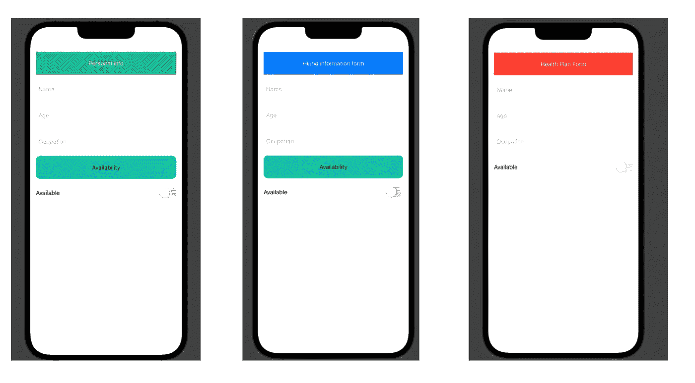

上面我们有三个场景:第一个场景对应于一个简单的个人信息处方集，第二个场景对应于一个招聘过程，最后一个场景对应于一个健康计划。

三个不同的上下文，尽管界面有点类似，除了不同的标题和可用性标题视图，只显示健康计划。如果我们可以从外部定义我们应该遵循的上下文，那不是很实际吗？

# 识别上下文之间的差异

为了使该视图可重用，我们应该首先确定该视图中哪些 UI 是可定制的。

如前所述，在不同的场景中，有两个地方可能会有所不同，即顶部标题和可用性标题，它们可能存在，也可能不存在:

因此，正如我们所检查的，我们在这个场景中的视图有 6 个可能的定制:顶部内容的个人信息标题视图、雇用信息标题视图或健康计划标题视图，中间有或没有可用性标题视图。

# 在不同的背景下构建我们的观点

现在，让我们以声明的方式定义我们的视图结构，让我们首先定义可能填充我们屏幕的标题视图:

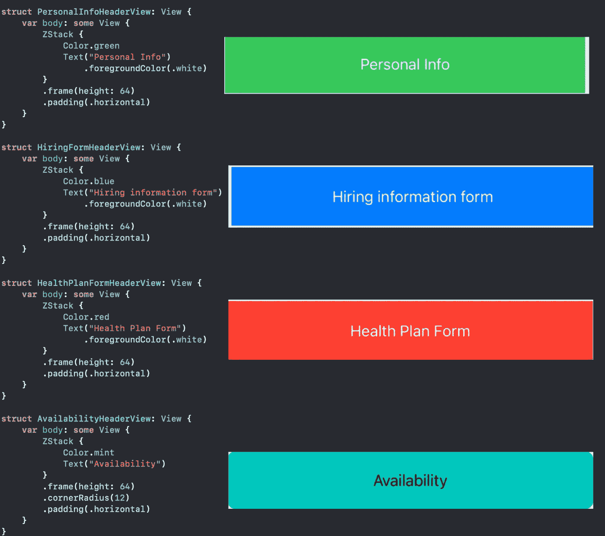

现在让我们定义根视图:

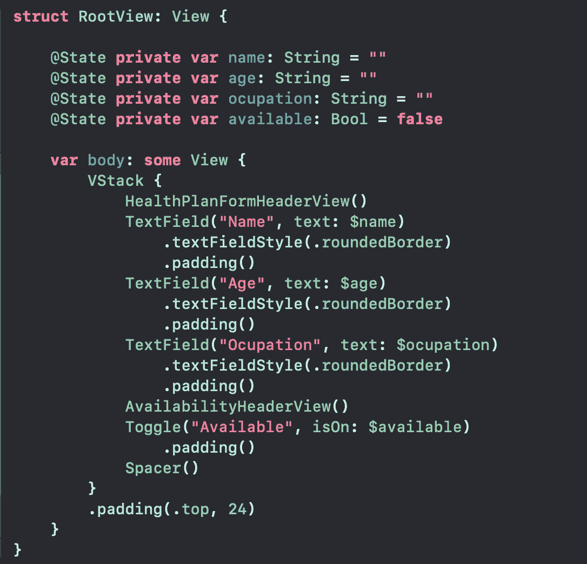

这导致了带有可用性标题视图的健康计划场景

我们只是简单地将`HealthPlanFormHeaderView`和`AvailabilityHeaderView`作为原始组件，但是我们真正想要的是将它们变成可定制的参数。这就是我们所说的`ViewBuilders`！

`ViewBuilders`是两个参数，它们是返回视图类型的闭包，我们将使用它们来填充我们的根视图:

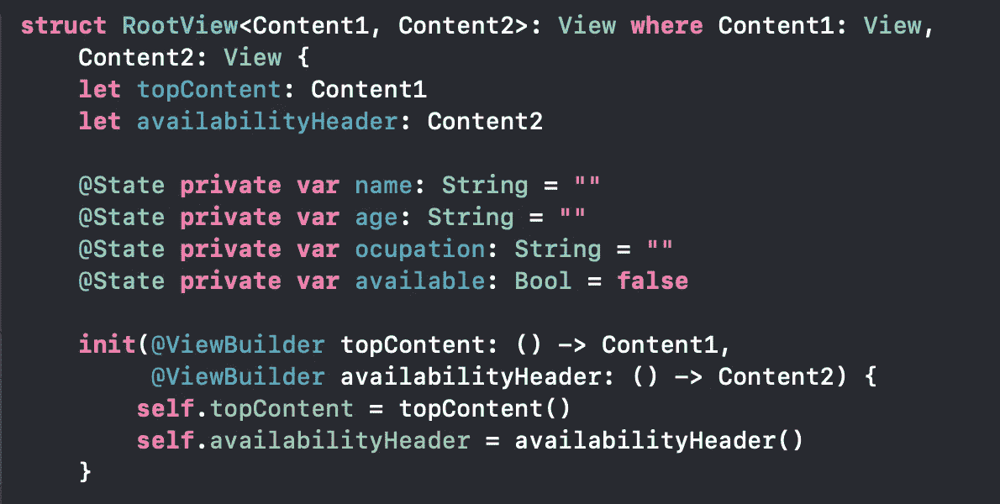

因为与 UIKit 不同，我们处理的是`*structs*`而`View`是一个协议，我们需要定义两个符合视图协议的通用类型。我们定义了两个不同的参数注入到我们的`RootView`中，分别是返回`Content1`和`Content2`类型的闭包。

当初始化我们的根视图时，我们简单地从两个闭包获取返回的视图，并分配给`topContent`和`availabilityHeader`属性。我们还必须将 *init* 方法中的这两个参数标记为 ViewBuilders。

既然我们已经对 top 和 availability 标题视图进行了参数化，让我们简单地在主体中调用它:

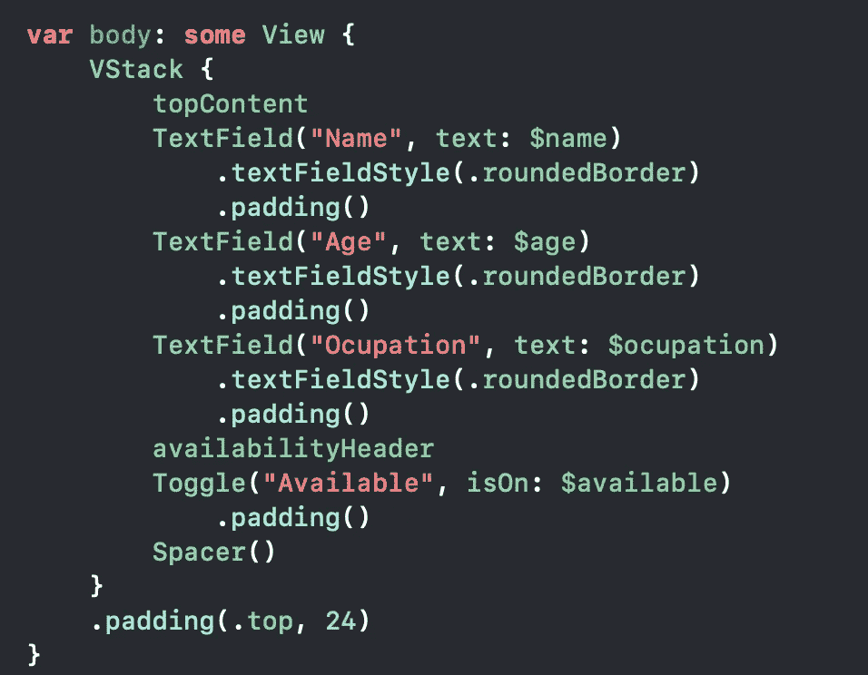

太棒了。既然我们已经对这两个组件进行了参数化，我们可以将任何类型的视图传递给这个组件，它将显示在正确的位置:

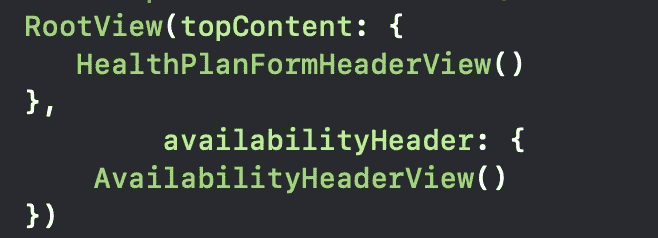

作为 SwiftUI 开发人员，您实际上对这个概念很熟悉，因为大多数框架的本地组件实际上都接收了`ViewBuilders`来定制它的外观。

SwiftUI `Button`是两个很好的例子，它定义了点击时的行为，然后是描述其外观的`label`闭包。同样的情况也可以在`VStacks`和`HStacks`中得到验证，它们获取一些注入的内容，并在水平或垂直的轴上显示出来

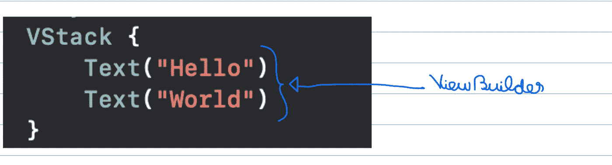

这些视图作为可定制的参数被注入到另一个视图中。

# 在不同的场景中传播我们的可重用视图

现在我们有了`RootView`，这是一个可定制的组件，我们可以在其他屏幕(视图)中重用它，注入该上下文所需的适当数据:

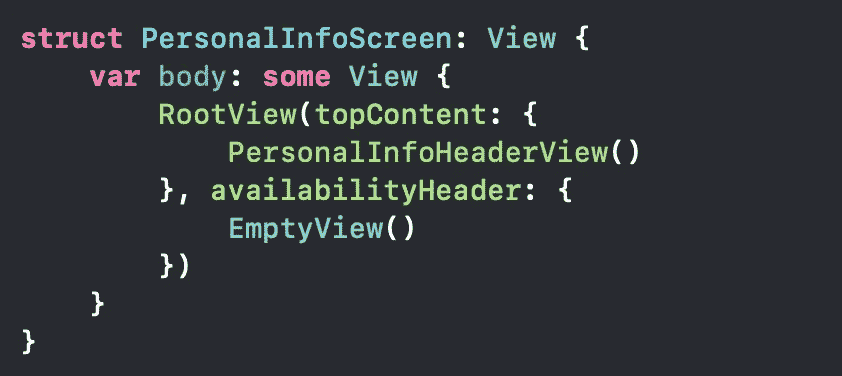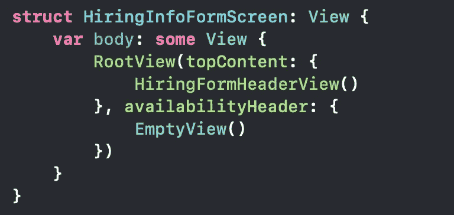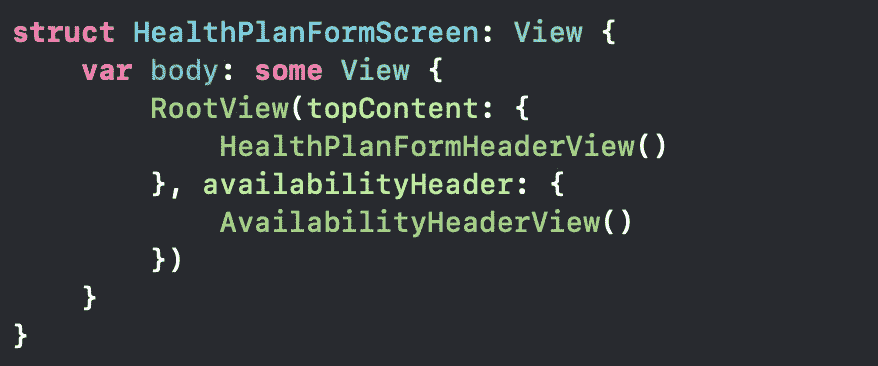

分别地，我们将有这些场景:

如果一些新的场景和可能的头出现，我们只需要将相应的实例注入到我们的可重用的`RootView`中，它在屏幕的主体中被调用。

# 作为私有函数的视图生成器

正如我们所见，`ViewBuilder`是一个返回`View`类型的闭包，但它也可能是视图类型中的一个命名函数，为 UI 的某些部分建立一些参数化:

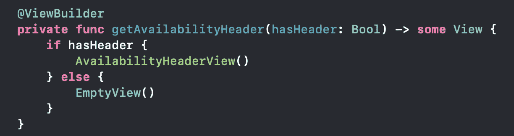

现在我们创建了一段代码，它根据`hasHeader`布尔值返回一个可定制的组件。

如果你的视图有一个太复杂的 UI，并且不认为创建分离的文件和视图来填充它是一个好的方法，因为这些 UI 正是为这个上下文而制作的，那么将视图的不同部分分离到一个`ViewBuilder`私有方法中总是一个好的选择。

# 摘要

在本文中，我们描述了一种提高视图可重用性的方法，通过将一些 UI 变体转换成可定制的参数。随着应用程序的增长，您可以通过从外部注入视图的某些部分来重用视图。

视图构建器作为视图的参数，视图实际上是子视图。任何时候你发现一个屏幕在不同的上下文中被重用，修复特定的部分并把它们转换成参数。

我希望你喜欢它，并不断提高你的代码的美观性和可重用性；)