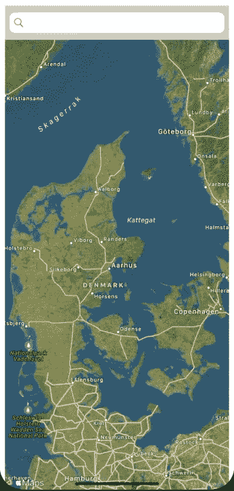
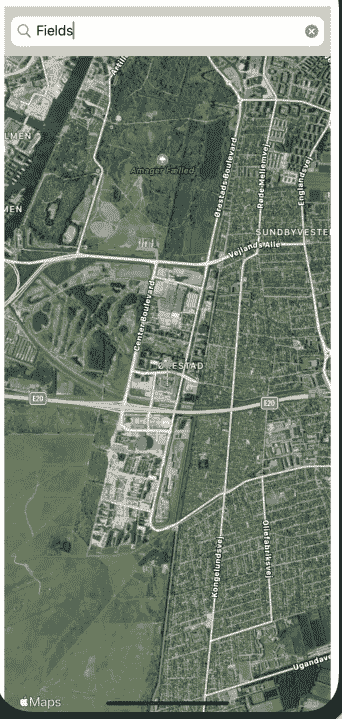
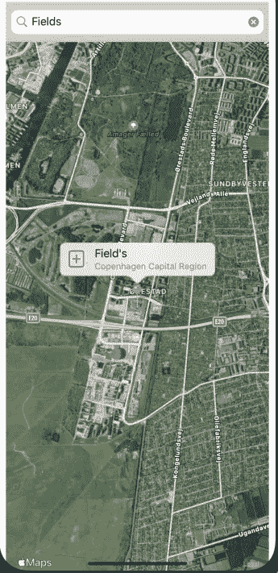

# SwiftUI —与 UIkit 交互第 1 部分:地图视图

> 原文：<https://betterprogramming.pub/swiftui-interacting-with-uikit-part1-map-view-73b4e1e91e11>

## 如何在 SwiftUI 应用中包含 MapKit 功能的示例


照片由[捕捉人心。](https://unsplash.com/@dead____artist?utm_source=unsplash&utm_medium=referral&utm_content=creditCopyText) on [Unsplash](https://unsplash.com/?utm_source=unsplash&utm_medium=referral&utm_content=creditCopyText)

SwiftUI comes 与现有的 [UIkit](https://getuikit.com/) 框架有很好的集成。通过将`UIViewControllers`包装到 SwiftUI 视图中，或者反过来，可以实现 SwiftUI 与 UIKit 的交互；将 SwiftUI 视图嵌入视图控制器。

在这篇文章中，我将向您展示一个如何在 SwiftUI 应用程序中包含`MapKit`功能的例子，包装一个视图控制器。

这个演示的目的是创建一个视图，包含一个搜索栏和一个地图视图。用户在搜索栏的某个位置键入；地图搜索检索到的结果列表中的第一个结果将作为大头针添加到地图中。

最后，我将展示如何通过为控制器创建一个委托来与外部视图进行交互。

# 从视图控制器开始

创建一个视图控制器，并以编程方式包含要在视图中显示的所有元素；搜索栏和地图视图:

```
class MapViewController: UIViewController {
 var mapView: MKMapView!

 // MARK: - Search

 fileprivate var searchBar: UISearchBar!
 fileprivate var localSearchRequest: MKLocalSearch.Request!
 fileprivate var localSearch: MKLocalSearch!
 fileprivate var localSearchResponse: MKLocalSearch.Response!

 // MARK: - Map variables

 fileprivate var annotation: MKAnnotation!
 fileprivate var isCurrentLocation: Bool = false

 var selectedPin: MKPlacemark?// MARK: - UIViewController's methods

 override func viewDidLoad() {
  super.viewDidLoad()

  mapView = MKMapView()

  let leftMargin:CGFloat = 10
                let topMargin:CGFloat = 60
                let mapWidth:CGFloat = view.frame.size.width-20
                let mapHeight:CGFloat = view.frame.size.height - 100

                mapView.frame = CGRect(x: leftMargin, y: topMargin, 
                      width: mapWidth, height: mapHeight)
  mapView.isZoomEnabled = true
                mapView.isScrollEnabled = true
  self.view.addSubview(mapView)

  searchBar = UISearchBar(frame: CGRect(x: 10, y: 0, width: mapWidth, height: 60))
  searchBar.delegate = self
  self.view.addSubview(searchBar)

  mapView.delegate = self
  mapView.mapType = .hybrid
 }
}
```

# 映射代理

`MKMapView`对象要求视图控制器符合`MKMapViewDelegate`。

在这个例子中，我将只实现用于向地图添加注释的`mapView(**_** mapView: MKMapView, viewFor annotation: MKAnnotation)`方法。

此外，注释会显示一个小`+`按钮。例如，我可以用它将地标添加到地标存储库中。我以后再讲。

目前，我只是为`savedPin`动作保留了一个空的实现。

```
extension MapViewController:MKMapViewDelegate{

 func mapView(_ mapView: MKMapView, viewFor annotation: MKAnnotation) -> MKAnnotationView?{
  guard !(annotation is MKUserLocation) else { return nil }
  let reuseId = "pin"
  var pinView = mapView.dequeueReusableAnnotationView(withIdentifier: reuseId) as? MKPinAnnotationView
  if pinView == nil {
   pinView = MKPinAnnotationView(annotation: annotation, 
                                reuseIdentifier: reuseId)
  }pinView?.pinTintColor = UIColor.orange
  pinView?.canShowCallout = true
  let smallSquare = CGSize(width: 30, height: 30)
  let button = UIButton(frame: CGRect(origin: CGPoint.zero, size: smallSquare))

  button.setBackgroundImage(UIImage(systemName: "plus.square"), for: .normal)
  button.addTarget(self, action: #selector(savedPin), for: .touchUpInside)

  pinView?.leftCalloutAccessoryView = button

  return pinView
 }

 [@objc](http://twitter.com/objc) func savedPin(){

 }
}
```

# 搜索栏代理

搜索栏需要控制器符合`UISearchBarDelegate`。

我只实现了`searchBarSearchButtonClicked(_ searchBar: UISearchBar)`方法；当用户在搜索栏中键入文本后按 enter 键时，将执行该操作。

搜索功能使用`MKLocalSearch`通过 apple map kit 执行搜索，并返回地图项目列表。随后，我从列表中取出第一个，并将一个大头针添加到包含嵌入在该地图项目中的 placemark 的地图中。

`addPin`和`addAnnotation`方法有助于从地标创建注释并将其添加到地图中。最后，`showAlert`用于在搜索没有任何结果时显示警告。

```
// MARK: - UISearchBarDelegate
 func searchBarSearchButtonClicked(_ searchBar: UISearchBar) {
  if self.mapView.annotations.count != 0 {
   annotation = self.mapView.annotations[0]
   self.mapView.removeAnnotation(annotation)
  }

  localSearchRequest = MKLocalSearch.Request()
  localSearchRequest.naturalLanguageQuery = searchBar.text
  localSearch = MKLocalSearch(request: localSearchRequest)
  localSearch.start { (localSearchResponse, error) -> Void in
   if localSearchResponse == nil {
    return self.showAlert()
   }

   guard let mapItem = localSearchResponse?.mapItems.first else {
    return self.showAlert()
   }

   let placemark = mapItem.placemark

   self.addPin( placemark: placemark)
   self.selectedPin = placemark
  }
 }

 func showAlert(){
  let alert = UIAlertController(title: nil, message:"Place not found", preferredStyle: .alert)
  alert.addAction(UIAlertAction(title: "Try again", style: .default) { _ in })
  self.present(alert, animated: true){}
 }

 func addPin(placemark: MKPlacemark){
  let annotation = MKPointAnnotation()
  annotation.coordinate = placemark.coordinate
  annotation.title = placemark.name

  if let city = placemark.locality,
   let state = placemark.administrativeArea {
    annotation.subtitle = "\(city) \(state)"
  }

  addAnnotation(annotation: annotation)
 }

 func addAnnotation( annotation:MKPointAnnotation ){
  mapView.addAnnotation(annotation)
  let span = MKCoordinateSpan(latitudeDelta: 0.05, longitudeDelta: 0.05)
  let region = MKCoordinateRegion(center: annotation.coordinate, span: span)
  mapView.setRegion(region, animated: true)
 }
}
```

# 与外界互动

显然，我不能将在线功能包含在这个控制器中。当在控制器内部执行各种操作时，需要触发将包装并随后嵌入该控制器的视图。

因此，我实现了一个委托协议来与我的`MapViewController`交互:

```
protocol MapViewDelegate{
 func saveLocation(placemark: MKPlacemark)
}
```

随后，在控制器中添加一个委托变量:

```
var delegate:MapViewDelegate!
```

最后，实现`savedPin()`动作方法来使用这个委托:

```
[@objc](http://twitter.com/objc) func savedPin(){
 guard let delegate = delegate, let placemark = selectedPin else { return}
 delegate.saveLocation(placemark: placemark)
}
```

# 控制器的最终实现

```
import UIKit
import MapKitprotocol MapViewDelegate{
 func saveLocation(placemark: MKPlacemark)
}class MapViewController: UIViewController {

 var delegate:MapViewDelegate!

 var mapView: MKMapView!

 // MARK: - Search

 fileprivate var searchBar: UISearchBar!
 fileprivate var localSearchRequest: MKLocalSearch.Request!
 fileprivate var localSearch: MKLocalSearch!
 fileprivate var localSearchResponse: MKLocalSearch.Response!

 // MARK: - Map variables

 fileprivate var annotation: MKAnnotation!
 fileprivate var isCurrentLocation: Bool = false

 var selectedPin: MKPlacemark?// MARK: - UIViewController's methods

 override func viewDidLoad() {
  super.viewDidLoad()

  mapView = MKMapView()

  let leftMargin:CGFloat = 10
        let topMargin:CGFloat = 60
        let mapWidth:CGFloat = view.frame.size.width-20
        let mapHeight:CGFloat = view.frame.size.height - 100

        mapView.frame = CGRect(x: leftMargin, y: topMargin, width: mapWidth, height: mapHeight)
  mapView.isZoomEnabled = true
        mapView.isScrollEnabled = true
  self.view.addSubview(mapView)

  searchBar = UISearchBar(frame: CGRect(x: 10, y: 0, width: mapWidth, height: 60))
  searchBar.delegate = self
  self.view.addSubview(searchBar)

  mapView.delegate = self
  mapView.mapType = .hybrid
 }
}

extension MapViewController:MKMapViewDelegate{

 func mapView(_ mapView: MKMapView, viewFor annotation: MKAnnotation) -> MKAnnotationView?{
  guard !(annotation is MKUserLocation) else { return nil }
  let reuseId = "pin"
  var pinView = mapView.dequeueReusableAnnotationView(withIdentifier: reuseId) as? MKPinAnnotationView
  if pinView == nil {
   pinView = MKPinAnnotationView(annotation: annotation, reuseIdentifier: reuseId)
  }pinView?.pinTintColor = UIColor.orange
  pinView?.canShowCallout = true
  let smallSquare = CGSize(width: 30, height: 30)
  let button = UIButton(frame: CGRect(origin: CGPoint.zero, size: smallSquare))

  button.setBackgroundImage(UIImage(systemName: "plus.square"), for: .normal)
  button.addTarget(self, action: #selector(savedPin), for: .touchUpInside)

  pinView?.leftCalloutAccessoryView = button

  return pinView
 }

 [@objc](http://twitter.com/objc) func savedPin(){
  guard let delegate = delegate, let placemark = selectedPin else { return}
  delegate.saveLocation(placemark: placemark)
 }
}extension MapViewController:UISearchBarDelegate{
 // MARK: - UISearchBarDelegate
 func searchBarSearchButtonClicked(_ searchBar: UISearchBar) {
  if self.mapView.annotations.count != 0 {
   annotation = self.mapView.annotations[0]
   self.mapView.removeAnnotation(annotation)
  }

  localSearchRequest = MKLocalSearch.Request()
  localSearchRequest.naturalLanguageQuery = searchBar.text
  localSearch = MKLocalSearch(request: localSearchRequest)
  localSearch.start { (localSearchResponse, error) -> Void in
   if localSearchResponse == nil {
    return self.showAlert()
   }

   guard let mapItem = localSearchResponse?.mapItems.first else {
    return self.showAlert()
   }

   let placemark = mapItem.placemark

   self.addPin( placemark: placemark)
   self.selectedPin = placemark
  }
 }

 func showAlert(){
  let alert = UIAlertController(title: nil, message:"Place not found", preferredStyle: .alert)
  alert.addAction(UIAlertAction(title: "Try again", style: .default) { _ in })
  self.present(alert, animated: true){}
 }

 func addPin(placemark: MKPlacemark){
  let annotation = MKPointAnnotation()
  annotation.coordinate = placemark.coordinate
  annotation.title = placemark.name

  if let city = placemark.locality,
   let state = placemark.administrativeArea {
    annotation.subtitle = "\(city) \(state)"
  }

  addAnnotation(annotation: annotation)
 }

 func addAnnotation( annotation:MKPointAnnotation ){
  mapView.addAnnotation(annotation)
  let span = MKCoordinateSpan(latitudeDelta: 0.05, longitudeDelta: 0.05)
  let region = MKCoordinateRegion(center: annotation.coordinate, span: span)
  mapView.setRegion(region, animated: true)
 }
}
```

# 包裹控制器

现在，让我们将之前创建的视图控制器包装到一个`UIViewControllerRepresentable`中，以便稍后在 SwiftUI 视图中使用。这是一个标准实现，[遵循苹果的例子](https://developer.apple.com/tutorials/swiftui/interfacing-with-uikit)。

一个符合`MapViewDelegate`协议的`coordinator`类实现了`saveLocation`方法(现在只打印)。`makeUIViewController`正在从上面创建控制器并返回它。

之后，`updateUIViewController`将`Coordinator`作为委托附加到`MapViewController`上。

```
struct MapSearchView: UIViewControllerRepresentable {
 class Coordinator: NSObject, MapViewDelegate {
  func saveLocation(placemark: MKPlacemark) {
   print("add placemark" )
  }
    }func makeCoordinator() -> Coordinator {
  return Coordinator()
    }func makeUIViewController(context: UIViewControllerRepresentableContext<MapSearchView>) -> MapViewController {
        let mapController = MapViewController()

        return mapController
    }func updateUIViewController(_ uiViewController: MapViewController,
                                context: UIViewControllerRepresentableContext<MapSearchView>) {

  uiViewController.delegate = context.coordinator
    }
```

# 使用

现在，让我们在一个示例 SwiftUI 应用程序中使用这个视图:

```
struct ContentView: View {
    var body: some View {
       MapSearchView() }
}
```

下面是我的示例应用程序中控件的外观:



我希望你喜欢这个教程，并开始在你的 SwiftUI 应用中加入`MapKit`。