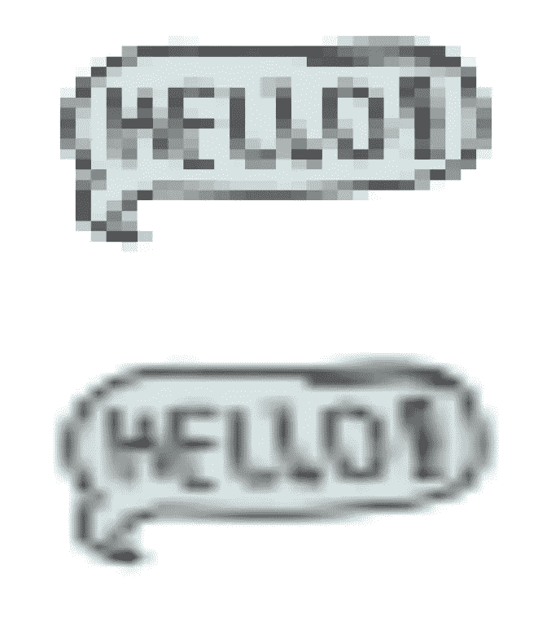

# SwiftUI:插值

> 原文：<https://betterprogramming.pub/swiftui-interpolation-9c337ca98bc7>

## 平滑大图像的边缘


[timJ](https://unsplash.com/@the_roaming_platypus?utm_source=medium&utm_medium=referral) 在 [Unsplash](https://unsplash.com?utm_source=medium&utm_medium=referral) 上拍照。

我发现苹果没有任何插值的定义，这很有趣。哦，好吧，我想我会尽力解释的。当图像被拉伸得比平时大，并且您可以看到一些像素和丢失一些细节时，可以使用 SwiftUI 中的插值。插值非常有助于你将这些像素分解成更小的块，平滑你的图像。

简而言之，在插值的帮助下，你的像素化图片会看起来很平滑。

在本教程中，您将学习什么是插值以及如何在 SwiftUI 中使用它。

# 先决条件

要学习本教程，您需要了解以下方面的一些基本知识:

*   迅速发生的
*   至少 Xcode 11

# 插入文字

为了证明一点，我基本上下载了一个 30px 的图像，试图拉伸它以确保它完全像素化，然后试图插值。

显然，你不应该在 300 的宽度上使用 30px 的图像，但是这里的要点是插值确实有助于平滑图像。

```
Image("hello")
    .resizable()
    .interpolation(Image.Interpolation.none)
    .frame(width: 300, height: 200)Image("hello")
    .resizable()
    .interpolation(Image.Interpolation.high)
    .frame(width: 300, height: 200)
```



# 结论

感谢阅读！