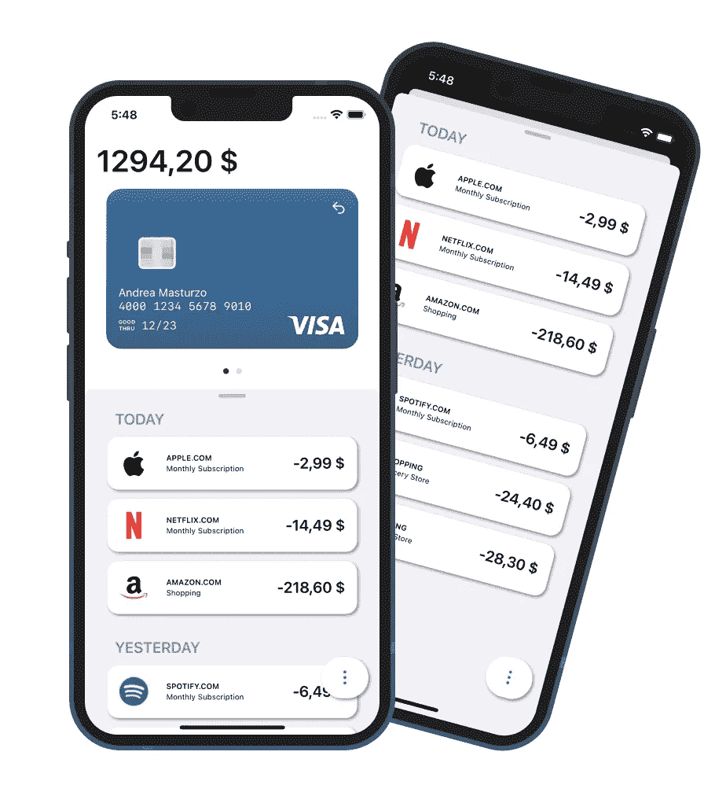
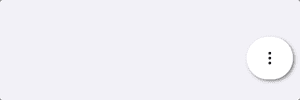

# SwiftUI 中可以有半模态视图吗？

> 原文：<https://betterprogramming.pub/swiftui-into-uikit-into-swiftui-43e7d9f525e8>

## SwiftUI 到 UIKit 到 SwiftUI

# **半模态**

半模态是一种界面元素，在许多不同的情况下都很有用。不幸的是，它不能在 SwiftUI 框架本身中实现。

然而，我们向您展示了一种绕过这种限制的方法，并创建了一个具有 SwiftUI 环境所有特性的半模态。

# 控制器

通常，要显示 UIKit 中的 SwiftUI 元素，您应该使用一个`UIHostingController`。通过子类化，你可以随意定制它。

在这种情况下，它是半模态的，可以调整大小为全屏。

# 结构

模态的实际结构必须符合`UIViewControllerRepresentable`。

在我们的项目中，我们使用了一个`ViewBuilder`来避免故事板的添加。

# 履行

现在你可以像普通的 **SheetView** 一样在 SwiftUI 中轻松调用你的模态。

# 奖励:浮动 Tabbar

下面是创建这个小的自定义元素来扩展你的界面的可能性的代码，尽情享受吧！

感谢阅读。

*编剧* [*安德里亚*](https://medium.com/u/c770bbe07209?source=post_page-----43e7d9f525e8--------------------------------)*[*克里斯蒂安·西姆比尔*](https://medium.com/u/28ba224edda8?source=post_page-----43e7d9f525e8--------------------------------)*

**本文的所有代码资源都可以在 GitHub 上找到:**

* [## GitHub—AndreaMasturzo/BankingAppConcept

### 此时您不能执行该操作。您已使用另一个标签页或窗口登录。您已在另一个选项卡中注销，或者…

github.com](https://github.com/AndreaMasturzo/BankingAppConcept)*