# iOS 16 的 SwiftUI 4 功能

> 原文：<https://betterprogramming.pub/swiftui-ios16-d7685c08f8d5>

## 到目前为止，我探索的一些 SwiftUI 好东西


奥马尔·穆罕默德在 [Unsplash](https://unsplash.com?utm_source=medium&utm_medium=referral) 上拍摄的照片

WWDC 2022 活动本周刚刚启动，像每次一样，SwiftUI 公告值得关注。从新的`NavigationStack`到仅支持 SwiftUI 的图表库，再到网格布局的增强——有很多好东西等着我们去发掘。

在接下来的几节中，我将向您介绍我在 iOS 16 的 SwiftUI 第四次迭代中有机会探索的 4 项新功能。它们将主要用于提升你的 iOS 应用的前端 UI 和 UX。

# SwiftUI 图表

`Charts`是一个全新的 SwiftUI 专用框架。因此，向自定义图表库说再见吧，因为 SwiftUI 现在将允许您创建令人惊叹的数据可视化应用程序和可访问的小部件。

目前，图表框架支持现成的条形图、面积图、折线图、点图和矩形图。没有卖油炸圈饼和馅饼的。然而，我认为我们可以通过利用框架来构建一个自定义的。

以下是如何使用 SwiftUI 图表框架创建条形图的快速示例:

```
Chart{
BarMark(x: .value("Name", ""))
}
```

条形图由`BarMark`视图组成。这里的`x`参数有两个参数:条形的描述名和显示名。类似地，`y`参数需要酒吧的名称和长度参数。SwiftUI 不是直接在视图中传递数据，而是要求我们将它们包装在一个可绘制的对象中(`.value`)。

虽然上面的例子非常简单，但在现实世界的应用中，我们必须使用数据结构来构建图表。

这是我们刚刚创建的一个样本结构。

注意:重要的是将其中一个轴的值设置为可识别的，以便唯一地识别每个条形:

这是应用程序的输出结果:

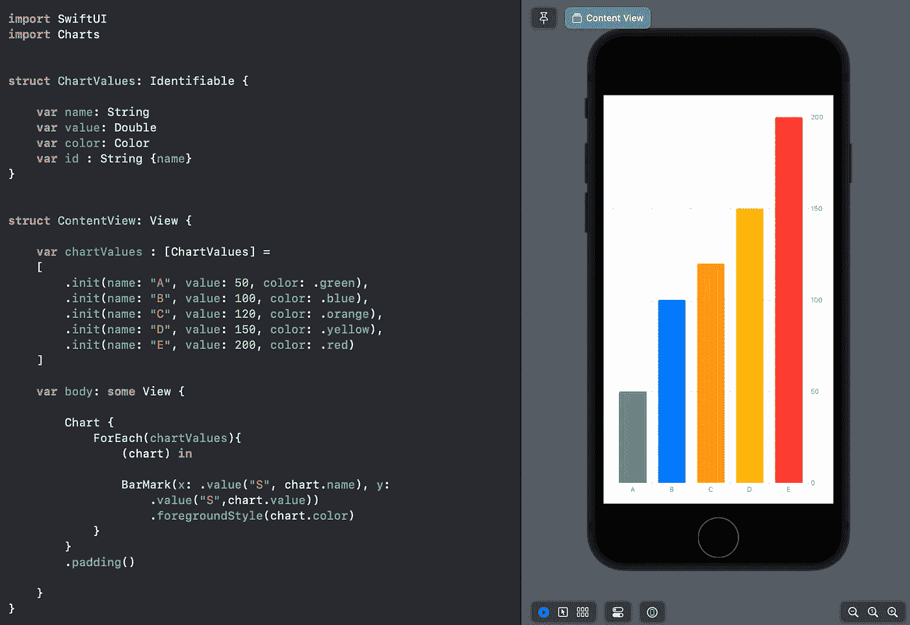

要创建水平图表，简化翻转`x`和`y`值。

我们可以通过隐藏轴网格线来进一步定制图表——通过`.chartYAxis(.hidden)` 和`.chartXAxis(.hidden)`修饰符或者通过图例给它们更多的上下文。

您还可以在同一视图中添加多个图表，通过使用:

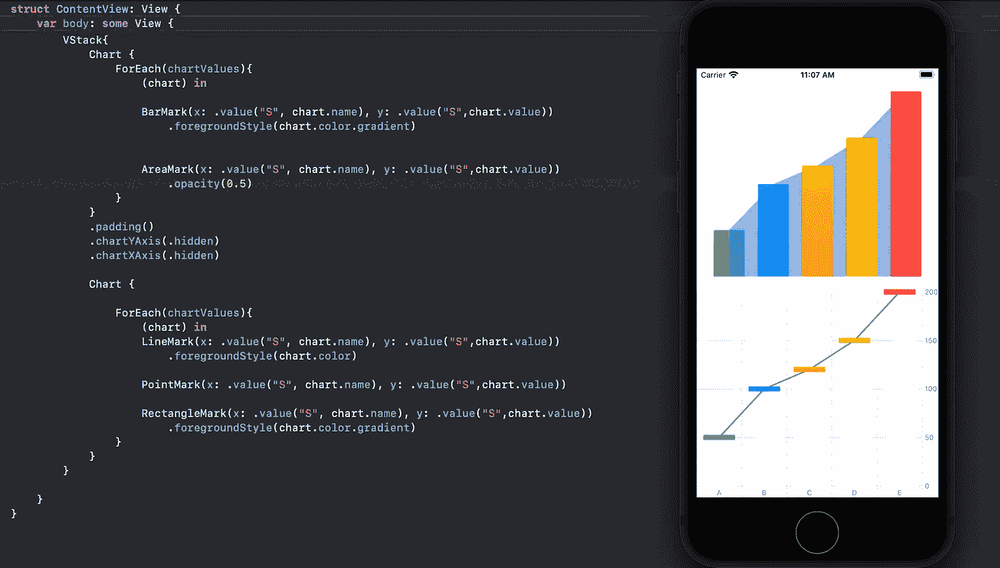

`LineMark`、`AreaMark`、`PointMark`、`RectangleMark`——我们都有了。要了解 SwiftUI Charts 框架如何让构建图表变得如此简单快捷，[请查看这篇创建了自定义条形图的文章](/swiftui-bar-charts-274e9fbc8030)。

# 渐变和阴影

添加线性渐变比以往任何时候都容易。只需添加。`Color`后的渐变修改器带来那种效果。

想看看实际情况吗？检查最后的图表演示图像。它包含:`.foregroundStyle(chart.color.gradient)`给你的图表一个优势。

SwiftUI 4 还使用`ShadowStyle`带来了对内部阴影和投影的开箱即用支持。下面是它的使用方法:

```
Circle().fill(.red.gradient.shadow(.inner(radius: 10)))Circle().fill(.red.gradient.shadow(.drop(color: .black, radius: 10)))
```

我们还可以将它们组合起来，带来更多定制化的效果。预计这个特性会被大量使用来创建漂亮的图标设计。

下面是阴影和渐变的不同排列和组合的输出:

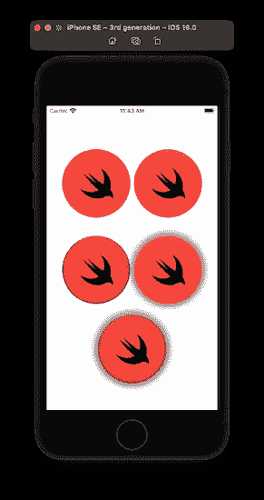

最后一个图标是带有渐变的投影和内部阴影的组合:

# 可定制的底板

在 iOS 15 中，苹果为 UIKit 引入了`UISheetPresentationController.Detent`。使用 iOS 16，你也可以在 SwiftUI 中自定义底部表单——通过使用`presentationDetents`

下面是它的使用方法:

```
.presentationDetents([.medium, .large,]).presentationDetents([.fraction(0.2), .height(100)])
```

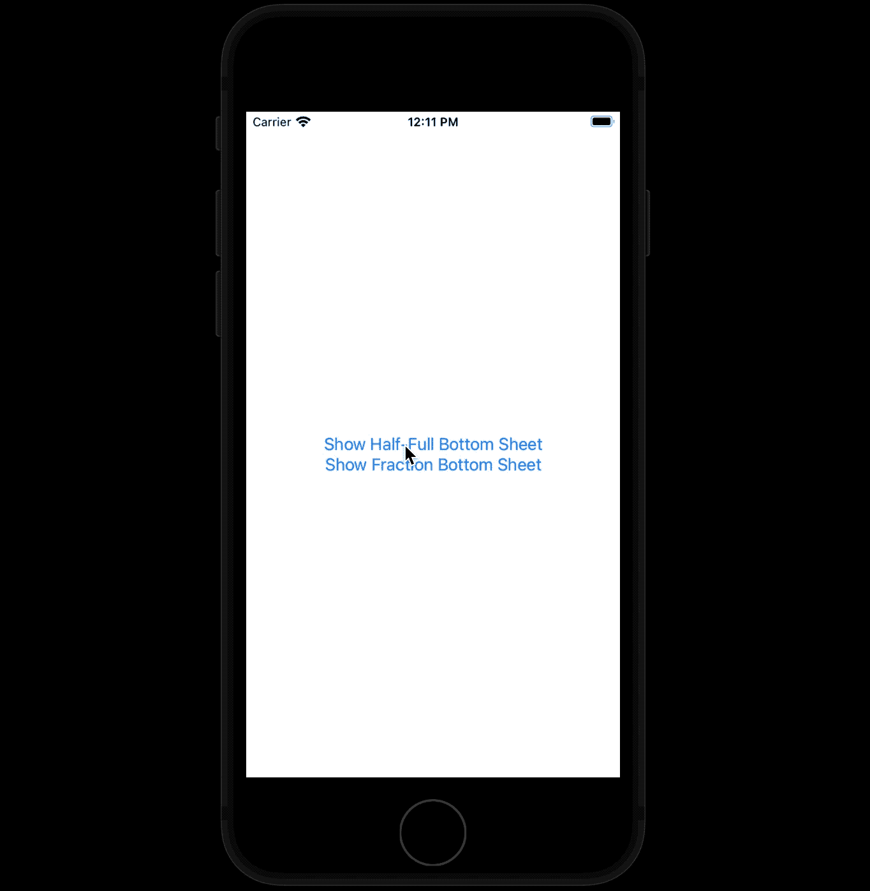

# 共享链接

留出可定制的底部表。iOS 16 的 SwiftUI 也带来了对原生 share sheets 的支持。

通过使用共享链接，您可以打开默认的共享工作表界面，如下所示:

```
struct ContentView: View {

  private let shareItem = URL(string: "https://www.apple.com")!  var body: some View {
    ShareLink(item: shareItem)
  }
}
```

默认情况下，`ShareLink`显示有“共享”按钮和图标。但是，您可以将其自定义为包含其他图标和标签。

注意:将`ShareLink`包装在`Button`上不起作用——可能是因为 ShareLink 本身就是一个按钮。

此外，默认情况下，ShareLink 显示完整的底部工作表。但是，您可以使用`presentationDetents`对其进行定制，就像底部板材一样。

注意:在撰写本文时，为一个共享链接定制`presentationDetents`也会在层次结构中的其他视图上反映出来。

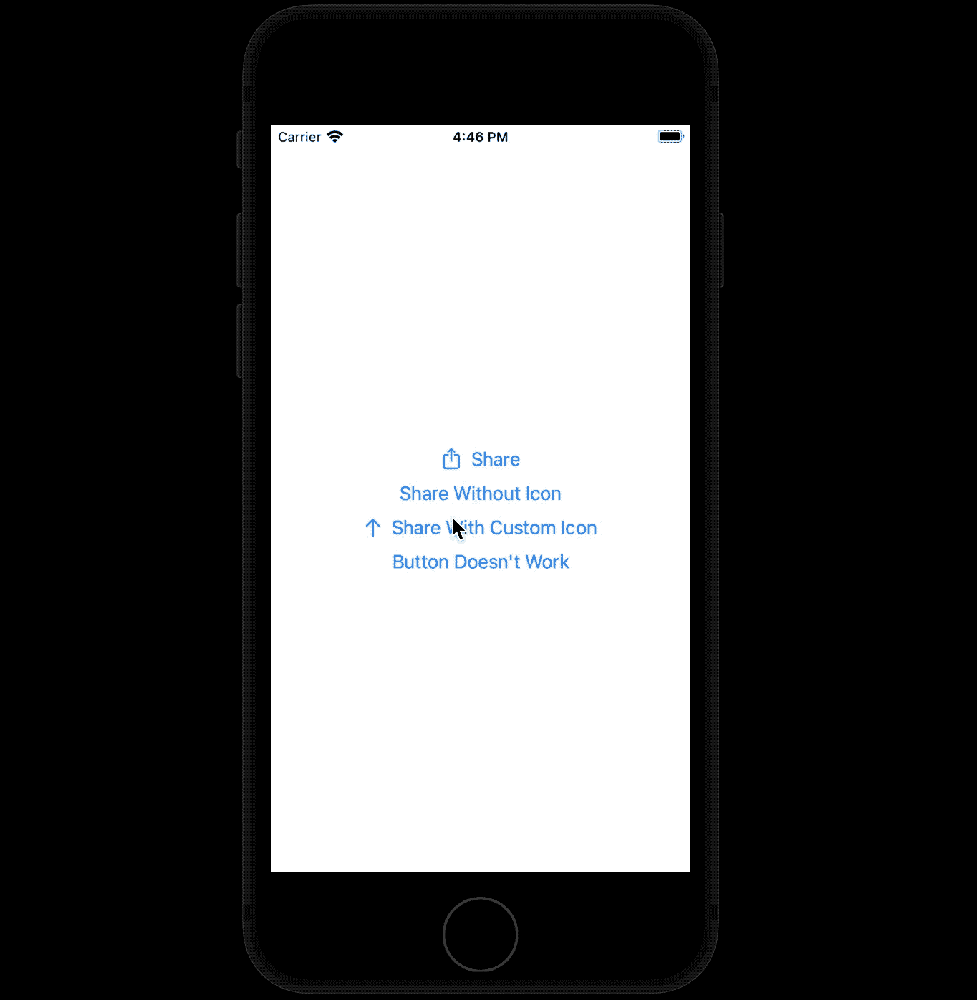

# 估计

如果你使用过 SwiftUI `ProgressView`，仪表对你来说不会太陌生。从本质上说，量表是类固醇的进展视图。

与让您以百分比形式设置值的进度视图不同，仪表允许我们表示指定范围内的值。

此外，增加的可定制性使它们成为构建应用程序小部件的有力竞争者。

以下是仪表的使用方法:

```
Gauge(value: 50, in: 0...100) {
Text("Gauge Name")
}
.gaugeStyle(.accessoryCircular)
```

我们可以进一步定制和添加`maximumValueLabel`、`minimumValueLabel`和`currentValueLabel`用于仪表。

以下是一些仪表样式:


# 新网格

SwiftUI 现在提供了一个内置的`Grid`视图来组成更复杂的布局。

通过使用`GridRows`和`gridCellColumn`修改器，定制网格变得更加容易和快速。

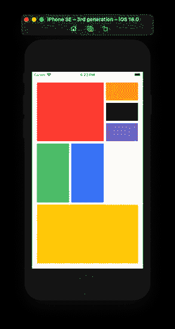

# 多重日期选择器

曾经想要从本地 SwiftUI 选择器中选择多个日期吗？可能是预订你的旅行计划或工作约会。不要担心！

在 iOS 16 中，我们有了以如下方式工作的`MultiDatePicker`:

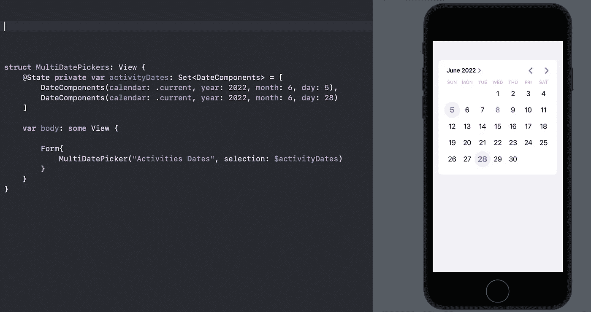

# 适合的视图

`ViewThatFits`是 iOS 16 引入的新视图类型。顾名思义，它让 SwiftUI 自动选择两个视图中最适合可用空间的一个。

一个非常方便的工具，可以为不同的屏幕尺寸和方向设置不同的视图，如下所示:

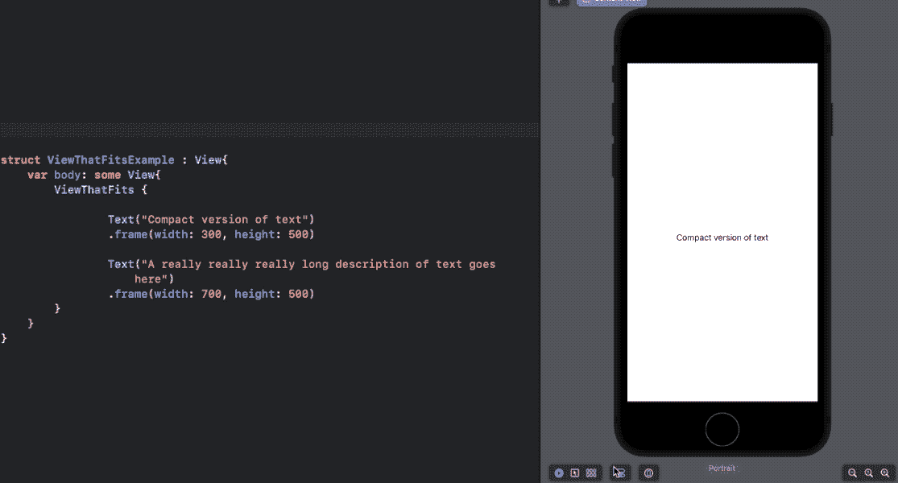

# 任意布局

。iOS 16 的 SwiftUI 引入了`AnyLayout`——一种在不丢失子视图状态的情况下在删除类型的布局之间切换的结构。它和`VStack`和`HStack`一起工作就像一个魔咒——但是和`ZStack`不一起工作。

虽然`ViewThatFits`允许 SwiftUI 为我们选择视图，但是`AnyLayout`给了您一些对定制的控制权

在不使用过渡和几何效果的情况下创建过渡效果从未如此简单:

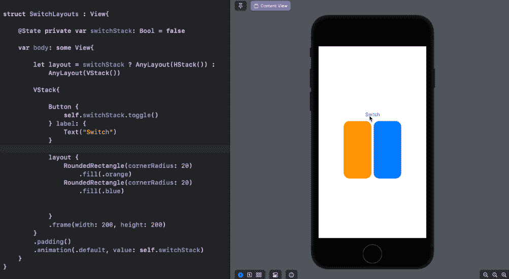

# 可变 SF 符号 4

除了更多的新图标，SF Symbols 4 还引入了可变符号。

这意味着您现在可以将符号的颜色动态设置为百分比值，以动画形式显示或展示进度。

```
Image(systemName: "wifi", variableValue: value)
```

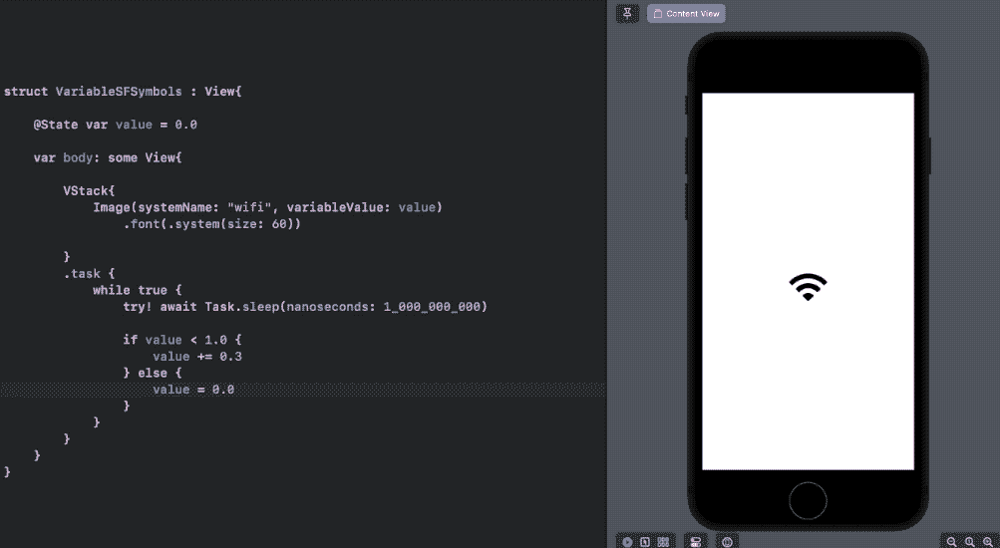

# 将 SwiftUI 视图转换为图像—使用 iOS 16 中的 ImageRenderer API

新的 ImageRenderer API 允许您将视图导出为 UIImage、NSImage 或 CGImage。通过下面的函数调用，拍摄视图或捕捉现实场景变得简单多了:

```
ImageRenderer(content: <ViewToBeConverted>).uiImage
```

让我们使用上述概念创建一个迷你海报 SwiftUI 应用程序。下面是我们想要转换成图像的视图的代码:

它由包裹在`Shape`内的`Text`和`Image`组成。

现在，让我们构造我们的`ContentView`:

我们添加了一个`ColorPicker`和一个`TextField`来定制我们海报的背景和文本。

点击`Button`，我们将得到一份海报视图作为`Image`:

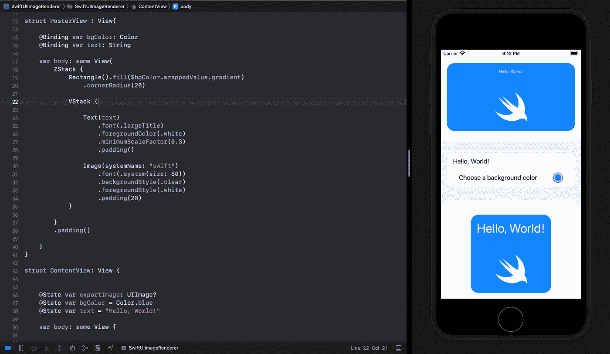

要构建一个完整的海报应用程序，首先要将上面的视图封装在一个`ScrollView`中。

注意:`ImageRenderer` API 并不适用于所有的视图。其中一些，像`VideoPlayer`、`Map`都是被禁止的。

这部分就到此为止了。但是还有很多你可能感兴趣的好东西。

就像一个原生的照片拾取器，SwiftUI 列表的增强(是的，它不再使用`UITableView`)，更多的搜索视图控件，用于编写自定义布局的新`Layout`协议，用于[应用商店评论](https://nilcoalescing.com/blog/RequestingAppStoreReviewsInSwiftUI/)的内置 API，等等。同样，在 Xcode 14 中，SwiftUI 视图是自动缩进的。

SwiftUI 文本字段也有一些不错的升级。比如开箱即用的多行支持，默认的焦点修改器，以及将其集成到`Alert`中的能力。这里有一个关于 iOS 16 新 SwiftUI TextField 特性的[教程。](/whats-new-in-swiftui-textfield-for-ios-16-308264052ca3)