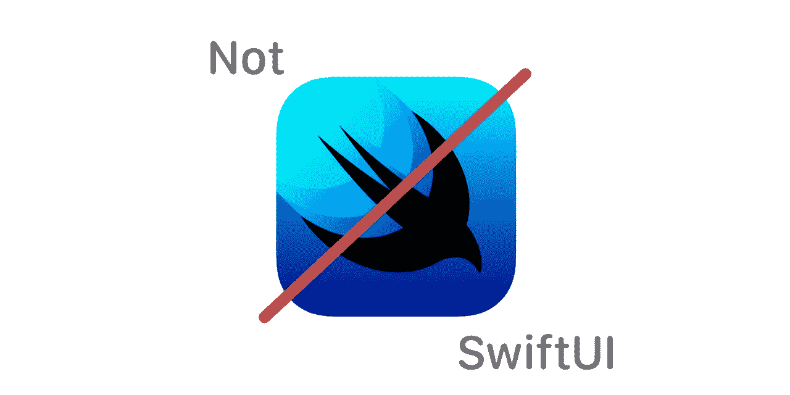

# SwiftUI 好玩，NotSwiftUI 更好

> 原文：<https://betterprogramming.pub/swiftui-is-fun-but-notswiftui-is-better-c884cdea2423>

## UIKit Swift 和 SwiftUI 有了宝宝会怎么样？两全其美

自从 SwiftUI 在 2019 年 WWDC 会议期间宣布以来，社区在 SwiftUI 以其[声明性](https://medium.com/flawless-app-stories/declarative-and-imperative-programming-using-swiftui-and-uikit-c91f1f104252)性质引入桌面的核心理念上一直存在分歧。

我自己和其他人还没有接受 SwiftUI 是编程的真正未来，然而我们大多数人已经同意 SwiftUI 所代表的一般思想实际上是编程如何发展的(甚至可能成为新的标准)。

# 问题是

随着时间的推移，我们开发出了惊人的应用程序，彻底改变了我们的生活。我们彻底改变了食品和产品配送行业，让它变得如此简单，任何人都可以使用它(甚至你的祖母也可以做到这一点！)，我们让跟踪我们的家务和待办事项变得更加容易，在遥远的国家导航外国道路变得前所未有的简单，各种翻译应用程序消除了人与人之间的边界。现在，所有这些都是由[命令式编程](https://en.wikipedia.org/wiki/Imperative_programming)完成的——它告诉程序事情应该如何发生。这很有趣，但有时会变得非常复杂。

SwiftUI 带来了[声明式编程](https://en.wikipedia.org/wiki/Declarative_programming\)，这意味着——应该发生什么。这也很有趣，让程序自己处理大量的逻辑，同时只给它一套规则来遵循。虽然外表看起来很棒，但这会让我们失去对事情的控制。

由于我主要是在没有故事板的情况下开发应用程序[(在我看来，故事板让我对正在发生的事情有更多的控制，并帮助我对 UI 本身有更多的控制)，我经常发现自己用许多行代码声明各种 UIKit 元素。例如:](/creating-ios-apps-without-storyboards-42a63c50756f)

声明 UIButton 元素的常规方式。

这是一个带有向左箭头 SFSymbol 的按钮的常规声明。稍后我会将它添加到一个视图中，并用一些约束来定位它(这需要更多的代码行)。正如你所看到的，这需要 15 行以上的代码来编写。现在想象一下有几十个不同的 UI 元素。这样，您可以很容易地找到包含许多这样的声明的文件。就术语而言，这也会损害可读性，因为它有时会使您的代码变得“沉重”和复杂。

# **解决方案**

我非常喜欢用 SwiftUI 声明各种变量的简单方式。只有几行代码，你可以有一个圆圈，或一个标签，或一个图像，按钮等。因此，我开始将 SwiftUI 的美学与常规 Swift (UIKit)结合起来，并创建了一个 Swift 包，它的整个前提是允许程序员在保持可读性的同时，用较少的代码轻松创建复杂的对象。例如，下面是同一个通过 [NotSwiftUI](https://github.com/Jonas1197/notSwiftUI.git) 包声明的 SFSymbol:

声明一个带有 SFSymbol 的 UIImageView，在视图中居中，给它一个背景色并添加一些阴影。

现在，如果我想让它在视图中居中，我只需执行以下操作:

在视图中居中创建元素。

这很容易为您节省时间和代码行，允许一种简单的方法来创建 UI 元素并定位它，同时保持可读性。

# NotSwiftUI 背后的理念

利用 UIKit 中的所有元素本质上都是 UIViews 的想法，您可以在 NotSwiftUI 的帮助下声明所有的 ui kit 元素。同样，它也适用于定制你的元素，比如添加阴影、改变背景颜色、添加动作、圆角等等。

在带有水平轴的 UIStackView 中堆叠一个正方形和一个圆形(都是 ui view ),将其添加到一个视图中，并对其进行一些定制。

# 结论

[**NotSwiftUI**](https://github.com/Jonas1197/notSwiftUI.git) 是一个有趣的项目，旨在将两个世界结合起来，并允许程序员在纯 Swift (UIKit)驱动的应用程序中拥有 SwiftUI 的一些功能。主要是为了减轻反复编写许多冗长代码的负担，同时保持良好的可读性。虽然它仍处于初级阶段，但随着时间的推移，更多的功能将会稳步推出。

在我看来，SwiftUI 还没有准备好迎接黄金时代，但它仍然是苹果开发生态系统中非常重要的一部分。如果你正在考虑集成各种功能，如 CarPlay 或 Apple Watch 扩展，为你的应用程序创建小工具，甚至构建跨平台的应用程序，这是必不可少的。

关于[**NotSwiftUI**](https://github.com/Jonas1197/notSwiftUI.git)**随时给建议，反馈，甚至为这个小项目出一份力。最重要的是，享受快乐编程！**