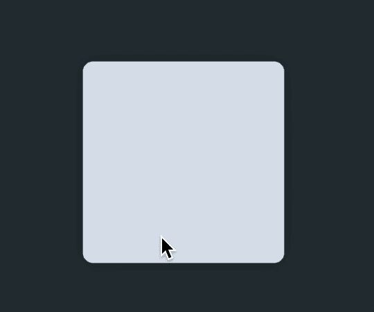

# 为 SwiftUI 中的任何视图构建 Like 修改器

> 原文：<https://betterprogramming.pub/swiftui-like-modifier-a0ad41e0c4c7>

## 给任何人“被喜欢”的能力


保罗·坎德罗在 [Unsplash](https://unsplash.com/s/photos/speed?utm_source=unsplash&utm_medium=referral&utm_content=creditCopyText) 上拍摄的照片

这个简短的教程将带您完成创建带有手势和动画的自定义弹出窗口的过程。然后您将扩展这个`ViewModifier`以允许它被您项目中的任何`View`使用。

# **入门**

*   首先创建一个新文件`LikeModifier.swift`。
*   从下面添加基本的`ViewModifier`存根。到目前为止，当我们将修饰符添加到我们的视图中时，它将返回原来的内容。

# 创建“喜欢”覆盖


类似的覆盖层

当我们的`content`被双击时，我们希望在右上角显示类似的覆盖图。首先，我们必须创建它:

# 跟踪用户交互

现在有趣的部分来了。直到用户双击`content`，我们才能显示覆盖图。为了跟踪这一点，我们需要添加一个名为`liked`的`@State`变量。

```
@State var liked: Bool = false
```

然后，在我们的`body`函数中，我们更新了`content`，使`TapGesture`在触发前接受`2`点击——然后，当它触发时，它翻转`liked`的值。

# 动画覆盖

现在我们通过`liked`变量跟踪`content`的状态，我们可以隐藏和显示视图。为此，我们使用了`scaleEffect`和`opacity`的组合。将这些功能添加到我们的覆盖图的末尾:

```
.opacity(self.liked ? 1.0 : 0)
.scaleEffect(self.liked ? 1.0 : 0, anchor: .center)
.animation(.easeIn(duration: 0.2))
```

现在转到您项目的`ContentView.swift`并使用以下代码测试`LikeModifier`:

```
Rectangle()
    .cornerRadius(10)
    .frame(width: 200, height: 200, alignment: .center)
    .modifier(LikeModifier())
```



工作中的 LikeModifier

# 添加回拨

这很好，但是如果用户与`View`交互时没有收到更新，这又有什么用呢？当我们初始化`LikeModifier`时，我们将传递一个在`TapGesture`被触发时调用的函数，向`LikeModifier`添加一个回调:

```
struct LikeModifier: ViewModifier { @State var liked: Bool = false var callback:()->() func body(content: Content) -> some View { content // ... // Overlay here // ... .gesture( TapGesture(count: 2) .onEnded({ withAnimation { self.liked = !self.liked } // Fire the callback so we can update the model. self.callback() }) ) } }
```

现在您可以将您的测试代码更新为:

```
Rectangle()
    .cornerRadius(10)
    .frame(width: 200, height: 200, alignment: .center)
    .modifier(LikeModifier {
    	// Update model here...
    })
```

# 延伸`View`

如果你愿意的话，你也可以扩展`View`类，以便更容易地添加`LikeModifier`:

```
extension View {
    func onFavorite(callback: @escaping ()->()) -> some View {
        return self.modifier(LikeModifier(callback: callback))
    }
}
```

这使得你的代码更具可读性，并减少了样板文件。

感谢阅读！保重。