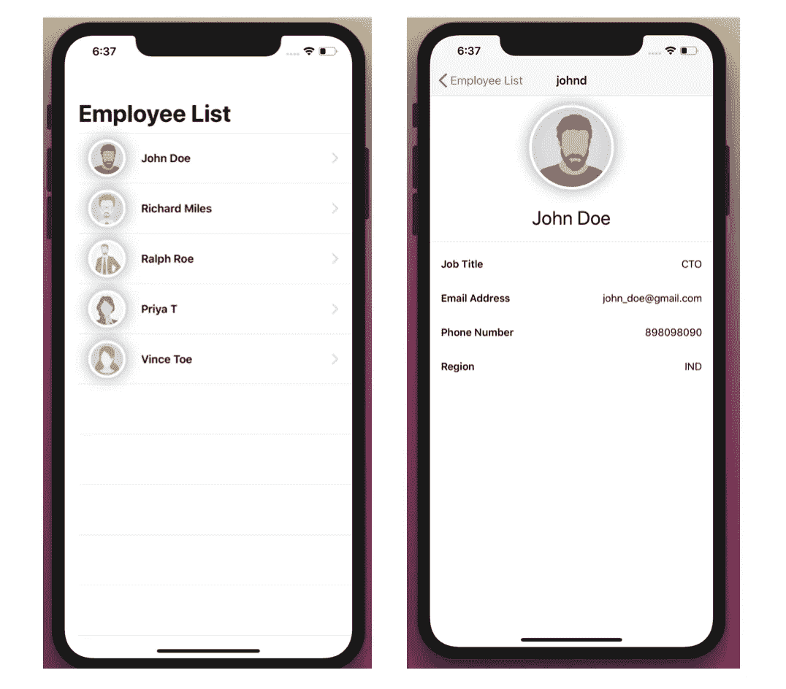

# SwiftUI 列表和导航— UITableView(第 3 部分)

> 原文：<https://betterprogramming.pub/swiftui-list-and-navigation-uitableview-d9526eefddc7>

照片由[安德鲁·尼尔](https://unsplash.com/@andrewtneel?utm_source=unsplash&utm_medium=referral&utm_content=creditCopyText)在 [Unsplash](https://unsplash.com/s/photos/list?utm_source=unsplash&utm_medium=referral&utm_content=creditCopyText) 上拍摄

[SwiftUI](https://developer.apple.com/xcode/swiftui/) 的`List`视图与`UITableView`相似。`List`使用起来简单多了。

没有数据源，没有委托。不需要在故事板中创建原型单元，或者在代码中注册它们。不需要出列和配置单元等等。

让我们创建一个显示雇员列表和每个雇员的详细信息的项目。

# 创建/获取样本数据

我们将在我们的项目中使用以下样本数据。将 JSON 文件添加到 Xcode 项目中。

# **创建模型**

创建`Employee`结构，存储应用程序需要显示的所有员工信息。

重要提示:`List`中使用的每个模型都应该实现可识别或可散列的协议来惟一地标识列表中的每一行。

我们使用了`Codable`协议来编码和解码定制的数据格式，比如 JSON 到本地 Swift 对象。

# 加载数据

创建一个 Swift 文件`Data.swift`，它从`employee.json`导入一组员工数据。

# 创建行视图

创建一个新的 SwiftUI 视图，命名为`EmployeeRow.swift`。

*   一个存储属性`employee`。
*   名为`EmployeeRow`的结构符合`View`协议，并在`body`属性中描述了视图的内容和布局。
*   `HStack`将视图水平放置在容器中。
*   `CircleImage` 是自定义的 SwiftUI 视图，将图像裁剪为圆形，并添加笔触和阴影。我们需要传递图像名称和帧大小。查看 [CircleImage SwiftUI 视图要点。](https://gist.github.com/49da47cb66fb2e9d1d3a151f1d7c0427.git)
*   `Text` 显示员工的姓名。
*   `Spacer` 添加沿其包含堆栈布局的主轴扩展的灵活空间，如果不包含在堆栈中，则在两个轴上扩展。`HStack`中的`Spacer`将文本“推”到前沿。
*   使用帧修改器指定行帧。
*   名为`ContentView_Previews`的结构符合`PreviewProvider`协议，并声明了该视图的预览。
*   `EmployeeRow`用一些数据调用结构体进行预览。
*   `previewLayout(_:)`修饰符，用来设置一个近似于列表中一行的大小。

# 创建列表

创建一个新的 SwiftUI 视图，命名为`EmployeeList.swift`。

*   将`employeeData`传递给`List`初始化器。
*   从闭包返回`EmployeeRow`来完成动态生成的列表。这将为`employeeData`数组中的每个元素创建一个`EmployeeRow`。

在`SceneDelegate.swift`中，将 app 的根视图切换到`EmployeeList`。

# 创建详细视图

创建一个新的 SwiftUI 视图，命名为`EmployeeDetail.swift`。

*   `Divider` 视图通过画线来划分周围的视图。
*   `navigationBarTitle`修饰符为视图配置导航条的标题。

# 列表和详细信息之间的导航

*   在`EmployeeList.swift`中，将员工列表嵌入到一个`NavigationView`中。
*   在列表的闭包内，将返回的行包装在一个`NavigationLink`中，指定`EmployeeDetail`视图作为目的地。

构建并运行项目！

参考 GitHub 上的[完整 Xcode 项目。](https://github.com/talreja-priya/SwiftUI-List)

谢谢你。编码快乐！