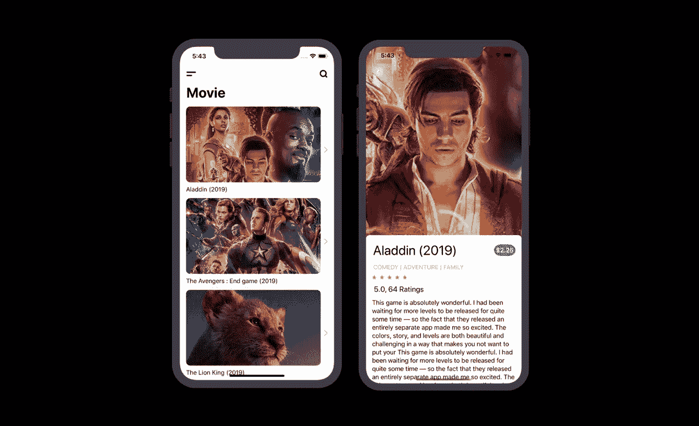
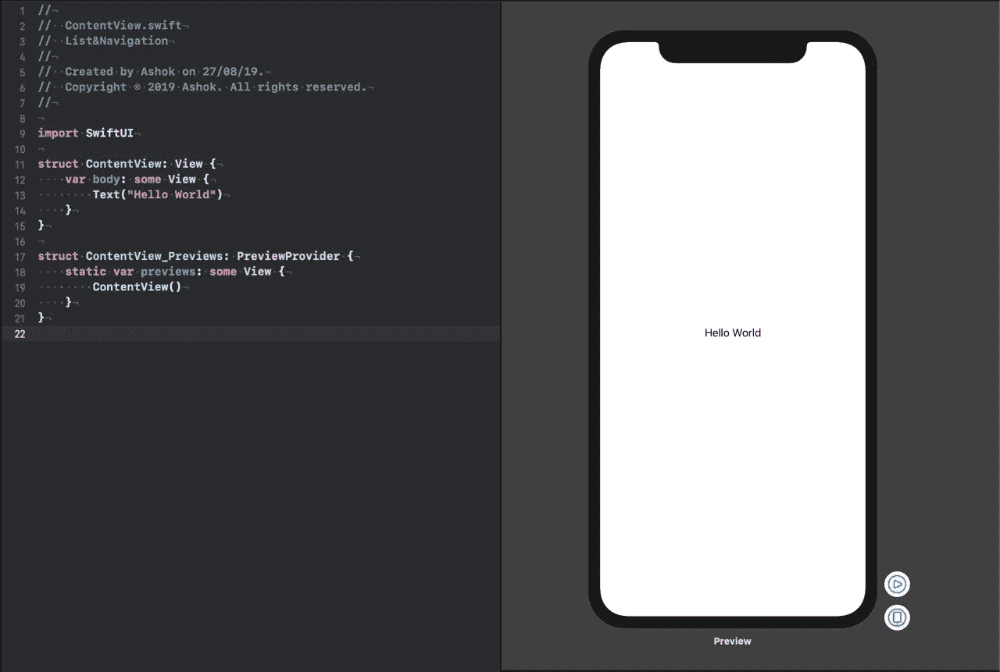
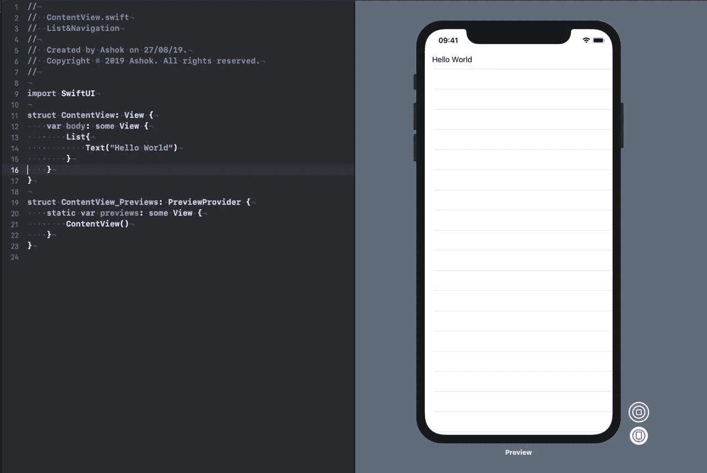
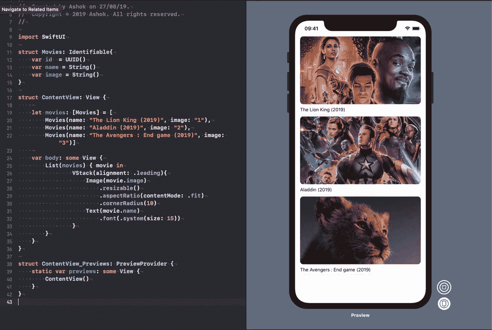
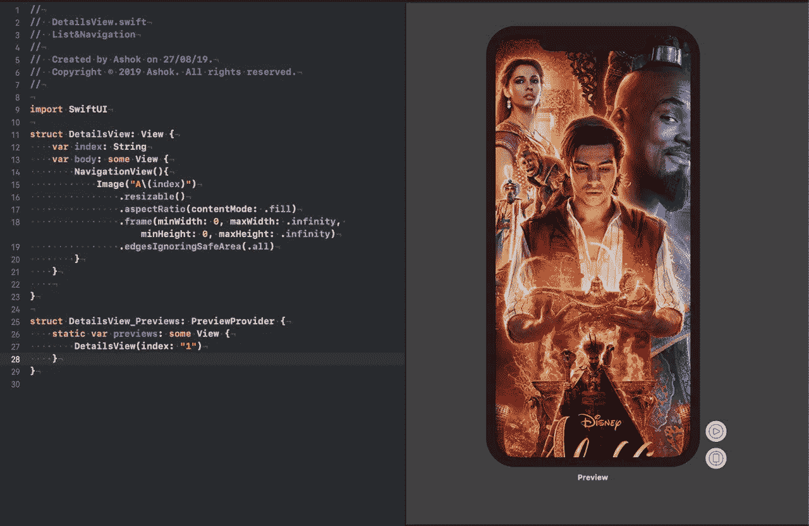
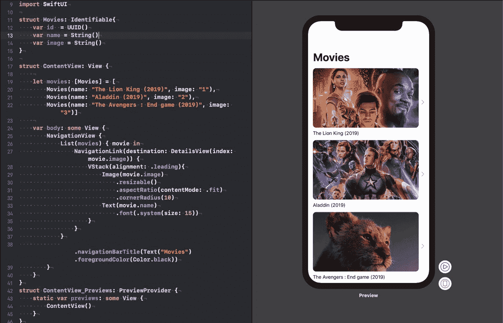

# SwiftUI —列表和导航视图

> 原文：<https://betterprogramming.pub/swiftui-list-and-navigationview-cc51ee400c6>

## 一些关键功能的逐步演示



如果你不熟悉 SwiftUI [，SwiftUI —快速入门指南](https://medium.com/@ashok_b/swiftui-quick-start-guide-e9157a8e8be6)是一个有用的资源。

# 涵盖的主题

通用结构:[列表](https://developer.apple.com/documentation/swiftui/list)，[导航视图](https://developer.apple.com/documentation/swiftui/navigationview)，[导航链接](https://developer.apple.com/documentation/swiftui/navigationlink)， [VStack](https://developer.apple.com/documentation/swiftui/vstack) ，[图片](https://developer.apple.com/documentation/swiftui/image)，[文本](https://developer.apple.com/documentation/swiftui/text)，[环境对象](https://developer.apple.com/documentation/swiftui/environmentobject)

# 目录

一种容器，它显示排列在单列中的多行数据。

## 申报

```
struct ContentView: View {
     var body: some View {
        List{

        }
    }
}
```

# 导航视图

一种视图，用于呈现一堆视图，这些视图表示导航层次结构中的可见路径。

## 申报

```
struct ContentView: View {
     var body: some View {
        NavigationView{
             List{

            } 
        }
    }
}
```

注意:列表将位于 NavigationView 中。

# 开始吧！

## 第一步

最初，ContentView.swift 会是这样的:



## 第二步

添加列表:



## 第三步

***C*** 创建将数据加载到列表中的结构:

```
struct Movies: Identifiable{
    var id  = UUID()
    var name = String()
    var image = String()
}
```

## 第四步

在 ContentView 中，创建一个名为 movies 的“Movies”类型的变量。

```
let movies: [Movies] = [
        Movies(name: "The Lion King (2019)", image: "1"),
        Movies(name: "Aladdin (2019)", image: "2"),
        Movies(name: "The Avengers : End game (2019)", image: "3")]
```

添加垂直保存图像和名称的 VStack，并将其与行距对齐。

```
VStack(alignment: .leading){
 Image(movie.image)
    .resizable()
    .aspectRatio(contentMode: .fit)
    .cornerRadius(10)
 Text(movie.name)
    .font(.system(size: 15))
  }
```

结果会是这样的:



## 第五步

创建名为“DetailsView.swift”的结构来保存电影的完整视图图像



## 第六步

在 ContentView.swift 上，添加 NavigationView 和 NavigationLink。

现在，我们的结构内容视图将如下所示:

```
struct ContentView: View {

    let movies: [Movies] = [
        Movies(name: "The Lion King (2019)", image: "1"),
        Movies(name: "Aladdin (2019)", image: "2"),
        Movies(name: "The Avengers : End game (2019)", image: "3")]

    var body: some View {
        NavigationView {
            List(movies) { movie in
                NavigationLink(destination: DetailsView(index: movie.image)) {
                    VStack(alignment: .leading){
                        Image(movie.image)
                            .resizable()
                            .aspectRatio(contentMode: .fit)
                            .cornerRadius(10)
                        Text(movie.name)
                            .font(.system(size: 15))
                    }
                }
            }
            .navigationBarTitle(Text("Movies").foregroundColor(Color.black))
        }
    }
}
```



注意:导航视图包含列表，列表包含导航链接。

## 第七步

在 DetailsView 上。Swift，在`NavigationBarItems`中增加自定义导航返回按钮。创建绑定演示模式属性，以便在点击导航后退按钮时关闭 my DetailsView。

现在，我们的结构 DetailsView 将如下所示:

```
struct DetailsView: View {
    [@Environment](http://twitter.com/Environment)(\.presentationMode) var presentationMode: Binding<PresentationMode>
    var index: String
    var body: some View {
        NavigationView(){
            Image("A\(index)")
                .resizable()
                .aspectRatio(contentMode: .fill)
                .frame(minWidth: 0, maxWidth: .infinity, minHeight:       0, maxHeight: .infinity)
                .edgesIgnoringSafeArea(.all)
        }
        .navigationBarItems(leading: Button(action: {
            self.presentationMode.wrappedValue.dismiss()
        }, label: { Image("back").foregroundColor(Color.white)}))
    }

}
```

就是这样—运行您的项目！

[*GitHub*](https://github.com/ashokgurmeet/SwiftUI-List-Navigation)