# 使用 SwiftUI 列出了 iOS 15 的功能

> 原文：<https://betterprogramming.pub/swiftui-lists-after-wwdc21-a8e5184e23b3>

## WWDC 21 版后 SwiftUI 列表入门

照片由[Paico official](https://unsplash.com/@paicooficial?utm_source=medium&utm_medium=referral)在 [Unsplash](https://unsplash.com?utm_source=medium&utm_medium=referral) 上拍摄

列表是现代应用程序中使用最广泛的组件之一。它们使应用程序能够在一列中显示多行数据。在 UIKit 中，可以使用`UITableView`开发列表，开发人员要编写大量代码来实现列表。然而，在 SwiftUI 中，可以使用`List`视图轻松实现列表。感谢`List`，现在开发者可以:

*   用更短更简洁的代码实现列表。
*   用更少的努力给他们的列表更好的外观和感觉。
*   配置每一行包含各种视图，如`Image`、`Text`、`Button`等。
*   使用相同的代码将应用程序扩展到其他苹果平台，如 iPadOS 和 macOS。

最激动人心的部分是 [WWDC21](https://developer.apple.com/wwdc21/) 宣布了大量集成到`List`中的特性，使得它不仅更加用户友好，也更加开发者友好。随着本教程的深入，您将逐渐熟悉以下功能:

*   `Text`视图中的降价支持。
*   `.formatted`修饰符，简洁简单的日期和时间格式。
*   的。`refreshable`修改刷新列表。
*   整合搜索的`.searchable`修改器。
*   `.swipeActions`在`List`中。
*   使用`.headerProminence`使`List`部分标题更加清晰可见。
*   使用`.listRowSeparator`和`.listRowSeparatorTint`分别改变`List`行分隔符的可见性和颜色。

> 注意:你需要 Xcode 13。本教程是使用 beta 5 编写的。要在 iOS 设备上运行这个项目，必须运行 iOS 15 beta。

# 入门指南

从 GitHub 库下载 starter 项目。

构建并运行起始项目。你会看到`FavMovies`应用程序的屏幕显示我最喜欢的电影，如下图所示:

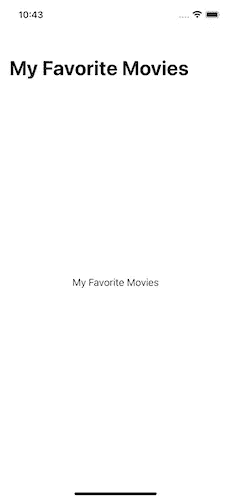

作者图片

失望？不要担心，许多变化正在发生。

现在，看看文件夹结构。除了样板文件和文件夹，您还会看到五个文件夹:`Extensions`、`Helpers`、`JSON Files`、`Models`和`Views`。

`Extensions`包含一个处理 JSON 解码的扩展`Bundle`。您将使用它来解码`JSON Files`的 JSON 文件。

`Helpers`包含一个用于生成预览数据的文件。

同样，`Models`包含`Movie.swift`和`Genre.swift`，它们将被用作将被列入 FavMovies 的电影的模型。

另外，`Views`包含了 app 的视图。目前，它只包含`ContentView.swift`。

# 建立你的清单

是时候建立一个电影列表并在 FavMovies 中展示了。打开`Models`中的`Movie.swift`找到型号`Movie`。它符合`Identifiable`，因为您将使用它来构建一个列表，其中每个`Movie`值使用其`id`获得一个惟一的标识。它也符合`Codable`，因为您将使用这个模型来解码 JSON。

除了`id`，你还会在`Movie`中看到`name`、`desc`、`releaseDate`和`genre`等其他属性。

`genre`为`Genre`型，是符合`String`、`CaseIterable`、`Codable`的`enum`，有多种情况。

## 为列表设置数据源

如果必须生成电影数据的想法困扰着你，starter 已经解决了这个问题。在`JSON Files`中，您将看到`movies.json`，您将使用它来生成电影数据。

打开`Views`中的`ContentView.swift`。使用下面给出的代码行在`ContentView`中创建一个名为`movies`的状态:

上面给出的代码创建了一个状态变量`movies`，并使用`Bundle`的`decode(_:from:)`将解码 JSON 数据生成的电影数据存储在`movies.json`中。至此，您已经完成了列表数据源的设置。

## 显示列表中的数据

是时候使用刚刚设置的数据源在列表中显示电影的详细信息了。

打开`ContentView.swift` ，将`ContentView`的`body`中的`Text(“My Favorite Movies”)`一行替换为:

上面给出的代码通过迭代`movies`中的项目创建了一个`List`。`movie`参数捕获每次迭代的值，并且`List`闭包中的`Text`视图访问`movie`的`name`以显示电影的名称。

构建并运行以查看类似于下面给出的屏幕截图的屏幕:

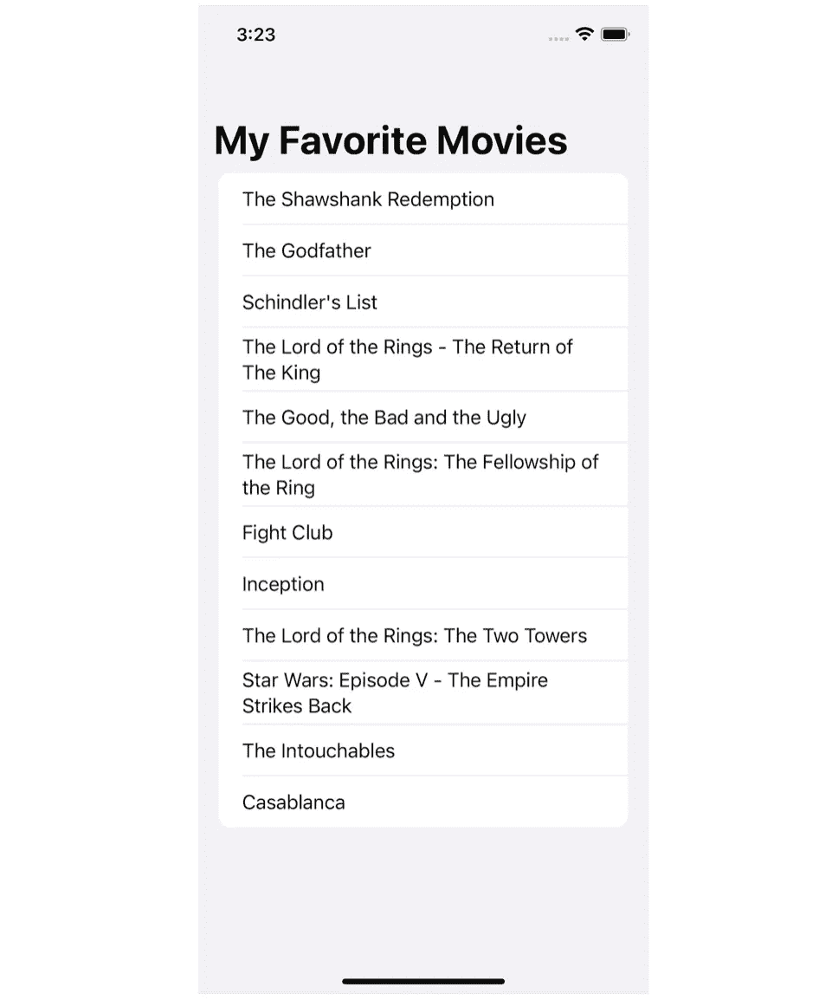

`FavMovies`现在显示包含一些电影名称的列表。

> 注意:在 WWDC21 之前，`List`需要一个`id`参数来遍历数组的元素。
> 
> 但是，在上面给出的代码中，您使用了 WWDC21 之后引入的语法，消除了必须将参数传递给`id`的麻烦。

# 额外的电影信息，请。

您已成功在收藏电影中显示电影名称。你为什么不通过显示电影的描述和上映日期来使列表更有信息量呢？

## 在每个列表项中显示额外信息

由于您将需要更多的视图来显示行中的额外信息，一个好的办法是创建一个单独的视图，这样所有的代码就不会只在`ContentView`中变得混乱。

因此，在`Views`中创建一个新的 SwiftUI 视图`MovieListView.swift`。该视图将显示包含每部电影的名称、描述和上映日期的列表。它需要数据，您将设置`MovieListView`从`ContentView`获取数据。

在`MovieListView`中，使用以下代码添加一个绑定变量:

一旦添加了上面给出的行，`MovieListView_Previews`就会显示一条错误消息:

> 调用中缺少参数“movies”的参数。

用下面一行代码替换`MovieListView()`:

由于`MovieListView`有一个绑定，您通过调用`PreviewMovieGenerator.getPreviewMovie()`给了它一个常量`[Movie]`值，并将其存储在一个数组中。现在错误应该消失了。

必要的设置已经基本完成。用以下代码替换`MovieListView`中的`Text(“Hello, World!”)`:

给定的代码创建一个`List`,它的每次迭代都包含一个`VStack`,保存显示每部电影的名称、描述和上映日期的`Text`视图。另外，几个`Spacer`视图用于增加`Text`视图之间的间距。

现在，用以下内容替换`List`视图及其在`ContentView`中的内容:

代码调用`MovieListView`的初始化器，并将`$movies`绑定传递给它，这样`ContentView`就成为了`MovieListView`的唯一真实来源。因此，如果`MovieListView`的`movies`绑定变量的数据发生变化，它也会反映到`ContentView`的`movies`状态变量中。

现在，`ContentView`的身体应该看起来如下:

构建并运行。您将看到一个屏幕，上面有一个列表，显示不同电影的名称、描述和上映日期，如下图所示:

显示电影名称、描述和发行日期的列表

## 使用降价和日期格式美化列表项

虽然 FavMovies 现在显示电影名称、描述和上映日期，但由于缺乏适当的文本格式，该列表看起来并不美观。此外，由于没有适当的日期格式，您可以在发布日期中看到不必要的细节。现在，这就是`Text`视图中的降价支持和`.formatted`修改器的作用。

WWDC21 宣布 SwiftUI 内置支持渲染 Markdown。它支持粗体、斜体、链接、删除线和等宽格式，并且易于使用。您可以简单地在视图中包含 Markdown 语法，并相应地设置文本格式。

例如:

上面给出的代码创建了一个带有`Text`视图的`VStack`，其中包含带有 Markdown 语法的文本。它产生的结果显示在下面的屏幕截图中:

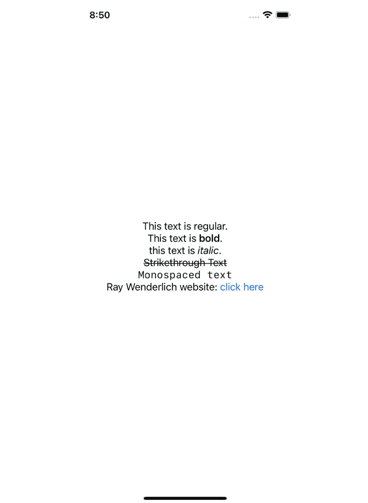

包含带标记的文本视图的 VStack

关于链接的一个有趣的事情是，当它们被点击时，它们会把你带到它们所链接到的网页。

现在，开始编码。打开`MovieListView.swift`，用以下代码替换`VStack`及其内容:

上面给出的代码创建了一个包含带有 Markdown 语法的`Text`视图的`VStack`。第一个`Text`视图显示粗体电影名称，而第二个视图显示斜体电影描述。

构建并运行以查看变化。您的列表应该类似于下面给出的屏幕截图:

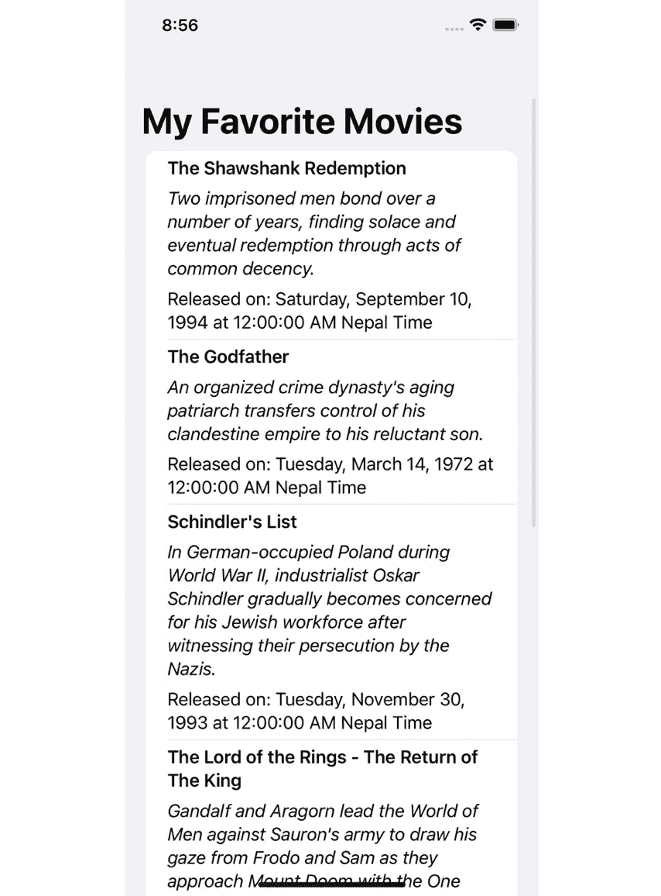

视图中的 Markdown 支持使得文本格式化变得简单快捷。然而，仍然有一个问题——发布日期。当涉及到发布日期时，只显示月、日和年就足够了。所以，你应该使用`.formatted`去掉不必要的东西(而不是`DateFormatter`，这是一个更长的过程)。

使用`.formatted`很简单。只需考虑下面给出的代码:

在上面给出的行中，`Text`视图通过使用`Date`的`.formatted`修饰符格式化来显示当前日期。`.formatted`接受一个`FormatStyle`作为参数，在上面给出的代码中，`FormatStyle`是`dateTime`。然后，访问`dateTime`的`year()`、`day()`和`month()`，得到如下结果:

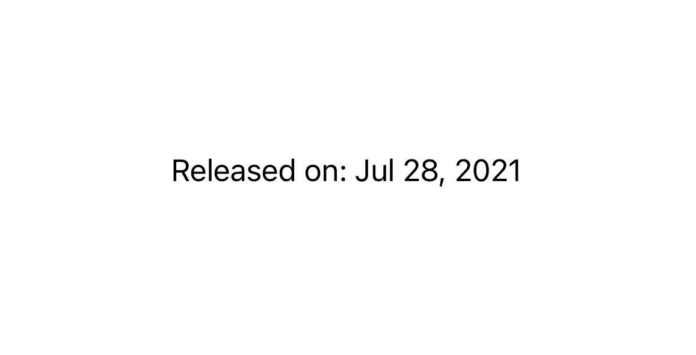

太棒了，你只用一行代码就格式化了日期。我们使用`DateFormatter`并编写多行代码来获得想要的日期格式的日子已经一去不复返了。

目前，月份名称是缩写形式，但是如果您想显示它的完整形式呢？

只需在`month()`中传递`.wide`参数。`month()`有一个`Date.FormatStyle.Symbol.Month`类型的参数`format`，该参数的默认值为`.abbreviated`。通过传递`.wide`，你明确地说你想要这个月的宽版本。尝试下面给出的代码:

在给定的代码中，`.wide`参数在`month()`中传递。因此，结果将类似于下面给出的屏幕截图:

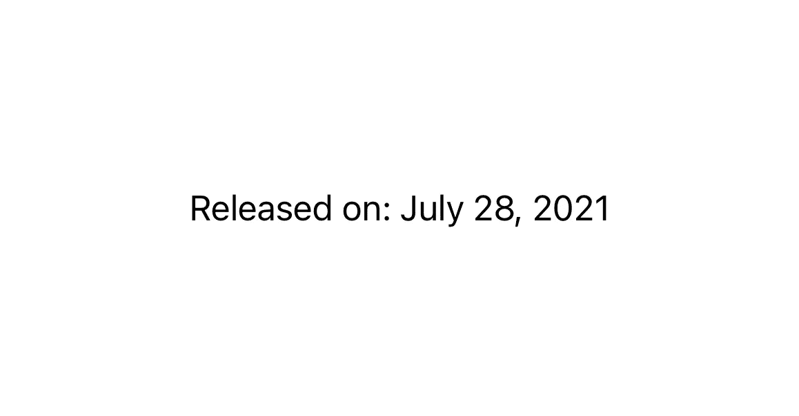

这样，你就可以显示月份的全称了。

要在`FavMovies`中实现这一点，打开`MovieListView.swift`并用以下代码替换显示发布日期的`Text`视图:

给定代码使用`.formatted`格式化日期，并且只显示年、日和月(完整形式)。

构建并运行。您将看到类似于下面给出的屏幕截图的输出:

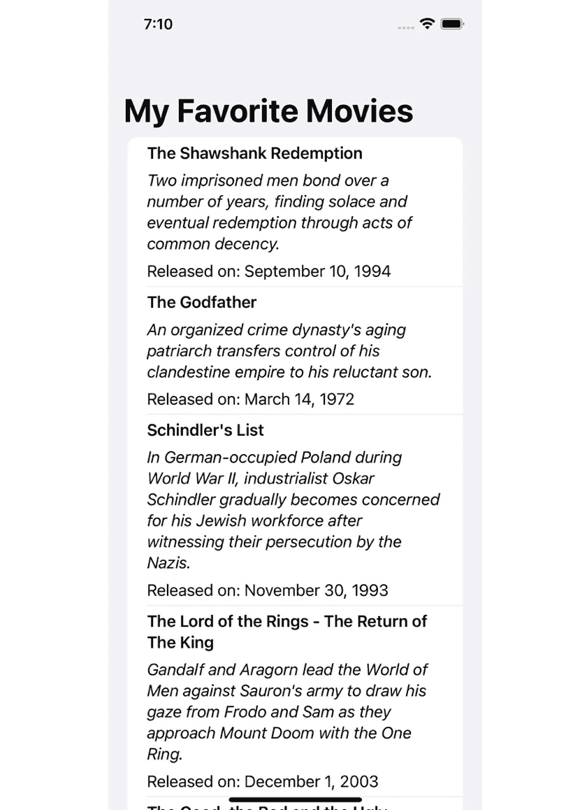

带格式化日期的电影列表

因此，`FavMovies`用美化的文本和日期显示电影列表。

# 添加“酷”的拉动式更新

如果您喜欢拉至刷新功能，那么您也会喜欢这一部分，因为您将了解如何实现它。另外，实现它的容易程度可能会让你惊叹不已，因为你只需要在你的`List`中使用`.refreshable(action:)`修饰符。

`action`参数是一个异步动作，当用户在其 iOS 或 iPadOS 应用程序中下拉列表时，SwiftUI 会执行该动作。您使用该参数加载新数据，当新数据加载时，SwiftUI 在列表顶部显示一个刷新指示器。很简单，对吧？

首先要建立的是加载新数据的机制。如果您打开`JSON Files`，您将看到另一个名为`more_movies.json`的 JSON 文件，其中包含一组新的电影数据。您将解码该文件以生成新的附加数据。

转到`ContentView.swift`并使用以下代码创建`refreshMovieList()`:

给定的代码创建`refreshMovieList()`，附加解码`more_movies.json`和`movies.json`生成的两个数组，并将结果存储在`movies`中。

之后，在`ContentView`，下面。`navigationTitle(“My Favorite Movies”)`，添加以下代码:

你对`MovieListView`应用了`.refreshable(action:)`修改器，因为它的`body`返回你想要刷新的`List`。因此，当执行拉至刷新时，从`.refreshable(action:)`的`action`闭合调用`refreshMovieList()`。

构建并运行，了解拉动式更新的实际应用。

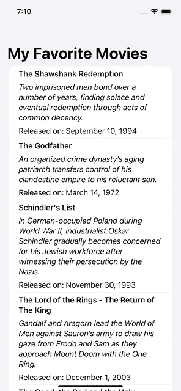

拉动式更新正在发挥作用

好样的。您已经在`FavMovies`中实现了拉至刷新。

# 实施搜索的时间

搜索是显示大量信息的应用程序中最重要的功能之一，SwiftUI 在很大程度上简化了它的实现。

使用`.searchable(text:placement:prompt:suggestions:)`可以让您轻松显示和实现搜索。`.searchable(text:placement:prompt:suggestions:)`有一个`text`参数，它是一个接收用户输入的搜索查询的`String`绑定。

同样，您可以使用参数`placement`，它的默认值是`.automatic`，来明确定义您想要在哪里显示搜索字段。您可以分别使用`.navigationBarDrawer`、`.sidebar`和`.toolbar`显式地将其显示在导航栏的抽屉、侧边栏或工具栏中。通过在不同的平台上运行代码，并在你的应用程序的不同视图中添加`.searchable`修改器，你可以自由地进行实验。

然而，将它设置为`.automatic`足以满足大多数情况，因为应用程序运行的平台会自动决定它的位置。默认情况下，在 iOS、iPadOS 和 macOS 上，搜索栏放置在工具栏中，而在 tvOS 和 watchOS 上，搜索栏放置在其内容内联。

在`.searchable(text:placement:prompt:suggestions:)`中还有另一个名为`prompt`的参数，它向用户显示一个提示文本。它接受一个`String`值，并且是可选的。

最后，您可以选择使用`suggestions`参数在用户开始搜索时显示搜索建议。

## 显示搜索栏

显示搜索栏很简单。将`.searchable`修改器添加到任何想要显示的视图中。

你需要强制传递一个绑定到`.searchable`的`text`参数。因此，打开`ContentView.swift`，使用下面给出的代码创建一个状态变量`searchText`:

上面给出的代码用空的`String`初始化`searchText`。接下来，通过在`NavigationView`的右括号后添加以下代码行，将`.searchable`放置到`ContentView`的`NavigationView`:

就像这样，您在`ContentView`中添加了一个绑定到`searchText`的搜索字段。当用户开始在搜索字段中输入时，输入的文本被存储在`searchText`中。

构建并运行以查找添加到收藏电影的搜索栏。

收藏电影中的搜索栏

在显示的屏幕记录中，你可以看到一个交互式搜索栏被添加到应用程序中，只需放置`.searchable`修改器。

## 让搜索发挥作用

到目前为止，你已经在 FavMovies 中添加了一个搜索栏，但它还没有工作。是时候让它发挥作用了。

打开`MovieListView.swift`并添加一个绑定`searchText`，使用下面给出的代码:

您将使用上面创建的`searchText`绑定来绑定`ContentView`的`searchText`。因此，用户在搜索过程中输入的文本也会被传递给这个`searchText`。

一旦你添加了绑定，`MovieListView_Previews`会要求你插入`searchText`参数的实参。用以下零件替换`MovieListView(movies: .constant([PreviewMovieGenerator.getPreviewMovie()]))`将其固定:

在代码中，您向预览中的`MovieListView`初始化器的`searchText`参数传递了一个常量空值`String`。

但是您仍然会看到一个错误。如果看不到，就构建项目。在`ContentView`中，`MovieListView`初始化需要`searchText`参数中的一个自变量。用以下内容替换`MovieListView(movies: $movies)`:

在上面显示的代码中，您从`ContentView`传递了`searchText`到`MovieListView`的绑定。因此，`MovieListView`的`searchText`现在能够接收用户在搜索栏中输入的搜索查询。

应用程序应该知道什么时候应该开始显示搜索结果，而不是普通的电影列表——显然，这是用户点击搜索栏并开始输入的时候。幸运的是，SwiftUI 使用`isSearching`环境变量让您知道什么时候会发生这种情况。在`MovieListView`中的`searchText`声明下增加以下一行:

你写的代码创造了一种知道用户是否在搜索的方法。如果用户正在搜索，您将显示一个带有搜索结果列表的视图，否则，显示一个带有所有电影列表的视图。因此，你会有两种不同的观点。

在`MovieListView`中，使用下面给出的代码创建`movieRow(movie:)`:

`movieRow(movie:)`返回与`MovieListView`的`body`的`List`视图相同的`VStack`。

现在，在`MovieListView`中，使用以下代码创建`searchResults`变量:

`searchResults`是一个计算属性，过滤并返回名称中包含`searchText`值的所有电影。

现在，要显示由`searchResults`返回的结果，您需要设置`MovieListView`,用下面的代码替换它的`body`:

让我们一步一步来。

1.  您创建了一个包含一个`if-else`块的`List`。
2.  如果用户点击了搜索栏(`isSearching`为`true`)，并且用户在那里输入了一些内容(`searchText`不为空)，代码使用`ForEach`遍历`searchResults`并显示由`movieRow(movie:)`返回的视图来显示搜索结果。
3.  然而，如果用户不是通过键入一些输入来执行搜索操作，代码会通过运行`ForEach`到`movies`来显示由`movieRow(movie:)`返回的视图。

> 注意:您在`List`中使用了`ForEach`块，因为您使用了相同的`List`视图来显示搜索结果以及所有电影。因此，您需要`ForEach`来遍历数据。
> 
> 此外，如果不使用`List`中的`ForEach`，滑动动作功能将不起作用。在本文的后面，您将学习实现它。

构建并运行以查看搜索工作。

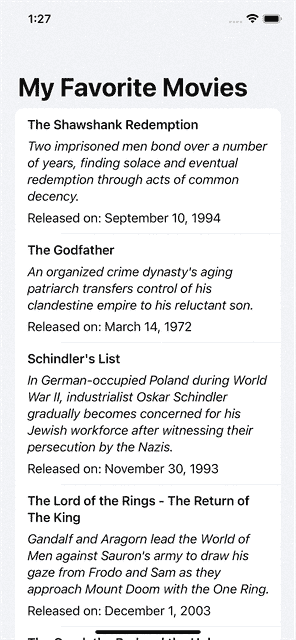

行动搜索

干杯，你已经实现了 FavMovies 中的搜索。

# 删除？只是向左一扫。

如果你在 iOS 或 iPadOS 上使用过苹果的 Notes 应用，你一定会注意到它提供了某些选项，如 pin、delete 等。当您左扫或右扫列表中的备忘录时。

所以，如果你能在 FavMovies 中实现这个功能，难道不令人兴奋吗？

为了实现滑动动作，SwiftUI 提供了`.swipeActions`修改器。它有三个参数:`edge`、`allowsFullSwipe`和`content`。

使用`edge`参数，其默认值为`HorizontalEdge.trailing`，您可以定义想要关联滑动动作的视图边缘。

将`allowsFullSwipe`参数设置为`true`可使该功能以全扫的方式执行第一个动作。

而`content`参数是你写滑动动作外观的地方。

## 实现滑动删除

现在，您将在收藏电影中构建滑动删除功能。使用以下代码打开`MovieListView.swift`并在`movieRow(movie:)`的`VStack`右拉条后添加`.swipeActions`:

让我们一步一步来。

1.  您添加了参数设置为`true`的`.swipeActions`修改器。
2.  对于`content`参数，您传递了一个`Button`，它的`role`设置为`.destructive`(给它一个红色)，它的`action`设置为从`movies`中删除其`id`与当前`movie`的`id`匹配的电影，它的`label`显示一个带有文本`Delete`的垃圾桶图标。

构建并运行以查看滑动删除的实现。

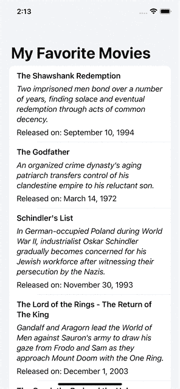

在操作中滑动以删除

恭喜您，您已经在`FavMovies`中实现了滑动删除。因为您没有将参数传递给`edge`参数，所以滑动动作在尾端实现。

# 突出部分标题

SwiftUI 允许您创建包含部分及其标题的列表，以便您的列表看起来分类清晰。在 WWDC21 引入可以接受`.increased`参数的`.headerProminence`修饰符之前，这些节头是不可修改的。它也可以使用`.standard`参数，但是`.increased`增加了标题的字体大小和粗细，使它们更加突出。

## 显示节标题

打开`MovieListView.swift`并使用以下代码创建`movieListWithGenres`变量:

让我们逐步理解代码。

*   您创建了`movieListWithGenres`变量。
*   一个`ForEach`贯穿了`Genre`T22 的所有案例，因其符合`CaseIterable`而成为可能。
*   在`Genre`案例的每次迭代中，都会创建一个节，其标题被设置为流派的`String` `rawValue`。因此，行`Text(genre.rawValue)`设置节标题。
*   创建另一个贯穿`movies`的`ForEach`块。每次迭代都存储在`movie`中。
*   如果`movie`的`genre`与当前的`genre`相匹配，则该电影被放在该类型的部分下。

现在，用`movieListWithGenres`替换`MovieListView`的`body`的`else`块中的`ForEach`块及其内容，使`body`看起来像下面给出的代码:

构建并运行。该应用程序将如下所示:

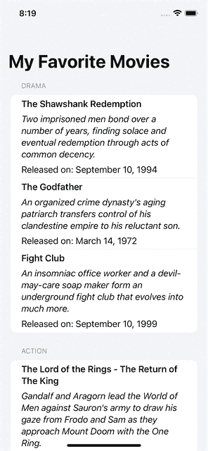

带有节和节标题的列表

FavMovies 现在显示一个根据类型分组的电影列表。

## 更改页眉突出度

目前，标题并不明显。所以，有必要改变这一点。打开`MovieListView.swift`。在其`body`中，在`else`块中的`movieListWithGenres`变量之后，添加以下行:

您向`movieListWithGenres`添加了带有`.increased`参数的`.headerProminence`修饰符。

构建并运行以查看类似于以下屏幕记录的屏幕:

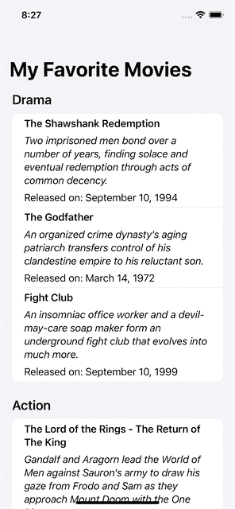

包含突出程度增加的标题的列表

FavMovies 显示一个列表，其中包含突出程度增加的标题。有了这个，你就让你的标题脱颖而出了。

# 玩弄行分隔符

在 FavMovies 中，您一定注意到了电影列表中各部分行之间的水平线。它们被称为行分隔符，WWDC21 引入了`.listRowSeparator()`和`.listRowSeparatorTint()`来允许开发者显示或隐藏它们，并分别改变它们的颜色。

如果你喜欢玩颜色，现在是时候了。您将使用`.listRowSeparatorTint()`来改变行分隔符的颜色。打开`MovieListView.swift`，在`movieRow(movie:)`中`.swipeActions`的右括号后，添加下面一行，使行分隔符为红色:

你把行分隔符涂成红色。构建并运行以查看结果:

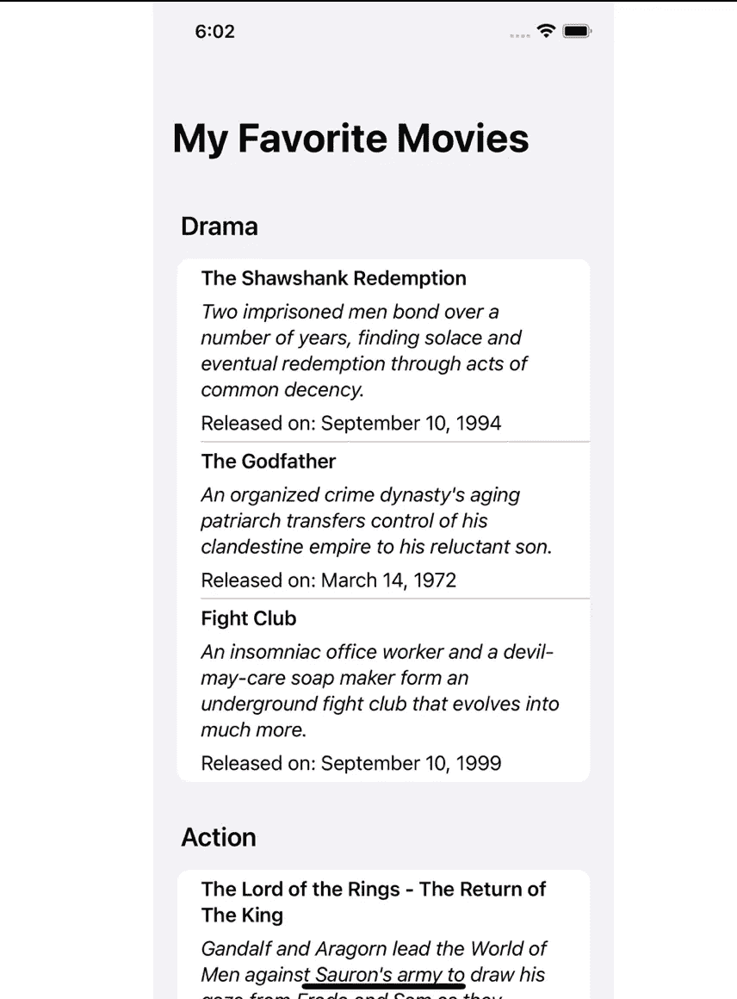

用红色列出行分隔符

您也可以使用`.listRowSeparatorTint()`中的其他`Color`值。

但是，如果你不是那些行分隔符的忠实粉丝，你可以使用`.listRowSeparator(.hidden)`隐藏它们，其中`.hidden`是`Visibility` `enum`的一种情况。其他情况包括`.visible`和`.automatic`。

要隐藏收藏电影中的行分隔符，打开`MovieListView.swift`，在`movieRow(movie:)`中`.swipeActions`的右括号后，添加以下行:

您刚刚隐藏了行分隔符。构建并运行以查看行分隔符的消失。

带有隐藏行分隔符的收藏电影

这样，您就在`FavMovies`中试验了列表行分隔符的可见性和颜色。

# 综上

在本教程中，您已经学习了 SwiftUI 列表的基础知识。一路走来，您实现了:

*   在`Text`视图中增加降价支持。
*   使用`.formatted`简洁轻松地格式化日期和时间。
*   使用`.refreshable`刷新列表。
*   使用`.searchable`实现搜索。
*   在`List`中增加`.swipeActions`。
*   使用`.headerProminence`使`List`部分标题醒目。
*   玩`.listRowSeparator`和`.listRowSeparatorTint`分别改变`List`行分隔符的可见性和颜色。

如果您想下载完成的项目文件，请通过[这个资源库](https://github.com/sagunraj/SwiftUILists_Materials)。

编码快乐！

如果你觉得这篇文章有用，并且愿意支持我，请"[给我买杯咖啡](https://www.buymeacoffee.com/sagunraj)"

 [## Sagun Raj Lage 正在撰写博客和书籍，并免费教授编程。

### 我是一名 iOS 开发人员，有从事各种领域相关项目的经验，如交通和…

www.buymeacoffee.com](https://www.buymeacoffee.com/sagunraj)