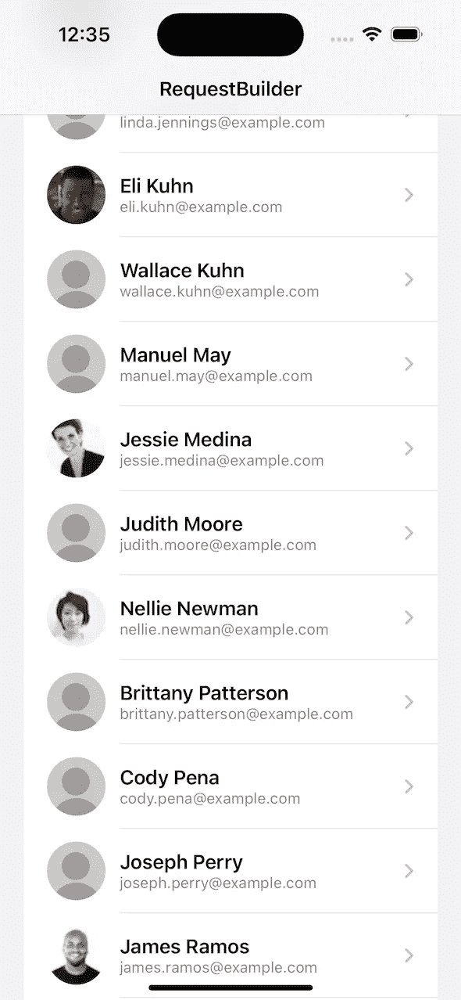
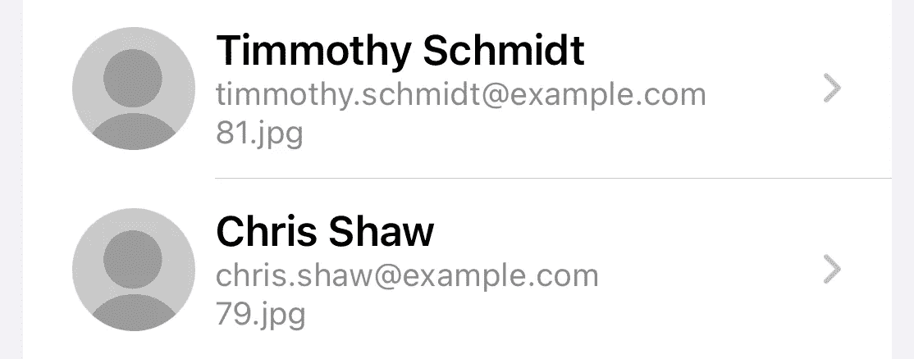
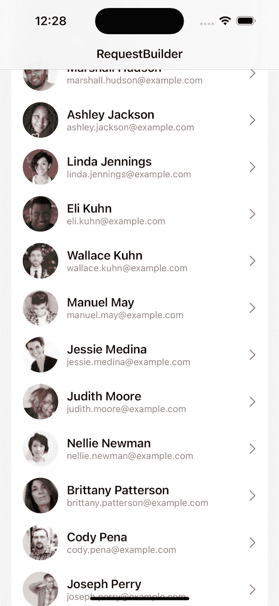

# SwiftUI 列表已损坏且无法修复

> 原文：<https://betterprogramming.pub/swiftui-lists-are-broken-and-cant-be-fixed-a7114d0baaba>

## 一个古老的问题是如何再次浮出水面的。


克里斯·劳顿在 [Unsplash](https://unsplash.com?utm_source=medium&utm_medium=referral) 上的照片

因此，在周末，我在为 [RequestBuilder](https://github.com/hmlongco/RequestBuilder) 开发 SwiftUI 演示应用程序时，遇到了一个问题。

RequestBuilder，顾名思义，使用 Builder 设计模式为 Combine 和 Async/Await 构建和执行 URLRequests。演示应用程序使用它从 API 获取用户列表，以及他们的缩略图，以便在 SwiftUI 列表中显示。

获取用户列表看起来像这样…

```
session.request()
    .add(path: "/api")
    .add(queryItems: ["results" : "50", "seed": "998", "nat": "us"])
    .data(type: UserResultType.self, decoder: JSONDecoder())
    .map(\.results)
    .receive(on: DispatchQueue.main)
    .eraseToAnyPublisher()
```

在该应用程序中，缩略图是从另一个专门的服务获取的，该服务也缓存图像以供以后使用。到目前为止，一切顺利。

# 虫子！

这个应用程序以前运行得很好，但是现在当我运行它并向下滚动时，我开始看到列表中的用户只显示占位符图像，而不是他们的实际缩略图。



不用说，我很不高兴，在接下来的几个小时里，我试图找出我的图书馆出了什么问题。

却发现那根本不是我的图书馆。

罪魁祸首似乎是 SwiftUI 本身。

# Xcode 14.0.1

你可能会从显示新“动态岛”的截图中推断出，我在 iPhone 14 模拟器上使用 Xcode 14.0.1 运行 iOS 16，这是我刚刚安装的 Xcode 的新版本。

嗯。

我只是在前一天运行了这个项目，但我是用 Xcode 13.3.1 和一个运行 iOS 15.6…和 SwiftUI 3 的模拟器来运行的。

下面的代码显示了列表中的卡片视图。

```
struct MainListCardView: View { let user: User @State private var photo: UIImage? private let images = Container.userImageCache() var body: some View {
      let _ = Self._printChanges()
      HStack(spacing: 12) {
        ZStack {
          if let image = photo {
             Image(uiImage: image)
                .resizable()
                .aspectRatio(contentMode: .fit)
          } else {
             Image("User-Unknown")
                .resizable()
                .aspectRatio(contentMode: .fit)
                .onReceive(images.thumbnail(forUser: user)) {
                  photo = $0
                }
          }
      }
      .frame(width: 50, height: 50)
      .clipShape(Circle()) ...
```

`Container.userImageCache`是我的依赖注入库[工厂](https://github.com/hmlongco/Factory)提供的服务。可疑代码在`onReceive`处理程序中，我们向服务请求一个缩略图，它要么返回一个缓存的图像，要么从 API 获取一个。

当它从服务接收到一个图像时，它将它放入一个状态对象中，该对象改变状态并触发刷新，从而显示新的图像。简单明了……但这不再管用了。

# 让我们解决问题吧

我在处理程序中添加了一些调试代码。

```
.onReceive(images.requestThumbnail(forUser: user)) {
    print("onReceive \(user.picture?.thumbnail)")
    photo = $0
}
```

并向列表显示代码本身添加了一些信息，这样我就可以查看日志，了解哪些图像获取请求失败了



这是日志的样本。

```
MainListCardView: _photo changed.
MainListCardView: @self, @identity, _photo changed.
REQ: https://randomuser.me/api/portraits/thumb/men/6.jpg
MainListCardView: @self, @identity, _photo changed.
MainListCardView: @self, @identity, _photo changed.
200: https://randomuser.me/api/portraits/thumb/men/6.jpg
onReceive "https://randomuser.me/api/portraits/thumb/men/6.jpg"
MainListCardView: _photo changed.
MainListCardView: @self, @identity, _photo changed.
MainListCardView: @self, @identity, _photo changed.
MainListCardView: @self, @identity, _photo changed.
MainListCardView: @self, @identity, _photo changed.
MainListCardView: @self, @identity, _photo changed.
MainListCardView: @self, @identity, _photo changed.
MainListCardView: @self, @identity, _photo changed.
MainListCardView: @self, @identity, _photo changed.
MainListCardView: @self, @identity, _photo changed.
MainListCardView: @self, @identity, _photo changed.
MainListCardView: @self, @identity, _photo changed.
```

如您所见，过了一会儿，`onReceive`处理程序本身就不再被调用了。

我试着将`onReceive`处理程序的位置移动到视图中的不同位置，看看会发生什么。同样的结果。

我尝试修改代码，为每个子视图提供自己的视图模型，并切换到从`onAppear`调用视图模型。还是没有欢乐。

# Xcode 14.1 测试版

我想了几分钟，然后切换到在 Xcode 14.1 beta 2 和 iOS 16.1 下运行该项目……并且成功了！大部分是。在更新界面时仍然有一些小故障，但总体来说已经好多了。

然后我在 iOS 16.0 模拟器上运行 14.1 版本的代码，它再次失败，当我直接在我的 14 Pro Max 上运行它时也是如此。

然后我尝试了另一个实验，从这样一个基本的`List`循环开始…

```
var body: some View {
    List {
        ForEach(users) { user in
            NavigationLink(destination: DetailsView(user: user)) {
                MainListCardView(user: user)
            }
        }
        .navigationTitle("RequestBuilder")
    }
}
```

使用一个`LazyVStack`并模拟一个列表。

```
var body: some View {
   ScrollView {
     LazyVStack {
         ForEach(users) { user in
              NavigationLink(destination: DetailsView(user: user)) {
                 HStack {
                    MainListCardView(user: user)
                        .accentColor(Color(UIColor.label))
                    Spacer()
                    Image(systemName: "chevron.right")
                        .foregroundColor(.secondary)
                 }
                 .padding(.vertical, 4)
             }
         }
    }
    .padding(.horizontal, 16)
    .padding(.vertical, 8)
    .background(Color(.secondarySystemGroupedBackground))
    .cornerRadius(16)
    .padding(16)
    .navigationTitle("RequestBuilder")
  }
  .background(Color(.systemGroupedBackground))
}
```

这给出了以下结果。



在`LazyVStack`中使用的完全相同的视图、视图模型和服务可以工作。然而，在一个`List`内，他们没有。

# 列表

从所有这些看来很明显的是，SwiftUI 的 iOS 16.0 实现中有一个 bug，列表元素的`onReceive`和`onAppear`处理程序并不总是被调用。

这可能与 iOS 16 下，`List`视图不再由表视图支持，而是由*集合*视图支持有关。在改变实现的过程中，苹果的工程师们引入了一些错误，这些错误似乎已经在当前的 iOS 16.1 测试版中得到部分纠正。

无论如何，最终的结果是，如果你的应用程序依赖于列表的正确运行，那么它将不再适用于 iOS 16，你对此几乎无能为力(除了重新发布你的应用程序，用`LazyVStacks`替换上述列表视图)。

这是个问题。但这不是真正的问题。

# SwiftUI SDK

在一个理想的世界里，你应该能够进入你的 Xcode 项目设置，将你的应用程序链接到一个已知版本的 SwiftUI 库，并且不受这种变化的影响，就像我们对 CocoaPods 或 SPM 所做的那样……但这不是它的工作方式。

我相信你很清楚，SwiftUI 的每一个版本都明确绑定到 iOS 的特定版本。SwiftUI 1.0 到 iOS 13，SwiftUI 2.0 到 iOS 14 等等。

当然，苹果最终会发布 iOS 16.1，这将*可能*解决问题——对于 iOS 16.1 用户来说。但是任何没有更新并且还在运行 iOS 16.0 的设备*都会坏掉。永远。*

如果你用较早版本的 Xcode 和较早版本的 SwiftUI 构建了一个 app，但是在 iOS 16.0 上运行，就会坏。

如果你用更高版本的 Xcode 和更高版本的 SwiftUI 构建一个 app，但是在 iOS 16.0 上运行，就会坏。

我已经多次写了这个，以及 Android 上的 [Jetpack Compose 如何做不同的事情](https://michaellong.medium.com/swiftui-vs-jetpack-compose-why-android-wins-hands-down-b5f849b730db)。在那里，你可以将你的应用程序与最新版本的程序库链接起来，并使用程序库中几乎所有的功能……不管那台设备有多旧，运行的是什么版本的 Android。

但是在 iOS 上呢？没有。不能这么做。想要使用一些非常酷、非常高级的 SwiftUI 功能，如拉至刷新？

没问题。只要确保你的整个用户群都在 iOS 15 上。

这…令人沮丧。

完全没有必要。

# 式样

注意，`UITableView`支持的`List`更改也可能导致问题，如果您试图使用`UITableView.appearance`修饰符来设计表格视图的样式，以便做一些其他超级高级的功能，比如更改列表背景颜色。

我们在 iOS 13 中这样做了，以解决 SwiftUI 的局限性，而且很有效……直到 iOS 14 出来打破了这种能力。我们在 iOS 15 中确实又找回来了，太棒了！

只是在 iOS 16 中又失去了它，因为列表不再是表格视图。

但是不用担心！这么多年过去了，SwiftUI 4 还是你的后盾。只需使用`background`修改器和新的`scrollContentBackground`修改器…

当然，`scrollContentBackground`只在 iOS 16 和更好的版本上可用，当然，也不会回移植到早期版本的 iOS 和 SwiftUI。

但是我相信你可以找到一种方法来使用新特性，同时保持所有旧代码的向后兼容性。那一点也不乱也不方便。

对吗？

# 完成块

不要误解我。我喜欢 SwiftUI，我真的认为它是 iOS 平台的未来。还有 macOS。和其他地方。

我希望在我的所有平台和项目中全面使用它。但是，只要像跳转和字段聚焦或可刷新这样的高级功能被限制在最新、最高级的操作系统版本中，那么我们就有问题了。

是的。我们可以填补并退回到 UIKit，编写我们自己的导航栈和文本视图，使用`UIViewControllerRepresentables`并编写`UIHostingControllers` …

但是所有这些都不是必须的。

正如我们刚刚看到的，即使你的应用程序支持 SwiftUI 的最新版本，你的应用程序仍然不能免受苹果可能决定对 SwftUI 的*稍后*版本做出的任何改变的影响。

**再说一遍，这应该没有必要。**

嘿。苹果！

安卓做对了。

也许我们应该考虑做同样的事情。

今天到此为止。如往常一样，请在下面留下评论和问题，如果你想看更多，请点击“喜欢”按钮。

*本文是* [*The SwiftUI 系列*](https://michaellong.medium.com/the-swiftui-series-abc180690a9d) *的一部分。*