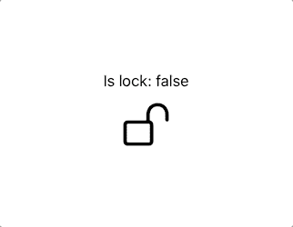

# SwiftUI:长按手势

> 原文：<https://betterprogramming.pub/swiftui-longpressgesture-63234cdc4eac>

## 如何在 SwiftUI 中长按


照片由[蒂莫西·穆扎](https://unsplash.com/@timothymuza?utm_source=unsplash&utm_medium=referral&utm_content=creditCopyText)在 [Unsplash](https://unsplash.com/s/photos/touch-screen?utm_source=unsplash&utm_medium=referral&utm_content=creditCopyText) 上拍摄

`LongPressGesture`可以通过长按提示动作来完成。默认情况下，`LongPressGesture`在半秒后被激活，您甚至可以选择更改持续时间(秒)。

> *“用户执行长按时成功的手势。”—苹果文档*

在本教程中，您将了解 SwiftUI 中的`LongPressGesture`是什么以及如何使用它。

# 先决条件

按照本教程，你需要一些基本知识。

*   对 Swift 的基本熟悉。
*   至少 Xcode 11。

# 长按手势

长按锁，你需要在一秒钟内打开锁。这应该不会太难，对不对？如果你没有什么想法，可以关注下面的我。

您将创建一个保存锁定状态值的`State`。

```
@State private var isUnlocked = false
```

根据给定的值，您将相应地显示它。如果是真的，锁就没锁，反之亦然。

结果应该如下所示:



请记住，默认的秒数只有半秒，如果你想让它更长，你可以相应地调整它。

如果在解锁/锁定之间，你想要一个很酷的动画发生呢？你也可以这么做。您首先需要知道用户是否通过创建另一个状态来按下图像。

```
@State private var isDetectingLongPress = false
```

一旦你有了这个，你将不得不对代码做一点调整。

结果是:


# 从这里去哪里

如果你觉得你已经准备好接受更多的挑战，请随时查看我们创建的另一个教程:

*   [拖动手势](https://medium.com/better-programming/swiftui-drag-gesture-2559cf255c5e)