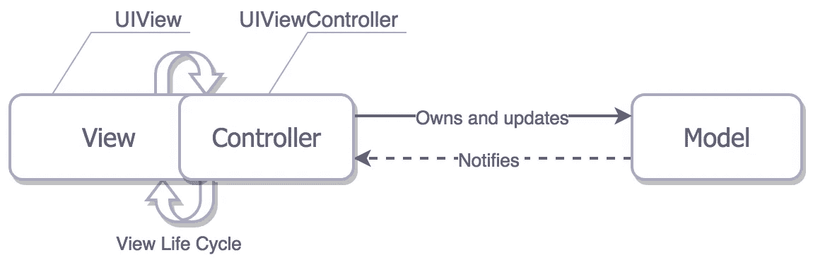
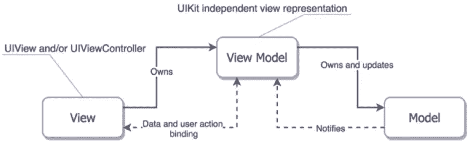
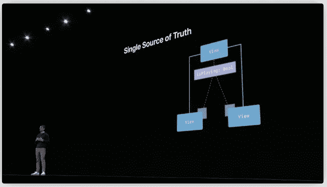
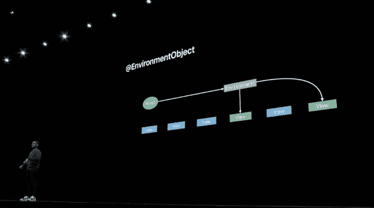

# SwiftUI 微服务

> 原文：<https://betterprogramming.pub/swiftui-microservices-c7002228710>


## SwiftUI 中应用架构的现代方法

SwiftUI 为 iOS、macOS 和苹果所有其他设备上的应用程序开发带来了一种新的声明式、状态驱动、基于组件的方法。

因此，我们的应用程序架构方法也该向前发展了。

但是在我们继续之前，让我们简要回顾一下历史和当前的技术水平。

# 模型视图控制器

iOS 应用程序开发的经典方法依赖于 MVC(模型视图控制器)。在 MVC 中，控制器在模型和代表我们界面的各种视图之间来回传递信息。



在 iOS 中，控制器表现为一个单独的对象，UIViewController。视图控制器管理所有用户交互和状态更改，包括加载信息、操作和更新数据，它还处理用户在应用程序中各种屏幕和页面之间的导航。

这种方法意味着控制器在我们的应用程序架构中扮演了一个过大的角色。事实上，它的作用如此之大，以至于人们普遍称它为 MVC(大规模视图控制器的简称)。

不用说，这种方法不是最理想的。

# 模型-视图-视图模型

已经提出了各种解决方案来对抗大规模视图控制器，但大多数归结为某种形式的模型-视图-视图模型(MVVM)。

就此而言，模型和视图仍然存在，视图控制器也是如此。但是应用程序的核心，数据操作和业务逻辑，已经从视图控制器中提取出来，并转移到视图模型中。

为什么？首先，它简化了视图控制器，但是从视图控制器中提取所有逻辑的主要目的是使逻辑可测试。我们可以实例化一个视图模型，向它提供信息，调用它的方法，并直接观察视图模型将呈现给视图控制器的状态变化。



由于视图控制器的工作已经简化为简单地将这些状态变化传递给组成我们应用程序的视图，我们可以相当有信心，如果视图模型的输出是正确的，我们的应用程序也将是正确的。

这个主题有多种变化:模型-视图-演示者(MVP)。毒蛇。干净。但是它们都基于相同的基本概念，主要区别在于它们如何在一组组件之间划分职责。

然而，所有人都同意一件事，那就是视图控制器应该尽可能的笨。

# 斯威夫特伊

苹果显然同意这一点，因为 WWDC19 出现了，苹果推出了 SwiftUI，其中完全消除了大多数用户定义和管理视图控制器。

在 SwiftUI 中，您使用简单的语法来声明您的用户界面。

此外，在任何给定时间点，该界面完全由应用程序的状态驱动。更改应用程序状态，应用程序界面将立即更新以反映这些更改。

苹果将这一概念称为“真理的唯一来源”。



WWDC19“通过 SwiftUI 的数据流”演示

但是仅仅因为应用程序的任何给定部分都应该有一个真实的来源，并不意味着整个应用程序都应该有一个真实的来源。

迷茫？让我解释一下。

# 作文

正如我在我的文章“[swift ui](https://medium.com/swlh/structural-decomposition-in-swiftui-8892e512b18e)中的视图合成”中所写的，苹果鼓励你将视图分解成小的、紧密的、不同的组件，其中每个视图控制用户界面的特定部分。

让我们再来看看那篇文章中的一个组件，一个收藏夹按钮，用于指示给定的项目应该被记住并显示在应用程序的收藏夹列表中。


收藏夹按钮背后的代码如下:

```
struct FavoritesButton: View { let item: MenuItem @EnvironmentObject var favorites: FavoritesService var imageName: String {
        favorites.isFavorite(item) ? "star.fill" : "star"
    } var body: some View {
        Image(systemName: imageName)
            .foregroundColor(.accentColor)
            .scaleEffect(1.2)
            .onTapGesture {
                self.favorites.toggleFavorite(self.item)
            }
    }
}
```

favorites 按钮界面和行为是完全独立的，可以在整个应用程序的任何视图中的任何地方使用。如截图所示，我们甚至可以将其拖放到导航栏中。

```
struct DetailView: View {
    let item: MenuItem
    var body: some View {
        ScrollView(.vertical) {
            VStack {
                ...
            }
        }
        .navigationBarTitle("Details", displayMode: .inline)
        .navigationBarItems(trailing: FavoritesButton(item: item))
    }
}
```

轻按导航栏中的“个人收藏”按钮，当前项目将被标记为个人收藏。或者被移除。无论如何，`DetailView`不知道按钮的内部细节或实现。

## *最喜欢的服务*

虽然 favorites 按钮界面背后的代码是独立的，但是在内部，视图的基本功能依赖于`FavoritesService`，这是一个环境对象，它已经被定义并插入到链上更高位置的视图层次结构中。

`FavoritesService`是一个 SwiftUI ObservableObject，它向我们的视图公开了一个发布的值和两个方法。一个是`isFavorite(item)` 方法，用于确定该项是否已经是收藏，另一个是`toggleFavorite(item)`，用于相应地切换该项的状态。

请注意，当从这里或从应用程序中的任何地方调用`toggleFavorite(item)`时，我们的收藏夹项目列表会更新，因此，任何依赖于`FavoritesService`的视图都会被要求相应地更新其视图显示。

```
class FavoritesService: ObservableObject { @Published var items: [MenuItem] = [] func isFavorite(_ menuItem: MenuItem) -> Bool {
        items.firstIndex(where: { $0.id == menuItem.id }) != nil
    } func toggleFavorite(_ menuItem: MenuItem) {
        if let index = items.firstIndex(where: { $0.id == menuItem.id }) {
            items.remove(at: index)
        } else {
            items.append(menuItem)
        }
    }}
```

`FavoritesService`是这一特定观点的唯一真理来源。这也可能是其他观点的真实来源，但是`FavoritesButton`并不关心这个。

`FavoritesService`还坚持单一责任原则。它的目的是管理一个喜欢的菜单项列表，仅此而已。

## 应用程序选项卡

让我们看看另一个服务，尽管是一个非常简约的服务。

```
enum AppTabs: Int {
    case favorites
    case menu
    case order
}class AppState: ObservableObject {
    @Published var currentTab = AppTabs.favorites
}
```

在这里，我们跟踪应用程序的当前标签状态，这样我们可以根据需要有计划地移动到特定的标签。

```
struct AppTabView: View {
    @EnvironmentObject var appState: AppState
    var body: some View {
        TabView(selection: $appState.currentTab) {
            FavoritesView()
                .tabItem {
                    Image(systemName: "star")
                    Text("Favorites")
                    }
                .tag(AppTabs.favorites)
            ...
            }
    }
}
```

## 订单服务

还有一个。这里有一个来自同一个应用程序*、*的`OrderService`、*、*用于跟踪订购的商品。

```
class OrderService: ObservableObject { @Published var items = [MenuItem]() var total: Int {
        items.reduce(0) { $0 + $1.price }
    } func isInCart(_ menuItem: MenuItem) -> Bool {
        items.firstIndex(where: { $0.id == menuItem.id }) != nil
    } func add(item: MenuItem) {
        items.append(item)
    } func remove(item: MenuItem) {
        if let index = items.firstIndex(of: item) {
            items.remove(at: index)
        }
    }
}
```

## Redux

由于应用程序的每个组件都应该有一个真实的来源，[有些人建议](https://medium.com/swlh/clean-architecture-for-swiftui-6d6c4eb1cf6a)swift ui 转移到 Redux 风格的状态模型，整个应用程序有一个真实的来源。

```
class AppState: ObservableObject {
    @Published var currentTab = AppTabs.favorites
    @Published var menuItems: [MenuItem] = []
    @Published var favoriteItems: [MenuItem] = []
    @Published var orderItems: [MenuItem] = []
}
```

或者，如果您想在组件行之间保持功能性，也许可以尝试这样做:

```
class AppState: ObservableObject {
    @Published var currentTab = AppTabs.favorites
    @Published var menu = MenuService()
    @Published var favorites = FavoritesService()
    @Published var order = OrderService()
}
```

将全局`AppState`导入到每个需要数据的视图中，就大功告成了。

## 单一全球国家的利弊

做单个`AppState`的好处主要在于简单。如上所述，您只需要处理一个`environmentObject`进口。

但是对我来说，缺点很多。

首先，它们与性能有关。对应用程序状态进行一次更改——比方说，将一个项目标记为收藏夹——现在需要遍历应用程序中的每一个视图树并检查更改。为什么？因为每个视图所依赖的单个环境对象已经发出了发生更新的信号。

对于较小的应用程序，这种影响可以忽略不计。但是对于更大的呢？

(应该注意，对于大型 React/Redux web 应用程序，这也是一个已知的问题。)

## 全局数据

我的第二大反对意见与应用程序数据的全球公开有关。

导入`AppState`到单一视图，所有东西都暴露出来让大家看。既然如此，在不遍历视图中的每一行代码的情况下，您如何确定给定的视图可能正在访问或操作什么信息呢？

我们上面的`FavoritesButton`就是不这么做的一个很好的例子。通过查看代码的开头，我可以知道这段代码唯一能看到或更改的是`FavoritesService`，因为这是从应用程序环境导入的唯一对象。

此外，如果我想在另一个应用程序中使用`FavoritesButton` ，很容易就能看出我还需要什么来移动到另一个应用程序。

## 测试

我的第三个反对意见与测试有关。我们将代码分解成视图模型和服务的主要动机之一在于使代码更容易测试。

在 SwiftUI 中，我们的应用程序完全由它的状态控制。因此，如果我们将该状态放入模型或服务中，并且如果该状态由于用户触发的动作而改变，那么在测试中，我们可以触发那些动作并观察状态的结果变化。

如果对于每一个可能的变化或动作，状态都正确地更新了，那么我们就有相当高的信心相信我们的应用程序是正确的。

但是将我们所有的状态放在一个容器中，使得孤立地测试我们单独的模型或服务变得非常非常困难。它对于集成测试来说相当不错，但是对于单元测试来说就不那么好了。

即使这样，全球国家也很有可能产生未经检验的、因此无法预见的副作用。"哦，我没意识到它也在改变*那个*变量！"

## 后期绑定

正如在 view-composition 文章中指出的，SwiftUI 的另一个最佳实践是在尽可能低的层次中绑定状态。



WWDC19“通过 SwiftUI 的数据流”演示

当我们在层次结构的底层绑定时，我们极大地减少了所需的界面更新和重新渲染的数量，因为视图树中只有一小部分会受到任何给定更新的影响，并且需要重新生成。

所有这些都极大地提高了应用程序的性能。

上面，收藏夹服务直接绑定到需要它的对象。想要显示收藏夹按钮的`DetailView`既不知道也不关心它。当然，更高层次的人必须提供它，但这是其他人要处理的不同责任。

## 为什么是服务而不是视图模型？

有人可能会问，为什么我们称它们为*服务*，而不仅仅是*视图模型*。

在这种情况下，关键的区别因素是视图模型通常被编写为驱动单个屏幕、页面或视图，并且该视图拥有视图模型。

另一方面，服务是在 SwiftUI 应用程序中的多个视图和组件之间创建和共享的，方法是将它们注入到视图层次结构的某个级别的应用程序环境中，供较低级别的元素使用。只要这一水平持续存在，它们就会持续存在。

事实上，当我们的初始内容视图在我们的`SceneDelegate`中创建时，许多服务倾向于被创建并注入到视图层次结构的最顶层。

```
func scene(_ scene: UIScene, willConnectTo session: UISceneSession, options connectionOptions: UIScene.ConnectionOptions) { // Create the SwiftUI view that provides the window contents.
    let contentView = AppTabView()
        .environmentObject(AppState())
        .environmentObject(MenuService())
        .environmentObject(MessageService())
        .environmentObject(FavoritesService())
        .environmentObject(OrderService())
        .environmentObject(RatingsService()) // Use a UIHostingController as window root view controller.
    if let windowScene = scene as? UIWindowScene {
        let window = UIWindow(windowScene: windowScene)
        window.rootViewController = UIHostingController(rootView: contentView)
        self.window = window
        window.makeKeyAndVisible()
    }
}
```

尽管更好的解决方案可能是使用系统服务修饰符，如“ [SwiftUI 和缺失的环境对象](https://medium.com/swlh/swiftui-and-the-missing-environment-object-1a4bf8913ba7)”中所述

```
 let contentView = AppTabView()
        .modifier(SystemServices())
```

服务修饰符如下:

```
struct SystemServices: ViewModifier { private static var appState: AppState = AppState()
    private static var menu = MenuService()
    private static var messages = MessageService()
    private static var favorites = FavoritesService()
    private static var ratings = RatingsService()
    private static var order = OrderService() func body(content: Content) -> some View {
        content
            // defaults
            .accentColor(.red)
            // messages
            .overlay(MessageOverlayView(), alignment: .top)
            // services
            .environmentObject(Self.appState)
            .environmentObject(Self.menu)
            .environmentObject(Self.messages)
            .environmentObject(Self.favorites)
            .environmentObject(Self.order)
            .environmentObject(Self.ratings)
    }}
```

注意，我们的`SystemServices`修饰符的存在只是为了在需要时将我们的服务注入 SwiftUI 环境中(比如当我们呈现一个新的模态视图或动作表时)。这就是为什么它的成员是私有的。

## SwiftUI 中的微服务

微服务架构被定义为将一个应用程序安排到一个松散耦合的服务集合中。这些服务是细粒度的，它们之间的协议是轻量级的。

在微服务架构中，服务是可独立部署的。在上面的`FavoritesService`案例中，我们已经看到，我们可以在另一个应用程序中轻松地重新部署该服务和那些接口组件。

最后，将它们称为*微服务*进一步强调了我们的服务应该是小型的、定义良好的，并且每一个服务的实现都紧紧围绕管理我们应用程序的一个方面。

真相的唯一来源。

## 完成块

如果 SwiftUI 背后的一个主要目标是从良好组合的、独立的、可重用的视图中构建我们的应用程序，那么我们不应该考虑以同样的方式实现我们的内部服务架构吗？

这是我的看法，但是如果你有不同的看法，我想听听。

**注意:**我的 idin 应用程序源代码版本可以从我在 GitHub 上的[idin 库获得。它包括本文中提到的例子。](https://github.com/hmlongco/iDine)

*如果你喜欢这篇文章，那就试试我最新的:*[*swift ui*](https://medium.com/@michaellong/deep-inside-views-state-and-performance-in-swiftui-d23a3a44b79)*中的深度观点、状态和表现。或者为什么这些词几乎没有一个是你所认为的意思…*