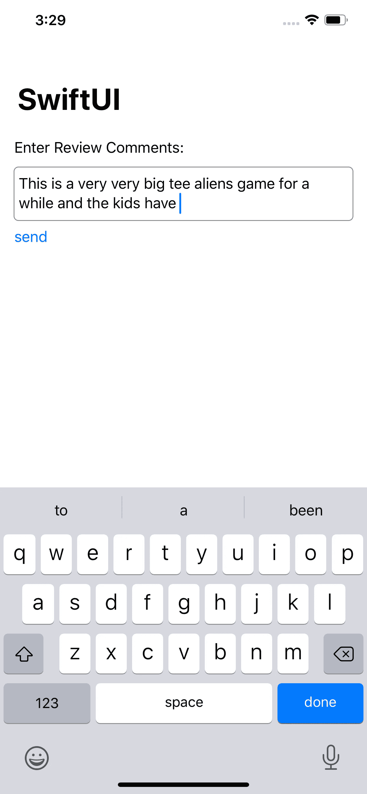

# 如何在 SwiftUI 中构建多行文本字段

> 原文：<https://betterprogramming.pub/swiftui-multiline-content-fit-textfield-3abbdcedaabc>

## 使用 SwiftUI 在 Xcode 11.4 上开发

由于 **iOS 13** 上的 SwiftUI 默认不支持`TextView`，我们需要创建自己的`UIViewRepresentable`。这个`UIViewRepresentable`可以包装`TextView`，我们可以在 SwiftUI 中使用。

`UIViewRepresentable`协议要求我们实现`makeUIView`、`updateUIView`、`makeCoordinator`、`UIViewType`等。因此，现在我们将尝试为 SwiftUI 创建一个`UITextView`包装器。

既然我们已经完成了视图的创建，我们需要设置协调代理。

重新计算高度并更新`updateUIView`中的视图。

完成了。

# 如何使用

# **完整的项目要点**

完整演示-多行 TextView SwiftUI

## **基于 iOS 14 构建— XCode 12**

苹果增加了对' *TextEditor* '的支持，使用 TextEditor 我们可以直接渲染多行 TextView。

# 参考

 [## 如何为 SwiftUI 包装自定义 UIView

### Paul Hudson @twostraws 针对 Xcode 11.4 进行了全面更新，尽管 SwiftUI 在提供许多 UIKit 方面做得很好…

www.hackingwithswift.com](https://www.hackingwithswift.com/quick-start/swiftui/how-to-wrap-a-custom-uiview-for-swiftui)  [## 如何在 SwiftUI 中创建多行 TextField？

### 好吧，我开始与@sas 的方法，但需要它真正的外观和感觉作为多行文本字段的内容适合，等等。这里…

stackoverflow.com](https://stackoverflow.com/questions/56471973/how-do-i-create-a-multiline-textfield-in-swiftui)