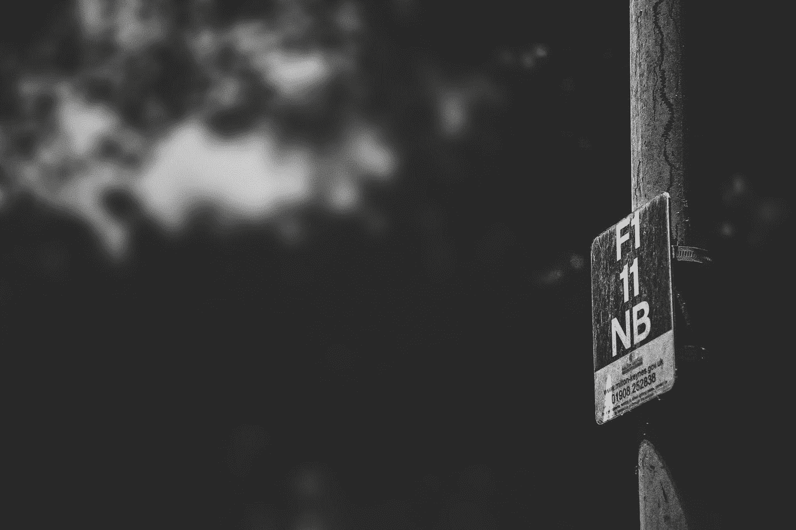
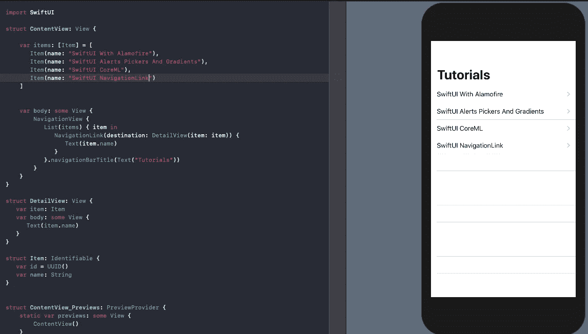
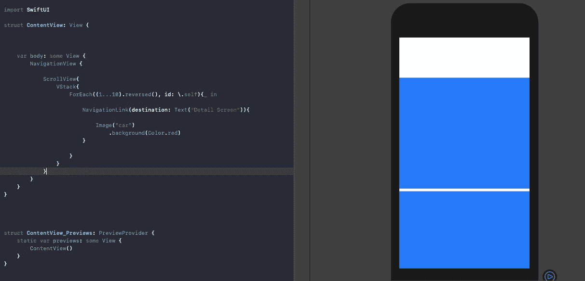

# SwiftUI 导航链接和面临的常见陷阱

> 原文：<https://betterprogramming.pub/swiftui-navigation-links-and-the-common-pitfalls-faced-505cbfd8029b>

## 目前，这不是懒惰，这可能是危险的



劳拉·威克姆在 [Unsplash](https://unsplash.com?utm_source=medium&utm_medium=referral) 上的照片

每个应用程序都需要导航，当然，除非你做了一个杀手级的应用程序，在单一视图下运行良好。

`NavigationView`是负责浏览不同视图的主要角色之一(另一个是`TabView`)。

[SwiftUI](https://developer.apple.com/xcode/swiftui/) 里的`NavigationView`类似于 [UIKit](https://developer.apple.com/documentation/uikit) 里的`[UINavigationController](https://developer.apple.com/documentation/uikit/uinavigationcontroller)`，而`NavigationLinks`就像 segues(其实比那个好多了)。

A `NavigationLink`负责将用户带到`destination`中指定的视图，如下所示:

```
NavigationLink(destination: Text("New Screen")) {Text("Press me")}
```

`NavigationLink`的主体是视图，当按下时，将用户带到目的地视图。

为了让一个`NavigationLink`工作，它需要成为`NavigationView`的一部分，尽管不是显式的。

# 我们的目标

*   理解导航工作的不同方式。
*   处理`NavigationLink`它屏蔽了里面的视图。
*   解决`NavigationLink`无法缓慢加载的目的地。

# 一点历史

自从 SwiftUI 发布以来，导航链接已经经历了很多改变和废弃。

像`DynamicNavigationDestinationLink`、`NavigationDestinationLink`和`NavigationButton`这样的东西已经过时，它们的功能现在包含在`NavigationLink`中(在撰写本文时)。

# 以编程方式导航链接

通常，需要基于某些异步事件或条件来触发导航链接。对于这种情况，我们可以将导航链接设置为以编程方式触发，如下所示:

```
NavigationView{

            VStack{

                NavigationLink(destination: Text("New Screen"),     isActive: self.$isActive) {
                    Text("")
                }

                Button("Press programmatically"){
                    self.isActive = true
                }

            }
}
```

在上面的代码中，`NavigationLink`是用`isActive`定义的，最初设置为`false`。

一旦按钮被按下，state 属性被设置为`true`，导致 SwiftUI 视图的`body`再次被渲染，从而触发现在处于活动状态的`NavigationLink`。

# 路由导航带标签的链接

在有多个导航链接的情况下，用上述方法路由到导航链接将需要太多的状态变量。

幸运的是，`NavigationLink`通过使用如下所示的标签提供了另一种实现:

```
@State var selection : Int? = nil

    var body: some View {
        NavigationView{

            VStack{

                NavigationLink(destination: Text("New Screen"), tag: 1, selection: self.$selection) {
                    Text("")
                }

                NavigationLink(destination: Text("New Screen 2"), tag: 2, selection: self.$selection) {
                    Text("")
                }

                Button("Button 1"){
                    self.selection = 1
                }

                Button("Button 2"){
                    self.selection = 2
                }

            }
        }

    }
```

# 导航列表链接

当 SwiftUI 列表中嵌入一个`NavigationLink`时，箭头附件会自动放置在行项目中，如下所示:



`NavigationLinks`尽管看起来很轻松，但如果处理不当，很容易失控。

既然我们已经讨论了设置`NavigationLinks`的不同方式，那么是时候解决在将该组件集成到 SwiftUI 应用程序中时将面临的常见陷阱了。

# 陷阱 1。NavigationLink 在 ScrollView 下屏蔽视图

让我们看看下面的例子，它试图在一个`ScrollView`中显示一个图像，每个图像都嵌入在`NavigationLink`中:



图像根本不可见。相反，我们看到视图被强调色(本例中为系统蓝)覆盖。

要移除此覆盖，只需将`NavigationLink`上的`buttonStyle`属性设置为 plain，如下所示:

```
NavigationLink(destination: Text("Detail Screen")){Image("car")
.background(Color.red)}**.buttonStyle(PlainButtonStyle())**
```


将 NavigationLink 设置为普通样式后

在另一个场景中，我们在 NavigationView 中使用 PickerView 而不是 Lists，将`buttonStyle`设置为 plain 会导致图像被屏蔽，如[这一部分](https://medium.com/better-programming/how-to-change-your-apps-icon-in-swiftui-1f2ff3c44344)所示。

因此，在这些情况下，将`Image`渲染模式设置为`original`很重要。

# 陷阱 2。NavigationLink 目的地不懒惰

*更新:截至 Xcode 11.4.1，iOS 13.4.1，苹果已经修复了这个问题。导航链接目的地视图现在是延迟加载的。出于历史目的，请随意阅读这一部分。*

这意味着即使用户没有导航到目标视图，也会立即加载该视图。要对此进行交叉检查，只需在目标视图的`onAppear`中添加一条打印语句。

不懒惰的目标视图会影响具有视图列表的应用程序的性能。当列表中有数百行时，每一行都有一个获取远程数据的目标视图，应用程序的性能肯定会受到影响。

谢天谢地，有一个解决办法，正如[的推文](https://twitter.com/chriseidhof/status/1144242544680849410?lang=en)所展示的。通过将目的地视图包装在我们自己的自定义视图中，我们可以延迟加载`NavigationLink`的`destination`，如下所示:

```
struct LazyView<Content: View>: View {
    let build: () -> Content
    init(_ build: [@autoclosure](http://twitter.com/autoclosure) [@escaping](http://twitter.com/escaping) () -> Content) {
        self.build = build
    }
    var body: Content {
        build()
    }
}
```

最后，我们将目的地封装在上面的视图中:

```
NavigationLink(destination: **LazyView**(Text("Detail Screen"))){Image("car")
.background(Color.red)}.buttonStyle(PlainButtonStyle())
```

这无疑提高了应用程序的性能。

# 结论

我们探索了在 SwiftUI 中设置`NavigationLink`的不同方式，并解决了两个常见的陷阱。可以认为`NavigationLink`目的地默认不偷懒(写的时候)。

也许，从设计上来说，苹果不希望 SwiftUI 中的视图太重，因为重新加载视图应该是一种廉价的操作。

这一个到此为止。我希望你喜欢阅读。