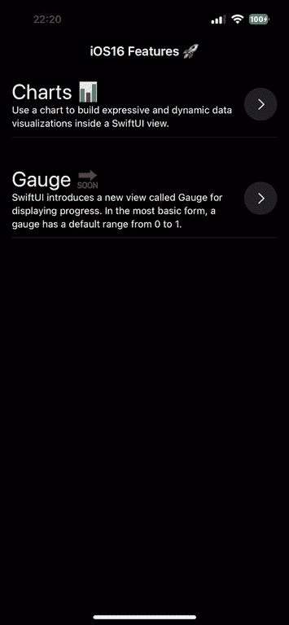
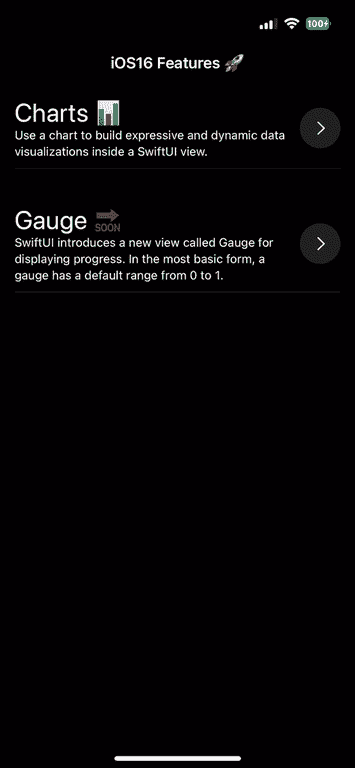

# SwiftUI NavigationStack —深度链接之旅和新功能

> 原文：<https://betterprogramming.pub/swiftui-navigation-stack-how-to-deeplink-and-whats-new-64b1401cb9af>

## 深层链接和导航变得更加容易


Julien Kettmann 在 [Unsplash](https://unsplash.com?utm_source=medium&utm_medium=referral) 上拍摄的照片

> 本文是 iOS 16 和 Mac OS 13 中 SwiftUI4 新功能系列文章的一部分。其余的你可以直接在我的个人资料页面找到🚀。现在让我们继续阅读。

你好！这正是我在今年的 WWDC 上看到新的导航堆栈时所说的，我对此非常高兴。我快乐的基础是我确切地知道我要用它做什么！

就在我的脑海里，我有一个想法:终于有了深度链接导航！从那天起，因为我没有时间去做它，但时间来了，这将是我在媒体上的第一篇文章，并开始了 iOS 16 中所有新的 SwiftUI 功能的系列。让我们开始派对吧！

# **好吧，但是什么变了？**

对于那些不熟悉这个主题的人，我将快速介绍一下 SwiftUI 以前版本中导航和深度链接的外观。因此，之前我们作为开发人员只能使用`NavigationView`和`NavigationLink`，这将使我们能够在应用程序中导航用户，它看起来像这样:

```
struct Feature: Identifiable, Hashable, Decodable {
    var id: String = UUID().uuidString
    let title: String
    let description: String
    let type: FeatureType
}enum FeatureType: String, Decodable {
    case charts
    case gauge
}final class ContentViewModel: ObservableObject {

    @Published var selectedFeature: Feature?
    @Published var showFeatureScreen: Bool = false

    @ViewBuilder func showFeature() -> some View {
        if let feature = selectedFeature {
            switch feature.type {
            case .charts:
                ChartsScreen(feature: feature)
            case .gauge:
                GaugeScreen(feature: feature)
            }
        }
    }
}struct ContentView: View {
    @StateObject var viewModel = ContentViewModel()

    var body: some View {
        NavigationView {
            ZStack {
                NavigationLink(isActive: $viewModel.showFeatureScreen) {
                    viewModel.showFeature()
                } label: {}

                ScrollView {
                    LazyVStack(spacing: 8) {
                        ForEach(viewModel.features) { feature in
                            FeatureCell(feature: feature) {
                                viewModel.selectedFeature = feature
                                viewModel.showFeatureScreen = true
                            }
                        }
                    }
                }
                .navigationTitle("iOS16 Features 🚀")
                .onOpenURL { url in
                    print("🚀 \(url)")

                    guard let components = URLComponents(url: url, resolvingAgainstBaseURL: true) else { return }
                    let query = components.queryItems ?? []
                    let host = components.host
                    let scheme = components.scheme

                    if scheme == "showdownRouting" && host == "feature" {
                        var jsonQuery = query.map { "\"\($0.name)\":\"\($0.value ?? "")\"" }.joined(separator: ",")
                        jsonQuery = "{\(jsonQuery)}"

                        guard let jsonData = jsonQuery.data(using: .utf8) else {
                            return
                        }

                        do {
                            let feature = try JSONDecoder.shared.decode(Feature.self, from: jsonData)
                            viewModel.selectedFeature = feature
                            viewModel.showFeatureScreen = true
                        } catch {
                            print(error)
                        }
                    }
                }
            }
        }
    }
}
```


这是你处理简单深层链接的老方法，你可以看到这种方法的问题是每次只能打开一个屏幕，从长远来看这很麻烦。然后当你打开树中的一些导航时，你会面临缺少弹出到根方法的问题。并且您需要使与导航树连接的所有绑定无效。

好吧，这是有问题的，但是我们能做什么呢？`NavigationStack`！

新的`NavigationStack`和`NavigationPath`对于 UIKit 开发者来说会非常熟悉，他们会喜欢这个:

```
enum FeatureType: String, Decodable {
    case charts
    case gauge
}

struct Feature: Identifiable, Hashable, Decodable {
    var id: String = UUID().uuidString
    let title: String
    let description: String
    let type: FeatureType
}

final class ContentViewModel: ObservableObject {
    @Published var navigationPath = NavigationPath()

    var features: [Feature] = [
        Feature(title: "Charts 📊",
                      description: "Use a chart to build expressive and dynamic data visualizations inside a SwiftUI view.",
                      type: .charts),
        Feature(title: "Gauge 🔜",
                description: "SwiftUI introduces a new view called Gauge for displaying progress. In the most basic form, a gauge has a default range from 0 to 1.",
                type: .gauge)
    ]

   ** func showFeature(_ feature: Feature) {
        navigationPath.append(feature)
    }**
}

struct ContentView: View {
    @StateObject var viewModel = ContentViewModel()

    var body: some View {
        NavigationStack(path: $viewModel.navigationPath) {
            ScrollView {
                LazyVStack(spacing: 8) {
                    ForEach(viewModel.features) { feature in
                        FeatureCell(feature: feature) {
                            viewModel.showFeature(feature)
                        }
                    }
                    **.navigationDestination(for: Feature.self) { feature in
                        switch feature.type {
                        case .charts:
                            ChartsScreen(feature: feature)
                        case .gauge:
                            GaugeScreen(feature: feature)
                        }
                    }**
                    .navigationTitle("iOS16 Features 🚀")
                }
                .onOpenURL { url in
                    print("🚀 \(url)")

                    guard let components = URLComponents(url: url, resolvingAgainstBaseURL: true) else { return }
                    let query = components.queryItems ?? []
                    let host = components.host
                    let scheme = components.scheme

                    if scheme == "showdownRouting" && host == "feature" {
                        var jsonQuery = query.map { "\"\($0.name)\":\"\($0.value ?? "")\"" }.joined(separator: ",")
                        jsonQuery = "{\(jsonQuery)}"

                        guard let jsonData = jsonQuery.data(using: .utf8) else {
                           return
                        }

                        do {
                            let feature = try JSONDecoder.shared.decode(Feature.self, from: jsonData)
                            viewModel.showFeature(feature)
                        } catch {
                            print(error)
                        }
                    }
                }
            }
        }
    }
}
```



如你所见，我们将`NavigatonPath`对象保存在`ViewModel`中，我们可以将各种数据推送到它上面，例如特征，然后对它做出反应，在这种情况下，为了简单起见，我只检查它是什么类型。这种方法非常适合 SwiftUI，同时专注于建模数据和状态。

这使我们能够向堆栈添加更多内容，并像这样通过向下传递我们在 NavigationPath 上推送的视图`navigationPath`,轻松弹出到堆栈的根:

```
.navigationDestination(for: Feature.self) { feature in
                        switch feature.type {
                        case .charts:
                           ** ChartsScreen(feature: feature, navigationPath: $viewModel.navigationPath)**
                        case .gauge:
                            GaugeScreen(feature: feature)
                        }
                    }// Charts Screen implementation:
struct ChartsScreen: View {
    var feature: Feature
    @Binding var navigationPath: NavigationPath
    @StateObject var viewModel = ChartsViewModel()

    var body: some View {
        VStack {
            Text(feature.description)
                .font(.footnote)
                .padding()
                .multilineTextAlignment(.center)
                .onTapGesture {
                 **   navigationPath.removeLast(navigationPath.count)**
                }

            Spacer()

            HStack {
                Button {
                    withAnimation {
                        viewModel.team = viewModel.team.sorted { $0.seniority < $1.seniority }
                    }
                } label: {
                    Text("Sort")
                        .foregroundColor(.white)
                        .padding()
                        .background(.green)
                        .cornerRadius(10)
                }

                Button {
                    withAnimation {
                        viewModel.team = viewModel.team.shuffled()
                    }
                } label: {
                    Text("Shuffle")
                        .foregroundColor(.white)
                        .padding()
                        .background(.red)
                        .cornerRadius(10)
                }
            }

            ScrollView {
                barChart
                lineChart
                areaChart
            }
        }
        .navigationTitle(feature.title)
        .navigationBarTitleDisplayMode(.inline)
    }
```

效果是这样的:



克雷格·费德里吉——修复导航

正如你所看到的，实现非常简单，这让我非常高兴，我们将能够在不久的将来使用它，而新的 iPhones 现在就要出来了！

所有的源代码都是公开的，将会在下一集的新特性中更新。

[](https://github.com/LSWarss/iOS-16-MacOS-13-SwiftUI-Showdown) [## GitHub-lsw arss/iOS-16-MAC OS-13-swift ui-摊牌:新的 SwiftUI 4 为 iOS16+提供了示例应用程序

### 新的 SwiftUI 4 提供了一个适用于 iOS16+的示例应用程序。通过以下方式为 LSWarss/iOS-16-MAC OS-13-swift ui-摊牌开发做出贡献…

github.com](https://github.com/LSWarss/iOS-16-MacOS-13-SwiftUI-Showdown) 

如果你想知道接下来会发生什么等等。在 GitHub 上跟着看就行了。感谢阅读。