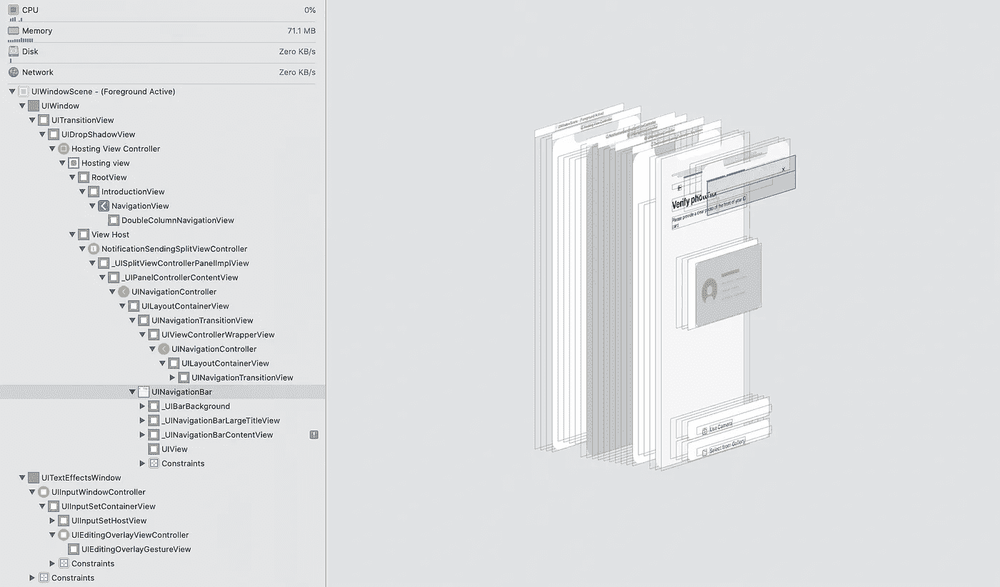
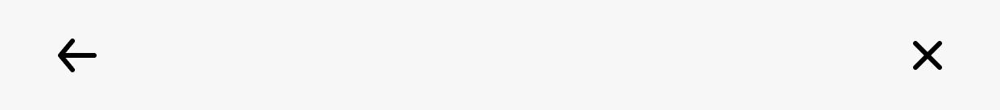
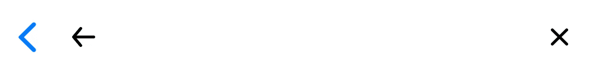
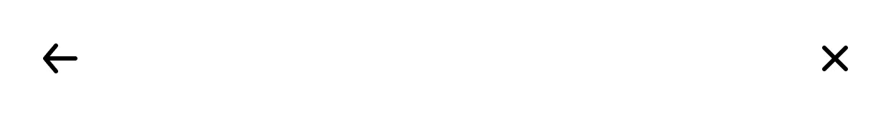
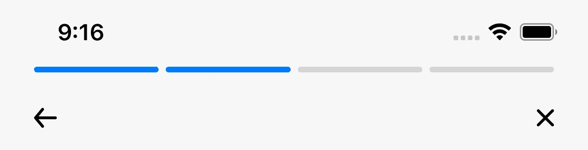
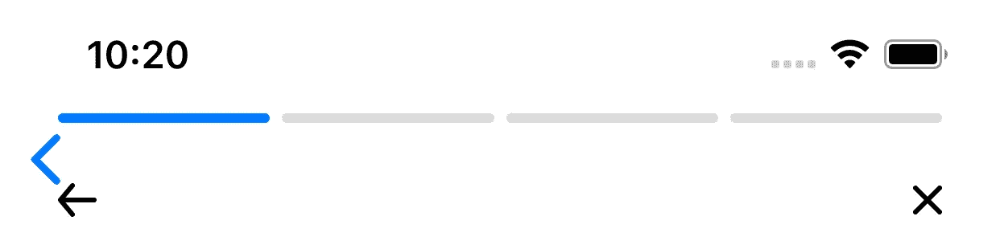
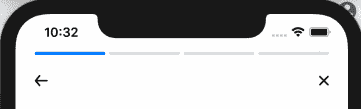
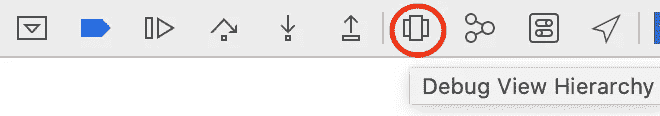
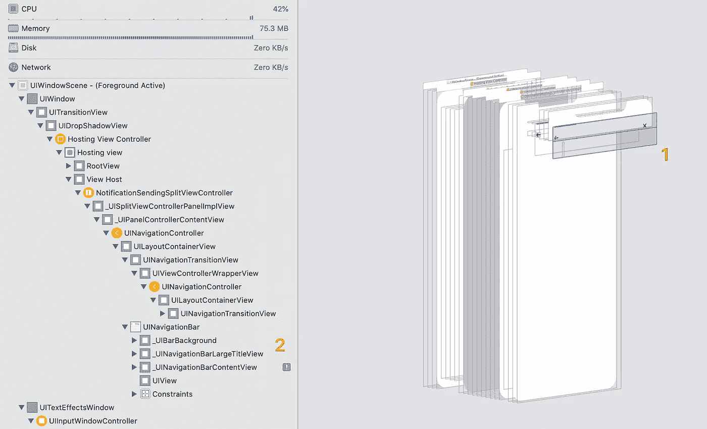

# SwiftUI 中的导航栏没有像预期的那样隐藏

> 原文：<https://betterprogramming.pub/swiftui-navigationbar-is-not-really-hidden-as-you-expect-785ff0425c86>

## 你的按钮不能敲吗？这里有一个简单的解决方法。



即使你隐藏了它，你的导航栏仍然在幕后覆盖着用户界面元素

TL；DR:如果你不能点击导航栏中的按钮，你可以直接跳到“4。解决问题的方案。

如果你不是那么匆忙，可以边喝咖啡边阅读我的整篇文章。

# 1.要求

天气好的时候，你的任务是在新的 iOS 应用中实现一个自定义导航栏。有了 SwiftUI，您有信心在一个小时内完成，因为它非常简单，只需要两个按钮:

*   **返回按钮**:让用户返回上一个屏幕
*   **关闭按钮**:让用户关闭当前流程，并关闭到流程的第一屏



“非常简单”，你认为

# 2.形势

您可能会想到使用 native `navigationBarItems`来提供一个前导项和一个尾随项，如下所示:

```
**var** body: **some** View {
    VStack {
        EmptyView()
    }
    .navigationBarItems(leading: backButton, trailing: closeButton)
    .background(Color.white)
    .edgesIgnoringSafeArea(.all)
}
```

有了 back 按钮作为前导按钮和 close 按钮，您就有信心运行代码了。哎呀！还有一个意想不到的蓝色后退按钮。



哎呀！还有一个意想不到的后退按钮。

简单！你会想，“我们可以在一秒钟内隐藏原生后退按钮！”停一下，您已经将前导按钮替换为自定义的后退按钮。为什么原生的蓝色返回键还在？

可能是苹果的 bug？或者是故意留下的？你还不知道。总之，您添加了另一行来隐藏后退按钮:

```
**var** body: **some** View {
    VStack {
        EmptyView()
    }
    .navigationBarItems(leading: backButton, trailing: closeButton)
    .navigationBarBackButtonHidden(**true**) // <-- you add this line
    .background(Color.white)
    .edgesIgnoringSafeArea(.all)
}
```

“现在看起来不错，”你说。



现在看起来不错——按照预期的设计，只有两个按钮

你呼出一口气，自信地用 Skype 与你的设计团队成员通话，向他们展示你的进展。

你的队友为你加油，“太棒了，伙计！”但是他接着说，“等等，这里是不是漏了什么？”



你的设计师提供给你的设计

是的，他是对的——你需要在导航项目上有一个进度条。

还是简单。你会想，“我们可以创建一个`ZStack`，把进度条放在导航栏的顶部。”但是元素之间的空间和设计中的不一样——这就是问题所在。

你试着和设计师打交道。如果忽略这些元素之间的间距会发生什么？如果你很幸运或者你是一个伟大的谈判者，你在这里完成了！

不幸的是，你必须实现一个自定义的`NavigationBar`来构建完全符合你的设计团队设计的 UI。不过，*还是 100%简单的*，你想。

这才是真正的问题开始！

# 3.问题是

首先，您构建一个定制的导航栏，并将其放入您的私有扩展中。

```
// MARK: - Custom Views
**extension** YourTaskView {
    **private** **var** customNavigationBar: **some** View {
        HStack {
            backButton
            Spacer()
            closeButton
        }
    }
}
```

接下来，使用上面的`customNavigationBar` 构建身体。

```
**var** body: **some** View {
    VStack {
        progressBar
            .padding(.top, 47)
            .padding(.horizontal, 24) customNavigationBar
            .padding(.top, 17)
            .padding(.horizontal, 24) Spacer()
    }
    .background(Color.white)
    .edgesIgnoringSafeArea(.all)
}
```

看右边，这是预览画布，一切看起来很棒。然而，对于这些涉及`NavigationView`，的流，我们需要真正地运行它，看看它将如何动作。



我们需要隐藏本机导航栏

哎呀！“没错——我们需要隐藏原生导航栏，”你想。

```
**var** body: **some** View {
    VStack {
        progressBar
            .padding(.top, 47)
            .padding(.horizontal, 24) customNavigationBar
            .padding(.top, 17)
            .padding(.horizontal, 24) Spacer()
    }
    .background(Color.white)
    .navigationBarHidden(**true**) // <-- you add this line
    .edgesIgnoringSafeArea(.all)
}
```

你试着再跑一次，但是后退按钮还在。很奇怪，对吧？
你让整个`NavigationBar`被那条新加的线隐藏了。
它什么都不做吗？

好吧，苹果可能会也可能不会在 2020 年 WWDC 奥运会上解决这个问题。我们走着瞧！

现在，我们需要显式隐藏 back 按钮。

```
**var** body: **some** View {
    VStack {
        progressBar
            .padding(.top, 47)
            .padding(.horizontal, 24) customNavigationBar
            .padding(.top, 17)
            .padding(.horizontal, 24) Spacer()
    }
    .background(Color.white)
    .navigationBarHidden(**true**) 
    .navigationBarBackButtonHidden(**true**). // <-- you add this line
    .edgesIgnoringSafeArea(.all)
}
```

现在一切看起来都很完美——除了你试图点击按钮，但它们不起作用(什么？).



按钮坏了。但是你做的每件事都是正确的！

你一切都做对了！我可以向你保证。那么这里的问题是什么呢？

为了解决这个问题，我们需要查看视图的层次结构。为此，从 XCode 打开调试视图层次结构。



旋转捕捉屏幕以查看屏幕上的所有层。你现在能看清一切了。



您可能会注意到截图中的两件事:

*   导航条仍然覆盖着这个区域。这就是为什么您不能点击该区域中的任何按钮或视图。
*   导航栏在试图用一个`!`符号进行布局时遇到问题。会不会是这个原因？

# 4.解决方案

为了帮助导航条自我修正，我们需要通过设置导航条的标题来让它知道标题的内容。不过，它还是被藏起来了。

```
**var** body: **some** View {
    VStack {
        progressBar
            .padding(.top, 47)
            .padding(.horizontal, 24) customNavigationBar
            .padding(.top, 17)
            .padding(.horizontal, 24) Spacer()
    }
    .background(Color.white)
    .navigationBarTitle("")    // <-- you add this line
    .navigationBarHidden(**true**) 
    .navigationBarBackButtonHidden(**true**)
    .edgesIgnoringSafeArea(.all)
}
```

对我来说，这似乎是一个奇怪的错误——希望它能在即将到来的 WWDC 2020 年奥运会上得到解决。

到那时，我们可以使用`ViewModifier`和一个视图`extension`来重构它，使它更简洁。

```
// HideNavigationBarModifier.swift**struct** HideNavigationBarModifier: ViewModifier {
    **func** body(content: Content) -> **some** View {
        content
            .navigationBarBackButtonHidden(**true**)
            .navigationBarHidden(**true**)
            .navigationBarTitle("")
    }
}
```

并且:

```
// View+Extensions.swift**extension** View {
    **func** hideNavigationBar() -> **some** View {
        modifier(HideNavigationBarModifier())
    }
}
```

最后，只要调用`.hideNavigationBar()`，我们就可以在任何地方使用它，就像这样:

```
**var** body: **some** View {
    VStack {
        progressBar
            .padding(.top, 47)
            .padding(.horizontal, 24) customNavigationBar
            .padding(.top, 17)
            .padding(.horizontal, 24) Spacer()
    }
    .background(Color.white)
    .hideNavigationBar()    // <-- you just need this line
    .edgesIgnoringSafeArea(.all)
}
```

# ***很有意思吧？***

您只需要一行代码就可以解决您的问题。但是如果你不知道问题本身，它可能会花费你几个小时。因此，为了解决问题，掌握调试技巧非常重要。一旦我们知道了问题，解决方案就在前面一步。

希望你今天学到了新东西！非常感谢您的阅读。