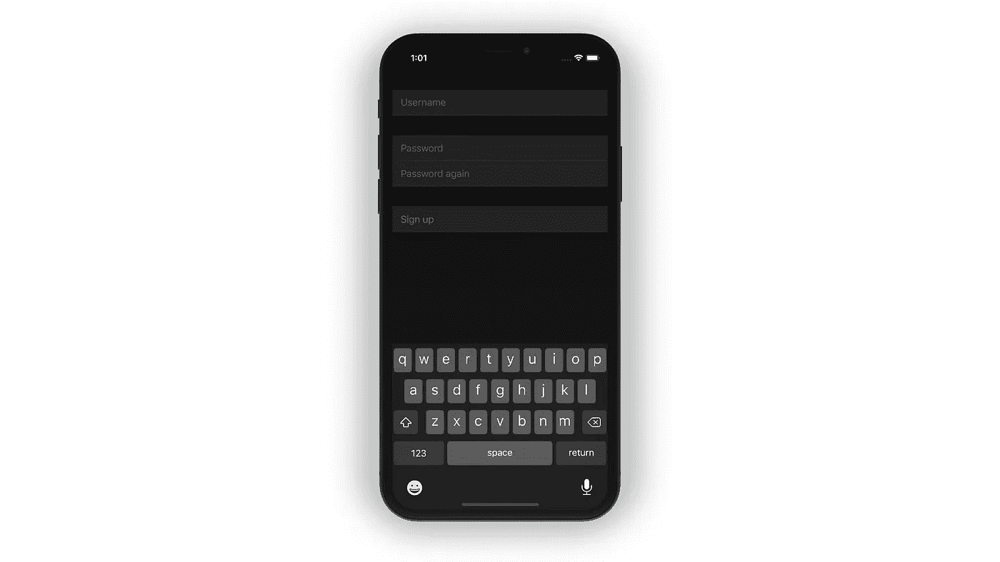
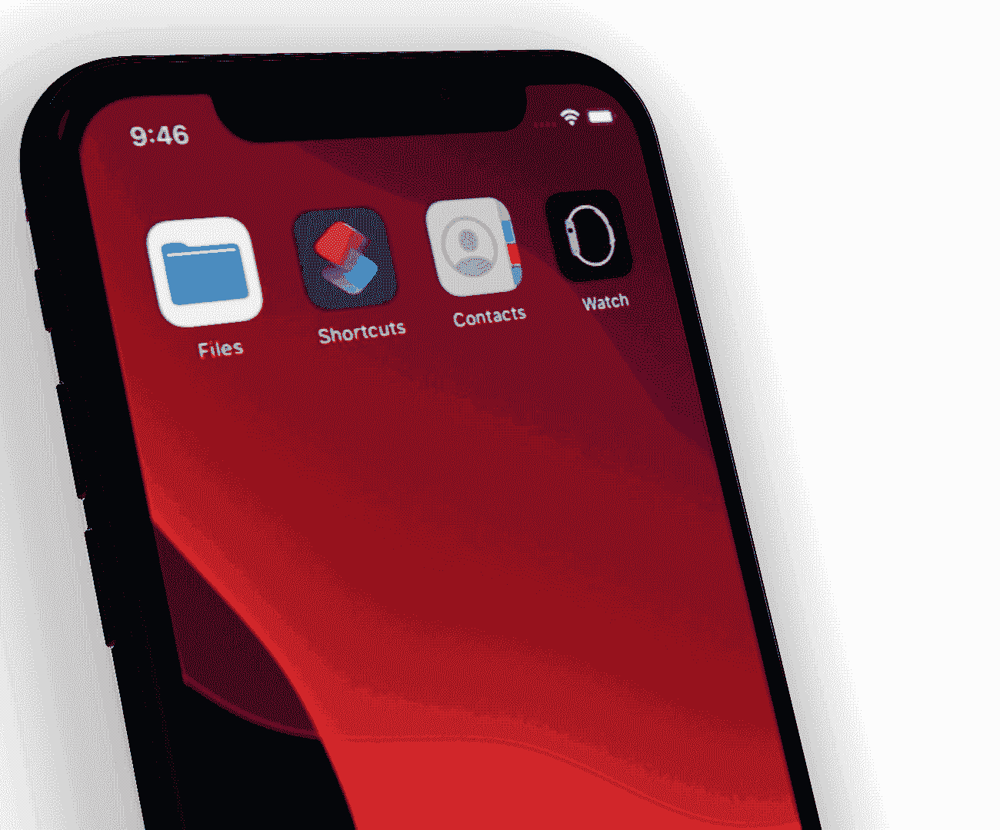

# SwiftUI 和 Combine:一起更好

> 原文：<https://betterprogramming.pub/swiftui-plus-combine-equals-love-791ad444a082>

## 功能反应式编程

## 为什么 SwiftUI 和 Combine 将帮助您构建更好的应用

由[汉娜·布斯](https://unsplash.com/@hannahbusing?utm_source=medium&utm_medium=referral)在 [Unsplash](https://unsplash.com?utm_source=medium&utm_medium=referral) 拍摄的照片

WWDC 2019 上最大的宣布之一是 swift UI——它的声明式方法使构建 ui 变得轻而易举，很容易看出人们为什么对此如此兴奋。然而，隐藏的瑰宝是 Combine 框架，它并没有得到我认为它应该得到的那样多的宣传。

> 苹果公司已经认可了函数式反应式编程，很快它将不再是只有少数开发团队使用的技术。

在本文中，我们将进一步了解如何使用 SwiftUI 并结合在一起，构建更好的应用程序，并在此过程中获得更多乐趣。

准备好了吗？我们走吧！

# 你将会学到什么

*   什么是 Combine 框架，以及如何将其与 SwiftUI 集成
*   什么是发布者、订阅者和操作者，以及如何使用它们
*   如何组织你的代码

为了帮助我们推理 SwiftUI 和 Combine，我们将使用一个简单的注册屏幕，让用户输入用户名和密码在应用程序中创建一个新帐户。在后面的文章中，我们将添加一个登录屏幕来演示使用 Combine 的一些额外好处。

注册屏幕的数据模型非常简单:

*   用户需要输入他们想要的用户名
*   他们还需要选择一个密码

用户名和密码的要求非常简单:

*   用户名必须包含至少 3 个字符
*   密码必须非空且足够强
*   此外，为了确保用户没有意外输入错误，他们需要再次输入他们的密码，并且这两个密码需要匹配

让我们用代码写下来！

我已经决定使用 MVVM 架构——这将产生一个干净的代码库，并使向应用程序添加新功能变得更加容易。首先，让我们定义 *ViewModel* ，它有几个接受用户输入(比如用户名和密码)的属性，并且暂时有一个属性公开我们不久将实现的任何业务逻辑的结果。

对于注册屏幕，我们使用一个带有几个`Section`的`Form`作为各种输入字段，这给了我们一个干净的外观和感觉。它完成了工作，但看起来并不令人兴奋。在下一集，我们将回顾一下 SwiftUI 和 Combine 是如何在不修改底层业务逻辑的情况下改变用户界面的。

注意我们如何使用 SwiftUI 绑定来访问视图模型的属性。*注册*按钮被绑定到视图模型的`isValid`输出属性。由于这个默认为`false`，这个按钮最初是禁用的，这正是我们想要的——毕竟，用户不应该能够创建一个用户名和密码为空的帐户！

这是目前为止用户界面的外观:

# 联合收割机简介

在为我们的注册表单实现验证逻辑之前，让我们花一些时间来理解 Combine 框架是如何工作的。

根据苹果[文档](https://developer.apple.com/documentation/combine):

> *Combine 框架提供了一个声明性的 Swift API，用于随时处理值。这些值可以表示多种异步事件。Combine 声明发布者公开可以随时间变化的值，并声明订阅者从发布者接收这些值。(* [*来源*](https://developer.apple.com/documentation/combine) *)*

让我们仔细看看这里的几个关键概念，以理解这意味着什么以及它如何帮助我们。

## 出版商

发布者将值发送给一个或多个订阅者。它们符合`Publisher`协议，并声明输出类型和它们产生的任何错误:

发布者可以随时发送任意数量的值，也可以因出错而失败。关联类型`Output`定义了发布者可以发送哪种类型的值，而关联类型`Failure`定义了它可能失败的错误类型。发布者可以通过指定`Never`关联类型来声明它永远不会失败。

## 订阅者

另一方面，订阅者订阅一个特定的发布者实例，并接收一个值流，直到订阅被取消。

它们符合`Subscriber`协议。为了订阅发布者，订阅者关联的`Input`和`Failure`类型必须符合发布者关联的`Output`和`Failure`类型。

## 经营者

发布者和订阅者是 SwiftUI 在 UI 和底层模型之间双向同步的支柱。我想你会同意，保持你的 UI 和模型同步从来没有比 SwiftUI 更容易，这都要归功于 Combine 框架的这一部分。

然而，运营商是联合公司的超级力量。它们是对一个`Publisher`进行操作、执行一些计算并产生另一个`Publisher`作为回报的方法。

*   例如，您可以使用`filter`操作符来忽略基于特定条件的值
*   或者，如果您需要执行一个昂贵的任务(比如通过网络获取信息)，您可以使用`debounce`操作符等待，直到用户停止输入
*   `map`操作符允许您将某种类型的输入值转换成不同类型的输出值

# 验证用户名

记住这一点，让我们实现一个简单的验证来确保用户输入的名称至少有三个字符。

我们的视图模型上的所有属性都用`@Published`属性包装器包装。这意味着每个属性都有自己的发布者，我们可以订阅。

为了表明用户名是否有效，我们使用`map`操作符将用户的输入从`String`转换为`Bool`:

然后这个转换的结果被`assign`订阅者使用，顾名思义，它将接收到的值分配给视图模型的`valid`输出属性。

由于我们之前在`ContentView.swift`中配置的绑定，每当这个属性改变时，SwiftUI 将自动更新 UI。我们稍后会看到为什么这种方法有点问题，但是现在，它工作得很好。

你可能想知道`debounce`和`removeDuplicate`操作符有什么奇特的功能？嗯，这些是 Combine 成为将 ui 连接到底层业务逻辑的有用工具的部分原因。在所有的用户界面中，我们必须处理这样一个事实:用户输入的速度可能比我们获取他们所请求的信息的速度还要快。例如，当键入他们的用户名时，没有必要检查用户名对于用户键入的每个字母是否有效或可用。只有当他们停止输入(或停顿片刻)时，才需要执行这项检查。

`debounce`操作符让我们指定希望等待事件交付的暂停，例如当用户停止输入时。

类似地，`removeDuplicates`操作符只在事件不同于任何先前的事件时才会发布事件。举个例子，如果用户先输入`john`，然后输入`joe`，再输入`john`，我们只会收到一次`john`。这有助于我们的 UI 更有效地工作。

这个调用链的结果是一个`Cancellable`，如果需要的话，我们可以用它来取消处理(对于长时间运行的链很有用)。我们将把这个(以及我们稍后将创建的所有其他内容)存储到一个`Set<AnyCancellable>`中，这样我们就可以在`deinit`时进行清理。

# 验证密码

现在让我们换个话题，看看如何执行多阶段验证逻辑。这是必需的，因为我们的表单上的密码字段需要满足多个要求:它们不能为空，它们必须匹配，并且(最重要的)选择的密码必须足够强。除了将输入值转换成一个`Bool`来指示密码是否满足我们的要求，我们还希望通过返回一个适当的警告消息来为用户提供一些指导。

让我们一步一步来，从实现验证用户输入的密码的管道开始。

检查密码是否为空非常简单，您会注意到这种方法非常类似于我们的用户名验证实现。然而，我们没有将转换的结果直接分配给`isValid`输出属性，而是返回了一个`AnyPublisher<Bool, Never>`。这是为了以后在订阅最终结果(有效或无效)之前，我们可以将多个发布者组合成一个多阶段链。

为了验证两个独立的属性是否包含相同的字符串，我们使用了`CombineLatest`操作符。请记住，每当用户输入一个字符时，绑定到相应的`SecureField`的属性就会触发，我们希望比较每个字段的*最新的*值。让我们去做吧。

为了计算密码强度，我们使用了[纳瓦霍语 Swift](https://github.com/jasonnam/Navajo-Swift) ，这是 [@mattt](https://www.twitter.com/mattt) 优秀的[纳瓦霍语](https://github.com/mattt/Navajo)库(2)的 Swift 端口。，并通过链接另一个发布者(`isPasswordStrongEnoughPublisher`)将结果枚举转换为`Bool`。这是我们第一次订阅我们自己的出版商，并且很好地展示了我们如何结合多个出版商来产生所需的输出。

如果你想知道为什么我们需要在每个链的末尾调用`eraseToAnyPublisher()`:这执行了一些类型擦除，确保我们不会以一些疯狂的嵌套返回类型结束。

太好了——我们现在知道了很多关于用户输入的密码，让我们把它归结为我们真正想知道的一件事:*这是一个有效的密码吗*？

您可能已经猜到，我们将需要使用`CombineLatest`操作符，但是这次我们有三个参数，我们将使用`CombineLatest3`，它有三个输入参数。

我们将三个布尔值映射到一个枚举的主要原因是，我们希望能够根据验证的结果产生一个合适的警告消息。告诉用户他们的密码不好并没有多大帮助，是吗？如果我们告诉他们为什么无效会好得多。

# 把所有的放在一起

为了计算验证的最终结果，我们需要将用户名验证的结果与密码验证的结果结合起来。然而，在我们这样做之前，我们需要重构用户名验证，以便它也返回一个我们包含在验证链中的发布者。

这样，我们就可以实现表单验证的最后一个阶段了:

到目前为止，您应该对此相当熟悉了。

# 更新用户界面

如果不将它连接到 UI，这些都不会非常有用。为了驱动*注册*按钮的状态，我们需要更新视图模型上的`isValid`输出属性。

为此，我们只需订阅`isFormValidPublisher`并将它发布的值赋给`isValid`属性:

由于这段代码与 UI 交互，所以它需要在 UI 线程上运行。我们可以通过调用`receive(on: RunLoop.main)`告诉 SwiftUI 在 UI 线程上执行这段代码。

最后，让我们将警告消息输出属性绑定到 UI，以帮助指导用户填写注册表单。

首先，我们订阅各自的发布者来了解什么时候`username` vs. `password`属性无效。同样，我们需要确保这发生在 UI 线程上，所以我们将调用`receive(on:)`并传递主运行循环。

最后，我们需要将输出属性`usernameMessage`和`passwordMessage`绑定到 UI。页脚是显示错误信息的一个方便的地方，我们可以通过将它们涂成红色来突出它们:

这是我们努力工作的成果:

运行中的演示应用

# 结论

用 SwiftUI 构建 UI 轻而易举。苹果在细节上煞费苦心，为我们提供了比以往任何时候都更加高效的 ui 构建工具。最重要的是，SwiftUI 遵循苹果的[人机界面指南](https://developer.apple.com/design/human-interface-guidelines/)，自动适应黑暗模式，并具有内置的可访问性。所有这些都有助于在更短的时间内构建更好、更具包容性的应用——有什么不喜欢的呢？

使用 Combine 会产生一个更干净、更模块化的代码，它(我们将在下一集看到)更易维护、更易扩展。

当然，像每个新的范例一样，有一个学习曲线，需要一些时间来掌握函数式反应式编程。但我确信这是值得努力的。通过发布 SwiftUI 和 Combine，苹果已经认可了函数式反应式编程，很快它将不再是只有少数开发团队使用的技术。

我们会看到越来越多的学习资源帮助人们入门。此外(在 Xcode 的最新测试版中，这是一个有点棘手的问题)，随着时间的推移，工具会变得更好，帮助开发人员提高工作效率。

现在是开始使用 SwiftUI 和 Combine 的绝佳时机——尝试在您的下一个项目中使用它们，以取得领先！

# 资源

 [## peterfriese/SwiftUI-Combine

### SwiftUI & Combine 入门探索文档“查看演示报告 Bug 请求”功能以获取本地副本…

github.com](https://github.com/peterfriese/SwiftUI-Combine)  [## 介绍联合收割机-WWDC 2019-视频-苹果开发者

### Combine 是一个统一的声明性框架，用于随时间处理值。了解它如何简化异步代码…

developer.apple.com](https://developer.apple.com/videos/play/wwdc2019/722/)  [## 结合实践— WWDC 2019 —视频—苹果开发者

### 扩展您对 Combine 的了解，Combine 是 Apple 新的统一声明式框架，用于处理随时间变化的值。学习…

developer.apple.com](https://developer.apple.com/videos/play/wwdc2019/721/)  [## 旋转-3D 模型，拖放-应用程序设计的动画 3D 模型

### Rotato 是一款适用于 Mac 的应用程序，可以让您在一个…

旋转 xyz](https://rotato.xyz/)