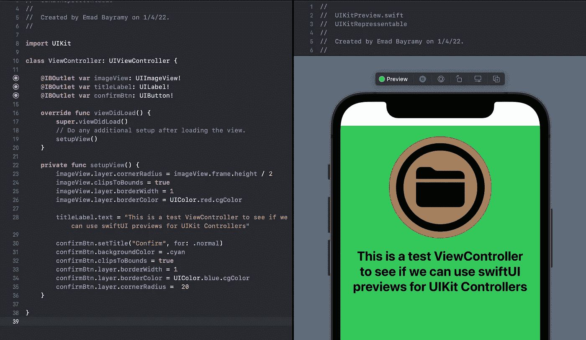
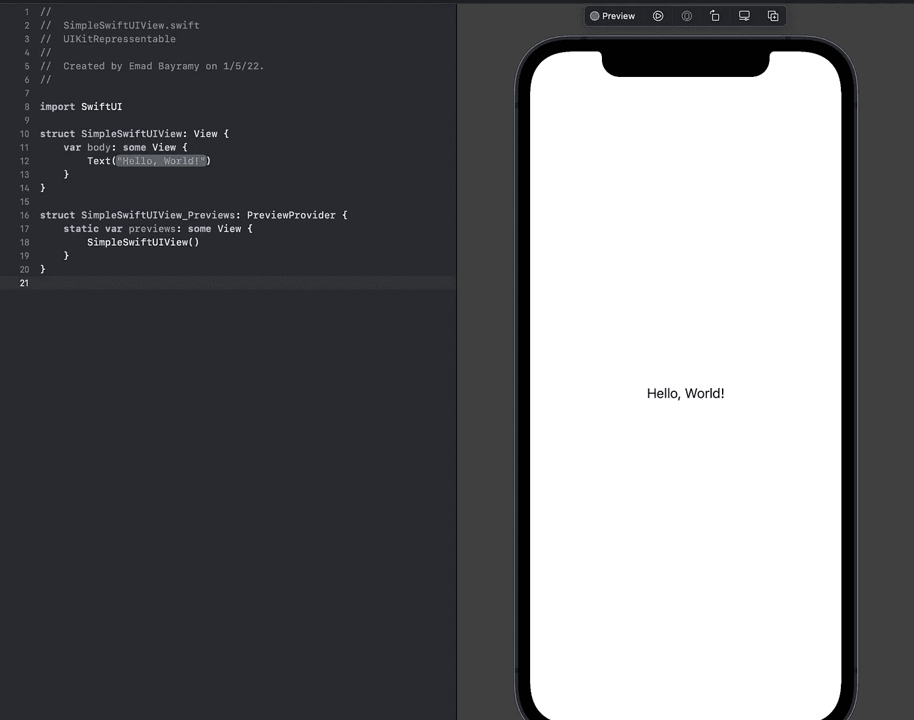
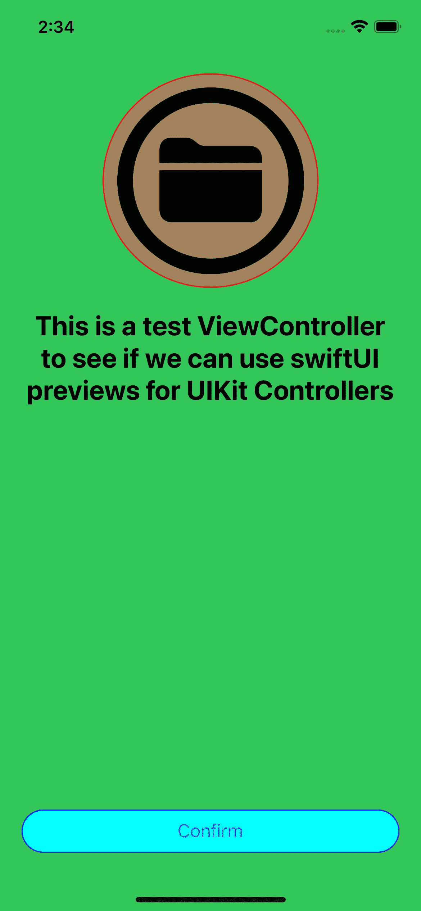
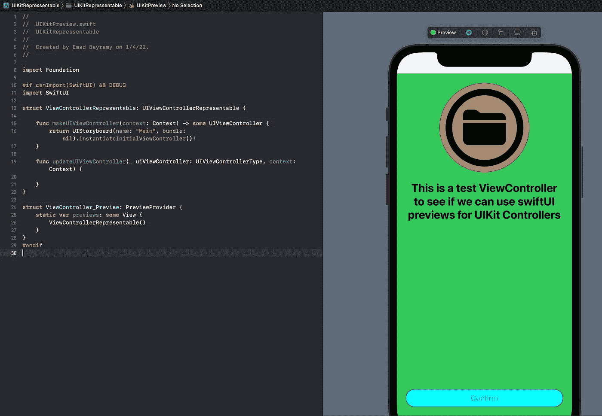

# 为 UIKit 视图构建 SwiftUI PreviewProvider

> 原文：<https://betterprogramming.pub/swiftui-preview-provider-for-uikit-3dd089d77915>

## 查看 UIKit ViewController 即时变化的简单方法——实时和按需



所有图片由作者提供

你试过 SwiftUI 吗？你没发现它是如此令人愉快和容易共事吗？

然而，在 UIKit 视图中，如果您在代码库中进行原型设计，每次都必须重新编译和构建项目，才能在模拟器中看到结果。但在 SwiftUI 中，无需重新构建即可按需查看更改，这是如此令人愉快。

如果我们可以为我们的 UIKit 组件做一些类似的事情呢？像预览或热重新加载 UIKit 更改一样，无需耗时的构建和编译过程。

本质上，我们希望使用 SwiftUI 为我们的 UIKit 视图创建一个实时预览系统。

有很多方法可以让这个过程变得更简单，比如简单的注释，比如`@IBDesignable` **、** `@IBInspectable` 等等。

但是如果你有使用这些方法的经验，有时它会出错，并由于合理的原因导致一些编译错误，有时它不是最好的方法。

所以在这篇文章中，你将学习一种新的更简单的方法来立即看到你的变化。如果你用过 SwiftUI，你应该已经知道了，但是我们给它加了一点小技巧，这样它就可以和 UIKit 一起工作了。

# SwiftUI: PreviewProvider

`[PreviewProvider](https://developer.apple.com/documentation/swiftui/previewprovider)`是一种在 Xcode 中生成视图预览的协议类型。它包含一个名为`Previews`的关联类型，该类型属于`View`类型。`View`是一个 SwiftUI 视图，我们将`return`让`PreviewProvider`显示——我们稍后会看到。

在创建了一个符合这个协议的对象之后，我们将传递我们希望在预览中看到的视图。它会自动弹出一个分割视图，如下图所示。



如果预览没有加载，不用担心:只需使用下面的键盘快捷键来查看重置实时预览:

```
**⌘ + ⌥ + Return (Command + option + Return)**
```

注意:如果您看不到，请确保单击显示在预览内容右上角的 resume 按钮，这意味着它正在工作并向您显示实时内容。

# UIKit: PreviewProvider

现在我们知道了`PreviewProvider`及其在 SwiftUI 中的工作原理，我们如何在 UIKit 中实现它呢？

答案很简单:我们必须将 UIKit 代码库转换成 SwiftUI 能够理解的东西，并使用 SwiftUI `PreviewProvider`来查看内容的现场模拟。猜猜是怎么回事？

## 如何将 UIKit 内容转换成 SwiftUI 内容？

这比你想象的要容易得多。不要把它复杂化。我们需要的只是流行的`UIViewControllerRepresentable`协议。

`UIViewControllerRepresentable`充当桥梁，帮助将 UIViewController 转换为 SwiftUI 视图。你猜到我们打算做什么了吗？

## 履行

现在我们已经了解了 SwiftUI 中的`UIViewControllerRepresentable` 和`PreviewProvider` ，让我们动手实践一下吧。

## UIKit 控制器

让我们创建一个简单的 UIKit 控制器(`UIViewController`)，它包含一些 UI 修改:

如果我们运行这个`ViewController`，您会看到类似这样的内容:



现在让我们创建一个 SwiftUI `Preview`。我们将在 UIKit UI 中进行的任何更改都可以简单地实时显示，我们不必像以前那样进行构建和编译。

## 将此 UIViewController 转换为 SwiftUI 控制器

我们简单地从我们的控制器中创建一个符合`UIViewControllerRepresentable`的对象，使它对 SwiftUI 可读。

在上面的代码中:

*   `canImport(SwiftUI)`用于确保其仅针对支持 SwiftUI 的 iOS 版本进行编译。
*   确保它只在我们的调试环境中运行。

在`MakeUIViewController(context: Context)` 函数中，您应该简单地实例化您想要在预览中看到的控制器。这里我只是实例化了我的`Main`故事板。

## 使用 PreviewProvider 预览我们的 UIViewController

现在我们已经有了`UIViewController`并且已经将它转换成 SwiftUI 控制器，我们只需要为我们的`PreviewProvider`添加几行代码。

在`#endif`前添加以下代码行:

```
struct ViewController_Preview: PreviewProvider {
    static var previews: some View {
         ViewControllerRepresentable()    
    }
}
```

完整的代码应该如下所示:

现在我们已经有了完整的代码库，你可以看到点播的`UIKit UIViewController` 的直播预告。试着稍微修改一下用户界面，注意一下立竿见影的效果。告别耗时的搭建过程。



目前就这些。感谢阅读。您可以查看下面的完整源代码:

[](https://github.com/EmadBeyrami/UIKitPreviews) [## GitHub-EmadBeyrami/uikit previews

### 此时您不能执行该操作。您已使用另一个标签页或窗口登录。您已在另一个选项卡中注销，或者…

github.com](https://github.com/EmadBeyrami/UIKitPreviews)