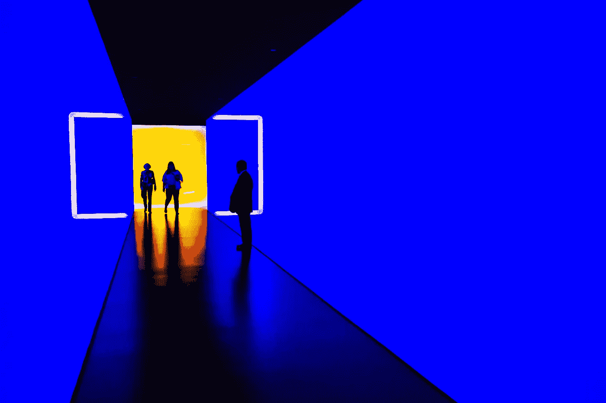
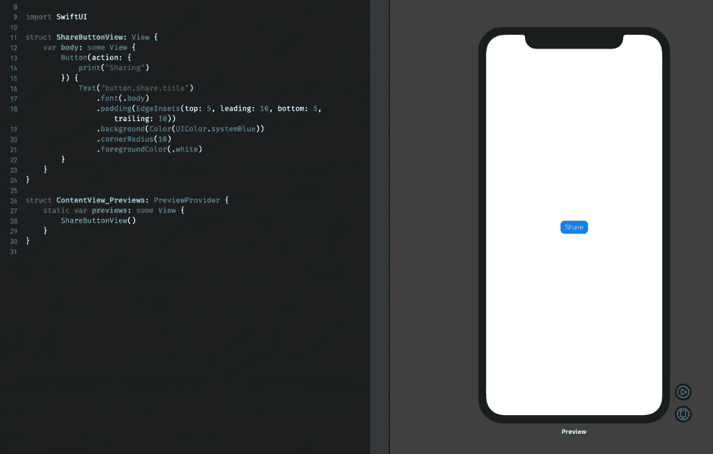
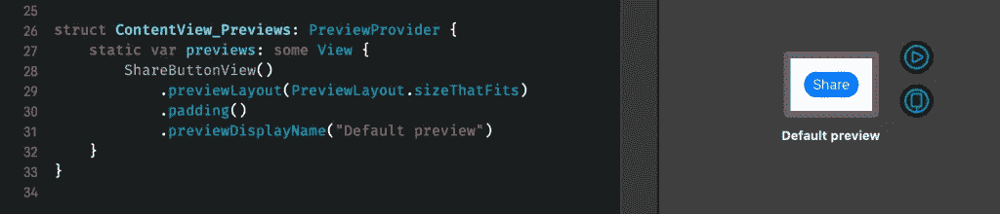
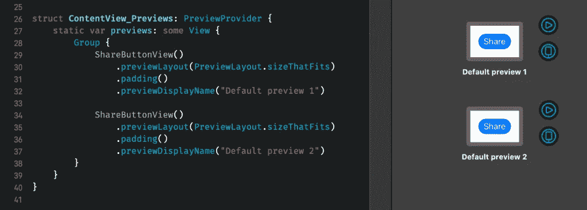
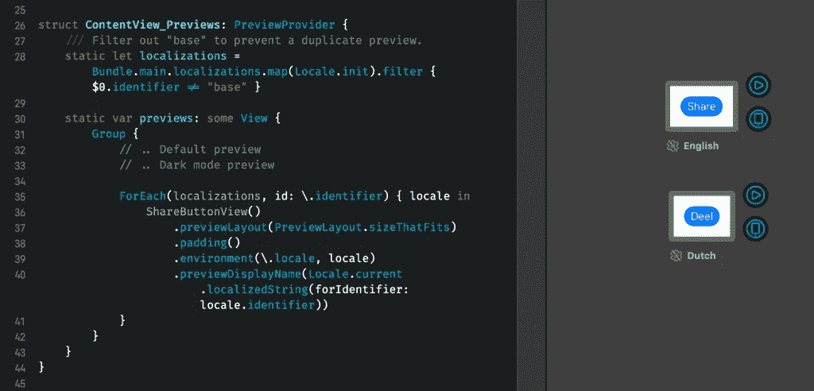

# SwiftUI 预览:如何在不同状态下验证视图

> 原文：<https://betterprogramming.pub/swiftui-previews-how-to-validate-views-in-different-states-9f0d7cfc26ad>

## 充分利用 SwiftUI 预览



沃纳·杜·普莱西斯在 [Unsplash](https://unsplash.com/s/photos/future?utm_source=unsplash&utm_medium=referral&utm_content=creditCopyText) 上的照片

SwiftUI 预览让我们的开发速度大大加快，因为我们现在可以在 Xcode 中实时预览视图。每当我们更改一段代码时，我们的预览就会更新，显示所呈现的更改。

当我们开发一个不同状态有不同外观的视图时，能够同时预览多个状态是很有帮助的。如果你意识到你可以用现有应用程序的 [UIKit 视图做同样的事情，那么知道如何用 Xcode 预览做这件事就更有价值了。](https://www.avanderlee.com/xcode/xcode-previews/)

# Xcode 中 SwiftUI 预览的默认状态

在本例中，我们将检查我们为 Collect by WeTransfer 应用程序定义的共享按钮的状态。这是我在日常工作中开发的应用程序，它有几个不同的状态需要考虑:

*   在黑暗模式下，颜色需要稍微更新。
*   “share”文本标签已本地化，需要转换为荷兰语“deel”。
*   由于这是一个行动号召，我们希望确保它能正确地调整动态字体大小。

该按钮的 SwiftUI 代码如下:

这是一个圆形按钮，有一点填充，背景颜色为蓝色。默认预览如下所示:



默认显示的 SwiftUI 预览

正如你所看到的，我们有一个蓝色的按钮，默认情况下标题会翻译成英语。它也显示在 iPhone 显示屏上，这并不真正符合我们的需求，因为它有很多不必要的空白。

是时候改进我们的按钮预览了——让我们开始吧！

# 使用自定义大小的 SwiftUI 预览

我们可以做的第一件事是为 SwiftUI 预览使用自定义大小。对此，我们有几种选择:

*   使用`previewDevice(_:)`选择不同的设备型号进行预览。
*   通过使用`previewLayout(_:)`和`PreviewLayout.fixed(width:height:)`设置自定义框架尺寸。
*   通过使用`previewLayout(_:)`和`PreviewLayout.sizeThatFits`来调整视图尺寸。

在某些情况下，每个选项都是有价值的。在我们的例子中，我们想调整它的大小，用一些填充物来适应。为此，我们将预览代码更改如下:

为了可读性，我们还添加了一个自定义的显示名称，显示在预览的正下方。这已经是一个很大的改进，如下所示:



调整 SwiftUI 预览的大小，使其内容略加填充

# 在 Xcode 中显示多个预览

在我们继续添加 SwiftUI 按钮的多个状态的预览之前，我们需要能够显示多个预览。

为此，我们将预览视图嵌入到组视图中:

这将在现有预览的正下方添加另一个预览:



在 Xcode 中一次显示一组视图

# 在 SwiftUI 预览中显示黑暗模式

现在我们知道了如何一次显示多个预览，是时候给舞台添加一个不同的状态了。我们添加的第一个状态是使用黑暗模式环境的预览，因此我们可以很容易地并排看到两个视图状态。

*如果你是第一次为你的应用程序添加黑暗模式支持，你可能想看看我的博客文章:* [*黑暗模式:在 Swift*](https://www.avanderlee.com/swift/dark-mode-support-ios/) 中为你的应用程序添加支持。

为此，我们需要改变预览的环境。为此，我们将使用环境值，我们可以从[大选项列表](https://developer.apple.com/documentation/swiftui/environmentvalues)中进行选择。在这种情况下，我们将使用`colorScheme`环境值:

请注意，我们还更新了背景色，以使用系统背景色。这是为了确保我们的预览也采用黑暗模式，显示黑色背景色。

这将最终导致以下预览:


在 SwiftUI 预览中预览黑暗模式

# 在 Xcode 预览中预览不同的语言环境

视图通常在不同的地区使用，因此它们需要调整以显示不同大小的副本。因此，能够在不同的地区预览视图是非常好的。

我们可以手动将每个地区添加到我们的列表中，但自动化过程更有效。为此，我们遍历项目的区域设置，并为每个区域添加一个预览。每当我们添加一个新的地区，一个新的预览将自动添加！

请注意，我们过滤掉了基本本地化，因为这将与我们的英语翻译相同。我们遍历每个地区，并通过设置`locale`环境来更新我们的预览。我们还更新了我们的预览显示名称，以显示所使用的语言。在我们的示例中，这将导致英语和荷兰语的预览:



为每个本地化自动创建表示

# 为每个动态文字大小创建预览

我们添加预览的最后一个状态是验证不同的动态类型大小。有相当多的[尺寸支持](https://developer.apple.com/design/human-interface-guidelines/ios/visual-design/typography/#Dynamic_Type_Sizes)，所以你可能不想自动化这个过程。相反，最好选择几个尺寸相差足够大的尺寸，以验证较大的尺寸是否好看。

在我们的示例中，我们将显示类别“超小”、“大”和“超超超大”的预览我们通过迭代这些大小类别的数组、更新`sizeCategory`环境值以及更新预览显示名称来实现这一点:

这为我们的按钮创建了三种不同的状态，并直接向我们展示了我们的按钮标题如何适应不同的文本设置:


在 Xcode 预览中预览不同的动态文字大小

这太棒了！我们现在可以并排看到每个动态类型的大小，并开发我们的按钮，同时确保我们的标题标签相应地调整。

# 为用户界面元素创建通用预览

开发一个应用程序时，你可能会同时创建许多不同的视图。向每个元素添加 SwiftUI 预览的不同状态是浪费时间。

为了解决这一问题，我们可以创建一个通用的解决方案，它接受您的视图，并显示我们想要检查的每个状态的预览。这是它的代码:

这个类包含了我们在这篇博文中采取的所有步骤:

*   显示默认大小的预览。
*   启用黑暗模式的预览。
*   我们项目的每个本地化应用于一个预览。
*   三种不同的动态类型大小应用于我们的元素。

我们的`ShareButtonView`预览代码可以简化为以下代码行:

```
struct ContentView_Previews: PreviewProvider {

    static var previews: some View {
        UIElementPreview(ShareButtonView())
    }
}
```

这比从一个视图到另一个视图复制我们所有的预览设置要少得多！

# 结论

SwiftUI 预览帮助我们更快地开发定制视图。我们可以设置我们的环境来并排显示每个状态，并快速捕捉 UI 问题。本地化、黑暗模式和动态字体大小会影响视图的显示方式，并且会增加创建视图所需的时间。有了正确的预览设置，我们可以加快这个过程，并通过我们的自定义预览视图快速应用每个环境。

如果你想进一步提高你的 SwiftUI 知识，请查看 [SwiftUI 类别页面](https://www.avanderlee.com/category/swiftui/)。如果您有任何其他建议或反馈，请随时[联系我](mailto:contact@avanderlee.com)。

谢谢！