# 50 多个 SwiftUI 开源项目，带指导教程

> 原文：<https://betterprogramming.pub/swiftui-projects-9e1dcba55c0c>

## 关于更好编程的 SwiftUI 项目集合

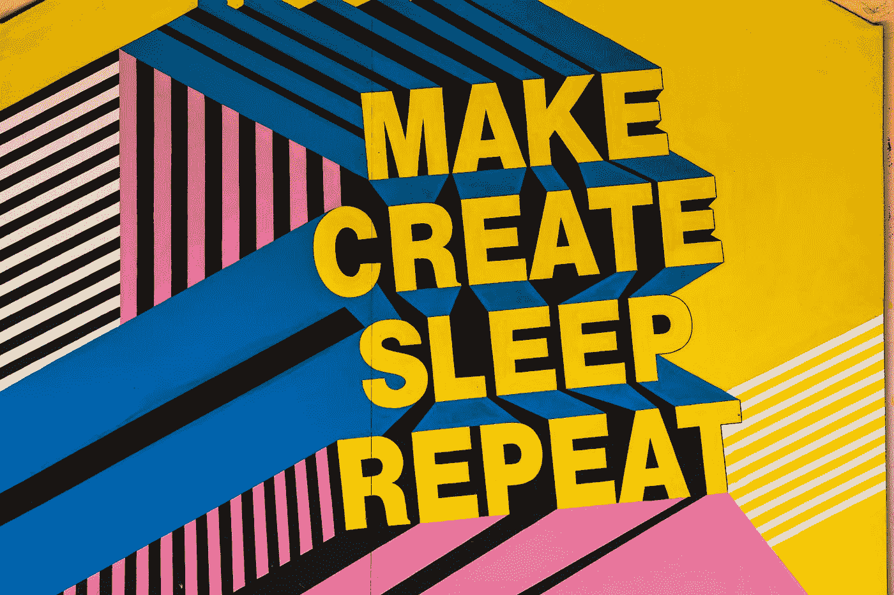

照片由 [Unsplash](https://unsplash.com?utm_source=medium&utm_medium=referral) 上的[尼克·费因斯](https://unsplash.com/@jannerboy62?utm_source=medium&utm_medium=referral)拍摄

SwiftUI 是苹果的声明式 UI 框架，于 2019 年发布，从那时起变得越来越好。

下面，我们汇编了一些最好的 SwiftUI 开源项目和由更好的编程作者创建的指南。我希望它能激励你使用这个神奇的框架来构建更多的东西。

# 1. [3D 条形图](/build-a-3d-bar-chart-in-scenekit-with-swiftui-789a2631ef6f)

我们都喜欢在 SwiftUI 应用中实现图表。让我们松口气的是，苹果现在有了一个图表框架，可以快速填充任何类型的图表。

但是有没有想过如何用 3D 技术建造它？不再赘述，因为 [Mark](https://marklucking.medium.com/) 向我们展示了如何在这个[资源库](https://bitbucket.org/wizard1066/bars/src/master/)中使用 SceneKit 和 SwiftUI 构建它。你也可以去看看，[的配套教程](/build-a-3d-bar-chart-in-scenekit-with-swiftui-789a2631ef6f)吧。

# 2.[饼状图](/build-pie-charts-in-swiftui-822651fbf3f2)

有了新的图表框架，我们能够创建折线图、面积图、规则图和点图，但饼图组件仍然缺失。很高兴，我们不需要重新发明轮子，因为 [Nazar Ilamanov](https://ilamanov.medium.com/) 的 [GitHub 项目](https://github.com/ilamanov/SwiftPieChart)展示了如何构建和定制饼图。

# 3.[贪吃蛇游戏](/how-to-create-the-snake-game-in-swiftui-14a7e8162bf3)

这是一个方便的项目，它使用手势来检测滑动方向，同时还利用了数组的概念。你可以在这里查阅莎拉的[全教程。](/how-to-create-the-snake-game-in-swiftui-14a7e8162bf3)

# 4.[表情符号猎人游戏](/build-a-swiftui-core-ml-emoji-hunt-game-for-ios-eb4465ec4153)

如果真实的图像可以被翻译成表情符号会怎么样？这里有一个[项目](https://github.com/anupamchugh/iowncode/tree/master/SwiftUIVisionEmojiHunt)，它使用核心 ML 和视觉在 SwiftUI 应用中执行图像分类。它在表情符号< >字符串表中查找预测标签。

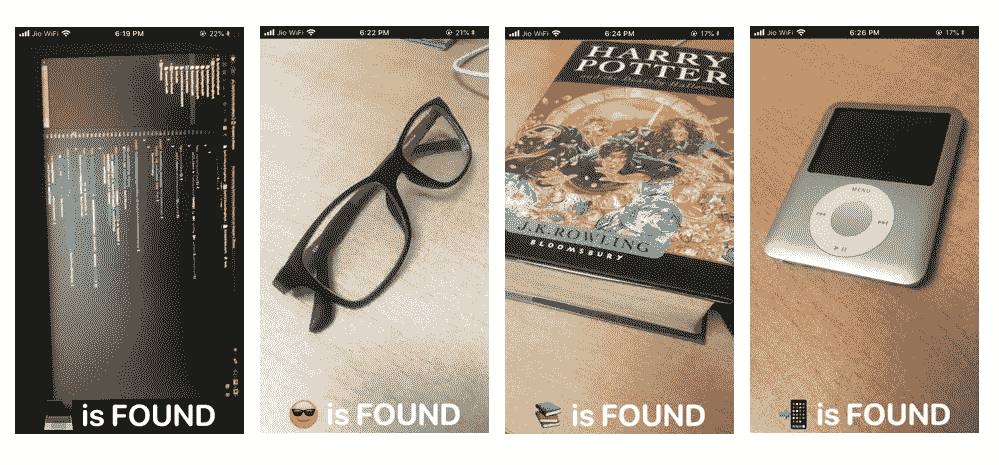

# 5.[多重切换](/implement-a-scalable-and-configurable-multi-toggle-swiftui-screen-ea484ef90691)

探索`Toggle`API 以及所面临问题的解决方法的[实施之旅](/implement-a-scalable-and-configurable-multi-toggle-swiftui-screen-ea484ef90691)，作者 [Riccardo Cipolleschi](https://medium.com/u/4ebe4ef7da18?source=post_page-----9e1dcba55c0c--------------------------------) 。

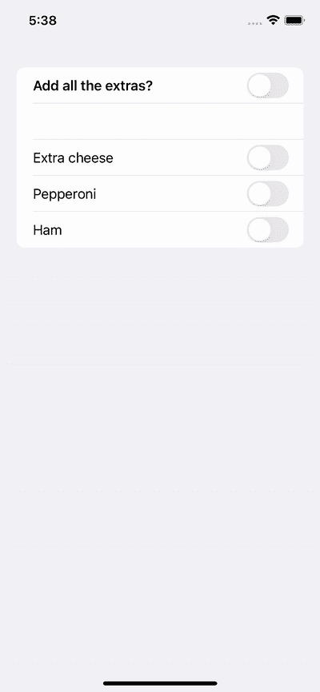

# 6.[你自己的博客应用](/build-your-own-blog-app-with-swiftui-3ee8196ecb84)

Roman Luzgin 的 CMS 原型可以在他的知识库中找到，展示了如何在 SwiftUI 中创建自己的博客应用程序。这是实现它的[完整指南](/build-your-own-blog-app-with-swiftui-3ee8196ecb84)。

# 7.[一款 Reddit 客户端应用](/build-your-own-blog-app-with-swiftui-3ee8196ecb84)

每个 Reddit 帖子一个列表行，另一个屏幕显示整个帖子列表和一个搜索字段，第三个屏幕显示网页内容，这些都是 [Eric](https://medium.com/@eriklasky) 使用 SwiftUI 创建 Reddit 客户端应用程序所需要的。它可以在这个 [GitHub 资源库](https://github.com/etlasky/Reddit-SwiftUI)中找到，还有一个[实践教程](/making-a-simple-reddit-app-with-swiftui-d0a3e76d980a)。

# 8.[一个类似 UIKit 的工具栏](/a-swiftui-toolbar-777523c03b7d)

在 SwiftUI for iOS 14 之前，没有办法像 UIKit 那样创建 SwiftUI 工具栏。因此， [Keith Lander](https://medium.com/@keithlander) 实现了他自己的 Swift 包 ToolbarSUI。代码可从 GitHub 上的[获得。](https://github.com/writing-shed/ToolbarSUI)

[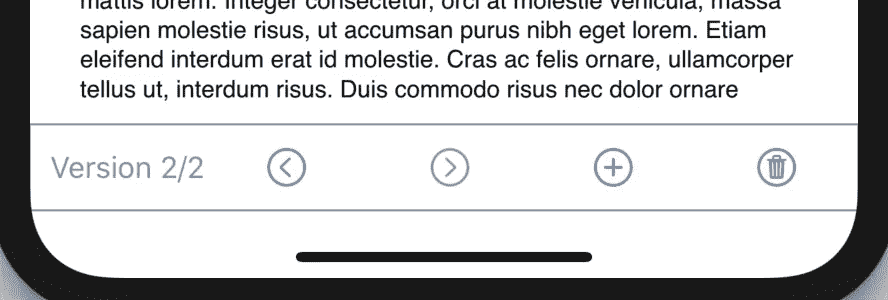](https://betterprogramming.pub/a-swiftui-toolbar-777523c03b7d)

# 9.[自定义弹出气泡](/cgaffinetransforms-arcs-and-quad-curves-in-swiftui-41e1dbfe6161)

通过利用、`CGAffineTransforms`、圆弧和四次曲线， [Aubree Quiroz](https://medium.com/@aubreequiroz?source=post_page-----41e1dbfe6161--------------------------------) 展示了如何创建带有锚点的自定义弹出气泡形状:

# 10.[火绒式可刷卡](/swiftui-create-a-tinder-style-swipeable-card-view-283e257cb102)

通过结合`GeometryReader`、手势和偏移，[Brandon Baars](https://brandonleebaars.medium.com/?source=post_page-----283e257cb102--------------------------------)’[项目](https://github.com/bbaars/SwiftUI-Tinder-SwipeableCards)展示了如何快速构建一个在当今所有约会应用中流行的可刷卡 SwiftUI 原型。这里的[教程](/swiftui-create-a-tinder-style-swipeable-card-view-283e257cb102)带我们完成了完整的实现。

[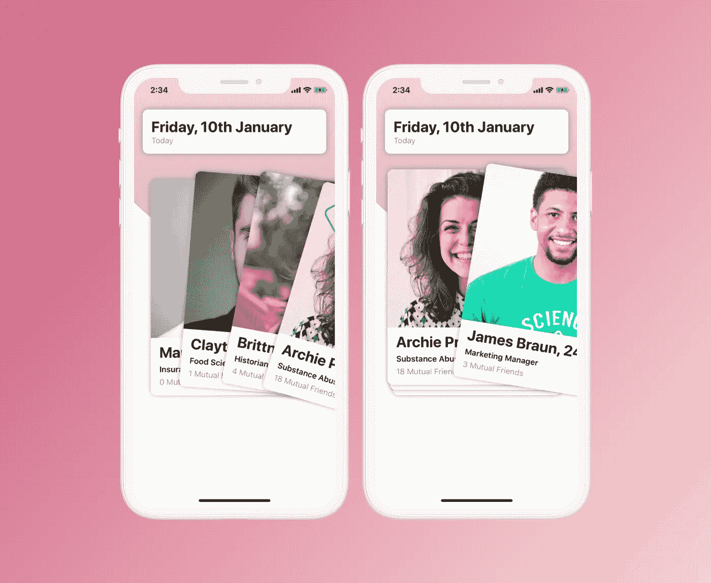](https://betterprogramming.pub/swiftui-create-a-tinder-style-swipeable-card-view-283e257cb102)

# 11.[制作信用卡动画](/how-to-create-fun-animations-in-swiftui-1c08adcb93ce)

在 SwiftUI 中构建动画比在 UIKit 中容易得多。利用开箱即用的金属框架使得 SwiftUI 动画更加强大和直观。

Fernando Moya de Rivas 的[开源项目](https://github.com/fermoya/BankCards)是一个交互式项目，展示了如何通过使用`rotation3DEffect`、`scaleEffect`和`transition`修改器来制作信用卡动画。分步指南可在这里[获得。](/how-to-create-fun-animations-in-swiftui-1c08adcb93ce)

# 12.一个 iPod 应用程序

谁不记得 iPods 的经典选轮器和专辑封面流程！费尔南多的连续[鼓舞人心的项目](https://github.com/fermoya/iPod)。这个展示了如何通过分而治之的策略来复制 iPod 的设计。这里有一个[教程](/build-a-classic-ipod-app-with-swiftui-f1ff3f19b97e)在上面。

[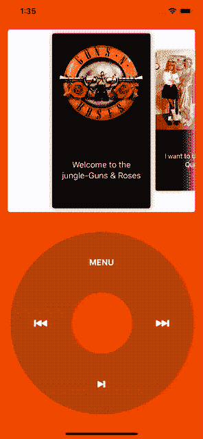](https://betterprogramming.pub/build-a-classic-ipod-app-with-swiftui-f1ff3f19b97e)

# 13.[情感分类应用](/create-a-sentiment-analyser-app-with-createml-and-swiftui-1a24071b6894)

创建机器学习模型，并用较少的样板代码在设备上运行它们，这很吸引人去构建基于人工智能的应用。[弗雷德·格雷](https://fredclampgray.medium.com/?source=user_profile-------------------------------------)展示了[如何实时预测](/create-a-sentiment-analyser-app-with-createml-and-swiftui-1a24071b6894)一个陈述是正面还是负面，并显示表情符号——使用 SwiftUI、CoreML、CreateML 和`NaturalLanguage`框架。

[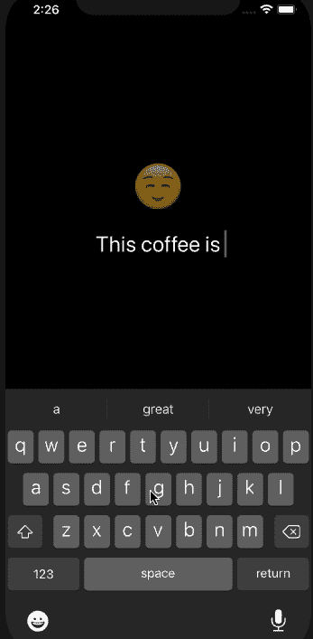](https://betterprogramming.pub/create-a-sentiment-analyser-app-with-createml-and-swiftui-1a24071b6894)

# 14.[动物穿越游戏](/build-a-swiftui-animal-crossing-application-part-1-aaf3528c1df)

受流行游戏的启发， [Thomas Ricouard](https://dimillian.medium.com/?source=post_page-----aaf3528c1df--------------------------------) 的[开源项目](https://github.com/Dimillian/ACHNBrowserUI)是一个全功能 SwiftUI 助手应用。该存储库是[学习 SwiftUI 和 Combine 基础](/build-a-swiftui-animal-crossing-application-part-1-aaf3528c1df)的金矿。

[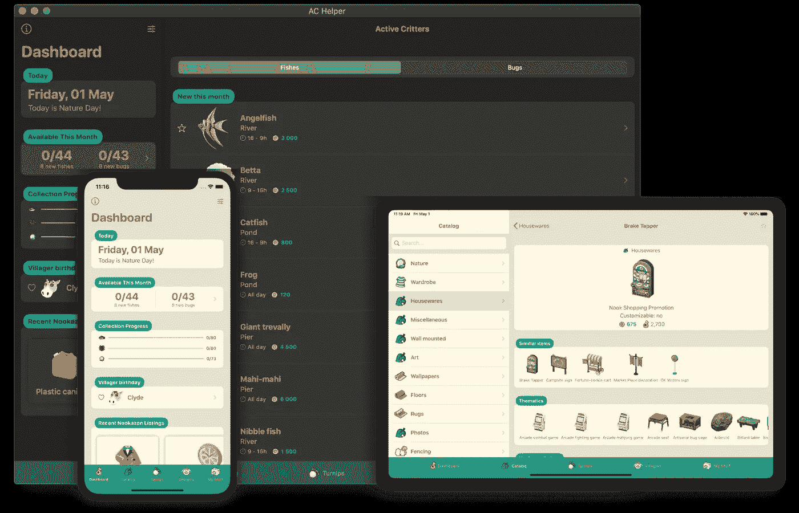](https://betterprogramming.pub/build-a-swiftui-animal-crossing-application-part-1-aaf3528c1df)

# 15.[灵活的拾取器](/flexible-picker-with-swiftui-5817ffe9fddf)

基于一个 Dribbble 设计，[这个项目](https://github.com/jcholuj/FlexiblePickerExample)展示了如何在 SwiftUI 中创建带有可选视图的定制灵活拣选器。[JD rzej Chou j](https://medium.com/@jedrzejcholuj?source=post_page-----5817ffe9fddf--------------------------------)已经在[这个故事](/flexible-picker-with-swiftui-5817ffe9fddf)中描述了整个实施过程。

[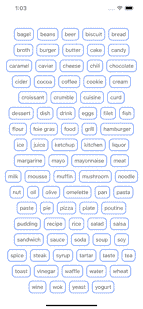](https://betterprogramming.pub/flexible-picker-with-swiftui-5817ffe9fddf)

# 16.[腕表的多重并发症](/multiple-complications-in-watchos-7-3a07b7bd566b)

这个[项目](https://github.com/andrew-codechimp/Multi-Complication-Example)引导我们添加不同的复杂功能，当描述改变时更新它们，并且对点击做出响应。这是安德鲁·杰克逊的[伴随教程](https://medium.com/@codechimp_org?source=user_profile-------------------------------------)。

[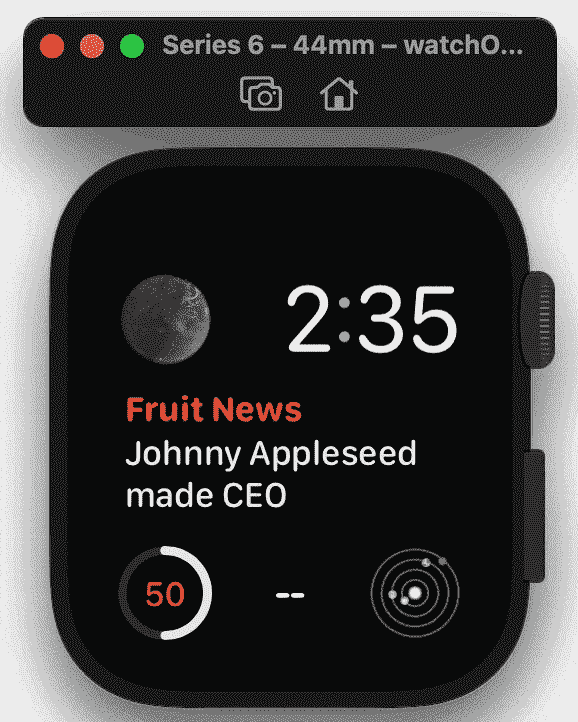](https://betterprogramming.pub/multiple-complications-in-watchos-7-3a07b7bd566b)

# 17.[预览照片](/how-to-preview-photos-in-swiftui-6c3a04d40bda)

Sarah 展示了如何通过 SwiftUI 手势在网格中缩放照片并制作动画。

[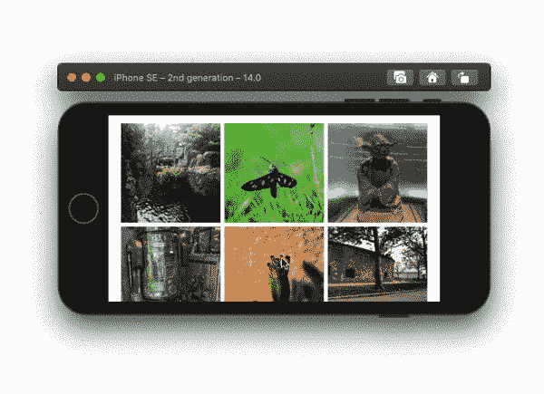](https://betterprogramming.pub/how-to-preview-photos-in-swiftui-6c3a04d40bda)

# 18.[糖果](https://medium.com/better-programming/rain-lightning-animation-using-spritekit-in-swiftui-part-1-%EF%B8%8F-e2cf489e5d25)

按照 Nikhil Vinod 的[教程](https://medium.com/better-programming/rain-lightning-animation-using-spritekit-in-swiftui-part-1-%EF%B8%8F-e2cf489e5d25)添加粒子发射器，利用 SpriteKit 创建雨/闪电动画体验。

# 19.[构建小部件](/build-your-first-widget-in-ios-14-with-widgetkit-9b893423e815)

WidgetKit 是在 iOS 14 中引入的，如今使用 SwiftUI 构建 widgets 要容易得多。像这个[项目](https://github.com/iAkashlal/SwiftUI-Widgets)探索了创建一个[重量进度小工具](/build-your-first-widget-in-ios-14-with-widgetkit-9b893423e815)的过程，由 [Akashlal Bathe](https://medium.com/@iAkashlal?source=post_page-----9b893423e815--------------------------------) 提供一步一步的指导。

[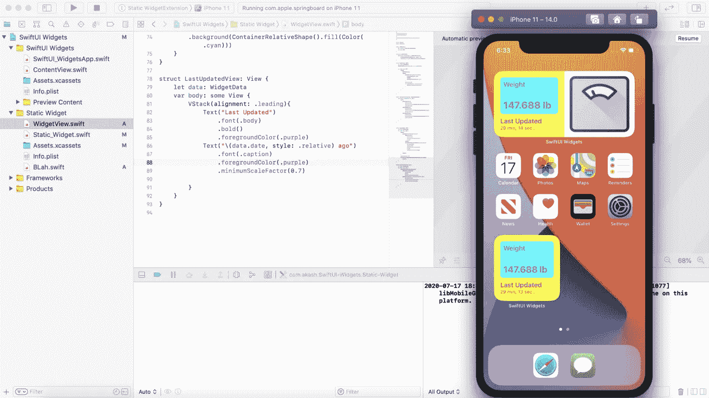](https://betterprogramming.pub/build-your-first-widget-in-ios-14-with-widgetkit-9b893423e815)

# 20.[降价编辑](/build-a-markdown-editor-with-swiftui-in-ios-15-767a2e9348a9)

通过创建您自己的支持 Markdown 的编辑器，在 SwiftUI 中编辑和格式化富文本。[郑君奇](https://medium.com/u/3968fe272788?source=post_page-----9e1dcba55c0c--------------------------------)的[开源项目](https://github.com/aheze/MarkdownTextEditor)展示了如何只用 43 行代码创建一个。这是关于它的教程。

[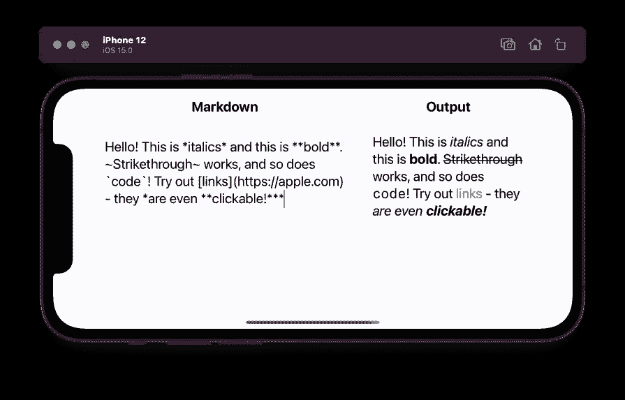](https://betterprogramming.pub/build-a-markdown-editor-with-swiftui-in-ios-15-767a2e9348a9)

# 21.[重现旧的 Mac OS X 黑豹探测器](/recreate-the-old-mac-os-x-panther-finder-using-swiftui-d08a8afb6357)

追忆 macOS 10 的 Aqua 设计？不用担心，Rob 使用 SwiftUI 重新创建了它。

[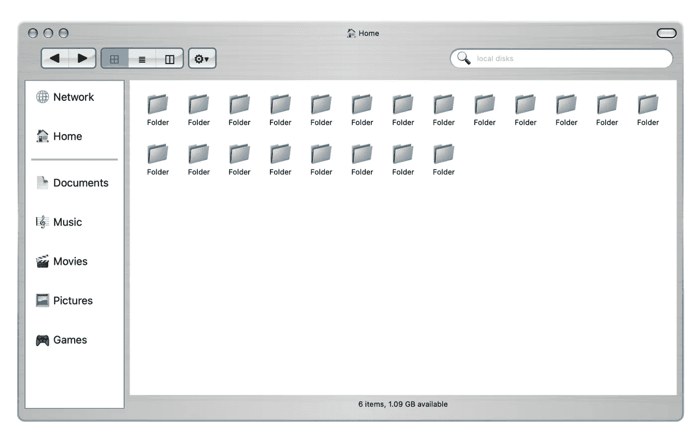](https://betterprogramming.pub/recreate-the-old-mac-os-x-panther-finder-using-swiftui-d08a8afb6357)

# 22.[一个 Glassmorphism 登录屏幕](/build-a-glassmorphism-login-screen-using-swiftui-materials-b909b1527414)

通过使用 SwiftUI 材料，Sarah 探索了创建具有类似玻璃效果的登录屏幕的不同方法——凸面、凹面和平面等等。

[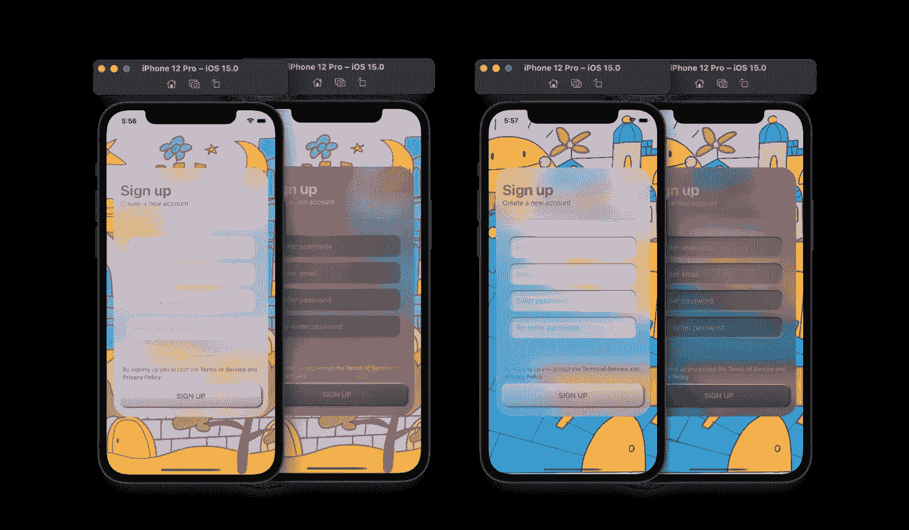](https://betterprogramming.pub/build-a-glassmorphism-login-screen-using-swiftui-materials-b909b1527414)

# 23.[多重选择器](/multi-selector-in-swiftui-52238dc2a690)

SwiftUI 确实提供了许多视图和控件来构建生产应用程序，但仍然缺少一些组件，比如支持列表中的多选功能。

这是 Cihat 的一个[开源项目](https://github.com/Jeehut/MultiSelectorDemo)，用于插入那个[定制组件](/multi-selector-in-swiftui-52238dc2a690)。

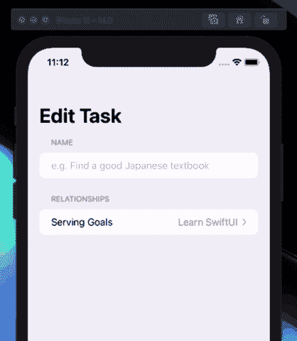

# 24.[笔迹检测](/text-recognition-on-swiftui-canvas-with-vision-in-ios-15-a838318f20d2)

通过使用新的画布视图，构建画图应用程序会变得非常有趣。 [Mark](https://marklucking.medium.com/) 展示了如何通过使用视觉框架[从画布](/text-recognition-on-swiftui-canvas-with-vision-in-ios-15-a838318f20d2)中检测绘制的文本来发挥创造力。

# 25.[一款运行 Python 的 macOS 应用](/from-swift-import-python-f2fc2a997d4)

这里有一个由 Anupam 在 macOS 上构建 SwiftUI 视频播放器的项目。USP？它通过利用 PythonKit 运行 Python 脚本来下载视频，Python kit 是 Python 和 Swift 之间的互操作性支持框架。

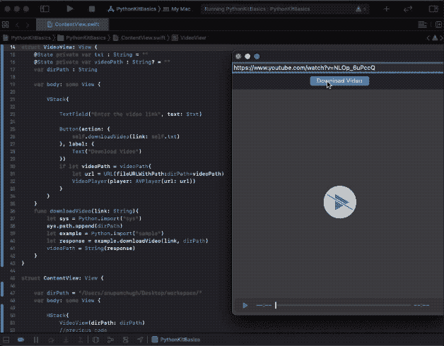

# 26.[让我们 Shazam](/exploring-shazamkit-with-swiftui-in-ios-15-577a7ce1dc51)

使用 ShazamKit 将音乐识别功能快速集成到您的应用中。这里是 [GitHub 库](https://github.com/rudrankriyam/Sample-Projects/tree/main/Musadora)和[教程](/exploring-shazamkit-with-swiftui-in-ios-15-577a7ce1dc51)，由 [Rudrank Riyam](https://rudrankriyam.medium.com/?source=post_page-----577a7ce1dc51--------------------------------) 编写。

[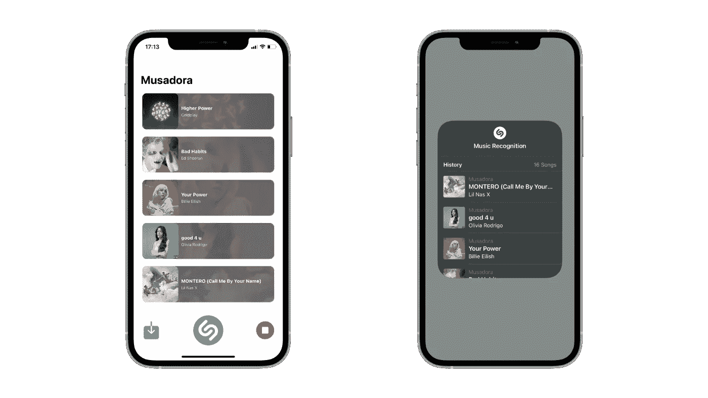](https://betterprogramming.pub/exploring-shazamkit-with-swiftui-in-ios-15-577a7ce1dc51)

# 27.[花式敬酒](/swiftui-create-a-fancy-toast-component-in-10-minutes-e6bae6021984)

Android 中常见的设计组件，但在 iOS 中不太常见。利用堆栈和形状，[法尔汉·阿吉](https://medium.com/@farhanadji?source=post_page-----e6bae6021984--------------------------------)在 SwiftUI 中构建[不同类型的祝酒词。](/swiftui-create-a-fancy-toast-component-in-10-minutes-e6bae6021984)

# 28.[增强现实中的一款计数器应用](/how-to-add-text-to-an-arview-in-an-ios-application-tutorial-f3f746f4dc1f)

通过使用 RealityKit，我们可以在 SwiftUI 应用程序中快速添加视图，如 Andronick Martusheff 在他的[项目](https://github.com/martusheff/ar-counter)和附带的[教程](/how-to-add-text-to-an-arview-in-an-ios-application-tutorial-f3f746f4dc1f)中所示。

# 29.[字云](/how-to-add-text-to-an-arview-in-an-ios-application-tutorial-f3f746f4dc1f)

这个[项目](https://github.com/tomasen/WordCloudDemo)在 SwiftUI 中创建了一个不同形状、大小和位置的自定义单词簇。下面是沈的[教程。](/word-cloud-in-swiftui-eee3d69f7d22)

[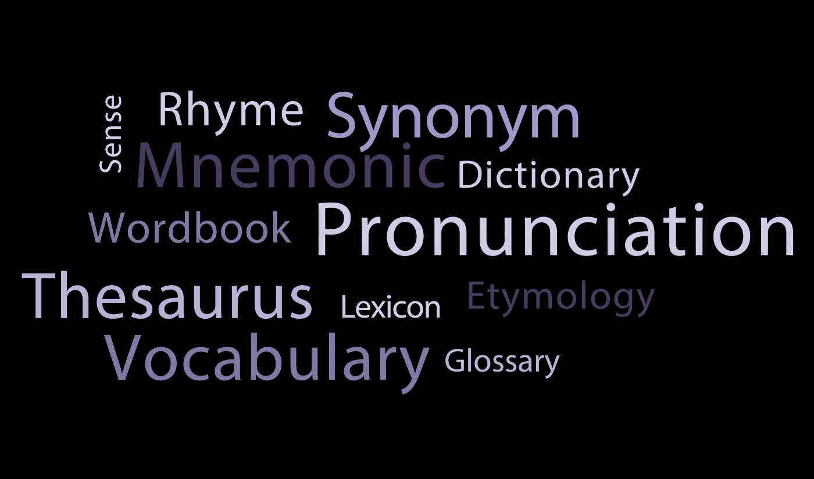](https://betterprogramming.pub/how-to-add-text-to-an-arview-in-an-ios-application-tutorial-f3f746f4dc1f)

# 30.[同步滚动视图](/simultaneously-scrolling-scrollviews-in-swiftui-2e8ef70ee993)

SwiftUI 可以做很多，但是 ScrollView 还是有限的。幸运的是，有一个自省库可以访问底层的 UIKit 视图。 [David Steinacher](https://medium.com/@davidsteinacher?source=post_page-----2e8ef70ee993--------------------------------) 通过他的[项目](https://github.com/stonko1994/SimultaneouslyScrollView)展示了如何使用它来同时滚动视图。

# 31.[分析黑客新闻的情绪](/sentiment-analysis-on-ios-using-swift-natural-language-and-combine-hacker-news-top-stories-d1b8d8f4f798)

通过在黑客新闻 feed 上运行自然语言处理框架和 Combine，我建立了一个演示应用程序来分析每条评论的情绪得分，从而了解每条帖子的总体反应。

下面是 [GitHub](https://github.com/anupamchugh/iowncode/tree/master/SwiftUIHNSentiments) 项目和[伴随教程](/sentiment-analysis-on-ios-using-swift-natural-language-and-combine-hacker-news-top-stories-d1b8d8f4f798)。

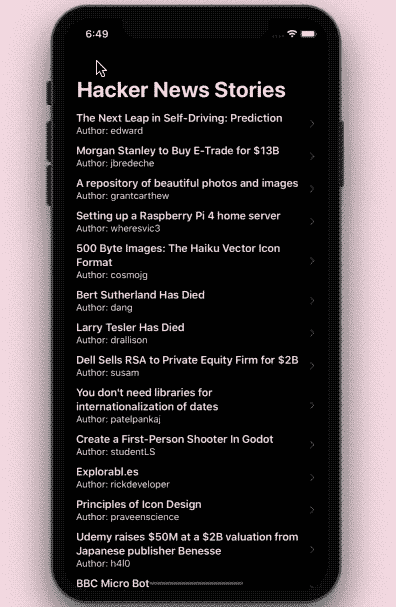

# 32.[电影横幅效果](/text-sfx-with-swiftui-spritekit-c3f9777f0f1c)

通过使用 SpriteKit 和核心图像过滤器，Mark 在 SwiftUI 中创建了一些[令人惊叹的文本效果，这肯定会让任何电影横幅都物有所值。](/text-sfx-with-swiftui-spritekit-c3f9777f0f1c)

# 33.[一款计算深蹲次数的人工智能健身应用](/ios-14-vision-body-pose-detection-count-squat-reps-in-a-workout-c88991f7cad4)

使用视觉身体姿势检测， [Philipp Gehrke](https://medium.com/u/144ed0020011?source=post_page-----9e1dcba55c0c--------------------------------) [构建了一个 SwiftUI 相机应用程序](https://github.com/philippgehrke/SquatCounter/tree/main)来检测重复次数。下面是创建这个移动人工智能应用程序的[完整过程](/ios-14-vision-body-pose-detection-count-squat-reps-in-a-workout-c88991f7cad4)。

# 34.[一款网页抓取 App](/how-to-read-website-in-swiftui-c1bb17a06bf8)

这里有一个[有趣的数据采集项目](https://github.com/egrimo/WebDataScraper)，可以通过使用`SwiftSoup`在 SwiftUI 中轻松解析网站。 [Ege Sucu](https://medium.com/u/a279959eb187?source=post_page-----9e1dcba55c0c--------------------------------) 展示了如何[构建那个应用](/how-to-read-website-in-swiftui-c1bb17a06bf8)。

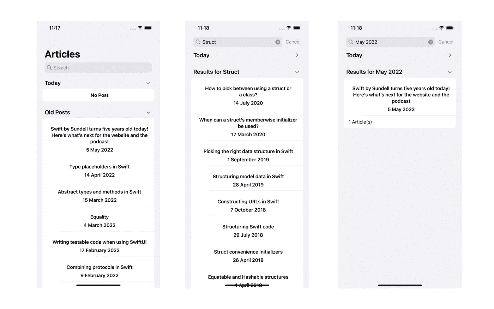

# 35.[一个消息应用原型](/build-a-chat-app-interface-with-swiftui-96609e605422)

如今，每个应用都有一个消息系统。Sarah 向我们展示了如何快速构建下面的界面:

[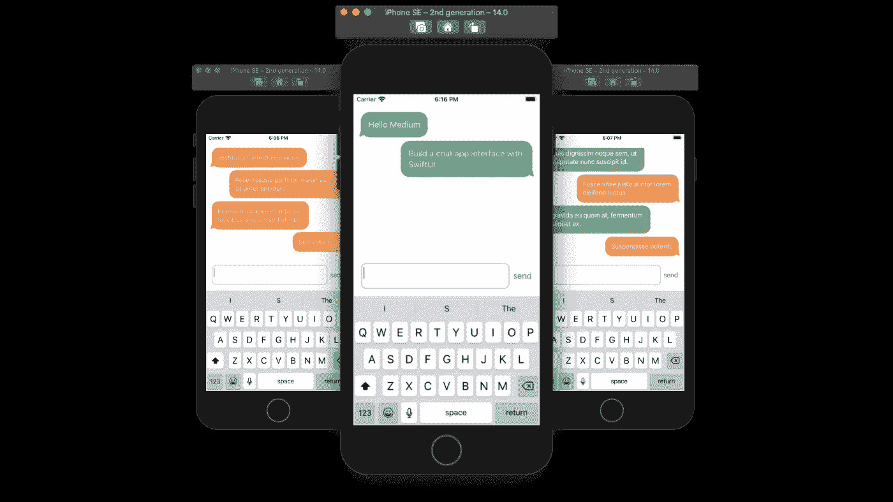](https://betterprogramming.pub/build-a-chat-app-interface-with-swiftui-96609e605422)

# 36.[信用卡异常检测和提取水印](/image-difference-using-computer-vision-in-ios-14-7753b8d61e82)

这个使用核心图像`CIColorAbsoluteDifference`过滤器来确定图像之间的差异。从提取水印到异常检测到使用空白卡提取信用卡数字，计算机视觉在 iOS 上的可能性是无限的。这里是 [GitHub 库](https://github.com/anupamchugh/CoreImageAbsoluteColorDiff)。

[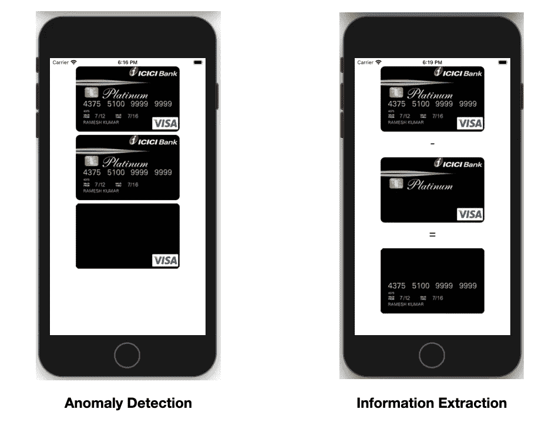](https://betterprogramming.pub/image-difference-using-computer-vision-in-ios-14-7753b8d61e82)

# 37.[一款使用亚马逊 Rekognition 和 Amplify 的物体检测应用](/build-an-object-detection-app-using-amazon-rekognition-amplify-and-swiftui-20b51dd0024b)

手机上的机器学习功能强大。但是您也可以将密集型任务卸载到云服务。[维克多·桑切斯](https://medium.com/u/ae23e965b307?source=post_page-----9e1dcba55c0c--------------------------------) [使用 AWS 服务构建了一个 SwiftUI 对象检测应用](https://github.com/rolisanchez/swiftui-rekognition-amplify-tutorial)，并概述了构建自己的应用的完整过程。

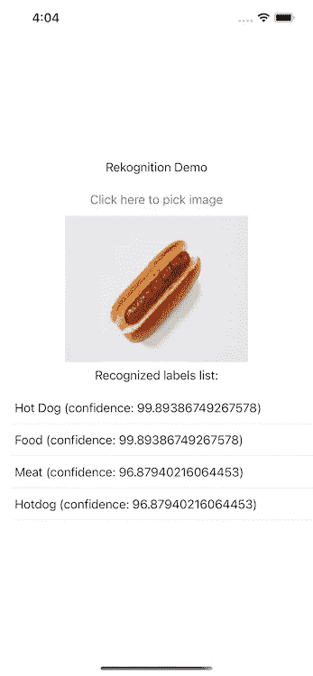

# 38.[直观的页面滚动条](/paged-scroll-in-swiftui-a-step-ahead-c6a5f74f9924)

从垂直页面滚动条到多页分页再到传送带， [Fernando](https://medium.com/@fmdr.ct) 用 GitHub 上的源代码[构建了一个完整的寻呼机应用。](https://github.com/fermoya/SwiftUIPager)

# 39.[三维饼图](/build-a-3d-pie-chart-using-scenekit-and-swiftui-423f24fc765a)

用另一个令人惊奇的 [SceneKit + SwiftUI 应用程序](https://github.com/wizard1066/Pie)标记 Lucking 的背部。你可能会在即将推出的苹果眼镜中体验到这种设计。下面是构建它的实践教程。

# 40.[基于文档的应用](/build-a-text-documents-app-in-swiftui-857411f30fde)

用`DocumentGroup`和`FileDocument`和莎拉创建一个[基于文本文档的 app。](/build-a-text-documents-app-in-swiftui-857411f30fde)

[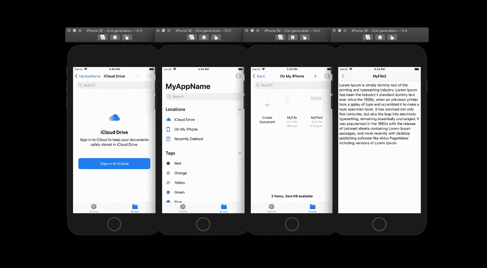](https://betterprogramming.pub/build-a-text-documents-app-in-swiftui-857411f30fde)

# 41.[复制苹果的提醒 App](/confirmation-dialogs-in-swiftui-63758a57da5c)

彼得的 [Make It So 应用](https://github.com/peterfriese/MakeItSo/tree/develop)使用纯 SwiftUI 和 Firebase 复制了苹果的提醒应用。这是建造的[完整演练指南。](/confirmation-dialogs-in-swiftui-63758a57da5c)

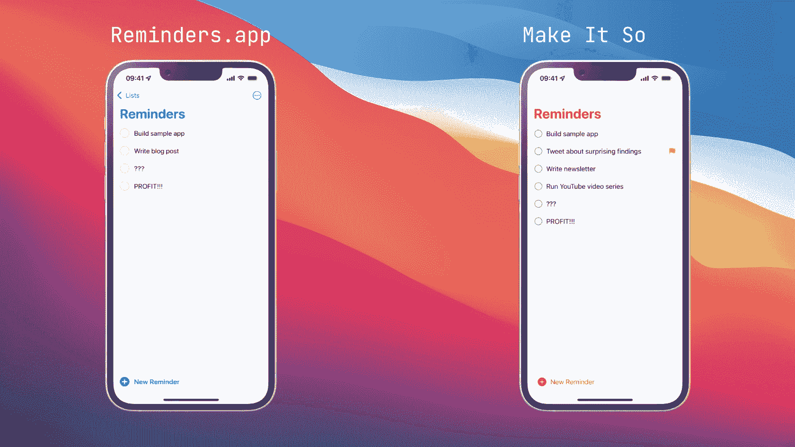

# 42.[iOS 应用的帮助中心](/build-a-help-center-for-your-ios-app-79b4884f77f1)

由[郑君奇](https://aheze.medium.com/)利用 [Markdown 和 GitHub 页面](/build-a-help-center-for-your-ios-app-79b4884f77f1)创建。

[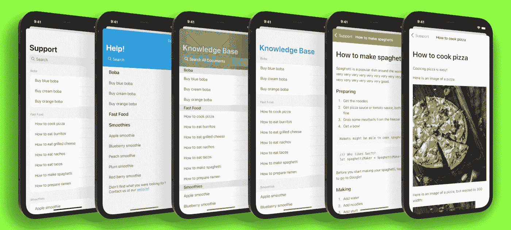](https://betterprogramming.pub/build-a-help-center-for-your-ios-app-79b4884f77f1)

# 43.[一款 21 点教练应用](/making-swiftui-previews-work-for-you-6e54f46afbf)

通过一款 [BlackJack 培训应用](https://github.com/mongodb-developer/BlackJackTrainer) , [Andrew Morgan](https://am-mongodb.medium.com/) 展示了如何充分利用 SwiftUI 预览应用——即使是依赖于 Realm 或 Core Data 等数据库中的数据的视图。当你在做的时候，一定要看看他的另一个令人惊叹的作品，它构建了一个[协作扫雷游戏](https://medium.com/realm/building-a-collaborative-ios-minesweeper-game-with-realm-935fcb68f0c3)(发表在[领域博客](https://medium.com/realm))。

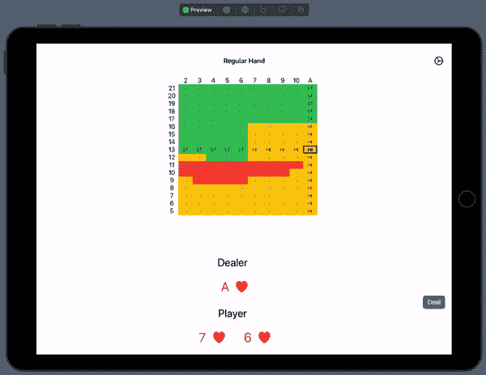

# 44.[一款硬币检测 App](/new-in-ios-14-vision-contour-detection-68fd5849816e)

使用视觉框架的轮廓检测请求，我已经[建立了一个应用程序](https://github.com/anupamchugh/iOS14-Resources/tree/master/iOS14VisionContourDetection)来检测和绘制硬币上的边界。这里的[完整教程](/new-in-ios-14-vision-contour-detection-68fd5849816e)也展示了如何清点硬币。

[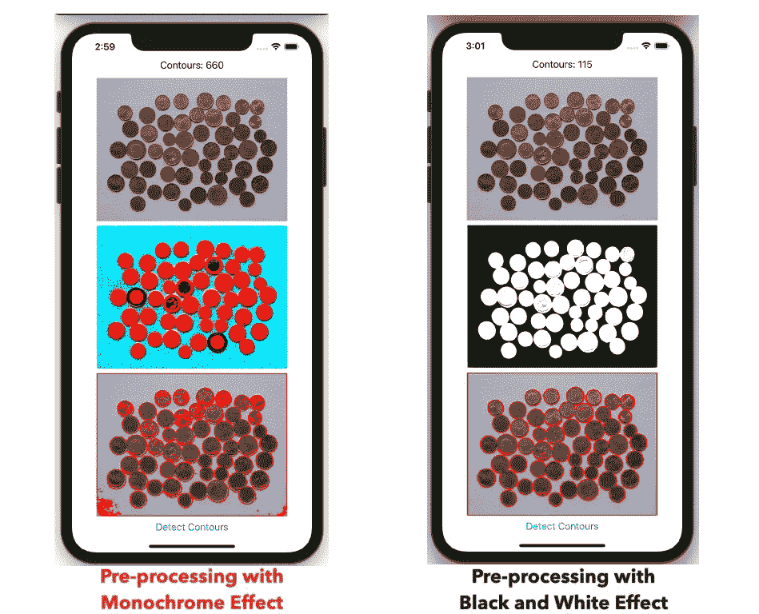](https://betterprogramming.pub/new-in-ios-14-vision-contour-detection-68fd5849816e)

# 45.[心跳动画](https://medium.com/better-programming/how-to-create-an-animated-heartbeat-shape-with-swiftui-a8c543cf31d2)

通过使用`Path`和`Shape`修改器，莎拉向[展示了如何绘制心跳形状](https://medium.com/better-programming/how-to-create-an-animated-heartbeat-shape-with-swiftui-a8c543cf31d2)并制作动画。

# 46.[一个网孔](/build-a-mesh-using-custom-geometry-in-scenekit-under-swiftui-44cadaa3727d)

受一部 70 年代科幻电影的启发，[马克](https://marklucking.medium.com/)在 SwiftUI 下的 SceneKit 中使用自定义几何图形构建了一个景观序列。

[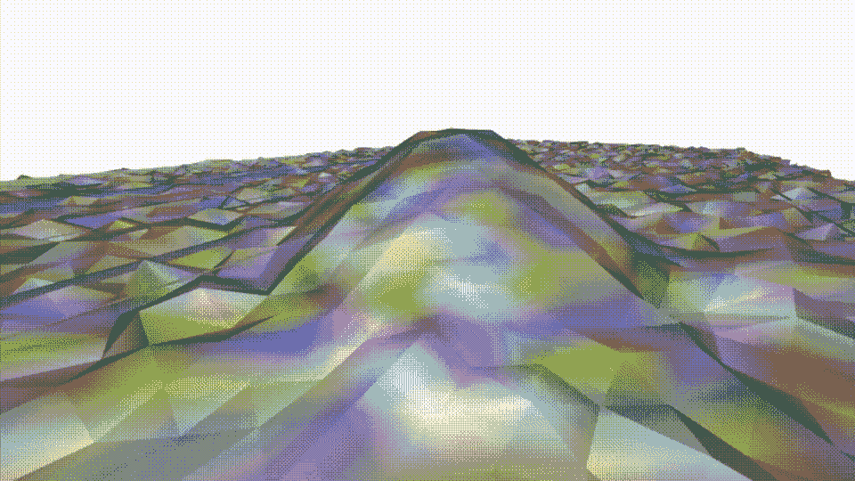](https://betterprogramming.pub/build-a-mesh-using-custom-geometry-in-scenekit-under-swiftui-44cadaa3727d)

# 47.[苹果计算器应用的克隆](/complete-the-apple-calculator-in-swiftui-using-mvvm-99571a5875b4)

通过两部分的系列([第一部分](/build-the-apple-calculator-in-swiftui-2fad61285dc8)和[第二部分](/complete-the-apple-calculator-in-swiftui-using-mvvm-99571a5875b4) ), [Ricardo Montemayor](https://medium.com/u/ba80dc2005ec?source=post_page-----9e1dcba55c0c--------------------------------) 使用 MVVM 架构从头开始创建了一个[类似苹果的计算器应用程序](https://github.com/ricardomongza99/Calculator)。

# 48.[抓浆果](/build-a-snake-game-in-swiftui-using-geometryreader-c6785cfc7b59)

[马克的](https://marklucking.medium.com/)带着另一个经典的游戏概念回来了。这个游戏使用了`GeometryReader`和偏好协议来构建一个稍微不同的贪吃蛇游戏！下面是带源代码的[完整教程](/build-a-snake-game-in-swiftui-using-geometryreader-c6785cfc7b59)。

# 49.[神经形态动画切换](/neumorphic-animated-toggle-in-swiftui-af697ba17f5f)

用[莎拉](https://medium.com/@sarah.h.alsharif)在 SwiftUI 中创建一个可定制的切换视图。

# 50.[后台更换器 App](/coreml-image-segmentation-background-remove-ca11e6f6a083)

使用图像分割模型，我开发了一个 SwiftUI 应用程序来快速更改或移除图像的背景。下面是完整的[代码](https://github.com/anupamchugh/iowncode/tree/master/CoreMLBackgroundChangeSwiftUI)。

# 51.[带存储的任务列表应用](/how-to-make-a-task-list-using-swiftui-and-core-data-a8ab6eaf0f58)

Maegon Wilson 通过构建一个基于 CRUD 的应用程序来探索核心数据和 SwiftUI 的工作原理。

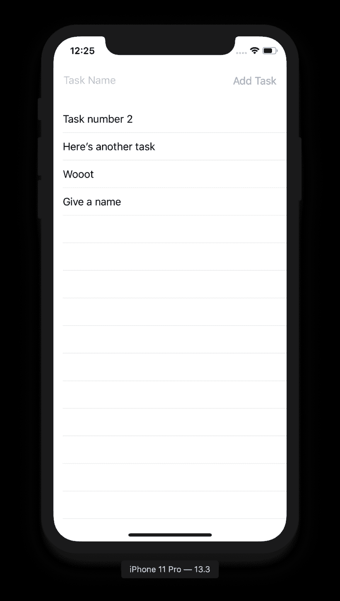

# 52.[类似矩阵的效果](/3-ways-to-create-the-iconic-matrix-opening-credits-scene-in-swiftui-dcdfac072175)

[Mark](https://marklucking.medium.com/) 展示了三种方法来构建一个矩阵开头的信用状屏幕:

*   为 iOS 13 使用 SwiftUI
*   在 iOS 14 中使用 SpriteKit
*   iOS 15 中的 CanvasView

敬请关注，我们将继续更新该系列。