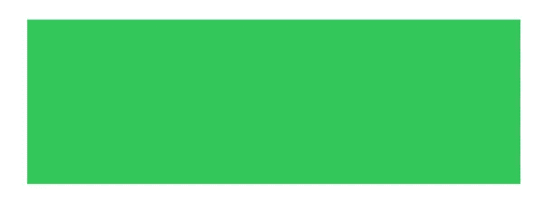
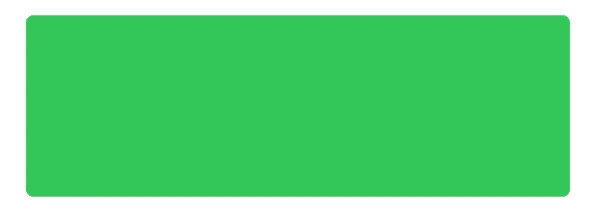
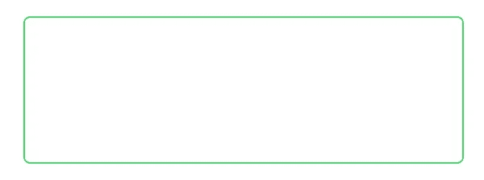
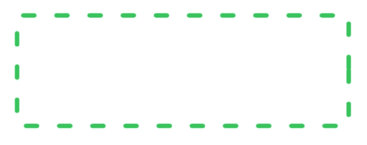

# SwiftUI:矩形

> 原文：<https://betterprogramming.pub/swiftui-rectangle-61e782daa283>

## 和圆形一样，SwiftUI 中的矩形和圆形非常简单

传统上，您将创建一个`UIView`来创建一个`Rectangle`。使用 SwiftUI，只需调用它的方法就可以创建一个矩形。

您应该在这里看到 SwiftUI 为您完成所有次要工作的模式。

在本教程中，您将学习如何在 SwiftUI 中从头构建一个矩形。

# 先决条件

按照本教程，你需要一些基本知识。

*   对 Swift 的基本熟悉。
*   至少 Xcode 11

# 矩形

有两种类型的矩形可供您使用。一个有圆角，一个没有圆角。

```
Rectangle()
    .fill(Color.green)
    .frame(width: 300, height: 100)
```



```
RoundedRectangle(cornerRadius: 4.0)
    .fill(Color.green)
    .frame(width: 300, height: 100)
```



请注意两个矩形之间的差异。要使用带圆角的，你必须使用`RoundedRectangle`。

如果背景颜色不合你的口味，你可以试试`stroke`。

```
.stroke(Color.green)
```



您甚至可以配置笔画的宽度。

```
.stroke(Color.green, lineWidth: 4.0)
```


虚线呢？

```
.stroke(Color.green, style: StrokeStyle(lineWidth: 4.0, lineCap: .round, dash: [10, 20]))
```



让我们在你的项目中尝试一些更实际的东西。以`RoundedRectangle`为背景的按钮怎么样？


除了文本，图片呢？


如果你属于中风类型。


感谢阅读！