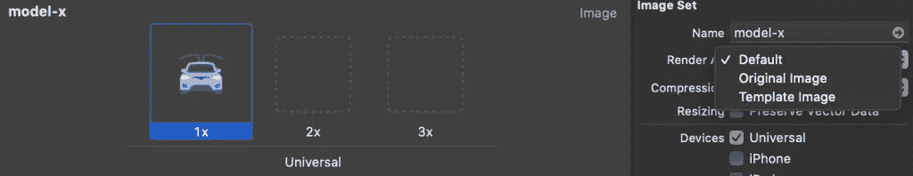

# SwiftUI:渲染模式

> 原文：<https://betterprogramming.pub/swiftui-rendering-mode-5f79454b13a2>

## 原始渲染与模板渲染


由[马克·舒尔特](https://unsplash.com/@marc_schulte?utm_source=unsplash&utm_medium=referral&utm_content=creditCopyText)在 [Unsplash](https://unsplash.com/s/photos/transparent?utm_source=unsplash&utm_medium=referral&utm_content=creditCopyText) 上拍摄

图像资源有两种渲染模式:

*   原创
*   模板

原始模式会如实描绘图像资产，而模板模式会将图像的所有不透明部分转换为您可以设置的一种颜色。默认颜色是黑色。

注:Apple 文档中没有概述。

在本教程中，您将了解 SwiftUI 中的渲染模式以及如何使用它。

# 先决条件

要学习本教程，您需要了解以下方面的一些基本知识:

*   迅速发生的
*   至少 Xcode 11

# 渲染模式

当您将图像资源添加到项目中时，Xcode 可以很好地帮助您选择渲染模式。但是，让我们看看渲染模式中的一些差异，这些差异可能对您的项目有用。

这是你选择渲染模式的一种方式。



图片来源:作者

另一种方法是以编程方式按原样设置它。下面是`original`的效果，这里按原样设置。

```
Image("model-x")
    .renderingMode(.original)
    .resizable()
    .frame(width: 40, height: 40)
```


假设您的设计师希望图像整体为蓝色，而您的设计师没有时间为您做这件事，您可以选择`template`选项。

```
Image("model-x")
    .renderingMode(.template)
    .resizable()
    .frame(width: 40, height: 40)
    .foregroundColor(.blue)
```


现在，你既是 iOS 开发者，又是设计师！

感谢阅读。