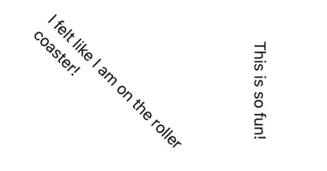
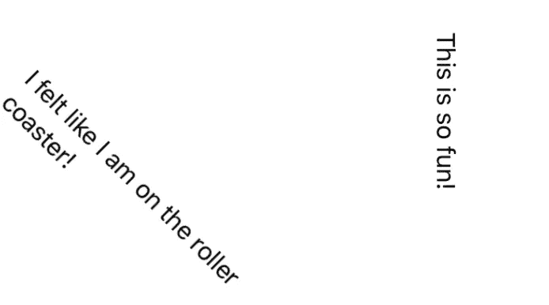
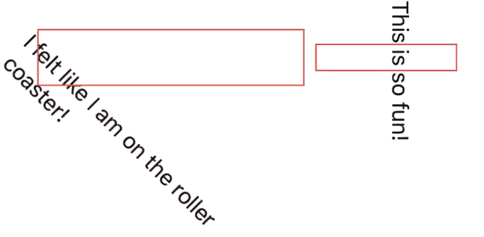
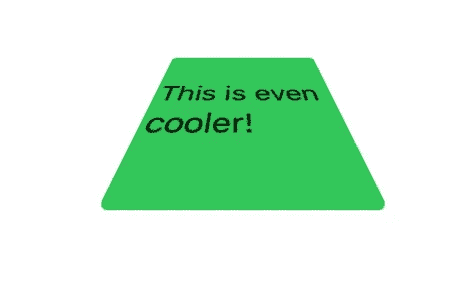
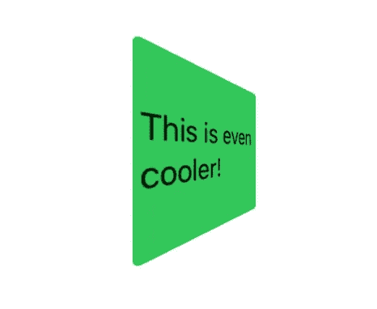
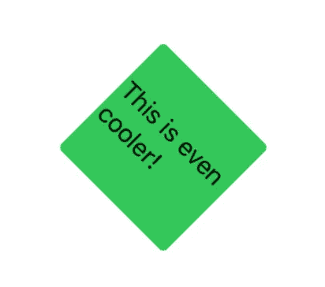

# SwiftUI:“旋转效应”

> 原文：<https://betterprogramming.pub/swiftui-rotation-effect-8f1dc116f126>

## 也许直的形象不太适合你的设计。让我们旋转它。


照片由[卢卡·布拉沃](https://unsplash.com/@lucabravo?utm_source=unsplash&utm_medium=referral&utm_content=creditCopyText)在 [Unsplash](https://unsplash.com/s/photos/rotation?utm_source=unsplash&utm_medium=referral&utm_content=creditCopyText) 拍摄

> "围绕指定点旋转该视图的渲染输出."
> 
> —苹果文档

在本教程中，您将了解 SwiftUI 中的旋转效果。您将了解到:

*   如何使用`rotationEffect`
*   如何使用`rotation3DEffect`

## 先决条件

要学习本教程，您需要了解以下方面的一些基本知识:

*   迅速发生的
*   至少 Xcode 11

# “旋转效应”

让我们试试不同程度的`rotationEffect`。

```
Text("I felt like I am on the roller coaster!")
  .rotationEffect(Angle(degrees: 45))Text("This is so fun!")
  .rotationEffect(Angle(degrees: 90))
```



你甚至可以调整锚点。默认情况下，它位于中心。

```
Text("I felt like I am on the roller coaster!")
  .rotationEffect(Angle(degrees: 45), anchor: .topLeading)Text("This is so fun!")
  .rotationEffect(Angle(degrees: 90), anchor: .bottom)
```



老实说，我看不出区别。让我们添加一个边框颜色，这样你可以有一个更好的看法。



# “旋转 3d 效果”

在 3D 中，您可以使用不同的轴，例如 *x、y、*和*z。*让我们开始吧。

## x 轴

```
RoundedRectangle(cornerRadius: 4.0)
    .fill(Color.green)
    .overlay(Text("This is even cooler!"))
    .rotation3DEffect(Angle(degrees: 45), axis: (x: 1.0, y: 0.0, z: 0.0))
    .frame(width: 100, height: 100)
```



## y 轴

```
.rotation3DEffect(Angle(degrees: 45), axis: (x: 0.0, y: 1.0, z: 0.0))
```



## z 轴

```
.rotation3DEffect(Angle(degrees: 45), axis: (x: 0.0, y: 0.0, z: 1.0))
```



# 从这里去哪里

如果你觉得你已经准备好接受更多的挑战，请随时查看我们创建的其他一些教程:

*   [阴影](https://daddycoding.com/2020/03/18/swiftui-shadow/)
*   [图像](https://daddycoding.com/2020/03/18/swiftui-image/)