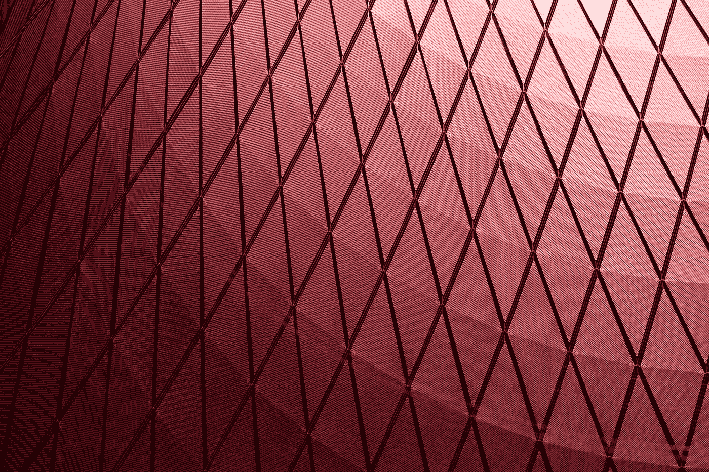
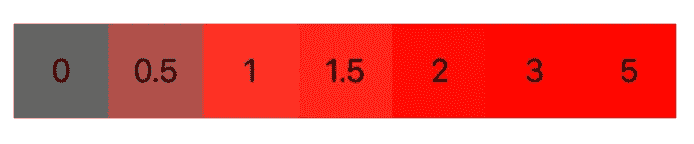
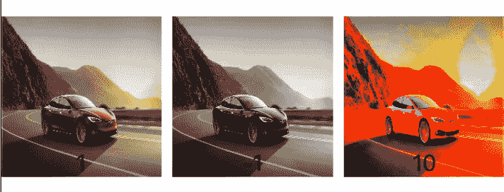

# SwiftUI:饱和度

> 原文：<https://betterprogramming.pub/swiftui-saturation-9ffd336c308c>

## 调整应用程序中颜色的强度



马丁·亚当斯在 [Unsplash](https://unsplash.com/s/photos/gradient?utm_source=unsplash&utm_medium=referral&utm_content=creditCopyText) 上的照片

饱和度控制颜色的强度。默认值始终为 1。随着饱和度值的增加，颜色会变得更加强烈。但是当你减少数字，颜色变得不那么强烈，并向灰色阴影移动。

根据[苹果文档](https://developer.apple.com/documentation/swiftui/tabview/3367692-saturation)，饱和度“调整视图的色彩饱和度”在本教程中，您将了解 SwiftUI 中的饱和度是什么以及如何使用它。

# 先决条件

要学习本教程，您需要了解以下方面的一些基本知识:

*   迅速发生的
*   至少 Xcode 11

# 浸透

这里你会看到基于饱和度从 0 到 5 的强度差异。你可以选择不时调整饱和度。

```
Color.red
  .frame(width: 50, height: 50)
  .saturation(0)
  .overlay(Text("0"))
```



这种效果也可以应用于图像。

```
Image("tesla")
    .resizable()
    .frame(width: 120, height: 120)
    .saturation(1)
    .overlay(Text("1"), alignment: .bottom)
```



图片来源:作者(图片来自[https://www.caranddriver.com/tesla/model-s](https://www.caranddriver.com/tesla/model-s))