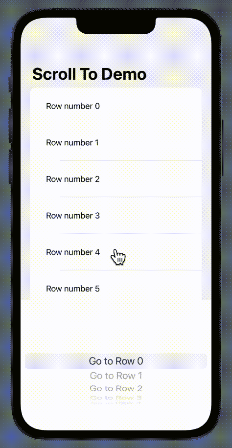

# SwiftUI:如何以编程方式滚动到一行

> 原文：<https://betterprogramming.pub/swiftui-scroll-to-row-in-scrollview-29d2eb5deba5>

## 了解如何以编程方式轻松滚动到 ScrollView 的某一行


来源: [Undraw](https://undraw.co/)

当执行简单的任务时，SwiftUI ScrollView 会变得非常乏味，而使用旧的亲爱的 UIKit 会非常非常令人沮丧。

很遗憾，滚动到想要的行是其中之一。

在 UIKit 中，每个`UIScrollView`都有一个非常方便的方法来以编程方式滚动视图本身:

```
func setContentOffset(CGPoint, animated: Bool)
```

以同样的方式，每一种子类都有类似的方法；例如，在`UITableView`中，您可以使用:

```
func scrollToRow(at: IndexPath, at: UITableView.ScrollPosition, animated: Bool)
```

令人惊讶的是，目前 SwiftUI 中缺少这些简单的功能，因此我们必须编写稍微复杂一点的代码来执行相同的任务。

我们将创建一个演示应用程序，能够重现以下行为:



就像上一篇文章一样，是时候编写上面显示的非常简单的 UI 了。我们将只使用一个`List`和一个`Picker`视图:

当然，这种朴素的 UI 是不行的。当我们使用滚轮选择器选择一个项目时，没有任何反应。

我们希望有某种能够观察和读取`ScrollView`内部发生的事情的组件

随着 iOS 14 的发布，苹果推出了一款名为`ScrollViewProxy`的新`struct`，定义如下:

> 扫描代理包含的所有滚动视图，查找带有标识符为“id”的子视图的第一个视图，然后滚动到该视图。

在 SwiftUI 官方文档的同一部分，我们还可以看到:

> 你不需要直接创建`ScrollViewProxy`的实例。相反，您的`ScrollViewReader`在其`content`视图构建器中接收到一个`ScrollViewProxy`的实例。

所以，正如苹果自己建议的，我们将使用`ScrollViewReader`视图！

这个新组件是一个内部带有代理 scrollView 的`View`。所以我们可以开始用下面的方式修改我们的 UI:

从上面的代码中可以得出一些推论:

*   在第 8 行中使用了`ScrollViewReader`视图。
*   在第 11 行，我们将修饰符`.id(index)`添加到了`Text`视图中。正如 SwiftUI 中经常发生的那样，我们可以用一个 id 唯一地标识一个元素。这正是我们在这里所做的。

现在是时候创建能够以编程方式滚动列表的真正代码了。
在第 22 行，我添加了注释`// More to come...`,我们将把选取器的选择绑定到一个动作。

让我们写几行代码:

`Just`操作符来自 Combine 框架，所以我们需要在文件顶部添加一个导入:`#import Combine`。

好了，搞定了！

现在，当我们选择一个提货行时，上方的`List`会滚动到某一行。

是的。您可能已经注意到，这段代码工作正常，但并不美观。UX 对那种“跳跃”一点也不友好。

让我们给卷轴添加一个简单而愉快的动画:

示例已经完成，是时候在一个地方展示完整的代码了:

在不到 40 行的时间里，我们得到了我们所需要的。

正如你所看到的，一旦你理解了基本的机制，整个过程是非常简单的，你只需要记住添加一个 id 到你想要滚动到的项目。

感谢阅读。同样的指南在我的 YouTube 频道上也有视频: