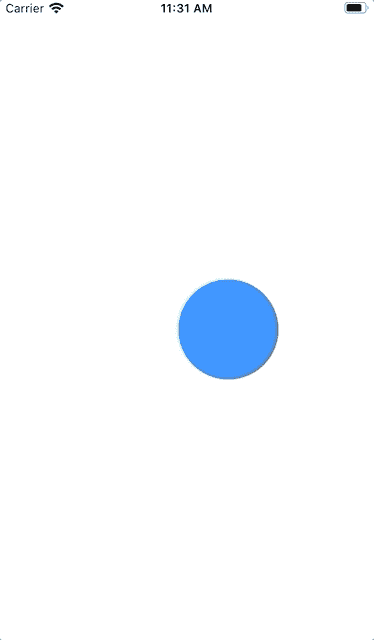

# SwiftUI:序列手势

> 原文：<https://betterprogramming.pub/swiftui-sequence-gestures-a9d8861caa4c>

## 组合手势—但只允许完成一个手势，然后才允许触发下一个手势


Elena Mozhvilo 在 [Unsplash](https://unsplash.com/s/photos/gesture?utm_source=unsplash&utm_medium=referral&utm_content=creditCopyText) 上的照片

在本教程中，您将学习 SwiftUI 中的序列手势以及如何使用它们。

## 先决条件

要跟随本教程，您需要:

*   对 Swift 的基本熟悉
*   至少 Xcode 11

# 序列手势

首先，您需要一些变量来知道您的视图是否被拖动，视图的当前位置，以及它将被移动到的位置。

```
@State var state = CGSize.zero
@State var isDraggable = false
@State var translation = CGSize.zerolet minimumLongPressDuration = 1.0
```

有了这些，你现在可以用一个长按手势和一个拖动手势来设置你的手势。通过长按，您可以启动用户现在可以拖动视图。

接下来是拖动手势。它给出了我们需要的所有值——像 *x* 和 *y* 坐标(等等)。

```
// Long Tap Gesture
let longTap = LongPressGesture(minimumDuration: minimumLongPressDuration).onEnded { value in
    self.isDraggable = true
}// Drag Gesture
let drag = DragGesture().onChanged { value in
    self.translation = value.translation
    self.isDraggable = true
}.onEnded { value in
    self.state.width += value.translation.width
    self.state.height += value.translation.height
    self.translation = .zero
    self.isDraggable = false
}// Sequence Gesture
let sequenceGesture = longTap.sequenced(before: drag)
```

这段代码返回一个圆，然后允许你移动它。

```
return Circle()
    .fill(Color.blue)
    .overlay(isDraggable ? Circle().stroke().stroke(Color.white, lineWidth: 2) : nil)
    .frame(width: 100, height: 100, alignment: .center)
    .offset(x: state.width + translation.width, y: state.height + translation.height)
    .shadow(radius: isDraggable ? 8 : 0)
    .animation(.linear(duration: minimumLongPressDuration))
    .gesture(sequenceGesture)
```

结果是:

