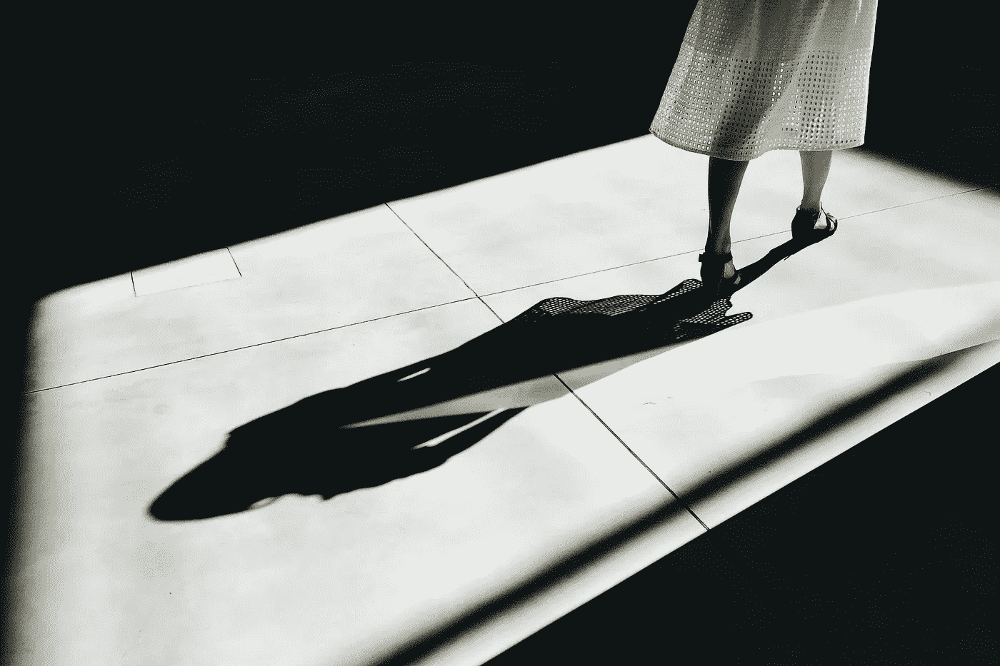
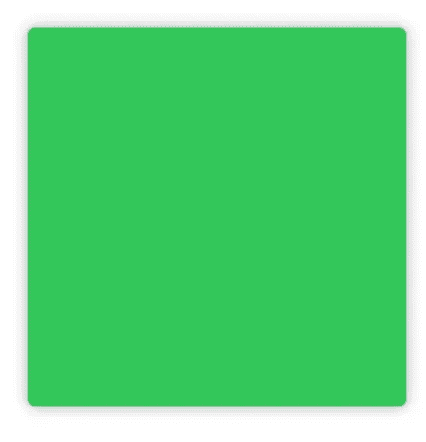
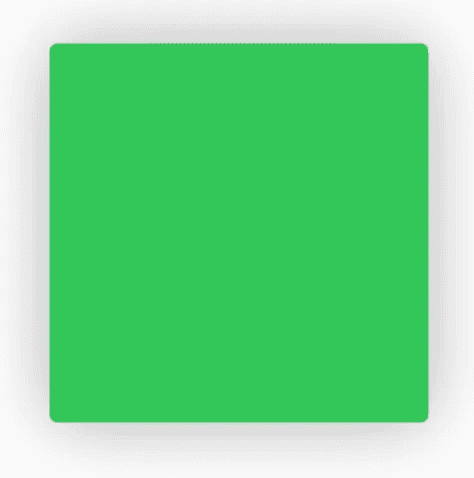
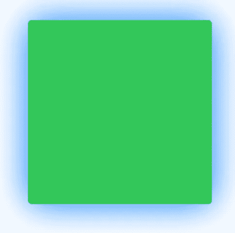
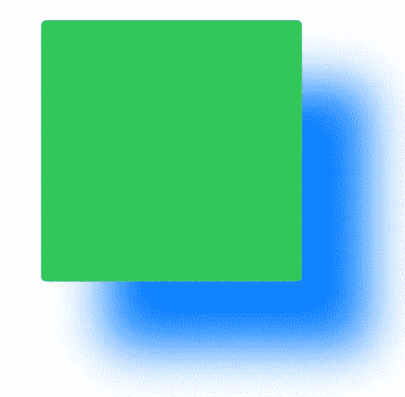

# 暗影

> 原文：<https://betterprogramming.pub/swiftui-shadow-9f9165c5e704>

## SwiftUI 的影子可以让你的设计更上一层楼——一定要包括它



Martino Pietropoli 在 [Unsplash](https://unsplash.com/s/photos/shadow?utm_source=unsplash&utm_medium=referral&utm_content=creditCopyText) 上拍摄的照片

在本教程中，您将了解什么是 SwiftUI Shadow。您将了解到:

*   如何使用阴影

# 先决条件

要学习本教程，您需要:

*   基本熟悉 Swift
*   至少 Xcode 11 的一些基础知识

# 阴影

在 UIKit 中包含一个阴影和一个圆角半径是一个大麻烦，你需要创建两个视图来实现这些效果。

下面是一个包括圆角半径和阴影的例子。

```
Rectangle()
.fill(Color.green)
.cornerRadius(4.0)
.shadow(radius: 4.0)
.frame(width: 200, height: 200)
```



你甚至可以调整阴影的半径。

```
.shadow(radius: 20.0)
```



如果阴影颜色不适合你的设计，那么你可以选择自己的颜色。

```
.shadow(color: Color.blue, radius: 20, x: 0, y: 0)
```



你甚至可以通过摆弄 x 轴和 y 轴来移动阴影。

```
.shadow(color: Color.blue, radius: 20, x: 50, y: 50)
```

