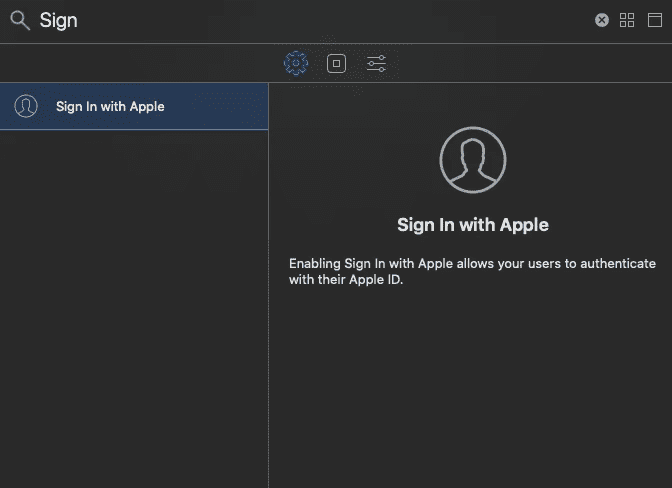
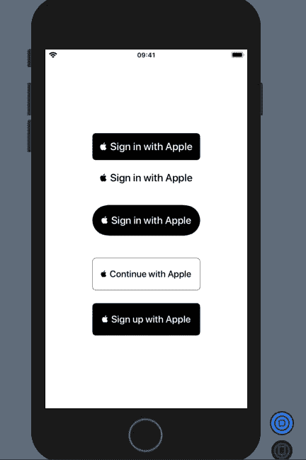
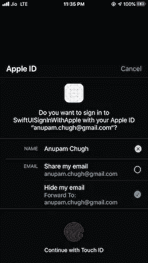
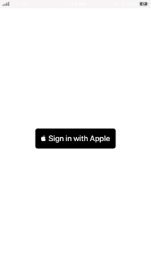

# SwiftUI 登录 Apple

> 原文：<https://betterprogramming.pub/swiftui-sign-in-with-apple-c1e70ccb2a71>

## 用户隐私、易用性和跨平台支持


Pic 演职员表: [Undraw](https://undraw.co/search)

在 WWDC 2019 期间，苹果推出了 Apple Sign in，允许开发者在他们的应用程序中设置快速安全的登录。这对于简化登录体验是有意义的，因为从 App Store 下载的应用程序也需要 Apple ID 认证。

自从 SwiftUI 第一次亮相以来，它已经震撼了 iOS 开发社区。多亏了它的状态驱动框架，它可以让我们写“做什么”而不是“怎么做”。

使用 Apple 登录不仅可以通过不跟踪用户的敏感信息来确保隐私，还可以通过 iCloud keychain 在所有设备之间无缝同步来为用户提供统一性。

是的，它在 Android 和 Windows 设备上提供浏览器支持，也可以通过 Apple JS 登录。此外，它通过结合设备上的机器学习来检测欺诈(知道用户是否真实)，从而提高了安全性。

# 隐藏我的电子邮件地址

登录 apple 时，您可以选择在应用程序中隐藏您的电子邮件。

然后，苹果会创建一个随机但真实且经过验证的电子邮件地址，发送到你真实的电子邮件地址。尽管您可以选择停止接收来自中继地址的电子邮件。这种经过验证的电子邮件地址功能对用户和开发人员来说是双赢的。

# 我们的目标

*   在基于 SwiftUI 的应用程序中集成登录和 Apple
*   设置授权流和存储用户凭证
*   处理授权变更

先决条件:需要一个 Apple 开发人员帐户才能使用 Apple 功能登录。

# 启用使用 Apple 功能登录

首先，您需要从*目标|功能*面板启用使用 Apple 功能登录，如下所示:



这将创建一个授权文件，其中包含使用 Apple 登录，访问级别设置为默认。现在我们准备在 SwiftUI 应用程序中添加按钮。

# 将登录与苹果按钮集成在一起

要用 Apple button 添加签到，需要`import AuthenticationServices`。以下代码向 SwiftUI 视图添加了一个`ASAuthorizationAppleIDButton`:

```
struct ContentView: View {var body: some View {SignInWithAppleView()
            .frame(width: 200, height: 50)
    }
}struct SignInWithAppleView: UIViewRepresentable {func makeUIView(context: Context) -> ASAuthorizationAppleIDButton {
        ASAuthorizationAppleIDButton()
    }

    func updateUIView(_ uiView: ASAuthorizationAppleIDButton, context: Context) {
    }
}
```

SwiftUI 目前不提供苹果`View`的登录，所以我们使用了一个`UIViewRepresentable`子类来包装 UIView 中的按钮。

Apple 允许我们通过以下方式定制按钮颜色、圆角半径和文本，以适应我们的应用程序设计:



```
let button = ASAuthorizationAppleIDButton(authorizationButtonType: .signUp, authorizationButtonStyle: .whiteOutline)button.cornerRadius = 10
```

我们可以设置按钮类型为`continue`、`signUp`、`signIn`，样式为`white`、`black`或`whiteOutline`。

现在我们的按钮已经设置好了，是时候配置它了。

# 操作按钮选择器

我们可以在 SwiftUI 视图或 UIKit 视图中设置按钮上的 tap 功能。我们将采用后者，如下面的代码片段所示:

```
struct SignInWithAppleView: UIViewRepresentable {

    [@Binding](http://twitter.com/Binding) var name : String

    func makeCoordinator() -> Coordinator {
        return Coordinator(self)
    }

    func makeUIView(context: Context) -> ASAuthorizationAppleIDButton {
        let button = ASAuthorizationAppleIDButton(authorizationButtonType: .signIn, authorizationButtonStyle: .black)

        button.addTarget(context.coordinator, action:  #selector(Coordinator.didTapButton), for: .touchUpInside)
        return button
    }

    func updateUIView(_ uiView: ASAuthorizationAppleIDButton, context: Context) {

    }
}
```

我们已经设置了一个绑定属性包装器`name`，它将在授权完成后更新 SwiftUI 时发挥关键作用。现在，只要把这个记下来。

接下来，我们将在我们的`Coordinator`类中的按钮 tap 上设置授权流！

# 显示授权对话框

要显示授权对话框，我们需要使用`ASAuthorizationAppleIDProvider`创建一个`request`,并将其输入到`ASAuthorizationController` ,如下所示:

```
@objc func didTapButton() {let appleIDProvider = ASAuthorizationAppleIDProvider()
let request = appleIDProvider.createRequest()
request.requestedScopes = [.fullName, .email]let authorizationController = ASAuthorizationController(authorizationRequests: [request])authorizationController.presentationContextProvider = self
authorizationController.delegate = self
authorizationController.performRequests()}
```

我们需要在我们的`Coordinator`类中实现以下两个协议:

*   `ASAuthorizationControllerPresentationContextProviding`
*   `ASAuthorizationControllerDelegate`

前者用于在屏幕上显示授权对话框，后者根据用户的动作处理授权结果。



选择隐藏我的电子邮件会将第二封电子邮件添加到邮件列表中，以便将邮件转发到您的主电子邮件。

# 授权后处理用户的凭证

在上面的代码中，一旦用户的授权完成，就会触发`didCompleteWithAuthorization`。它在`credential`参数中返回用户名、标识符和用户的电子邮件地址。

通常，Keychain 用于保存凭证，但是为了本文的简单起见，我们将使用`UserDefaults`。

为了更新 SwiftUI `ContentView`，我们将用用户名设置`Binding`实例`parent.name`。

```
struct ContentView: View {

    [@State](http://twitter.com/State) var name : String = ""
    [@EnvironmentObject](http://twitter.com/EnvironmentObject) var authorizationStatus: UserSettings

    var body: some View { VStack{
            if self.name.isEmpty{
                SignInWithAppleView(name: $name)
                .frame(width: 200, height: 50)
            }
            else{
                Text("Welcome\n\(self.name)")
                    .font(.headline)
            }
        }
    }
}
```

在上面的代码中，基于状态`name`，我们更新了文本并删除了使用 Apple 按钮登录，因为我们的授权已经完成。我想我知道你现在在想什么…为什么要声明一个环境对象？

`EnvironmentObject`是动态视图属性。类似于`ObjectBinding`(外部属性)和`States`(内部属性)，除了环境对象允许将可绑定对象传递给视图，而无需显式传递完整的对象。

# 处理授权变更

在我们的例子中，我们需要`EnvironmentObject`来处理授权变更和检查已经认证的用户。

为此，在您的`ContentView.swift`文件中添加一个`UserSetting`类:

```
class UserSettings: ObservableObject {// 1 = Authorized, -1 = Revoked
@Published var authorization: Int = 0}
```

接下来，我们将在`SceneDelegate`类中检查任何预先存在的用户或授权更改(用户可以从*设置| Apple ID |密码和安全*中撤销登录苹果),并相应地更新环境对象。

上面这段代码中的下面一行更新了我们之前看到的`ContentView`的`EnvironmentObject`:

```
window.rootViewController = UIHostingController(rootView: contentView.environmentObject(settings))
```

然后，我们可以根据`EnvironmentObject`中显示的最新授权状态，选择显示或隐藏 Apple 按钮登录。

这是我们构建的 SwiftUI 应用程序的屏幕截图:



# 下一步是什么

在本文中，我们混合了 SwiftUI 状态驱动框架和使用 Apple 授权流登录。目前，一旦您登录并尝试再次登录，凭据实例将不会再次获取用户名和电子邮件。

在下一部分中，我们将把 Keychain 加入进来，看看它如何帮助检索已经存在的用户的信息。

这一次到此为止。我希望你喜欢读它。