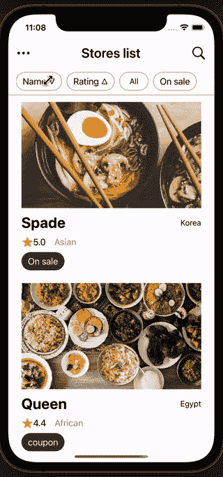
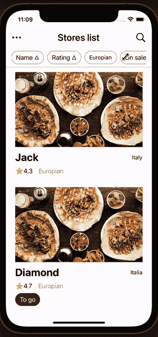
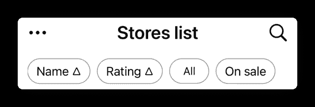

# 在 SwiftUI 中轻松排序、搜索和标记元素

> 原文：<https://betterprogramming.pub/swiftui-sorting-searching-tagging-elements-like-a-delivery-app-b607fba5ba70>

## 在 SwiftUI 中构建类似交付的应用程序

布雷特·乔丹在 [Unsplash](https://unsplash.com?utm_source=medium&utm_medium=referral) 上拍摄的照片

我这次尝试的是开发一些有趣的方法来从数据库中搜索、排序和标记元素。为此，我制作了一个交付应用程序的例子。

*让我们来看一看最终的视图。*

# 关键功能

让我们来看看我们将要使用的一些函数。

1.  `JSONDecoder()`:解码 JSON 数据库时使用
2.  `sort(), filter()`:在处理我们使用的型号列表时使用。

如你所见，一点也不难。那我们开始吧。

# 设置模型

让我们先建立我们的模型，使数据处理简单一点。

为了方便起见，我创建了一些名为`Food`的新数据类型，其中包含了各种美食。最初自定义的数据类型不是`Codable`，而是通过制作`enum`本身`Codable`，我们可以顺利处理这个问题。想了解`Codable`，看[这里](https://developer.apple.com/documentation/swift/codable)。简单地说，它使 JSON 编码/解码变得容易。

如果你想构建一个更复杂的，你可以像我在这篇文章底部附加的原始代码中所做的那样，编写自定义的编码规则。然而，在这种情况下，如果没有编码、解码规则，似乎不会发生任何错误。

# 从数据库加载数据(JSON)

为了方便起见，我们将使用本地文件存储数据。让我们编写一个`ListViewModel`来从文件中加载数据。JSON 文件如下所示:

多亏了`codable`，我们可以非常轻松地解码 JSON。

现在，我们所要做的就是简单地导入`.json`文件(*请注意，您应该在执行此*之前添加目标)，方法是获取文件`Bundle.main.url`的本地 URL 路径，并将其传递给`Data(contentOf: )`以获取数据。到时候剩下的辛苦工作就交给你了。之后，我们最终可以得到从`DBdata.json`解码的`Store`信息列表。

# 连接到视图

正如您在结果预览中看到的，我们将添加一个包含搜索栏和排序选项的应用程序栏。

先说根视图，`ListView`。

> ***ListView***

最引人注目的部分大概就是`filter`部分了。我们可以通过使用`ForEach`中的`.filter()`来获取过滤后的`Store`信息。过滤关键字`inputText`和`isOnSale`将在`AppBarView`中处理。请原谅我的懒惰，我只实现了搜索“出售”标签。如果你想添加更多的标签，使用标签关键词列表是避免硬编码的好方法。

除此之外，我还使用了`LazyVstack`来防止页面波动。而且，这是它的这个观点。现在让我们继续讨论`AppBarView`。

> **AppBarView**

它看起来很长，但是实际上并没有什么困难。我在这里只做了几件事，添加排序函数、选择器和按钮来改变绑定值。

为了方便起见，我写了`SortBy`枚举，你可以在第二段代码中看到(更新`ListViewModel.swift`)。这种方法特别有利于简化复杂条件的处理和提高可读性。我在第一个代码(`AppBarView.swift`)中使用的`picker`类也是制作选择选项视图的更好的建议，该视图从 iOS 14 开始可用。

现在让我们看看最后一个视图，它包含了实际的形状，`StoreView`。

> ***StoreView***

这是一个简单的布局，所以你可能没有什么不能理解的。但是，正如你可能注意到的，在`DBdata.json`中，`imageURL`的形式有点奇怪。为此，我做了一个扩展，从那个奇怪的路径中提取图像。

结束了。你现在可以得到和我开始展示的一样的结果。

# 完整源代码

 [## GitHub - enebin/MyDelivery

### 此时您不能执行该操作。您已使用另一个标签页或窗口登录。您已在另一个选项卡中注销，或者…

github.com](https://github.com/enebin/MyDelivery)