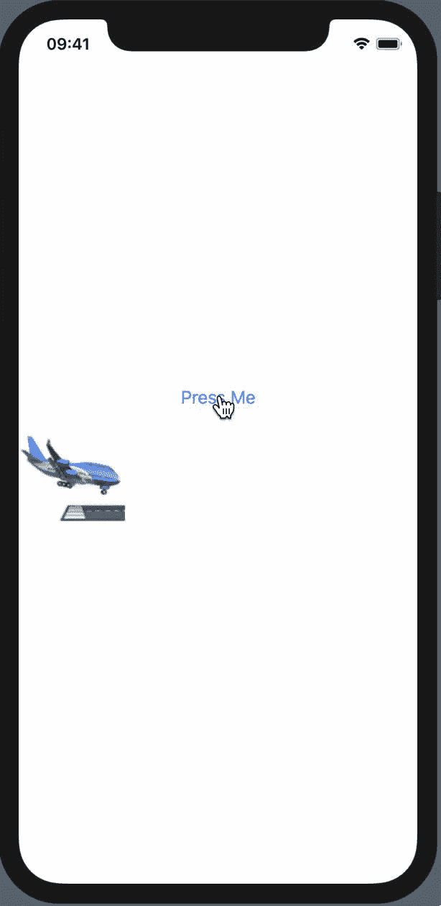
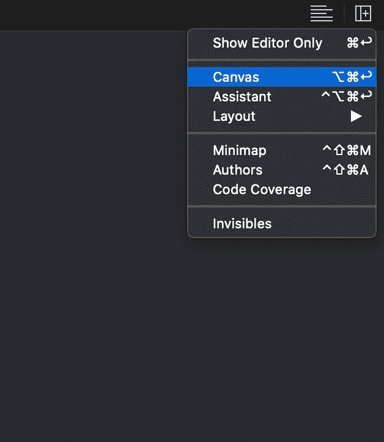
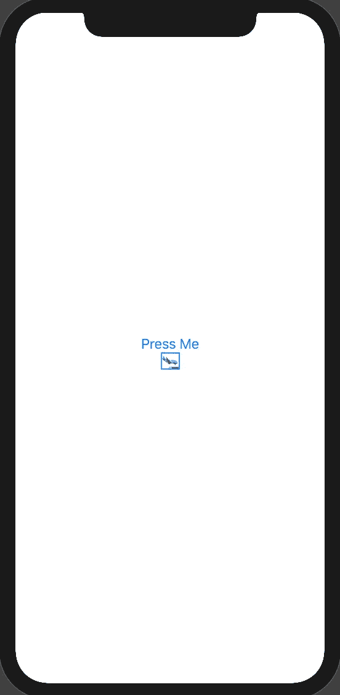
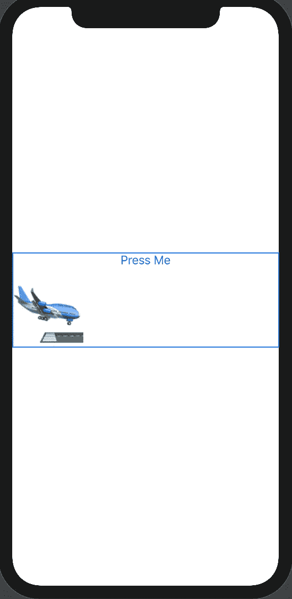

# SwiftUI Spring 动画

> 原文：<https://betterprogramming.pub/swiftui-spring-animation-beginner-69faf0b6eb9c>

苹果发布了 SwiftUI，利用 SwiftUI 的强大功能在所有苹果平台上构建用户界面



# 步骤 1:如何创建您的 SwiftUI 项目

在 XCode 中，进入文件→新建→项目→单视图应用程序→下一步→选择用户界面→ SwiftUI →下一步→选择您想要的项目位置→完成

# 步骤 2: ContentView.swift

默认的`SwiftUI(ContentView)` 文件会出现以下代码:

```
**import** SwiftUI**struct** ContentView: View {**var** body: **some** View {
    Text(”Hello World!”)
  }
}**struct** ContentView_Previews: PreviewProvider { **static** **var** previews: **some** View {
     ContentView()
   }
}
```

在右边，您可以看到 UI 的预览。

如果您看不到预览，请前往调整编辑器选项并选择画布，或者按 option+command+enter ***。*** 之后，确保 canvas 正在显示 UI 预览。



# 步骤 3:创建用户界面

在`ContentView`主体中，定义垂直堆栈，它将包含一个标记为“按我”的按钮和文本(“🛬").



**代码:**

```
VStack{ Button(“Press Me”){ //Perform an action        when the button is clicked } Text(“🛬”)}
```

按 function+control+command+spaceba**r**获得表情列表，选择一个平面。

现在如果你看预览，飞机几乎看不见。让我们使用属性`.font`、**、**来增加字体大小，我们将把`.custom`方法作为参数传递，在这里我们将定义字体名称和字体大小。

```
Text(“🛬”).font(.custom(“Arial”, size: 100))
```

现在让我们将文本嵌入到水平堆栈中，并添加`Spacer()`来对齐左侧的文本

> **面试问题:**swift ui 中的间隔符()是什么？
> 
> Spacer()是一个灵活的空间，它沿包含堆栈布局的主轴扩展，或者如果它不包含在堆栈中，则沿两个轴扩展。

所以现在我们的代码看起来会像这样:



```
HStack { Text(“🛬”)
    .font(.custom(“Arial”,       size: 100)) Spacer()}
```

我们的 UI 现在几乎准备好了——让我们添加动画以实现最终输出。

# 步骤 4:定义状态变量和偏移量

在添加动画之前，我们必须定义一个`@State`变量，它将负责维护动画的状态。

> **面试问题**:什么是状态变量？或者是什么状态？
> 
> `*@State*`关键字是一个`*@propertyWrapper*`，其中SwiftUI 管理您声明为状态的任何属性的存储。当状态值改变时，视图使其外观无效，并重新计算`[*body*](https://developer.apple.com/documentation/swiftui/view/3278523-body)`
> 
> *更详细* [*此处*](https://developer.apple.com/documentation/swiftui/state)

因此，我们将在视图主体外定义一个`*boolean State variable*` ，并将变量命名为`playAnimation`，并将默认值设置为 false。

```
@State **private** **var** playAnimation : Bool = **false**
```

因此，每当变量`playAnimation`的值发生变化时，SwiftUI 就会重新加载主体。

现在，让我们定义文本的`offset`值。如果变量`playAnimation`的值为真，我们要把平面移到右手边`(UIScreen.main.bounds.width — 120)`；否则，我们要将平面移动到原点或初始位置。

我们可以使用方法`.offset`访问文本的 offset 属性。因为我们想要沿着水平轴执行动画，我们将改变变量`x`的偏移值。

```
Text(“🛬”)
.font(.custom(“Arial”, size: 100))
.offset(x: **self**.playAnimation ? UIScreen.main.bounds.width — 120 : 0)
```

# 步骤 5:添加动画

我们可以使用`.animation` 属性给文本添加动画。作为一个参数，我们将在任何需要提供值的地方传递方法`.interpolatingSpring` ，比如对象的质量、弹簧的刚度、弹簧的阻尼以及动画开始时对象的初始速度。

```
Text(“🛬”)
.font(.custom(“Arial”, size: 100))
.offset(x: **self**.playAnimation ? UIScreen.main.bounds.width — 120 : 0)
.animation(.interpolatingSpring(mass: 1.0,stiffness: 100.0,damping: 10,initialVelocity: 0))
```

您可以使用这些值来找出最适合您的弹簧动画的值。

现在，我们几乎完成了我们的动画。我们只需要在用户点击按钮“按我”时切换变量`playAnimation`的值

```
Button(“Press Me”){
    **self**.playAnimation.toggle()
}
```

每当用户点击“按我”按钮，它将切换状态变量的值，这样整个身体将再次加载，它将根据状态变量值执行动画。

因此，整个代码将如下所示:

在 [GitHub](https://github.com/rathodmayur93/SwiftUISpringAnimation) 上找到这个项目。