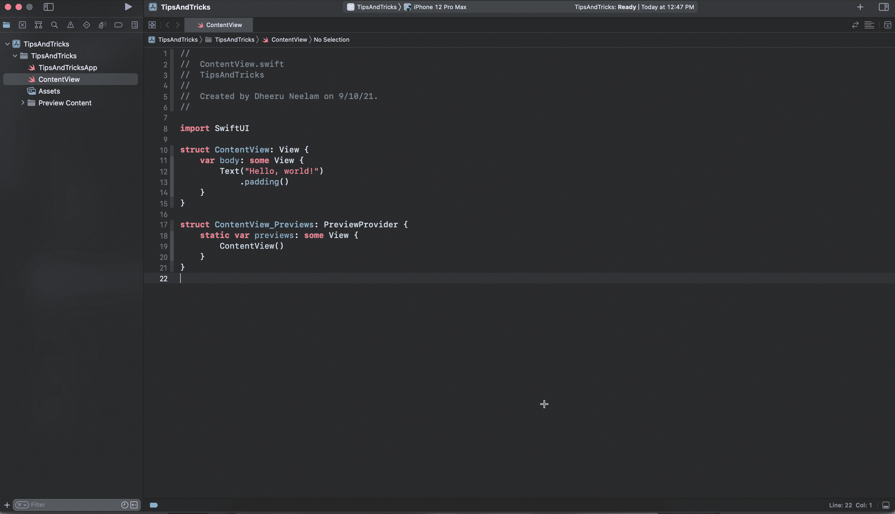
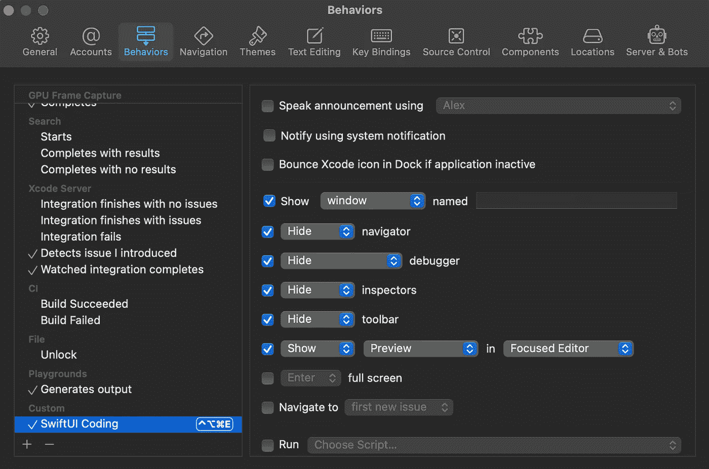
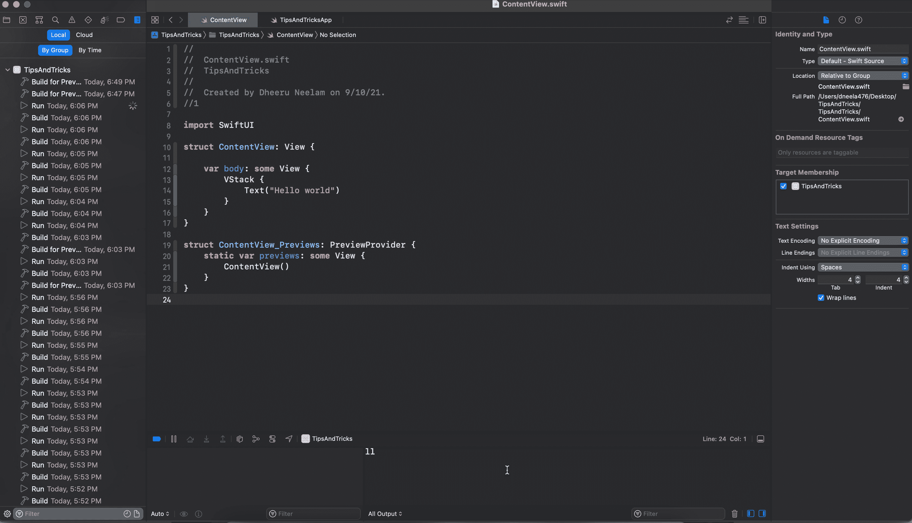
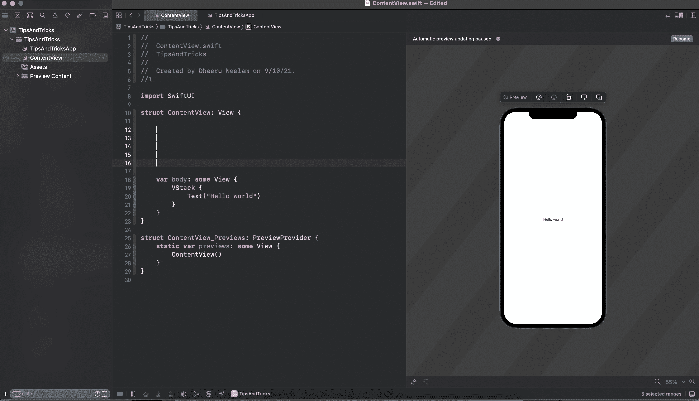
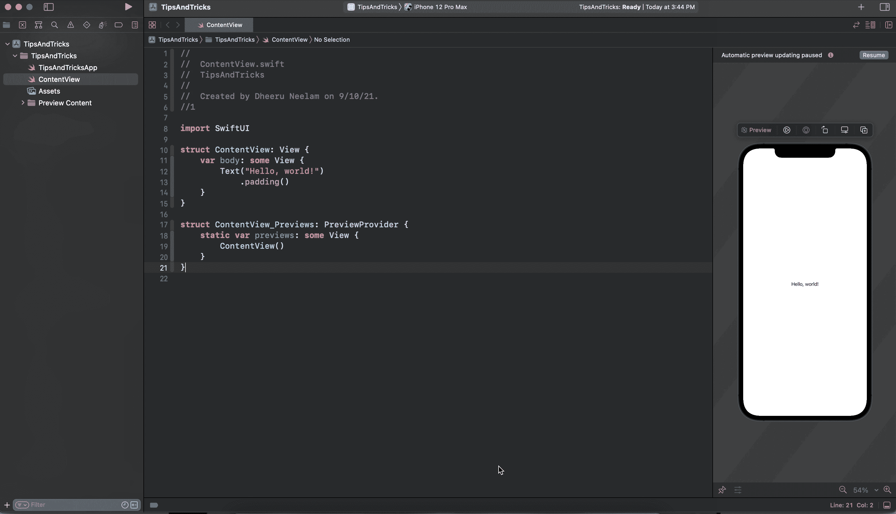
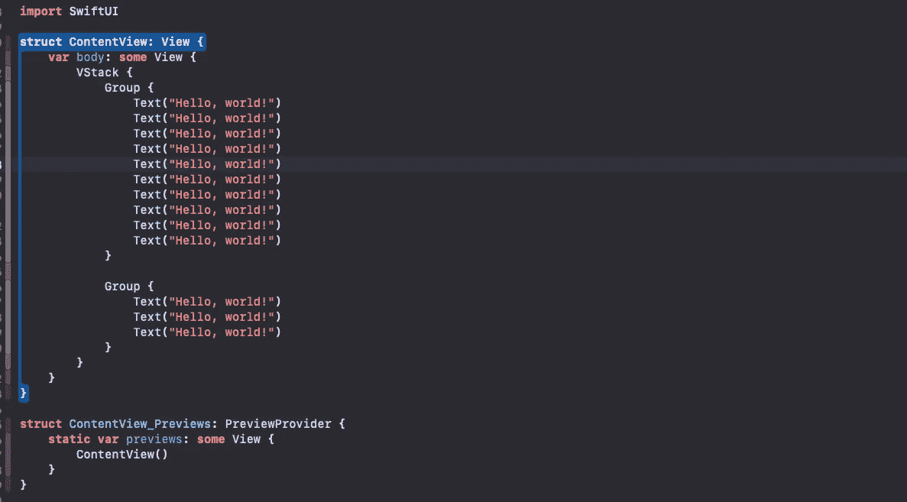

# 简化 iOS 代码库的 10 个 SwiftUI 提示和技巧

> 原文：<https://betterprogramming.pub/swiftui-tips-and-tricks-57b3d2f027d2>

## 你知道如何同时编辑或删除多行吗？


奥斯卡·伊尔迪兹在 [Unsplash](https://unsplash.com/photos/cOkpTiJMGzA) 上的照片

# 1.预览窗格

SwiftUI 预览允许我们显著加快开发速度，因为我们现在可以在 Xcode 中实时预览我们的更改。无论我们何时更改一段代码，我们的预览都会相应地刷新并显示更改。

在开发有很多状态的 UI 时，预览帮了我们很多。您可以使用以下方法刷新它:

```
⌥ + ⌘ + ↩ (Command + Option + Return)
```



显示预览窗格

## 简历预览

编码时实时预览设计是 Xcode 的一个不可思议的元素。存在由于各种原因导致预览暂停的情况。代码改动太多就是其中之一。

您必须转到预览窗格并选择“恢复”才能看到这些更改。现在，您可以使用以下命令来代替它:

```
⌥ + ⌘ + P (Option + Command + P)
```

# 2.在代码中设置自定义行为

假设您正在使用的应用程序必须处理多项事务，并且您正在检查 UI 元素或可访问性，或者正在搜索或使用报告导航器，您已经完成了工作，现在您必须继续构建 SwiftUI 视图。

如果您想在开发代码时保持 Xcode 的整洁和简单，您必须手动隐藏导航器、调试控制台和检查器。

如果您想为您的 SwiftUI 开发加载自定义选项卡配置，您可以通过执行`⌘ + w`来更改 Xcode 偏好设置中的**行为**

********

****行为配置****

****当您这样做时:****

```
**⌥ + ⌘ + ^ + E(Option + Command + Control + E)**
```

****它会自动更改您的完整 Xcode 标签配置。****

********

****行为配置****

# ****3.在多个地方使用相同的限定符****

****你知道如何同时编辑或删除多行吗？
当你必须同时使用一堆相同的限定词时，你可以这样做:****

```
**^ + ⌥ + drag cursor (Control + Option + drag cursor)**
```

********

****相同的限定符****

****你也可以用这个技巧同时删除或编辑多行。****

# ****4.添加库****

****当您在削减具有如此多 UI 组件的功能时，您可以简单地从对话框中拖放，而不是键入它们，当您这样做时:****

```
**⇧ + ⌘ + L (Shift + Command + L)**
```

****当您必须处理不同的修改器、代码片段、媒体和颜色库时，这也是可行的。****

# ******5。选择预览目的地******

****在开发特性时，您需要在各种设备上测试它们，以确保它是您想要的方式并且符合您的规格。除了利用触控板来转换它们，您还可以:****

```
**⌃ + ⇧ + 0 (Control + Shift + 0)**
```

********

****预览目的地****

# ****6.超越 10 个视图****

****当我最初在 SwiftUI 上工作时，有时我需要放置超过 10 个孩子，但 SwiftUI 不允许这样做。****

****它会抛出这样一个错误:****

```
**Extra arguments at positions #11, #12, … in call**
```

****为了解决这个问题，你可以根据自己的情况使用`VStack`中的`Group`或者`List`中的`Group`。****

********

****[超越 10 个视角](https://gist.github.com/dheerajn/2a98c18cd22b440da9968309a9f5262f)****

# ****7.组合多个文本视图****

****当您必须组合多个文本视图或者必须处理属性文本时，您可以这样做:****

****多文本视图****

# ****8.自定义视图修改器****

****当您需要从不同的角度重用一组修改器时，可以使用 SwiftUI 的 ViewModifier。这样做有助于我们清理代码，维护和可读性。****

****[ViewModifier](https://developer.apple.com/documentation/swiftui/viewmodifier) 是一个修改器，应用于一个视图或另一个视图修改器，产生原始值的不同版本。****

****你可以通过把它添加到`View`扩展 *:* 来做更多的事情****

```
**extension View {
    func largeTitle() -> some View {
        modifier(LargeTitle())
    }
}**
```

****然后你直接用 like:****

```
**Text("Text 1 ")
    .largeTitle()**
```

# ****9.显示多个警报****

****当您在一个代码库上工作时，您有多个警报要在一个视图上显示，我们只能在一定程度上实现，但不会显示所有的警报。为了克服这一点，你可以这样做:****

# ****10.防止视图重新加载****

****当您编写状态驱动的代码时，当状态改变时，主体内部的视图会被刷新。下面给你看问题。****

********

****为了克服这个问题，你可以这样做:****

****此外，根据您的情况，您也可以遵循`Equatable`协议，以避免重新加载您的视图。****

```
**static func == (lhs: IndependentView, rhs: IndependentView) -> Bool {
    print("\n=------=")
    print("LHS Counter - ", lhs.counter)
    print("RHS Counter - ", rhs.counter)
    return lhs.counter == rhs.counter
}**
```

****我希望这能帮助你，如果你使用了任何其他快捷方式，请告诉我。谢谢你。祝你好运。****