# SwiftUI 提示和技巧

> 原文：<https://betterprogramming.pub/swiftui-tips-and-tricks-c7840d8eb01b>

## 提升 SwiftUI 技能的鲜为人知的功能

汤米·范·凯塞尔的照片🤙 on [Unsplash](https://unsplash.com?utm_source=medium&utm_medium=referral) 。

SwiftUI 改变了我们在 iOS 应用程序中构建用户界面的方式。声明性的状态驱动框架简明易懂，这主要归功于支持 DSL 语言的函数构建器。

自从它首次亮相以来，已经出现了大量的功能，跟踪一些很酷的技巧可能会成为一个挑战。谢天谢地，这篇文章正是您在这种情况下需要的备忘单。

在接下来的部分中，我整理了一个提示和技巧列表，应该可以帮助您轻松构建 SwiftUI 应用程序。让我们开始吧。

# 当您有不同类型时，将视图包装在任意视图或组中

`some`关键字是在 Swift 5.1 中引入的，用于定义不透明类型。它允许编译器根据返回值决定函数的具体类型。

虽然这对于单分支代码或者视图类型相似的情况来说都很好，但是当多分支代码具有不同的视图时，这将导致编译器错误。

具体来说，SwiftUI 接口不能确定单一的不透明类型。我们可以通过将视图集包装在一个`Group`或`AnyView`中来解决这个问题。

`AnyView`确保有一个单一的不透明返回类型，但确保不要太频繁地使用它。

当在 SwiftUI 主体中使用 switch 语句时，上面的提示也很有用。但是，在这种情况下，更好的替代方法是在单独的函数中提取 switch 语句。

# 通过解耦独立视图，防止在状态更改时重新加载整个 SwiftUI 主体

作为一个状态驱动的框架，每当状态改变时，SwiftUI 主体中的所有视图都会刷新——包括没有绑定到该状态的视图。

有时候，你可能希望有一种方法来避免刷新整个身体。幸运的是，您可以通过分离不依赖于状态的视图来做到这一点，如下所示:

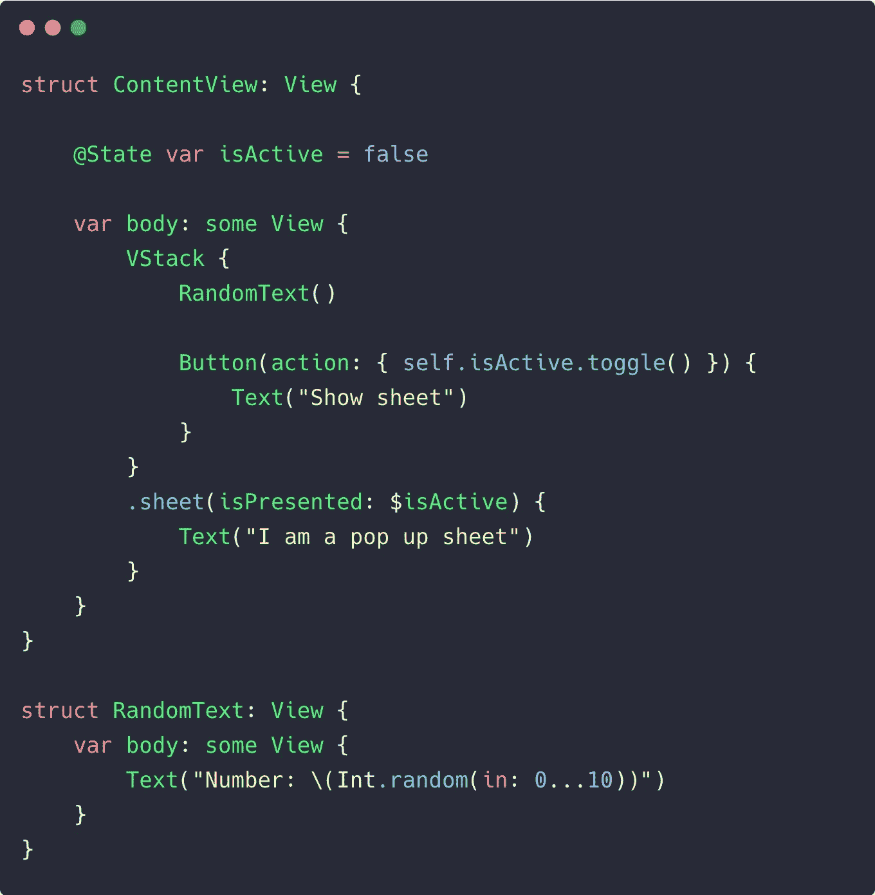

在上面的代码中，`RandomText`不再在底部的工作表被显示或关闭时刷新文本。

# 保持自定义视图的初始化代码块简短

值得注意的是，每次超级视图刷新时，都会调用 SwiftUI 主体中自定义视图的构造函数。然而，这并不意味着整个定制视图得到了重建。

例如，一个定制的 SwiftUI camera 视图每次都会调用它的`init`块，但不会每次都重建`AVFoundation`捕获会话(除非您正在传递一个触发其变化的状态属性包装器)。

因此，确保`init`街区不会太重是个好主意。

# 高效使用 SwiftUI 图像

除了 SwiftUI，iOS 13 还引入了 SF 符号，它拥有一系列图像。我们可以在 SwiftUI 图像中使用类似`font`的修改器轻松定制它们，这些修改器的应用方式与 SwiftUI `Text`相同。

## 杠杆插值

通常，您的图像资产需要将内容拉伸到超出其大小。您可能会得到模糊的图像，因为默认情况下起作用的插值会混合像素。

通过将`interpolation`修改器设置为`none`，可以确保混合不会发生，像素化图像是平滑的。

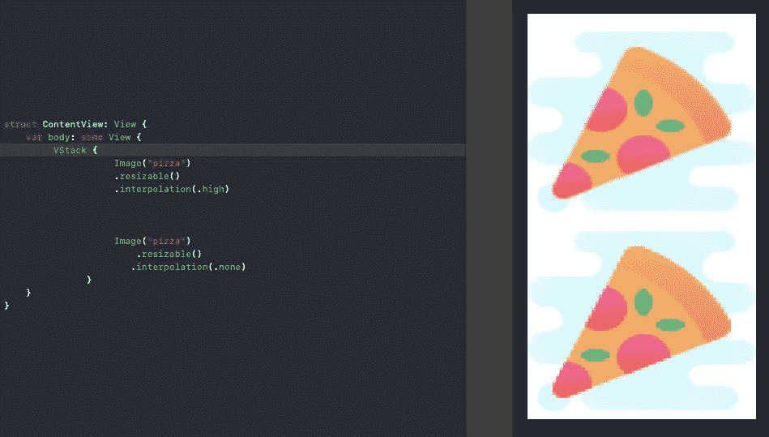

## 在导航视图中处理图像

SwiftUI 图像的另一个关键场景是当它们嵌入到`NavigationLink`中时。默认情况下，图像会被淡色(放置在`NavigationView`中时为蓝色)遮盖。为了避免这种重叠，我们需要在`NavigationLink`上设置`.buttonStyle(PlainButtonStyle())`，如下所示:

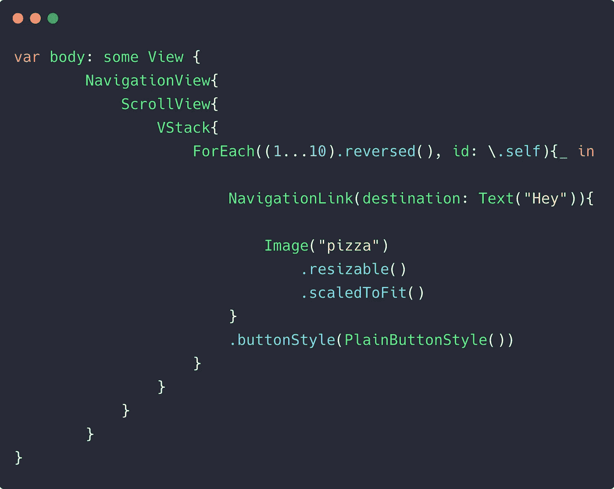

以下是在`NavigationLink`上设置和不设置`PlainButtonStyle`时的输出:

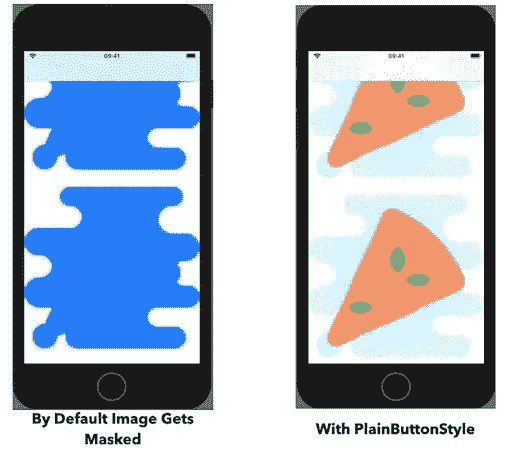

# 处理多个预览

我们知道 SwiftUI 为我们提供了实时预览，但更有趣的是它能够显示多个预览——无论是黑暗模式还是不同的设备型号。

这里有一个例子，展示了在明暗模式下相同的 SwiftUI 视图。

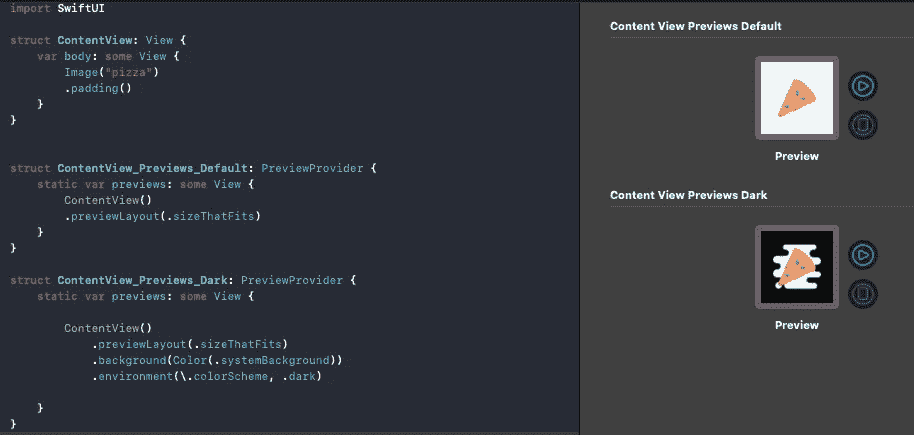

默认情况下，预览中的黑暗模式是半工作的。不要像上面那样设置系统背景色，你可以参考[这个堆栈溢出帖子](https://stackoverflow.com/questions/56591669/not-able-to-achieve-dark-mode-using-swiftui)来使用视图修改器扩展作为修复。

我们还可以`Group`内容预览或使用`ForEach`循环在不同的设备中显示 UI，如下所示:

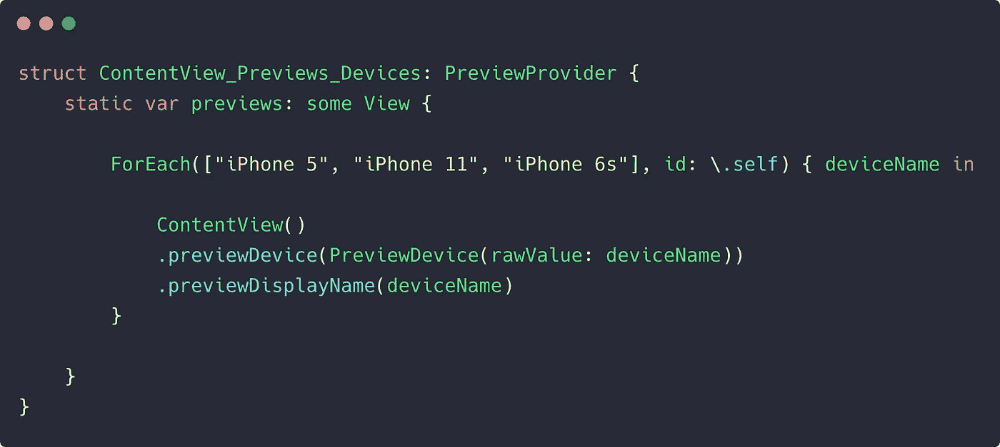

# 利用框架修改器填充视图

默认情况下，视图在屏幕上占据最小的空间。例如，下面的 TextView 会自我包装:

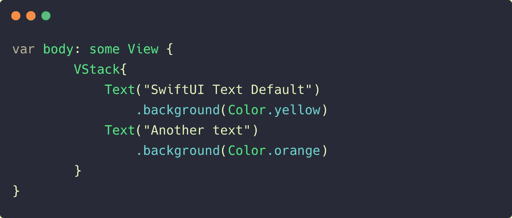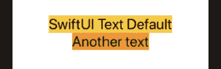

为了扩展视图以填充超级视图空间，我们可以利用`frame`修改器并将其中的`maxWidth`和`maxHeight`属性设置为`infinity`，如下所示:

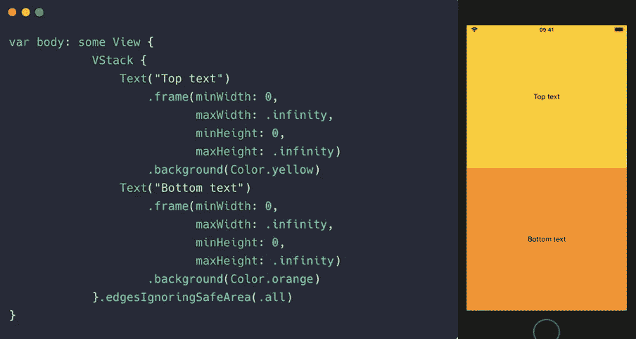

# 使用自定义修饰符和扩展

通过使用视图扩展，我们可以扩展内置功能，从而简化代码并提高可读性。例如，将视图包装在一个`AnyView`中或者嵌入到一个`NavigationView`中是一种相当常见的做法。我们可以像这样为它们创建扩展:

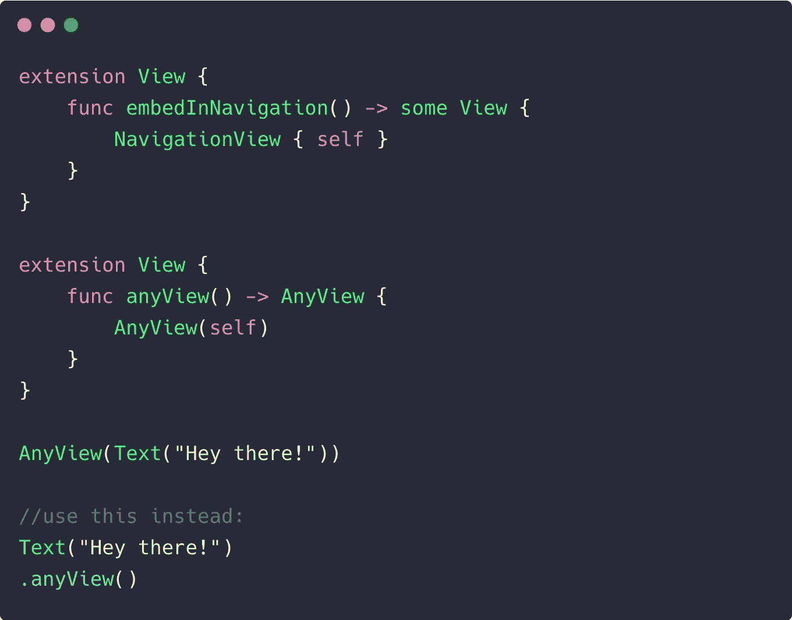

受此启发，您也可以为 SwiftUI 图像创建一个扩展，并设置一个默认的占位符图像。

SwiftUI 为我们提供了一系列视图修改器，可以作为构建模块链接在一起。但是有时，您最终会得到一组相同的修改器——特别是在定制视图时。这可能会产生样板代码，可以通过使用自定义视图修饰符来避免。

下面的代码显示了一个创建自定义样式的视图修改器:

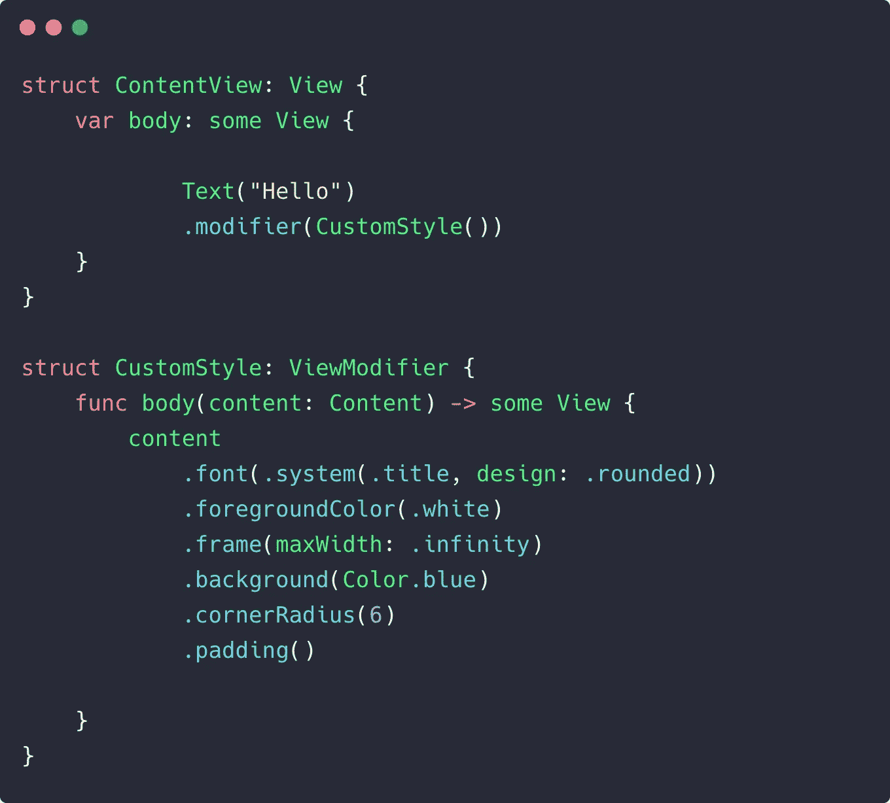

# 额外小费

我们在 SwiftUI 中探索了许多技巧和诀窍，我希望它们能帮助您进一步开发。

通常，在 SwiftUI 中编写代码时出错会停止预览，我们需要再次按下“恢复”按钮。由于这种情况经常发生，您可以使用 Option + Cmd + P 快捷键来快速恢复。

这一次到此为止。感谢阅读。